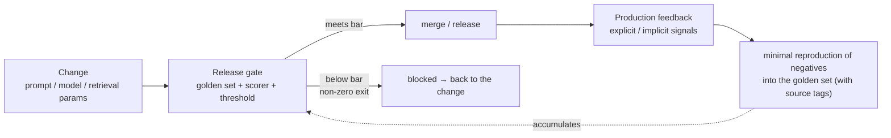

> **Group**: Production  |  **Previous group exit**: can restrict permissions, pause/resume tasks  |  **This group exit**: can decide when evaluation evidence is required and wire it into a release gate with thresholds and blocking
> **Prerequisites**: [Testing: The Deterministic Boundary](testing.md)  |  **Next**: [Deployment and Release](deployment.md) (where the gate lands); methodology continues at [evals](https://evals.zenheart.site/)

## 1. Overview

**BLUF**: this is a **bridge page**. Evaluation answers "how good is the output"; its methodology — dataset construction, scorer design, LLM-as-judge, statistics, red-teaming — **is owned by [evals](https://evals.zenheart.site/)**. This repo keeps only two engineering questions: **when evaluation evidence becomes mandatory**, and **how evidence turns into a CI gate that can block a release**. Without those two, evaluation is just a report that never enters the delivery chain.

### Mental model: the evidence integration point



The gate is the midpoint of the loop: pre-launch blocking depends on it, post-launch feedback nourishes it (the feedback path is detailed in the user-feedback loop below).

### Decision table: when evaluation evidence is mandatory

| Change type | Is testing enough? | Eval needed? | Evidence form |
| --- | --- | --- | --- |
| Validator / executor code refactor | Yes (deterministic assertions) | No | Green test suite |
| Prompt wording / structure change | No | Yes | Golden set before/after + threshold |
| Model / version swap | No | Yes | Golden set + per-dimension scores + variance |
| Retrieval params (chunk/topK/rerank) | No | Yes | Retrieval hit rate + end-to-end joint eval |
| Output schema change | Partially | As backstop | Tests (structure) + eval (content quality) |

### When to use / when not to

- Use: before merging or releasing any change that **affects output quality**.
- Do not use: pure engineering refactors, UI copy, dependency upgrades that never touch the generation path — that is [testing](testing.md) territory.

Historical milestone: consolidated into this bridge page in 2026-09 from the legacy `engineering/evals.md` and the `evaluation/` directory (including the Generative Benchmarking summary); benchmark methodology details belong to the evals site. The legacy page noted that "strong public-benchmark performance does not directly generalize to production" (Chroma research summary); the full argument and data are developed on the evals site.

## 2. Usage

Minimum walkthrough: 15 minutes, zero API keys, building the minimal skeleton of the **gate pattern** — a golden set of recorded fixtures and a scorer of deterministic assertions. In a real project, swap the scorer for the evals site's methodology; the gate skeleton stays.

### Step 1: prepare the golden set (recorded fixtures)

`golden.json` — each row = input + expected assertion (here, recorded real outputs):

```json
[
  { "id": "g1", "input": "I never received my invoice", "expect": { "category": "billing" } },
  { "id": "g2", "input": "The page goes blank",        "expect": { "category": "technical" } },
  { "id": "g3", "input": "What are your hours",         "expect": { "category": "other" } },
  { "id": "g4", "input": "How long do refunds take",    "expect": { "category": "billing" } },
  { "id": "g5", "input": "Login fails with 401",        "expect": { "category": "technical" } }
]
```

### Step 2: the gate script (scorer stubbed as a deterministic assertion)

`gate.mjs` — reads the golden set, runs **the current system's output parsing** against each case (simulated here by a replaceable `underTest` function), tallies the pass rate against the threshold:

```javascript
// gate.mjs — gate-pattern skeleton: golden set + scorer + threshold + blocking
import { readFileSync } from 'node:fs';

const THRESHOLD = 0.8; // release line: below 80% pass, block

// Replaceable entry point of the system under test. Real project: call your pipeline;
// when upgrading the eval: swap in the evals site's scorer (judge / semantic match).
async function underTest(input) {
  const map = {
    'I never received my invoice': { category: 'billing' },
    'The page goes blank':         { category: 'technical' },
    'What are your hours':         { category: 'other' },
    'How long do refunds take':    { category: 'billing' },
    'Login fails with 401':        { category: 'technical' },
  };
  return map[input] ?? { category: 'unknown' };
}

const golden = JSON.parse(readFileSync(new URL('./golden.json', import.meta.url), 'utf8'));
const results = [];
for (const c of golden) {
  const got = await underTest(c.input);
  results.push({ id: c.id, pass: got.category === c.expect.category });
}
const rate = results.filter((r) => r.pass).length / results.length;

console.log(JSON.stringify({ threshold: THRESHOLD, passRate: rate,
  failures: results.filter((r) => !r.pass) }, null, 2));

if (rate < THRESHOLD) {
  console.error(`BLOCKED: pass rate ${rate} < threshold ${THRESHOLD}`);
  process.exit(1); // block the release
}
```

### Step 3: run and output

```bash
node gate.mjs
```

Happy path (5/5 passing, exit code 0):

```json
{
  "threshold": 0.8,
  "passRate": 1,
  "failures": []
}
```

Negative output (break one mapping in `underTest`, e.g. blank page → `other`; 0.8 sits exactly at the threshold, so it passes but the failure is named):

```json
{
  "threshold": 0.8,
  "passRate": 0.8,
  "failures": [
    { "id": "g2", "pass": false }
  ]
}
```

With two broken (two failures → 0.6, below the threshold):

```json
{
  "threshold": 0.8,
  "passRate": 0.6,
  "failures": [
    { "id": "g2", "pass": false },
    { "id": "g4", "pass": false }
  ]
}
```

Then stderr prints the blocking line and the exit code is 1:

```text
BLOCKED: pass rate 0.6 < threshold 0.8
```

Exit code 1, CI blocks — that is the entire mechanism of "evaluation evidence wired into the release gate".

### Acceptance and cleanup

- Acceptance: you can produce one `BLOCKED`; you can relax the threshold from 0.8 to 0.6 and observe the pass (understanding that the threshold is a product decision).
- Cleanup: delete the two files.

## 3. Principles

(Deliberately slim: scorer design, dataset sampling, judge calibration, and statistical power are **owned by the [evals site](https://evals.zenheart.site/)** and are not duplicated here.)

### The three elements of a release gate

1. **Golden set**: a fixed, representative case set that includes failures and grows with production feedback (construction methodology → the evals site's Golden Dataset chapter).
2. **Scorer**: maps one output to pass/fail or a score. Deterministic assertions (this page's example) are the degenerate form; judges and semantic matching are the upgraded forms.
3. **Threshold and blocking**: the threshold is a product decision (prefer false blocks or false passes); blocking relies on a non-zero exit code wired into CI — an eval without blocking is just a gauge.

### Evidence grading

| Grade | Form | Use |
| --- | --- | --- |
| Deterministic assertion | Schema/enum/containment checks | Regression gate (this page's example) |
| Statistical evaluation | Score + variance + significance | Model/prompt swap decisions (→ evals site) |
| Human review | Sampled blind review | Gold standard and judge calibration (→ evals site) |

### What each layer evaluates: six evaluation facets

The follow-up question after "evaluation evidence is required" is "which layer of the system am I evaluating". One release gate can carry evidence from different facets; pick the wrong facet and the score detaches from what users feel:

| Facet | What it evaluates | Typical evidence form | Boundary and destination |
| --- | --- | --- | --- |
| Model Eval (model/inference) | Base capability and behavior shifts after a model or version swap | Golden set before/after + per-dimension scores + variance | Methodology → the evals site's model-eval chapters |
| RAG Eval (retrieval grounding) | Retrieval hits, faithfulness, citation traceability | Hit rate + end-to-end joint eval | Methodology → the evals site's RAG chapters; engineering → [Advanced Retrieval](../04-grounding/advanced-retrieval) |
| Tool Eval (tool action) | Tool selection and argument correctness, failure-path behavior | Call-trajectory assertions + replay fixtures | Assertable parts sink into [testing](testing.md); probabilistic parts → evals site |
| Agent Eval (multi-step tasks) | Task success rate, step efficiency, cost per task | End-to-end task set + trace reconciliation | Methodology → the evals site's agent chapters; trajectories → [observability](observability.md) |
| Protocol Eval (contract conformance) | Whether the implementation satisfies MCP/A2A contracts | The spec side's TCK/validators | Conformance testing (section below), not evaluation methodology |
| App Eval (whole application) | User-perceived quality and business metrics | Online metrics + sampled human review + A/B | Online-signal entry → the user-feedback loop (section below) |

### The user-feedback loop: from production signals to the next version

The release gate governs **pre-launch**; the feedback loop governs **post-launch** — together they form the complete data flywheel. Four steps:

1. **Collect feedback signals**: explicit (thumbs up/down, user edits, agent corrections) and implicit (retries, abandonment, escalation to humans, answer-adoption rate). Implicit signals are plentiful but heavily biased — users who bother to vote are not the population, so sample in strata. Collection points are the traces of [observability](observability.md) plus product analytics; do not build a second pipeline.
2. **Turn signals into data**: distill negatives into **minimal reproductions** that enter the golden set (with source tags: channel/date/scenario); cluster and deduplicate so high-frequency scenarios do not drown the long tail. The discipline is "minimize every case" — dumping whole chat transcripts into the set pollutes it.
3. **Let data drive iteration**: three exits ordered by cost — prompt wording/structure (cheapest, verified by this page's gate); retrieval and context fixes (middle, back to the [grounding group](../04-grounding/)); model swap or fine-tuning (most expensive, needs statistical-grade evaluation plus [Learn LLM](https://llm.zenheart.site/) training knowledge).
4. **Verify at the same gate**: whichever facet changed, the next version still passes the same release gate — the loop's exit is not "launch", it is "passes the gate".

Health metrics for the loop: golden-set monthly growth rate, negative-reflow latency (days from production discovery to entering the set), and the fix rate of reflowed cases. Reference structure: Chapter 10 of Chip Huyen's *AI Engineering* organizes this loop as "feedback-signal analysis → data iteration" (structural reference only; methodology details belong to the [evals](https://evals.zenheart.site/) site).

### Conformance testing for protocols

For protocol systems (MCP/A2A etc.), the concrete form of "evaluation" is **contract/conformance testing** — validating the implementation against the spec-side TCK/validators; that belongs to [testing](testing.md) and the protocol chapters (e.g. the conformance section of the [A2A chapter](../07-interoperability/a2a)), not to evaluation methodology.

### Spec vs local measurement

No external spec to implement here; the only measurement is the gate skeleton's behavior (exit code 0/1 and threshold comparison), shown in Usage.

## 4. Development

(Integration details follow the gate skeleton; scorer selection and tuning belong to the evals site.)

### Symptom → Evidence → Action → Done when

**Symptom**: the golden set passes, yet production quality degrades after launch.
**Evidence**: compare the golden set's coverage distribution with real traffic — novel/long-tail inputs have zero share in the set.
**Action**: flow production negatives back into the golden set via trace sampling from [observability](observability.md); tag set entries by source to track coverage.
**Done when**: before the next release, the set contains minimal reproductions of the last two weeks' production negatives.

### Symptom → Evidence → Action → Done when

**Symptom**: running the gate twice on the same version passes once and fails once (eval jitter).
**Evidence**: score variance is large; failures cluster in judge-boundary cases.
**Action**: separate the sources — jitter in deterministic assertions means the code under test is non-deterministic (fix the code); judge jitter follows the evals site's calibration process (multiple samples / calibration / tier changes).
**Done when**: variance across N consecutive runs stays within a declared range; the gate's handling of "true regression" vs "jitter" is documented separately.

### Symptom → Evidence → Action → Done when

**Symptom**: the team deadlocks arguing whether the threshold should be 0.8 or 0.95.
**Evidence**: neither side has a baseline number for "the current true pass rate in production" — the threshold is debated in a vacuum.
**Action**: first measure the current production version's pass rate on the golden set; use it as the baseline and only allow "not below baseline − ε" for new versions.
**Done when**: the threshold is expressed as "allowed regression versus baseline", with baselines recorded per version.

### Symptom → Evidence → Action → Done when

**Symptom**: three months after launch, the golden set has not grown by one case; the eval is forever green.
**Evidence**: the set's commit history shows the last change in launch week; production negatives (complaints, escalations-to-human records) have zero intersection with set entries.
**Action**: establish a reflow routine — weekly, sample negatives from [observability](observability.md) traces, distill minimal reproductions into the set (with source tags); set an upper bound on negative-reflow latency (e.g. 7 days).
**Done when**: the set's monthly growth rate is above zero; the set run by the most recent release gate contains minimal reproductions of last month's production negatives.

### Anti-patterns

- **Report-style evaluation**: scores produced, no blocking, no feedback loop — evaluation never entered the delivery chain.
- **One-shot dataset**: the set is built pre-launch and never grows, drifting from traffic over time.
- **Copying methodology into learn-ai**: maintaining judge prompts or statistics formulas in this repo guarantees drift — point to the evals site.

## 5. Resource Library

Four-level reading route:

- **Beginner**: run this page's gate skeleton; internalize "evidence = blockable".
- **Builder**: build a first golden set for your system (20 cases to start, including negatives) and wire it into CI.
- **Operator**: establish the negative-feedback mechanism (the user-feedback loop); manage thresholds against baselines; record gate results per version.
- **Researcher**: read the full methodology on [evals](https://evals.zenheart.site/) (datasets/judges/statistics/red-teaming).

### Resource table

| Name | Evidence level | Canonical URL | Purpose | Supported claim | Next |
| --- | --- | --- | --- | --- | --- |
| evals site | sibling (cross-repo owner) | https://evals.zenheart.site/ | Sole owner of evaluation methodology | bridge-register freezes the split: this repo keeps only release-gate integration (2026-09-01) | Its RAG/Agent Eval, Golden Dataset, CI/CD chapters |
| bridge-register (evals section) | internal artifact | https://github.com/zenHeart/learn-ai/blob/tech/_phase0/bridge-register.md | Stop-point registry | "When evidence is needed + gate integration" boundary (2026-09-01) | — |
| Testing: The Deterministic Boundary | internal chapter | [testing](testing.md) | The deterministic/probabilistic divide | — | Read it before this page |
| A2A chapter (conformance) | internal chapter | [../07-interoperability/a2a](../07-interoperability/a2a) | Protocol conformance testing | TCK and conformance belong to protocol chapters | — |

### Falsification and open questions

- Falsification entry: if a "quality judgment" can be written entirely as a deterministic assertion (e.g. stable output at temperature 0), it should sink into [testing](testing.md) — and the bridge page's boundary narrows accordingly.
- Open: the long-run reconciliation of gate results with production metrics (gate passed, but production dropped by how much?) needs real operational data; to be backfilled with cases from this repo.

### learn-ai stops here / where to go next

- All evaluation methodology: [evals](https://evals.zenheart.site/) (deliberately not expanded here).
- The engineering landing point of the gate (gate chain, blocking, rollback): [Deployment and Release](deployment.md).
- Resource index after this group: [Resource Library](../../resources.md).
