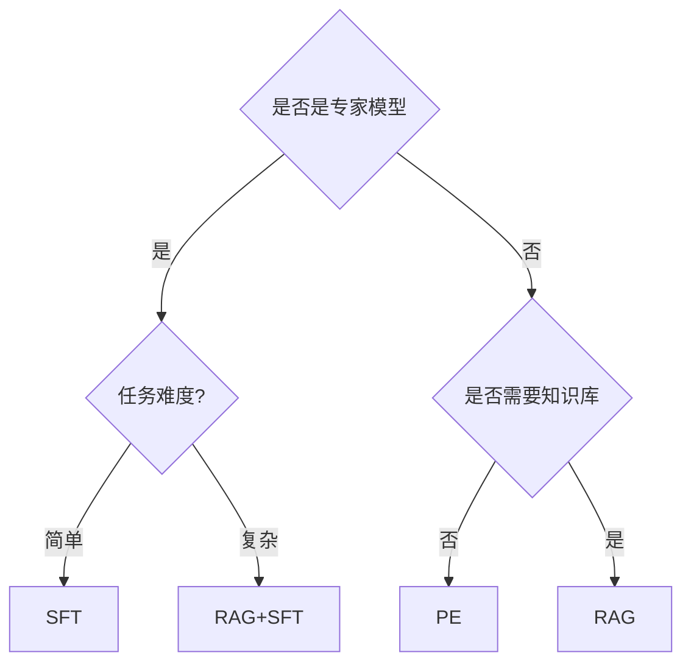

# 技术

本章探讨 AI 大模型在应用中的典型方式及其特点。

差别|微调（Fine-tuning）|RAG（检索增强生成）
---|---|---
核心原理|通过调整模型参数适配特定任务|通过检索外部知识增强生成能力
成本|**高** 需要GPU和大量标注数据，重新训练模型|**低**，依赖外部知识库，仅需推理和检索资源
响应时间|**低** 模型内置领域知识，直接输出|**高** 需要额外的检索步骤，在合并输入给模型
适用场景|适合术语理解、复杂推理任务|适合高准确性需求、频繁知识更新场景
其他特点|输出黑盒，模型训练后能力固定（可以通过用户输入增强）|输出可控，知识库可随时更新

技术决策树

## how to build

1. use RAG to make  LLM precise
2. use interceptor to process llm **illusion some check rule**
    1. format check
    2. rule check
3. some useful method to make prompt
    1. RTF → (role task format)
    2. COT → (chain of thingk) use logic
    3. FSP → (few shot prompiting) show some example
    4. RAG → inline some useful knowledge

some tools

1. ALLIN
2. ARKAI
3. DIFY

