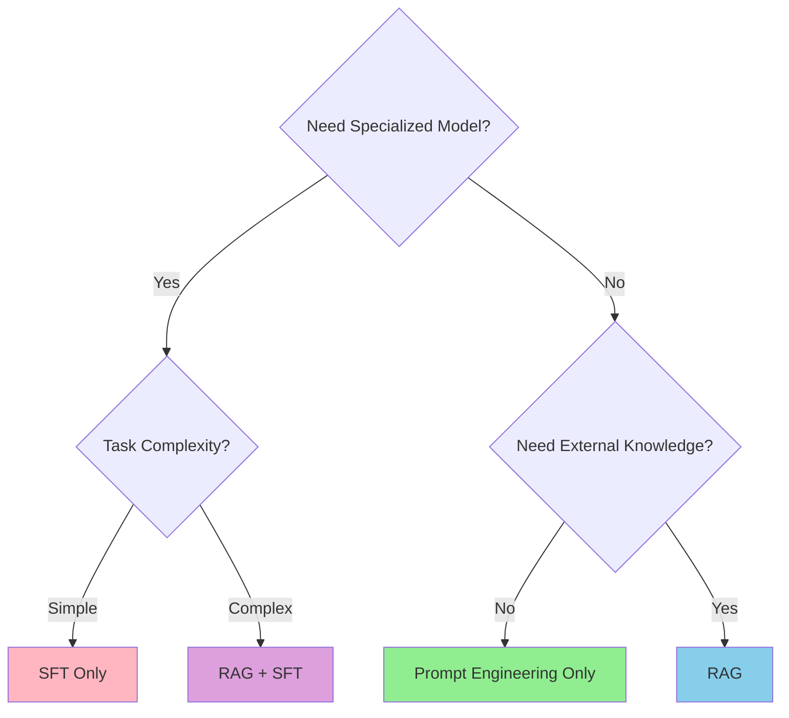

# Tech Stack

This section explores the core AI technologies and patterns you'll use to build intelligent applications. Each technology solves specific problems - understanding WHEN to use WHAT is critical.

## The Three Pillars of AI Application Development

### 1. **LLM (Large Language Models)** - The Foundation

**What**: Pre-trained models that understand and generate text.

**When to use**: All AI applications start here.

**Learn more**: [LLM Guide](/tech/LLM)

### 2. **Prompt Engineering** - The Interface

**What**: Techniques to communicate effectively with LLMs.

**When to use**: Every interaction with an LLM requires good prompts.

**Learn more**: [Prompt Engineering](/tech/prompt/)

### 3. **Context Management** - The Memory

**What**: Managing what information the LLM can see and remember.

**When to use**: Chat applications, document Q&A, any multi-turn interaction.

**Learn more**: [Context Guide](/tech/context)

## Core Technologies Comparison

### Fine-Tuning (SFT) vs RAG

| Aspect | Fine-Tuning (SFT) | RAG (Retrieval-Augmented Generation) |
|--------|-------------------|--------------------------------------|
| **Core Principle** | Adjust model parameters for specific tasks | Retrieve external knowledge to enhance generation |
| **Cost** | **High** - Requires GPUs, labeled data, retraining | **Low** - Uses external knowledge base, inference only |
| **Response Time** | **Fast** - Knowledge built into model | **Slower** - Requires retrieval step before generation |
| **Best For** | Domain-specific terminology, complex reasoning | High accuracy requirements, frequently updated knowledge |
| **Maintenance** | **Hard** - Requires retraining for updates | **Easy** - Update knowledge base anytime |
| **Control** | Black box, model behavior fixed after training | Transparent, controllable through knowledge base |
| **Setup Complexity** | Very high (days/weeks) | Medium (hours/days) |
| **When to Use** | Specialized domains, stable knowledge | Dynamic data, explainable AI, cost-sensitive |

**Frontend Engineer Recommendation**: Start with RAG. Only consider fine-tuning if you have:
- Highly specialized domain (medical, legal, etc.)
- Budget for GPU training
- Stable knowledge that rarely changes

## Technology Decision Tree



### Decision Guide

**Scenario 1: Building a chatbot for your product docs**
- ✅ Use: RAG (frequently updated docs)
- ❌ Don't use: Fine-tuning (expensive, hard to update)

**Scenario 2: Building a code completion tool**
- ✅ Use: Prompt Engineering + Context Management
- Maybe: RAG for project-specific patterns
- ❌ Don't use: Fine-tuning (unless you're GitHub Copilot)

**Scenario 3: Medical diagnosis assistant**
- ✅ Use: RAG + Fine-tuning
- Why: Specialized terminology (SFT) + Latest research (RAG)

**Scenario 4: Simple AI chat feature**
- ✅ Use: Prompt Engineering only
- Why: Most LLMs are already good at conversation

## How to Build AI Applications (Practical Pattern)

### Step 1: Start with Prompt Engineering

**Goal**: Make LLMs do what you want with good prompts.

**Techniques**:
- **RTF** (Role, Task, Format) - Structure your prompts
- **COT** (Chain of Thought) - Use logical reasoning
- **FSP** (Few-Shot Prompting) - Show examples
- **RAG** - Inject relevant knowledge inline

**Learn more**: [Prompt Engineering Guide](/tech/prompt/)

### Step 2: Add RAG for External Knowledge

**Goal**: Connect LLMs to your data (docs, databases, APIs).

**How it works**:
1. Store documents as vector embeddings
2. Retrieve relevant chunks based on user query
3. Inject chunks into LLM prompt
4. Get accurate, up-to-date answers

**Learn more**: [RAG Guide](/tech/RAG)

### Step 3: Use Interceptors for Quality Control

**Goal**: Prevent LLM hallucinations and errors.

**Checks to implement**:

1. **Format validation**
   ```javascript
   if (!isValidJSON(llmOutput)) {
     throw new Error('Invalid format, retry');
   }
   ```

2. **Business rule enforcement**
   ```javascript
   if (llmOutput.price < 0) {
     throw new Error('Invalid price, regenerate');
   }
   ```

3. **Content safety**
   ```javascript
   if (containsHarmfulContent(llmOutput)) {
     return fallbackResponse;
   }
   ```

### Step 4: Implement Agent Patterns (Advanced)

**Goal**: Build autonomous AI systems that use tools and make decisions.

**Capabilities**:
- Tool calling (MCP)
- Multi-step reasoning
- Error recovery
- Self-correction

**Learn more**: [Agent Guide](/tech/Agent), [MCP Protocol](/tech/MCP)

## Technology Stack by Use Case

### Chat Application
- **LLM**: GPT-4 or Claude
- **Context Management**: Sliding window or summarization
- **Prompt Engineering**: System prompts for personality
- **Optional**: RAG for knowledge base

### Code Assistant
- **LLM**: Claude 3.5 Sonnet (best for code)
- **Context Management**: Large context window (200k tokens)
- **MCP**: File system, git, documentation tools
- **Prompt Engineering**: Few-shot examples

### Document Q&A
- **RAG**: Vector database (Pinecone, Weaviate, pgvector)
- **LLM**: GPT-3.5 Turbo (cost-effective) or GPT-4 (accuracy)
- **Embeddings**: text-embedding-ada-002
- **Context Management**: Chunk-based retrieval

### AI Workflow / Agent
- **MCP**: Tool calling protocol
- **Agent**: ReAct or Plan-and-Execute pattern
- **LLM**: GPT-4 or Claude 3.5 (tool use capabilities)
- **Prompt Engineering**: Structured outputs, function calling

## Recommended Tools & Platforms

### Development Frameworks
1. **LangChain** - Python/JS framework for LLM apps
2. **Vercel AI SDK** - React-first AI framework
3. **LlamaIndex** - RAG and data framework
4. **Anthropic SDK** - Claude integration

### Vector Databases (RAG)
1. **Pinecone** - Managed vector DB
2. **Weaviate** - Open-source vector search
3. **pgvector** - Postgres extension
4. **Chroma** - Lightweight, embeddable

### Low-Code Platforms
1. **Dify** - Open-source LLM app platform
2. **Flowise** - Visual LLM workflow builder
3. **LangFlow** - Drag-and-drop LLM chains

### Local Development
1. **Ollama** - Run LLMs locally
2. **LocalAI** - Self-hosted AI API
3. **LM Studio** - GUI for local models

## Learning Path Recommendation

**Week 1-2**: Foundations
- Master [LLM basics](/tech/LLM)
- Learn [Prompt Engineering](/tech/prompt/)
- Understand [Context Management](/tech/context)

**Week 3-4**: Building Features
- Implement [RAG](/tech/RAG) for knowledge retrieval
- Explore [MCP](/tech/MCP) for tool integration
- Build simple [Agents](/tech/Agent)

**Week 5+**: Advanced Patterns
- Fine-tuning ([SFT](/tech/SFT)) for specialized needs
- Production optimization
- Multi-agent workflows

## Common Pitfalls to Avoid

1. **Over-engineering**: Don't use RAG if simple prompts work
2. **Wrong model choice**: Use cheaper models for simple tasks
3. **Ignoring context limits**: Always manage token usage
4. **No error handling**: LLMs fail - have fallbacks
5. **Premature fine-tuning**: Try RAG and prompt engineering first

## Next Steps

Choose your learning path based on your immediate needs:

- **Need to understand basics?** → Start with [LLM](/tech/LLM)
- **Building a chat feature?** → Check [Prompt Engineering](/tech/prompt/)
- **Adding external knowledge?** → Learn [RAG](/tech/RAG)
- **Building autonomous AI?** → Explore [Agent](/tech/Agent) and [MCP](/tech/MCP)
- **Managing costs/performance?** → Read [Context Management](/tech/context)
- **Need specialized model?** → See [SFT](/tech/SFT)

The technologies in this section are your building blocks. Master them to create powerful, production-ready AI applications.


