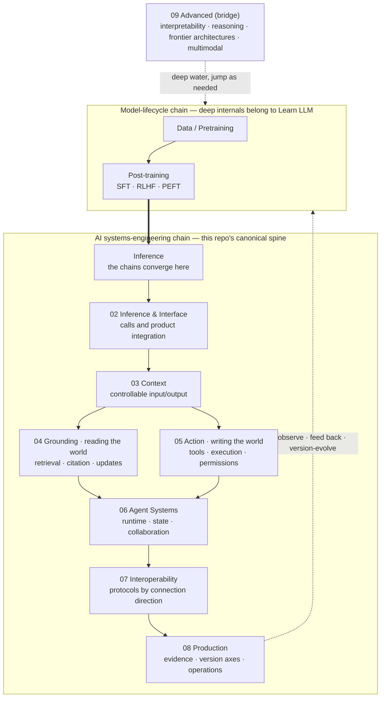

> **Group**: 0 · Orientation and Boundaries  |  **Previous layer exit**: none  |  **This page exit**: can locate the problem domain, state its dependencies and exits, and enter the right group
> **Prerequisites**: none (site entry)  |  **Next**: [Complexity Decision Ladder](00-map/complexity-ladder) · [Site Boundaries and Knowledge Ownership](00-map/site-boundaries) · [Model Lifecycle (Bridge)](01-model-lifecycle/)

## 1. Overview

**BLUF**: this is a **dependency-driven knowledge map**. The v6 organizing logic is not "classify by technology noun" but three structural questions:

1. **Where the two chains converge** — the model-lifecycle chain (data → pretraining → post-training) and the AI systems-engineering chain (integration → context → grounding/action → …) converge at **Inference**: every line of AI application code you write starts from the left chain's end. The left chain's deep internals belong to [Learn LLM](https://llm.zenheart.site/); the right chain is this repo's canonical spine.
2. **Why reading the world and writing the world are separated** — Grounding (retrieval, citation, updates) and Action (tools, execution, permissions) both "connect the model to things outside the model", but their failure modes are opposite: a read fails by **answering wrongly**; a write fails by **breaking things**. The acceptance criteria differ accordingly (correct citations vs restricted permissions), which splits them into [04-grounding](04-grounding/) and [05-action](05-action/).
3. **Why protocols are grouped by connection direction** — MCP, A2A, ACP, and AG-UI are not competitors; each owns one connection direction (Agent↔tools, Agent↔Agent, editor↔coding agent, Agent↔UI). The first selection question is "what are the two sides I'm connecting", not "which protocol is hotter" — see [07-interoperability](07-interoperability/).

This map answers one question: **where you are stuck right now, and where to go next.** It teaches no individual technology — every group and topic has its own five-part chapter (Overview → Usage → Principles → Development → Resource Library).

### Mental model: two chains converge, read and write split

```mermaid
flowchart TB
    subgraph ML["Model-lifecycle chain — deep internals belong to Learn LLM"]
        M1["Data / Pretraining"] --> M2["Post-training<br/>SFT · RLHF · PEFT"]
    end
    M2 ==> INF["Inference<br/>the chains converge here"]
    subgraph SE["AI systems-engineering chain — this repo's canonical spine"]
        INF --> C["02 Inference & Interface<br/>calls and product integration"]
        C --> CT["03 Context<br/>controllable input/output"]
        CT --> G["04 Grounding · reading the world<br/>retrieval · citation · updates"]
        CT --> A["05 Action · writing the world<br/>tools · execution · permissions"]
        G --> AG["06 Agent Systems<br/>runtime · state · collaboration"]
        A --> AG
        AG --> IOP["07 Interoperability<br/>protocols by connection direction"]
        IOP --> P["08 Production<br/>evidence · version axes · operations"]
    end
    P -. "observe · feed back · version-evolve" .-> ML
    ADV["09 Advanced (bridge)<br/>interpretability · reasoning · frontier architectures · multimodal"] -. deep water, jump as needed .-> ML
```

Arrows show the **default dependency order**, not a hard runtime constraint: a RAG service may pass only through 02/03/04; a tool script may pass only through 02/03/05. Implementation always falls back to the lowest complexity that meets acceptance.

### Ten-group navigation table

Groups appear in group-number order (00 → 09), with the three off-spine exits (appendices / Recipes / Resources) at the end:

| Group | What question it answers | Core topics | Depends on | Exit |
| --- | --- | --- | --- | --- |
| [00-map](00-map/complexity-ladder) Orientation & Map | Where do I start, and what is out of scope here? | the map, complexity ladder, site boundaries | none | can locate the problem domain and the next entry |
| [01-model-lifecycle](01-model-lifecycle/) Model Lifecycle (bridge) | Where did this model come from, and which of my decisions does it affect? | the engineering impact of SFT / RLHF / PEFT | 00 | knows when prompts are not enough and which Learn LLM chapter holds the deep water |
| [02-inference-interface](02-inference-interface/) Inference & Interface | How do I wire a model call into a product? | model-api, streaming, structured output, session & UI, edge | 00–01 | a cancellable, observable end-to-end interaction |
| [03-context](03-context/) Context | How do I make input and output controllable? | prompts, context engineering, session memory | 02 | can write and validate schemas; knows how failure is accepted |
| [04-grounding](04-grounding/) Grounding (reading the world) | How do answers get evidence? | embeddings & retrieval, RAG, advanced retrieval | 02–03 | a traceable retrieval chain and a re-runnable update pipeline |
| [05-action](05-action/) Action (writing the world) | How do I execute actions safely? | tool-calling contract, tool execution | 03 | permission-restricted, idempotent, reversible actions |
| [06-agent-systems](06-agent-systems/) Agent Systems | How do I build multi-step, recoverable, approval-gated autonomy? | runtime, workflows, multi-agent, skills, state & recovery | 04–05 | can restrict permissions, pause/resume tasks |
| [07-interoperability](07-interoperability/) Interoperability | How do I connect across boundaries? | MCP / A2A / ACP / AG-UI by connection direction | 05–06 | can pick a protocol by connection direction and justify rejecting the rest |
| [08-production](08-production/) Production | How do I prove it can launch and keep running? | testing, evaluation, observability, security, cost, deployment, version axes | 02–06 | five kinds of evidence; five rollback-able, traceable axes |
| [09-advanced](09-advanced/) Advanced (bridge) | Where do I learn the deep water? | interpretability, reasoning & TTC, MoE & frontier architectures, multimodal | as needed | knows the stopping points and which Learn LLM chapter to jump to |
| [Appendices](appendices/) | What else is there to read? | training bridges, cases, course notes, methodology archive | outside the spine | off-spine reading with a home |
| [Recipes](../cookbook/) | What can I copy for this task? | snippet-level code recipes | all groups | open and copy |
| [Resource Library](../resources.md) | Which resource for which problem? | a research index of symptom → chapter → resource | all groups | arrive with a question, leave with the next question |

### Symptom-driven decision tree

Start from symptoms, not nouns. Find your symptom and enter the matching group:

| Your symptom | Where to go |
| --- | --- |
| Output is unstable / unparseable | [03-context](03-context/) (landing point: [structured output](02-inference-interface/structured-output)) |
| Answers are stable but not yet integrated into a product | [02-inference-interface](02-inference-interface/) |
| Answers lack private or fresh facts | [04-grounding](04-grounding/) |
| Need to call systems or execute actions | [05-action](05-action/); multi-step / recoverable / approval-gated → then [06-agent-systems](06-agent-systems/) |
| Need to collaborate across host / org / agent boundaries | [07-interoperability](07-interoperability/) (pick by connection direction) |
| Feature runs, but cannot be proven / operated | [08-production](08-production/) |
| Want to understand model internals / training / frontier architectures | [01-model-lifecycle](01-model-lifecycle/) and [09-advanced](09-advanced/) (bridges → Learn LLM) |

### What this repo does not teach (three boundaries)

| Not expanded here | canonical owner | What this repo keeps |
| --- | --- | --- |
| Model internals: Transformer, training math, KV-cache derivations | [Learn LLM](https://llm.zenheart.site/) | decision impact + stopping points + jumps, see [Site Boundaries](00-map/site-boundaries) |
| Evaluation methodology: benchmarks, judges, release evidence | [evals](https://evals.zenheart.site/) | when evidence is needed + how to wire gates into release |
| Vendor docs / blog capture and EPUB indexing | sites-epub ([epub.zenheart.site](https://epub.zenheart.site/)) | second-pass treatment of stable cross-vendor concepts + reading routes |

### When to use / when not to

- Use: entering this track for the first time, unsure what to learn, or looking for an entry point from a concrete symptom.
- Do not use: model internals (→ [Learn LLM](https://llm.zenheart.site/)); vendor product click-paths (→ Products); evaluation methodology (→ [evals](https://evals.zenheart.site/)).

Historical milestone: this map was restructured in 2026-09 under Issue #116 Scope v6 into the **ten-group dependency-driven** form (two chains converge / read-write split / protocols by direction); the v5 six-layer pyramid (capability-transformation chain) narrative is superseded, while its "symptom decision tree + two-hop drills + three-station boundaries" carry over. Earlier history is unverified; nothing is invented.

## 2. Usage

This is a map page and produces no runnable artifact; "usage" = navigation drills. The acceptance bar is one line: **from a symptom, reach the correct group within two hops.**

### Drill 1: unstable output

- **Symptom**: "The model's JSON fails to parse three times out of ten."
- **Hop 1**: decision tree above → "output unstable / unparseable" → [03-context](03-context/).
- **Hop 2**: the group's symptom routing → the landing point for output-shape problems is [structured output](02-inference-interface/structured-output) (a contract-family page hosted in group 02).
- **Arrival**: you can write and validate an output schema and know how failure is accepted.

### Drill 2: missing fresh facts

- **Symptom**: "The internal assistant doesn't know the refund policy we updated last week."
- **Hop 1**: decision tree → "answers lack private or fresh facts" → [04-grounding](04-grounding/).
- **Hop 2**: the group's topic table → [RAG](04-grounding/rag).
- **Arrival**: you can build a traceable retrieval chain and update path (reading the world: the failure mode is answering wrongly, not breaking things).

### Drill 3: wanting the system to act

- **Symptom**: "I want the agent to auto-resolve finished tickets, but I'm afraid it will change the wrong thing."
- **Hop 1**: decision tree → "need to call systems or execute actions" → [05-action](05-action/).
- **Hop 2**: single controlled actions → [tool execution](05-action/tool-execution); multi-step / recoverable / approval-gated → [Agent Runtime](06-agent-systems/).
- **Arrival**: you can restrict permissions and make actions idempotent and reversible (writing the world: the acceptance criterion is restricted permissions, not correct citations).

If none of the three works: read the [Complexity Decision Ladder](00-map/complexity-ladder) to pin down your requirement level, then return to the decision tree.

## 3. Principles

### Why organize by dependency, not taxonomy

The old directory once put Fundamentals (knowledge abstraction), Prompt (interaction means), Integrate (implementation), RAG / Agent (architecture patterns), Skills / MCP (assets/protocols), and Engineering (lifecycle) on one level — six classification axes mixed, so readers could not get from "where I'm stuck" to "which page to read". This map keeps one spine: **knowledge ordered by dependency, not filed by noun**. Each group answers one question with declared dependencies and exits; the other dimensions (trust domain, lifecycle, evidence level, ownership) are demoted to page metadata and reference tables instead of competing as top-level sections.

### The convergence: why the first engineering topic is the interface, not the model

Your code starts at Inference, not at the Transformer. The left chain (model lifecycle) determines "what the model is and can do"; the right chain (systems engineering) determines "what you build with it" — the convergence point is Inference / Model Interface. Hence the first engineering group is [Inference & Interface](02-inference-interface/), with model-side knowledge attached upstream as a [bridge](01-model-lifecycle/).

### The read/write split: two opposite failure modes

Grounding and Action share the intuition "connect the model to the outside world", but their acceptance criteria are opposite: a read fails by **answering wrongly or failing to refuse** (no side effects) — accept correct citations and correct refusals; a write fails by **corrupting state** (side effects) — accept restricted permissions and recoverability. Merging them into one group dilutes both acceptance regimes — this is the root cause of the 04/05 split, and the shared structure behind the two engineering instincts "retrieve before you generate" and "allowlist before you execute".

### Teaching order is not runtime dependency

Arrows represent the default learning and dependency progression for newcomers. Real engineering can be built bottom-up from contracts and fixtures; Grounding, Action, and interface concerns combine per scenario. Each group's index states both "what to learn first by default" and "which scenarios may skip it".

## 4. Development

This page wires no code; "development" = how to maintain this map.

### Maintenance flow

1. **Register**: a new topic is first registered in `_phase0/slug-map.json` with topicId, group, slug, and mergeSources; one topicId has exactly one canonical owner.
2. **Assign group**: by "what question this page answers, what it depends on, who its exit serves" — never by technology noun. If it fits no group, ask first whether it is Products / appendices / sibling content.
3. **Rewire**: after a topic joins a group, return here to check: does the decision tree need a new branch? Does the ten-group table's core-topics column need a word?
4. **Bilingual**: zh/en pages match on topicId, structure, conclusions, diagrams, links; only `bilingualParity: exact` counts as done.
5. **Close out**: merged-away old paths go into `docs/public/redirects.json`, not the sidebar.

### Inventory and acceptance

- Structural facts follow `node scripts/pyramid-inventory.mjs` output, never memory; this page's body must contain all ten group directory names (00-map … 09-advanced).
- Map-level acceptance: from any real symptom, reach the correct group within two hops; any orphan page, owner-less protocol page, or link-only resource card without problem context counts as a map defect.

### Maintenance anti-patterns

- Using "More" to collect what fits nowhere — trash-can taxonomy re-pollutes the dependency spine.
- Adding a top-level entry for a hot protocol — protocols always enter from a connection direction.
- zh/en pages evolving separately — any `bilingualParity: partial` lasting more than one writing cycle is a defect.

## 5. Resource Library

This is an entry page; resources are "next hops". Four levels:

- **Beginner**: read this page + the [Complexity Decision Ladder](00-map/complexity-ladder); locate your group.
- **Builder**: enter [03-context](03-context/) and [02-inference-interface](02-inference-interface/); finish your first key-free fixture.
- **Operator**: enter [08-production](08-production/); learn to prove launch-readiness with evidence and version axes.
- **Researcher**: descend to sibling sites for deep internals (the bridge pages of [01](01-model-lifecycle/) and [09](09-advanced/) are the entrances).

### Three-station entry table

| Site | canonical URL | Use | Status |
| --- | --- | --- | --- |
| Learn LLM | https://llm.zenheart.site/ | model internals, training math | HTTP 200 (retrievedAt 2026-09-01) |
| Learn LLM chapter directory | https://llm.zenheart.site/chapters/ | the 21-chapter book map, deep-link entrance | HTTP 200 (retrievedAt 2026-09-01) |
| evals | https://evals.zenheart.site/ | evaluation methods, benchmarks, release evidence | HTTP 200 (retrievedAt 2026-09-01) |
| sites-epub | https://epub.zenheart.site/ | vendor-source capture and EPUB indexing | warning: TLS certificate mismatch, HTTPS currently unreachable (retrievedAt 2026-09-01, re-check before citing) |

Division of labor, stopping points, and bridge metadata conventions: see [Site Boundaries and Knowledge Ownership](00-map/site-boundaries).

### Falsification and open questions

- If a symptom finds no branch on the decision tree, or a branch delivers you to the wrong group — that is a map defect; fix the map first rather than routing around it.
- Open: sites-epub is currently unreachable over HTTPS (certificate mismatch); its ownership claim stands as recorded in bridge-register pending restoration.
- Open: the group indexes of [05-action](05-action/) and [06-agent-systems](06-agent-systems/) are being filled in by parallel tasks during the v6 migration; references here follow the group directories.

### Where learn-ai stops / where to go next

- How models "think": the [chapter directory](https://llm.zenheart.site/chapters/) of [Learn LLM](https://llm.zenheart.site/).
- How to prove quality: [evals](https://evals.zenheart.site/).
- Vendor sources and offline reading: sites-epub (once restored).
- Next stop in this repo: the [Complexity Decision Ladder](00-map/complexity-ladder).
