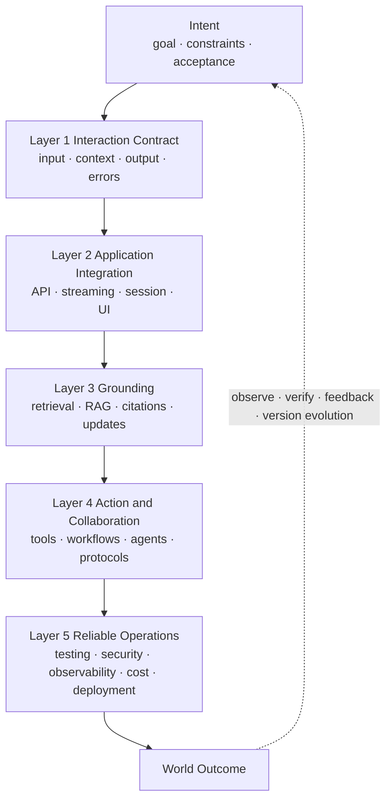

> **Layer**: 0 · Orientation and Boundaries ｜ **Exit of the layer above**: none ｜ **Exit of this layer**: you can locate your problem domain, audience, and next entry point
> **Prerequisites**: none (site entry) ｜ **Next**: [Complexity Decision Ladder](00-map/complexity-ladder) · [Site Boundaries and Knowledge Ownership](00-map/site-boundaries) · [Model Lifecycle (Bridge)](01-model-lifecycle/)

## 1. Overview

**Lead with the answer**: the engineering essence of AI technology is converting human intent, step by step, into verifiable system outcomes — under uncertainty, external state, and permission constraints. This track is organized along that capability-transformation chain. Protocols (MCP, A2A, ACP, AG-UI, and friends) are implementation choices for specific boundaries, not a learning order.

This map answers one question: **where are you stuck, and where do you go next.** It teaches no individual technology — every layer and topic has its own five-part chapter (Overview → Usage → Principles → Development → Resource Library).

### Mental model: one capability-transformation chain

```mermaid
flowchart TB
    I["Intent<br/>goal · constraints · acceptance"] --> L1["Layer 1 Interaction Contract<br/>input · context · output · errors"]
    L1 --> L2["Layer 2 Application Integration<br/>API · streaming · session · UI"]
    L2 --> L3["Layer 3 Grounding<br/>retrieval · RAG · citations · updates"]
    L3 --> L4["Layer 4 Action and Collaboration<br/>tools · workflows · agents · protocols"]
    L4 --> L5["Layer 5 Reliable Operations<br/>testing · security · observability · cost · deployment"]
    L5 --> W["World Outcome"]
    W -. "observe · verify · feedback · version evolution" .-> I
```

Arrows mark the **default order of increasing complexity**, not a hard runtime dependency: a RAG service may pass through only layers 1 and 3; a tool script may pass through only layers 1 and 4. Implementation always falls back to the lowest complexity that satisfies acceptance.

### When to use / when not to

- Use: first time in this track, unsure what to learn, or arriving with a concrete symptom.
- Do not use: model internals (→ [Learn LLM](https://llm.zenheart.site/)); click-by-click product tutorials (→ Products); evaluation methodology (→ [evals](https://evals.zenheart.site/)).

### Symptom-driven decision tree

Start from symptoms, not nouns. Find your symptom and enter the matching layer:

| Your symptom | Go to |
| --- | --- |
| Answers unstable / output cannot be parsed | [Layer 1 · Interaction Contract](03-context/) |
| Answers stable, but not yet in a product | [Layer 2 · Application Integration](02-inference-interface/) |
| Answers missing private or fresh facts | [Layer 3 · Grounding](04-grounding/) |
| Need to call systems or perform actions | [Layer 4 · Action and Collaboration](06-agent-systems/agent-runtime) |
| Need collaboration across host / org / agent boundaries | [Layer 4 · Protocol branch](07-interoperability) (choose by connection direction) |
| Feature works, but cannot be proven / operated | [Layer 5 · Reliable Operations](08-production/) |

### The six-layer pyramid

| Layer | Question it answers | Core topics | Depends on | Exit capability |
| --- | --- | --- | --- | --- |
| [0 · Orientation and Boundaries](00-map/complexity-ladder) | Where do I start; what is out of scope here? | Map, complexity ladder, site boundaries | none | Locate problem domain and next entry |
| [1 · Interaction Contract](03-context/) | How do I make input / output controllable? | Prompt, context, structured output, tool-calling contract | Layer 0 | Write and validate schemas; know failure acceptance |
| [2 · Application Integration](02-inference-interface/) | How does capability become a product interaction? | Model API, streaming, session and state, generative UI | Layer 1 | One cancellable, observable end-to-end interaction |
| [3 · Grounding](04-grounding/) | How do results get a data basis? | Embeddings and retrieval, RAG, advanced retrieval | Layer 2 | Traceable retrieval chain and update path |
| [4 · Action and Collaboration](06-agent-systems/agent-runtime) | How do systems act safely or collaborate across boundaries? | Tool execution, workflows, agent runtime, protocols | Layers 1–3 | Constrain permissions, pause / resume tasks, pick lowest-complexity collaboration |
| [5 · Reliable Operations](08-production/) | How do I prove it can ship and keep running? | Testing, observability, security, cost, deployment | Layers 1–4 | Replayable evidence of quality, risk, rollback, ownership |
| [Advanced](09-advanced/) | Frontier boundaries: interpretability, reasoning, architectures, multimodal (bridge → Learn LLM) | Concept positioning and next hops | L2-L8 | Know where the deep end lives |

### What this repository does not teach (three boundaries)

| Not expanded here | Canonical owner | What this repo keeps |
| --- | --- | --- |
| Model internals: Transformers, training math, KV-cache derivation | [Learn LLM](https://llm.zenheart.site/) | Decision impact + stop point + deep link; see [Site Boundaries](00-map/site-boundaries) |
| Evaluation methodology: benchmarks, judges, release evidence | [evals](https://evals.zenheart.site/) | When evidence is needed; how release gates plug in |
| Vendor docs / blog captures and EPUB indexing | sites-epub ([epub.zenheart.site](https://epub.zenheart.site/)) | Second-pass treatment of stable cross-vendor concepts + reading routes |

Version milestones: this map was frozen on 2026-09 under the Issue #116 pyramid restructure; the previous entry organized as "Fundamentals → Prompt → Integrate → RAG → Agent → Engineering" was merged into this page. Earlier history is unverified and will not be fabricated.

## 2. Usage

This page is a map; it produces no runnable artifact. "Usage" = navigation drills. The acceptance bar is one line: **from a symptom, reach the correct layer within two hops.**

### Drill 1: unstable output

- **Symptom**: "The JSON the model returns fails to parse three times out of ten."
- **Hop 1**: decision tree above → "Answers unstable / output cannot be parsed" → [Layer 1 · Interaction Contract](03-context/).
- **Hop 2**: layer 1 topic table → the symptom maps to [Structured Output](02-inference-interface/structured-output).
- **Arrival**: you can write and validate an output schema and know how failures are accepted.

### Drill 2: missing fresh facts

- **Symptom**: "The internal assistant does not know the refund policy we updated last week."
- **Hop 1**: decision tree → "Answers missing private or fresh facts" → [Layer 3 · Grounding](04-grounding/).
- **Hop 2**: layer 3 topic table → [RAG](04-grounding/rag).
- **Arrival**: you can build a traceable retrieval chain and update path.

### Drill 3: you want the system to act

- **Symptom**: "We want an agent to mark resolved tickets automatically, but we fear bad edits."
- **Hop 1**: decision tree → "Need to call systems or perform actions" → [Layer 4 · Action and Collaboration](06-agent-systems/agent-runtime).
- **Hop 2**: layer 4 topic table → for one controlled action, start with [Tool Execution Engineering](05-action/tool-execution).
- **Arrival**: you can constrain permissions and make the action idempotent and reversible.

If all three drills fail: read the [Complexity Decision Ladder](00-map/complexity-ladder) to pin down your requirement level, then return to the decision tree.

## 3. Principles

### Why this main line

The old directory placed Fundamentals (knowledge abstraction), Prompt (interaction means), Integrate (implementation), RAG / Agent (architecture patterns), Skills / MCP (assets / protocols), and Engineering (lifecycle) at the same level — six classification axes mixed together, so readers could not reason from "where am I stuck" to "which page do I read."

This map keeps exactly one axis: **how capability turns intent into outcome.** The other dimensions (semantic layer, trust domain, lifecycle, evidence level, ownership, view) are demoted to page metadata and comparison tables, never competing top-level sections.

### Two axes, one picture

- **Capability main line (vertical)**: from "the model can answer" to "the system can safely complete work" — the chain above.
- **Engineering cross-cut (horizontal)**: every layer passes through Overview → Usage → Principles → Development → Resource Library; security, privacy, cost, observability, and human approval cut across all layers.

### Why protocols live in layer 4, not layer 0

Protocols solve communication and capability discovery at specific boundaries: MCP connects agents to tools / data, A2A connects agents across trust domains, ACP connects editors to coding agents, AG-UI connects agents to user interfaces. They are implementation choices **after the boundary is known**. Learning protocols before problems is buying a screwdriver before finding a screw — the root of the old "protocol list" structure. Selection rules: rung 6 of the [Complexity Decision Ladder](00-map/complexity-ladder).

### Teaching order is not runtime dependency

Arrows mark the default learning and complexity order for newcomers. Real engineering can build bottom-up from contracts and fixtures; RAG, tools / agents, and API / streaming can combine per scenario. Every layer index states both "what to learn first by default" and "which scenarios may skip."

## 4. Development

This page wires no code; "Development" = how to maintain this map.

### Maintenance flow

1. **Register**: a new topic is first registered in `_phase0/slug-map.json` with topicId, layer, slug, and mergeSources; one topicId has exactly one canonical owner.
2. **Place by layer**: assign layers by "what question does this page answer," never by technology noun. If it fits no layer, ask whether it belongs to Products / appendices / a sibling site.
3. **Rewire**: once a topic lands in a layer, re-check this page — does the decision tree need a new branch? Does the six-layer table's core-topics column need a word?
4. **Keep bilingual parity**: zh and en pages share topicId, structure, conclusions, diagrams, and links; `bilingualParity: exact` marks completion.
5. **Close out**: merged old paths go to `docs/public/redirects.json`; they never linger in the sidebar.

### Inventory and acceptance

- Structural facts come from `node scripts/pyramid-inventory.mjs` output, not memory.
- Graph-level acceptance: starting from any real symptom, reach the right layer within two navigations; any orphan page, unowned protocol page, or resource card with links but no problem context is a map defect.

### Maintenance anti-patterns

- A "More" bucket for unclassifiable pages — the trash-can taxonomy re-pollutes the main axis.
- Top-level entries for trending protocols — protocols always enter from a boundary problem.
- Letting zh / en pages drift — a `bilingualParity: partial` older than one writing cycle is a defect.

## 5. Resource Library

This page is an entry point; resources are "next hops." Four-level route:

- **Beginner**: this page + the [Complexity Decision Ladder](00-map/complexity-ladder); locate your layer.
- **Builder**: enter [Layer 1](03-context/) and [Layer 2](02-inference-interface/); finish your first keyless fixture.
- **Operator**: enter [Layer 5](08-production/); learn to prove ship-readiness with evidence.
- **Researcher**: descend to sibling sites for deep principles.

### Three-site entry table

| Site | Canonical URL | Purpose | Status |
| --- | --- | --- | --- |
| Learn LLM | https://llm.zenheart.site/ | Model internals, training math | HTTP 200 (retrievedAt 2026-09-01) |
| Learn LLM chapter index | https://llm.zenheart.site/chapters/ | 21-chapter map; deep-link entry | HTTP 200 (retrievedAt 2026-09-01) |
| evals | https://evals.zenheart.site/ | Evaluation methods, benchmarks, release evidence | HTTP 200 (retrievedAt 2026-09-01) |
| sites-epub | https://epub.zenheart.site/ | Vendor source captures and EPUB index | warning: TLS certificate mismatch, HTTPS currently unreachable (retrievedAt 2026-09-01; re-check before citing) |

Ownership details, stop points, and bridge metadata rules per site: [Site Boundaries and Knowledge Ownership](00-map/site-boundaries).

### Active falsification and open questions

- If a symptom finds no branch in the decision tree, or a branch drops you into the wrong layer — that is a map defect; fix the map first instead of routing around it.
- Open: sites-epub is currently unreachable over HTTPS (certificate mismatch); its ownership claims follow the bridge register until the site is re-verified.
- Open: the "by connection direction" protocol drill-down lands in layer 4; the entry point is the [Protocol Map](07-interoperability).

### Where learn-ai stops / where to continue

- How models "think": Learn LLM's [chapter index](https://llm.zenheart.site/chapters/).
- How to prove quality: [evals](https://evals.zenheart.site/).
- Vendor originals and offline reading: sites-epub (once restored).
- Next in this repo: [Complexity Decision Ladder](00-map/complexity-ladder).
