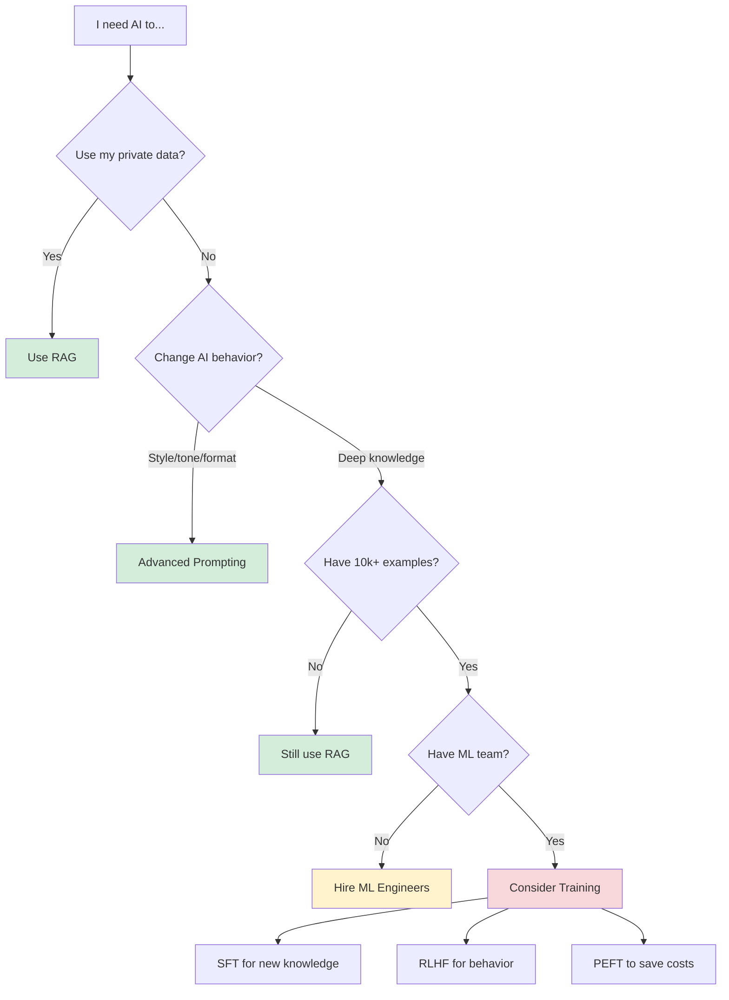

# AI Model Training for Frontend Engineers

**Important**: This section explains training concepts **at a high level only**. As a frontend engineer, you rarely need to implement training yourself.

## The Golden Rule

> **99% of frontend AI use cases should use RAG, not training.**

If you're considering model training, ask yourself:
- Do I have 10,000+ high-quality labeled examples?
- Do I have $10,000+ budget for training and experimentation?
- Do I have ML engineering expertise or can I hire it?

**If you answered "no" to any of these**, use RAG instead.

---

## When to Use What: Decision Tree

---

## Training Methods Comparison

| Method | What It Does | When Companies Use It | Frontend Relevance | Cost |
|--------|-------------|----------------------|-------------------|------|
| **[RAG](/tech/patterns/RAG)** | Retrieve docs + inject into context | Always (first choice) | ✅ **You implement this** | $ |
| **[SFT](/tech/training/SFT)** | Teach new knowledge via examples | Custom domains (legal, medical) | ❌ Hire ML engineers | $$$ |
| **RLHF** 🚧 | Refine behavior via human feedback | ChatGPT-style alignment | ❌ Research teams only | $$$$ |
| **PEFT** 🚧 | Efficient fine-tuning (LoRA) | Budget-conscious training | ❌ ML engineers implement | $$ |

🚧 = Concept-only documentation (coming soon)

---

## Why RAG is Your Friend

**RAG (Retrieval-Augmented Generation)** solves 99% of "I need AI to know my data" problems:

✅ **Works with any LLM** - No training required
✅ **Updates instantly** - Add new docs, they're immediately available
✅ **Costs pennies** - Vector search + API calls vs. thousands in training
✅ **Debuggable** - See exactly what documents were retrieved
✅ **Frontend-friendly** - You control the entire stack

**Example Use Cases RAG Handles**:
- Customer support over product docs
- Internal knowledge base search
- Code documentation Q&A
- Legal/medical document analysis

**Read More**: [RAG Complete Guide](/tech/patterns/RAG)

---

## When Training Actually Makes Sense

You should only consider training if you meet **ALL** of these criteria:

### For Supervised Fine-Tuning (SFT)

- [ ] You need the AI to learn **domain-specific knowledge** that doesn't exist in public training data
- [ ] You have **10,000+ high-quality labeled examples** (not just documents - actual input/output pairs)
- [ ] RAG is too slow or expensive for your use case
- [ ] You have budget for **$5,000-$50,000** in training costs
- [ ] You have ML engineers who can implement and debug this

**Example**: A medical company training an LLM to interpret proprietary lab reports using 50,000 annotated examples.

### For RLHF (Reinforcement Learning from Human Feedback)

- [ ] You need to change **behavior** (tone, style, safety) not add knowledge
- [ ] You have hundreds of hours of human feedback data
- [ ] You have a research team with RLHF expertise
- [ ] Budget: **$50,000+**

**Example**: OpenAI aligning GPT-4 to refuse harmful requests.

### For PEFT (Parameter-Efficient Fine-Tuning)

- [ ] You're already doing SFT but need to reduce costs
- [ ] You need to deploy multiple specialized models
- [ ] You have ML engineers familiar with LoRA/QLoRA

**Example**: Startups creating customer-specific model variants without full fine-tuning costs.

---

## The "When to Hire ML Engineers" Checklist

If you're a frontend engineer and answered "yes" to any of these, it's time to involve ML specialists:

- [ ] RAG isn't accurate enough even after optimization
- [ ] You need the model to "memorize" domain knowledge (SFT)
- [ ] You're spending >$10k/month on API calls and training might reduce costs
- [ ] You need to deploy models on-device or in restrictive environments
- [ ] Your company wants a proprietary AI advantage (custom model)

**What You Should Do First**:
1. Exhaust all RAG optimizations (hybrid search, reranking, better chunking)
2. Try advanced prompting techniques (few-shot, chain-of-thought)
3. Test with multiple LLM providers (Claude, GPT-4, Gemini)
4. Calculate ROI: Will training savings exceed $50k+ implementation cost?

---

## Training Concepts Overview

### Supervised Fine-Tuning (SFT)

**What**: Train a model on input-output examples to teach new knowledge or tasks.

**Pros**:
- Model "learns" domain-specific knowledge
- Can improve accuracy over RAG in narrow domains
- Responses can be faster (no retrieval step)

**Cons**:
- Requires 1,000-100,000+ examples
- Expensive ($1k-$100k depending on scale)
- Static - new data requires retraining
- Hard to debug when it goes wrong

**Read More**: [SFT Guide](/tech/training/SFT)

---

### RLHF (Reinforcement Learning from Human Feedback)

**What**: Human annotators rank model outputs (good/bad), and the model learns to prefer "good" responses.

**Used By**: ChatGPT, Claude, Gemini (all major LLMs)

**Frontend Relevance**: You'll never implement this. It's how OpenAI/Anthropic create safe, helpful models that you consume via APIs.

**Concept-only documentation coming soon**

---

### PEFT (Parameter-Efficient Fine-Tuning)

**What**: Techniques like LoRA that train only a small subset of model parameters instead of the full model.

**Why It Exists**: Full fine-tuning GPT-3.5 costs $10k+. LoRA can do it for $100.

**When Companies Use It**:
- Creating customer-specific model variants
- Rapid experimentation with limited budget
- Deploying multiple specialized models

**Frontend Relevance**: If your company has ML engineers doing SFT, they might use PEFT to reduce costs. You'll consume the model via API regardless.

**Concept-only documentation coming soon**

---

## Training Providers (If You Must)

If you've decided training is necessary, these providers offer no-code/low-code solutions:

| Provider | Best For | Starting Cost |
|----------|----------|---------------|
| **OpenAI Fine-Tuning** | GPT-3.5/4 fine-tuning | ~$1,200 (training) + usage |
| **Anthropic** | Claude fine-tuning (limited availability) | Contact sales |
| **HuggingFace AutoTrain** | Open models (Llama, Mistral) | $100-$5,000 |
| **Replicate** | One-click fine-tuning | $0.50-$5 per training run |

**Note**: Even with these tools, you need ML expertise to:
- Prepare quality training data
- Evaluate model performance
- Debug issues
- Decide when to stop training

---

## The Frontend Engineer's Training Mindset

**Your role**: Understand these concepts exist so you can:
- Have informed conversations with ML teams
- Make build-vs-buy decisions
- Know when RAG is sufficient (99% of the time)
- Recognize when to escalate to specialists

**Your job is NOT**:
- Implementing training pipelines
- Debugging gradient descent
- Choosing hyperparameters
- Managing GPU infrastructure

**Your job IS**:
- Building great RAG systems
- Mastering prompt engineering
- Integrating trained models via APIs
- Creating UX for AI features

---

## Next Steps

### For Most Frontend Engineers

1. Master RAG: [RAG Complete Guide](/tech/patterns/RAG)
2. Optimize prompts: [Prompt Engineering](/tech/fundamentals/prompt)
3. Learn structured output: [Type-Safe AI](/tech/structured-output) 🚧

### If You're Considering Training

1. Read [SFT Guide](/tech/training/SFT) to understand requirements
2. Audit your data: Do you have 10k+ quality examples?
3. Calculate costs: Compare RAG optimization vs. training investment
4. Consult with ML engineers before committing

### If You're Building AI Products

1. Start with RAG always
2. Measure: Is RAG accuracy <90% after optimization?
3. Explore: Can better prompts/models solve it?
4. Only then: Consider training with ML team

---

## Summary

- **99% of use cases → Use RAG** (no training needed)
- **Training is expensive** ($5k-$100k) and requires ML expertise
- **Frontend engineers** should understand concepts, not implement training
- **When in doubt**, optimize RAG before considering training

**The golden rule**: If you can solve it with RAG, don't train. If you can solve it with better prompts, don't use RAG.

---

## Additional Resources

- [RAG vs Fine-Tuning: When to Use Each](https://www.pinecone.io/learn/rag-vs-finetuning/) (External)
- [OpenAI Fine-Tuning Guide](https://platform.openai.com/docs/guides/fine-tuning) (External)
- [The Economics of LLM Fine-Tuning](https://www.anthropic.com/research/economics) (External - Example)

**Questions?** If you're unsure whether to use RAG or training, [open a discussion](https://github.com/zenheart/learn-ai/discussions).
