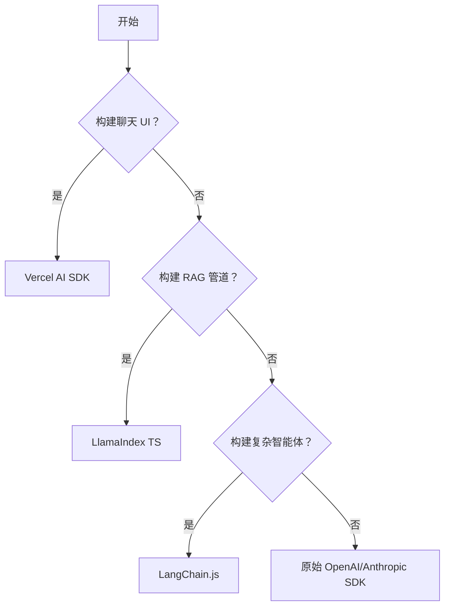

# AI 框架概览

使用原始 API 调用构建 AI 应用是可能的，但框架解决了诸如 **流式状态管理**、**链式调用** 和 **文档检索** 等常见问题。

## 三大巨头

| 框架 | 最适合 | 理念 |
| :--- | :--- | :--- |
| **Vercel AI SDK** | **前端/全栈** | "UI 优先"。专为 React/Next.js/Svelte 构建。轻松处理流式 Hooks 和 UI 更新。 |
| **LangChain.js** | **后端逻辑/智能体** | "链与智能体"。拥有庞大的集成生态系统。非常适合独立于 UI 的复杂工作流。 |
| **LlamaIndex TS** | **数据/RAG** | "数据优先"。专注于将 LLM 连接到你的数据（PDF、SQL、Notion）以构建 RAG 应用。 |

---

## 决策矩阵：我该用什么？

## 详细指南

### 1. [Vercel AI SDK](./vercel-ai-sdk.md) (推荐入门)
Next.js 开发者的默认选择。它统一了 API 层和 UI 层。
- **主要特性**: `useChat`, `useCompletion`, `streamText`。
- **生态系统**: 适用于 OpenAI, Anthropic, Mistral, Google 等。

### 2. [LangChain.js](./langchain-js.md)
AI 的瑞士军刀。
- **主要特性**: 提示词模板、输出解析器、链 (Chains)、智能体 (Agents)。
- **用例**: 当你需要轻松切换模型或构建复杂的多步推理链时。

### 3. [LlamaIndex.TS](./llamaindex-ts.md)
数据框架。
- **主要特性**: 数据加载器 (PDF, HTML)、向量存储索引、查询引擎。
- **用例**: 构建“与你的数据对话”的聊天机器人 (RAG)。

## 我可以混合使用吗？
**可以！** 一个非常常见的技术栈是：
- **Vercel AI SDK** 用于前端 UI (流式 Hooks)。
- **LlamaIndex** 或 **LangChain** 在后端检索数据并构建提示词。

## 下一步
从 **[Vercel AI SDK 指南](./vercel-ai-sdk.md)** 开始，构建你的第一个流式 UI。