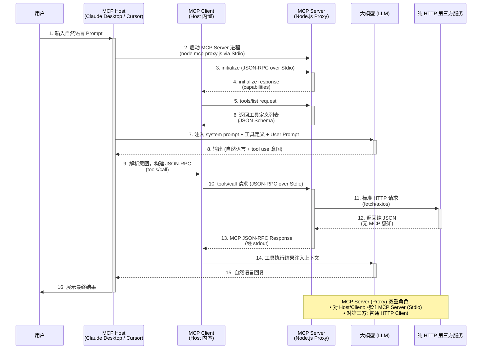

# MCP 协议架构详解

> 本文档深入分析 MCP 协议的分层架构、通讯流程，以及 MCP Proxy 模式如何桥接纯 HTTP 第三方服务。

## 一、协议分层

MCP 协议分为两层：

| 层级 | 职责 | 关键技术 |
|------|------|----------|
| **Transport Layer** (传输层) | 消息的物理传输通道 | Stdio / Streamable HTTP |
| **Data Layer** (数据层) | JSON-RPC 2.0 消息的格式和语义 | `initialize`、`tools/call`、`tools/list` 等方法 |

```
┌─────────────────────────────────────┐
│         MCP Host (AI 应用)           │
│  ┌────────────────────────────────┐ │
│  │        Data Layer               │ │
│  │   JSON-RPC 2.0 Messages        │ │
│  └────────────────────────────────┘ │
│  ┌────────────────────────────────┐ │
│  │     Transport Layer             │ │
│  │   Stdio ◄──────► Streamable HTTP│ │
│  └────────────────────────────────┘ │
└──────────────────┬──────────────────┘
                   │
         ┌─────────┴─────────┐
         │                     │
    Local Process          Remote Server
    (Stdio)               (HTTP/SSE)
```

## 二、MCP Proxy 模式（桥接 HTTP 第三方服务）

MCP Server 可以作为 **协议转换桥**，让不支持 MCP 的普通 HTTP 服务接入 MCP 生态。

### 完整时序图



### 关键要点

| 步骤 | 说明 |
|------|------|
| **2** | MCP Server 通过 **Stdio** 启动，本质是一个子进程 |
| **3-6** | MCP **握手协议**：先 `initialize`，再 `tools/list` 获取工具清单 |
| **8-9** | LLM 输出结构化**意图**，由 Host 应用**解析**后构建 JSON-RPC（LLM 不直接输出 JSON-RPC） |
| **10** | `tools/call` 通过 **Stdio stdin** 发送，不是网络请求 |
| **11-12** | Server 作为 **HTTP Client**，调用第三方 API（无 MCP 感知） |

## 三、Transport Layer 详解

MCP 支持两种传输机制：

### 3.1 Stdio Transport（本地进程）

```
Host 进程  ←→  [Stdin/Stdout]  ←→  MCP Server 子进程
```

- **适用场景**：本地 MCP Server（如文件系统、数据库工具）
- **优点**：无网络开销，性能最优
- **通信格式**：JSON-RPC 消息直接写入 stdin/stdout

### 3.2 Streamable HTTP Transport（远程服务）

```
MCP Client  ←→  [HTTP POST + SSE]  ←→  MCP Server (远程)
```

- **适用场景**：远程 MCP Server、第三方服务
- **HTTP 方法**：
  - Client → Server：`POST` (发送 JSON-RPC 请求)
  - Server → Client：Server-Sent Events (流式响应)
- **认证方式**：Bearer Token、API Key、OAuth

## 四、MCP Proxy 工作原理

### 为什么需要 MCP Proxy？

| 场景 | 问题 | 解决方案 |
|------|------|----------|
| 第三方 API 不支持 MCP | REST API 不认识 MCP 协议 | MCP Server 作为协议转换层 |
| 工具需要聚合 | 多个 API 需要统一暴露 | Proxy 聚合多个 HTTP API |
| 安全控制 | 不希望 LLM 直接访问外网 | Proxy 添加认证、限流、审计 |

### Proxy 的双重身份

```
┌──────────────────────────────────────┐
│           MCP Server (Proxy)          │
├──────────────────────────────────────┤
│  对 MCP Host/Client：                 │
│    • 遵循 MCP 协议                    │
│    • 暴露 tools/list、tools/call      │
│    • 通过 Stdio/HTTP 通讯              │
├──────────────────────────────────────┤
│  对第三方 HTTP 服务：                  │
│    • 普通的 HTTP Client               │
│    • 发送标准 REST 请求                │
│    • 接收纯 JSON 响应                  │
└──────────────────────────────────────┘
```

### 代码示例

```typescript
import { Server } from "@modelcontextprotocol/sdk/server/index.js";
import { StdioServerTransport } from "@modelcontextprotocol/sdk/server/stdio.js";
import { CallToolRequestSchema, ListToolsRequestSchema } from "@modelcontextprotocol/sdk/types.js";

// 1. 创建 MCP Server（对 Host 表现为标准 MCP Server）
const server = new Server(
  { name: "http-proxy", version: "1.0.0" },
  { capabilities: { tools: {} } }
);

// 2. 定义工具（暴露给 LLM）
server.setRequestHandler(ListToolsRequestSchema, async () => ({
  tools: [
    {
      name: "search_flights",
      description: "搜索航班",
      inputSchema: {
        type: "object",
        properties: {
          from: { type: "string" },
          to: { type: "string" },
          date: { type: "string" }
        }
      }
    }
  ]
}));

// 3. 处理工具调用（对第三方表现为普通 HTTP Client）
server.setRequestHandler(CallToolRequestSchema, async (request) => {
  const { name, arguments: args } = request.params;

  if (name === "search_flights") {
    // 发起标准 HTTP 请求（无 MCP 感知）
    const response = await fetch("https://api.example.com/flights", {
      method: "POST",
      headers: { "Content-Type": "application/json" },
      body: JSON.stringify(args)
    });
    const data = await response.json();

    // 包装为 MCP JSON-RPC 响应格式
    return {
      content: [{ type: "text", text: JSON.stringify(data) }]
    };
  }
});

async function main() {
  const transport = new StdioServerTransport();
  await server.connect(transport);
}
main();
```

## 五、常见误解澄清

| 误解 | 事实 |
|------|------|
| "LLM 直接输出 JSON-RPC" | LLM 输出结构化意图，由 Host 解析后构建 JSON-RPC |
| "MCP Server 直接调用 HTTP" | 是的，但 Server 同时要遵循 MCP 协议（双重身份） |
| "工具调用走 HTTP" | 本地场景走 Stdio；远程场景才走 HTTP |
| "MCP 是一个 HTTP API" | MCP 是协议，HTTP 只是传输层的一种实现 |

## 六、下一章

- **[MCP 入门指南](./index.md)**: 快速上手 MCP 开发
- **[工具定义最佳实践](./tool-schema.md)**: 如何设计 AI-Friendly 的工具 Schema
