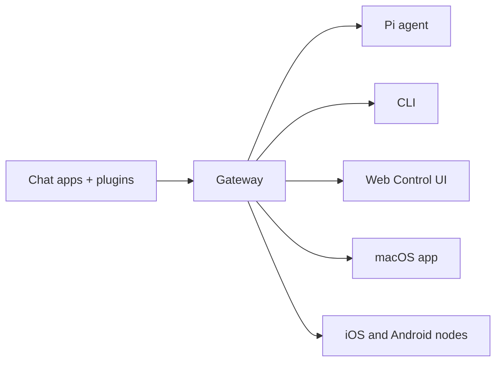

# OpenClaw 完全手册 Cheatsheet

直接体验参考 [feishu](./feishu.md)

## 🦞 第一章：认识 OpenClaw

### 什么是 OpenClaw？

OpenClaw 是一个**自托管的 AI 智能体网关**，将 WhatsApp、Telegram、Discord、iMessage 等即时通讯应用连接到 AI 编码智能体（如 Pi）。你在自己的机器（或服务器）上运行一个 Gateway 进程，它就成为消息应用与 AI 助手之间的桥梁。

**核心特点：**

- **自托管**：运行在你的硬件上，数据不离开你的控制
- **多通道**：一个 Gateway 同时服务 WhatsApp、Telegram、Discord 等
- **智能体原生**：为工具调用、会话、记忆和多智能体路由而设计
- **开源**：MIT 协议，社区驱动

### 架构总览



Gateway 是会话、路由和通道连接的唯一真相来源。它通过 **WebSocket**（默认 `127.0.0.1:18789`）对外提供 API。

## 🚀 第二章：安装

### 系统要求

- **Node 24**（推荐），Node 22 LTS（`22.16+`）仍受支持
- macOS、Linux 或 Windows（强烈推荐 WSL2）

### 安装方式

**方式一：官方安装脚本（推荐）**

macOS/Linux：

```bash
curl -fsSL https://openclaw.ai/install.sh | bash
```

Windows (PowerShell)：

```powershell
iwr -useb https://openclaw.ai/install.ps1 | iex
```

**方式二：npm/pnpm 手动安装**

```bash
npm install -g openclaw@latest
openclaw onboard --install-daemon
```

**方式三：从源码构建**

```bash
git clone https://github.com/openclaw/openclaw.git
cd openclaw
pnpm install && pnpm ui:build && pnpm build
pnpm link --global
```

**方式四：Docker**

```bash
./docker-setup.sh   # 从仓库根目录运行
```

### 安装后验证

```bash
openclaw doctor         # 检查配置问题
openclaw status         # 查看 Gateway 状态
openclaw dashboard      # 打开浏览器 UI
```

## ⚙️ 第三章：快速上手（5分钟）

### 步骤一：运行引导向导

```bash
openclaw onboard --install-daemon
```

向导会配置：

1. 模型/Auth（API Key、OAuth 或 setup-token）
2. 工作区（默认 `~/.openclaw/workspace`）
3. Gateway（端口、绑定地址、认证模式）
4. 通道（WhatsApp、Telegram、Discord 等）
5. 守护进程（macOS LaunchAgent 或 Linux systemd）

### 步骤二：登录频道（以 WhatsApp 为例）

```bash
openclaw channels login --channel whatsapp
# 用助手手机扫描二维码
```

### 步骤三：启动 Gateway

```bash
openclaw gateway --port 18789
# 或者查看已安装的守护服务
openclaw gateway status
```

### 步骤四：打开控制界面

```bash
openclaw dashboard
# 默认: http://127.0.0.1:18789/
```

### 最小配置文件（`~/.openclaw/openclaw.json`）

```json5
{
  agents: { defaults: { workspace: "~/.openclaw/workspace" } },
  channels: { whatsapp: { allowFrom: ["+15555550123"] } },
}
```

## 🔑 第四章：核心概念

### 4.1 工作区（Workspace）

工作区是智能体的家。默认位于 `~/.openclaw/workspace`。

**工作区文件映射：**

| 文件 | 作用 |
|---|---|
| `AGENTS.md` | 操作指令和记忆，每次会话加载 |
| `SOUL.md` | 个性、语气和边界 |
| `USER.md` | 用户档案和称呼方式 |
| `IDENTITY.md` | 智能体名称、风格和表情 |
| `TOOLS.md` | 本地工具使用规范（仅指导，不控制工具可用性） |
| `HEARTBEAT.md` | 心跳运行的简短清单 |
| `BOOT.md` | 网关重启时的启动检查清单 |
| `BOOTSTRAP.md` | 首次运行仪式（完成后删除） |
| `memory/YYYY-MM-DD.md` | 每日记忆日志 |
| `MEMORY.md` | 精心整理的长期记忆（仅在主私有会话加载） |
| `skills/` | 工作区专属技能 |

**不应放在工作区的内容（存放在 `~/.openclaw/`）：**

- 配置文件 `openclaw.json`
- 凭证 `credentials/`
- 会话记录 `agents/<agentId>/sessions/`

**备份建议：** 将工作区设为私有 git 仓库

```bash
cd ~/.openclaw/workspace
git init
git add AGENTS.md SOUL.md TOOLS.md IDENTITY.md USER.md HEARTBEAT.md memory/
git commit -m "Add agent workspace"
```

### 4.2 会话（Session）

会话管理对话连续性和隔离性。

**会话范围（`session.dmScope`）：**

| 值 | 行为 |
|---|---|
| `main`（默认） | 所有 DM 共享主会话（适合单用户） |
| `per-peer` | 按发送者 ID 隔离 |
| `per-channel-peer` | 按通道+发送者隔离（**多用户推荐**） |
| `per-account-channel-peer` | 按账户+通道+发送者隔离（多账户推荐） |

**安全 DM 模式（多用户必须开启）：**

```json5
{
  session: { dmScope: "per-channel-peer" }
}
```

**会话重置触发器：**

- `/new` 或 `/reset`：开启新会话
- `/compact [instructions]`：压缩上下文
- `/stop`：中止当前运行

**会话键格式：**

- 直接消息：`agent:<agentId>:<mainKey>`
- 群组：`agent:<agentId>:<channel>:group:<id>`
- Cron：`cron:<jobId>`

**会话维护配置：**

```json5
{
  session: {
    maintenance: {
      mode: "enforce",
      pruneAfter: "45d",
      maxEntries: 800,
      rotateBytes: "20mb",
    }
  }
}
```

### 4.3 智能体循环（Agent Loop）

一次智能体运行的生命周期：

```

接收消息 → 验证参数 → 解析会话 → 加载技能快照
→ 组装上下文/系统提示 → 模型推理
→ 工具执行 → 流式回复 → 持久化

```

关键事件流：

- `lifecycle`：开始/结束/错误
- `assistant`：流式文本块
- `tool`：工具调用事件

**Hook 拦截点（插件 API）：**

| Hook | 触发时机 |
|---|---|
| `before_model_resolve` | 模型解析前 |
| `before_prompt_build` | 提示构建前 |
| `agent_end` | 运行结束后 |
| `before_tool_call` / `after_tool_call` | 工具调用前后 |
| `before_compaction` / `after_compaction` | 压缩前后 |

### 4.4 记忆系统（Memory）

OpenClaw 记忆是**工作区中的纯 Markdown 文件**，文件是真相来源。

**两层记忆：**

1. `memory/YYYY-MM-DD.md` — 每日追加日志
2. `MEMORY.md` — 精心整理的长期记忆（仅主会话加载）

**记忆工具：**

- `memory_search`：语义检索
- `memory_get`：读取特定文件/行范围

**向量记忆搜索（自动选择 Provider）：**

自动选择顺序：`local` → `openai` → `gemini` → `voyage` → `mistral`

```json5
{
  agents: {
    defaults: {
      memorySearch: {
        provider: "openai",
        model: "text-embedding-3-small",
      }
    }
  }
}
```

**混合搜索（BM25 + 向量）：**

```json5
{
  agents: {
    defaults: {
      memorySearch: {
        query: {
          hybrid: {
            enabled: true,
            vectorWeight: 0.7,
            textWeight: 0.3,
            mmr: { enabled: true, lambda: 0.7 },
            temporalDecay: { enabled: true, halfLifeDays: 30 }
          }
        }
      }
    }
  }
}
```

### 4.5 上下文压缩（Compaction）

当会话接近模型上下文窗口限制时，自动触发压缩。

```

/compact Focus on decisions and open questions

```

- **自动压缩**：检测到上下文紧张时自动触发
- **手动压缩**：`/compact [指令]`
- **pre-compaction memory flush**：压缩前自动提示模型写入持久记忆

```json5
{
  agents: {
    defaults: {
      compaction: {
        model: "openrouter/anthropic/claude-sonnet-4-5",
        memoryFlush: { enabled: true }
      }
    }
  }
}
```

## 📡 第五章：通道配置

### 访问控制策略

**DM 策略（`dmPolicy`）：**

| 策略 | 行为 |
|||
| `pairing`（默认） | 未知发送者获得配对码，需要所有者批准 |
| `allowlist` | 只允许 `allowFrom` 中的发送者 |
| `open` | 允许所有入站 DM（需 `allowFrom: ["*"]`） |
| `disabled` | 忽略所有 DM |

### WhatsApp 配置

```json5
{
  channels: {
    whatsapp: {
      dmPolicy: "pairing",
      allowFrom: ["+15551234567"],
      groupPolicy: "allowlist",
      groups: { "*": { requireMention: true } },
    },
  },
}
```

**扫码登录：**

```bash
openclaw channels login --channel whatsapp
# 多账户
openclaw channels login --channel whatsapp --account work
```

### Telegram 配置

1. 通过 `@BotFather` 创建 Bot，获取 token
2. 在配置中设置：

```json5
{
  channels: {
    telegram: {
      enabled: true,
      botToken: "123:abc",
      dmPolicy: "pairing",
      groups: { "*": { requireMention: true } },
    },
  },
}
```

或使用环境变量：`TELEGRAM_BOT_TOKEN=...`

### DM 配对管理

```bash
openclaw pairing list telegram
openclaw pairing approve telegram <CODE>
```

配对码 8 位大写字母，**1小时过期**，每个通道最多 3 个待处理请求。

## 🤖 第六章：模型配置

### 选择模型 Provider

**内置 Provider（无需 `models.providers` 配置）：**

| Provider | 环境变量 | 示例模型 |
|---|---|---|
| `openai` | `OPENAI_API_KEY` | `openai/gpt-5.4` |
| `anthropic` | `ANTHROPIC_API_KEY` | `anthropic/claude-opus-4-6` |
| `openai-codex` | OAuth (ChatGPT) | `openai-codex/gpt-5.4` |

### 模型配置示例

```json5
{
  agents: {
    defaults: {
      model: {
        primary: "anthropic/claude-sonnet-4-5",
        fallbacks: ["openai/gpt-5.2"],
      },
      models: {
        "anthropic/claude-sonnet-4-5": { alias: "Sonnet" },
        "openai/gpt-5.2": { alias: "GPT" },
      },
    },
  },
}
```

### 模型 CLI 命令

```bash
openclaw models list           # 列出所有模型
openclaw models status         # 查看当前模型和认证状态
openclaw models set anthropic/claude-opus-4-6  # 设置主模型
openclaw models aliases add Opus anthropic/claude-opus-4-6  # 添加别名
openclaw models fallbacks add openai/gpt-5.2  # 添加备用模型
```

### 聊天中切换模型

```

/model                    # 显示模型选择器
/model list               # 列出可用模型
/model openai/gpt-5.2     # 切换模型
/model status             # 查看当前模型状态

```

## 🔧 第七章：配置详解

### 配置文件位置和格式

配置文件：`~/.openclaw/openclaw.json`（JSON5 格式，支持注释和尾随逗号）

**编辑方式：**

```bash
openclaw onboard            # 引导向导（推荐新手）
openclaw configure          # 配置向导
openclaw config get agents.defaults.workspace   # 读取单个键
openclaw config set agents.defaults.heartbeat.every "2h"  # 设置单个键
openclaw config unset tools.web.search.apiKey   # 删除键
```

### 配置热重载

Gateway 监视配置文件，大多数设置无需重启即可生效：

| 模式 | 行为 |
|---|---|
| `hybrid`（默认） | 安全更改即时生效，关键更改自动重启 |
| `hot` | 只热应用安全更改，需要重启时记录警告 |
| `restart` | 任何更改都重启 |
| `off` | 禁用文件监视 |

```json5
{ gateway: { reload: { mode: "hybrid", debounceMs: 300 } } }
```

**不需要重启的设置：** `channels.*`、`agents`、`models`、`routing`、`hooks`、`cron`、`session`、`tools`、`skills`

**需要重启的设置：** `gateway.*`（端口、绑定、认证）、`plugins`

### 环境变量

OpenClaw 读取环境变量来源：

1. 父进程
2. 当前目录 `.env`
3. `~/.openclaw/.env`（全局后备）

关键变量：

- `OPENCLAW_HOME`：内部路径解析的主目录
- `OPENCLAW_STATE_DIR`：状态目录
- `OPENCLAW_CONFIG_PATH`：配置文件路径
- `OPENCLAW_GATEWAY_TOKEN`：Gateway 认证令牌

在配置中引用环境变量：

```json5
{
  gateway: { auth: { token: "${OPENCLAW_GATEWAY_TOKEN}" } },
}
```

### 拆分配置文件（`$include`）

```json5
// ~/.openclaw/openclaw.json
{
  gateway: { port: 18789 },
  agents: { $include: "./agents.json5" },
  broadcast: {
    $include: ["./clients/a.json5", "./clients/b.json5"],
  },
}
```

## 🛡️ 第八章：安全

### 安全模型

OpenClaw 是**个人助手安全模型**：每个 Gateway 一个受信任的操作者边界。

**不支持的场景：** 多个互不信任的用户共享一个有工具权限的智能体。

### 快速安全检查

```bash
openclaw security audit          # 基础审计
openclaw security audit --deep   # 深度检查
openclaw security audit --fix    # 自动修复
```

### 必须设置的安全项

1. **限制谁可以给机器人发消息：**

   ```json5
   { channels: { whatsapp: { allowFrom: ["+15555550123"] } } }
   ```

1. **使用专属号码**（不要用个人 WhatsApp）

1. **禁用心跳直到信任该设置：**

   ```json5
   { agents: { defaults: { heartbeat: { every: "0m" } } } }
   ```

### 秘密管理（SecretRef）

支持三种秘密来源，避免明文存储 API Key：

```json5
// 环境变量
{ source: "env", provider: "default", id: "OPENAI_API_KEY" }

// 文件
{ source: "file", provider: "filemain", id: "/providers/openai/apiKey" }

// 可执行程序（1Password、HashiCorp Vault 等）
{ source: "exec", provider: "vault", id: "providers/openai/apiKey" }
```

**配置秘密管理：**

```bash
openclaw secrets audit --check    # 检查明文凭证
openclaw secrets configure        # 交互式配置
openclaw secrets audit --check    # 再次验证
```

## 🎭 第九章：多智能体路由

### 什么是多智能体？

多个**完全隔离**的智能体，拥有各自的：

- 工作区（文件、AGENTS.md/SOUL.md/USER.md）
- 状态目录（auth profiles、模型注册表）
- 会话存储

### 快速添加智能体

```bash
openclaw agents add work        # 添加名为 "work" 的智能体
openclaw agents list --bindings # 查看智能体和绑定规则
```

### 路由规则（优先级从高到低）

1. `peer` 匹配（精确 DM/群组/频道 ID）
2. `parentPeer` 匹配（线程继承）
3. `guildId + roles`（Discord 角色路由）
4. `guildId`（Discord 服务器）
5. `teamId`（Slack）
6. `accountId` 匹配
7. 通道级别匹配（`accountId: "*"`）
8. 默认智能体

### 多智能体配置示例

**按通道路由（WhatsApp vs Telegram 使用不同模型）：**

```json5
{
  agents: {
    list: [
      { id: "chat", workspace: "~/.openclaw/workspace-chat",
        model: "anthropic/claude-sonnet-4-5" },
      { id: "opus", workspace: "~/.openclaw/workspace-opus",
        model: "anthropic/claude-opus-4-6" },
    ],
  },
  bindings: [
    { agentId: "chat", match: { channel: "whatsapp" } },
    { agentId: "opus", match: { channel: "telegram" } },
  ],
}
```

**按发送者路由（一个号码多个用户）：**

```json5
{
  agents: {
    list: [
      { id: "alex", workspace: "~/.openclaw/workspace-alex" },
      { id: "mia", workspace: "~/.openclaw/workspace-mia" },
    ],
  },
  bindings: [
    { agentId: "alex",
      match: { channel: "whatsapp", peer: { kind: "direct", id: "+15551230001" } } },
    { agentId: "mia",
      match: { channel: "whatsapp", peer: { kind: "direct", id: "+15551230002" } } },
  ],
}
```

**多 WhatsApp 账户：**

```bash
openclaw channels login --channel whatsapp --account personal
openclaw channels login --channel whatsapp --account biz
```

```json5
{
  agents: {
    list: [
      { id: "home", default: true, workspace: "~/.openclaw/workspace-home" },
      { id: "work", workspace: "~/.openclaw/workspace-work" },
    ],
  },
  bindings: [
    { agentId: "home", match: { channel: "whatsapp", accountId: "personal" } },
    { agentId: "work", match: { channel: "whatsapp", accountId: "biz" } },
  ],
}
```

## 🔒 第十章：沙箱（Sandboxing）

### 沙箱模式

在 Docker 容器中运行工具，减少爆炸半径。

**`sandbox.mode`：**

| 值 | 行为 |
|---|---|
| `off` | 无沙箱 |
| `non-main` | 只沙箱非主会话（群组/频道） |
| `all` | 所有会话都沙箱化 |

**`sandbox.scope`：**

| 值 | 行为 |
|---|---|
| `session`（默认） | 每个会话一个容器 |
| `agent` | 每个智能体一个容器 |
| `shared` | 所有沙箱会话共享一个容器 |

**`sandbox.workspaceAccess`：**

| 值 | 行为 |
|---|---|
| `none`（默认） | 工具看到 `~/.openclaw/sandboxes` 下的沙箱工作区 |
| `ro` | 挂载智能体工作区为只读 |
| `rw` | 挂载智能体工作区为读写 |
