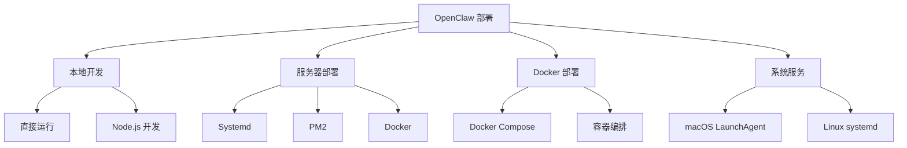
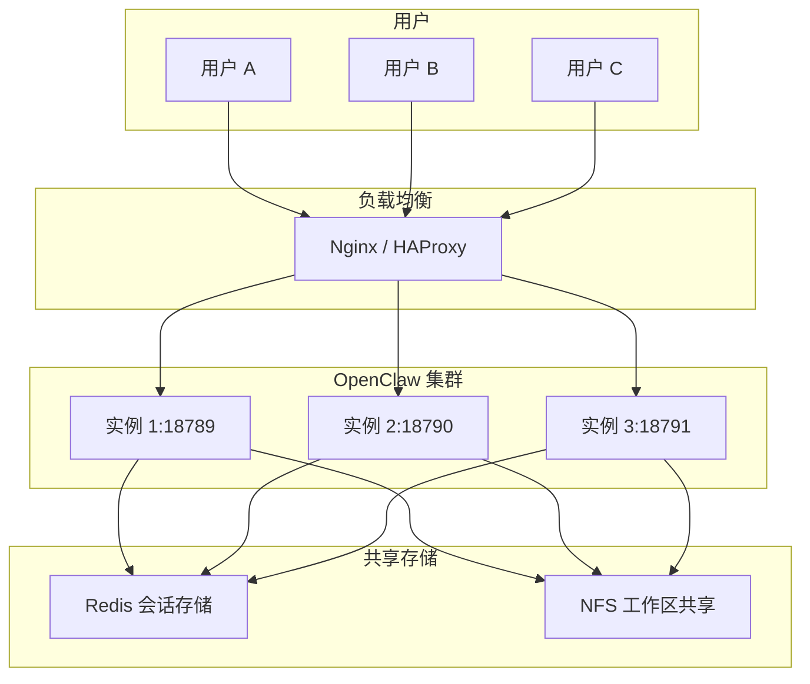

# OpenClaw 部署指南

> 本章节涵盖 OpenClaw 的各种部署方式，从本地开发到生产环境。
> **前置知识**：了解 OpenClaw 基本概念和配置。

---

## 1. 部署方式总览



| 部署方式 | 适用场景 | 复杂度 | 推荐度 |
|----------|----------|--------|--------|
| 直接运行 | 本地开发调试 | ⭐ | ⭐⭐⭐ |
| PM2 | 生产服务器 | ⭐⭐ | ⭐⭐⭐⭐ |
| Docker | 隔离环境 | ⭐⭐ | ⭐⭐⭐ |
| systemd | Linux 服务器 | ⭐⭐ | ⭐⭐⭐⭐ |
| LaunchAgent | macOS 桌面 | ⭐ | ⭐⭐⭐⭐ |

---

## 2. 本地开发部署

### 2.1 直接运行

适用于本地开发调试，最简单的方式：

```bash
# 安装后直接运行
openclaw gateway

# 带详细日志
openclaw gateway --verbose

# 指定端口
openclaw gateway --port 18790
```

### 2.2 从源码运行

适用于需要修改源码或调试的场景：

```bash
# 克隆源码
git clone https://github.com/openclaw/openclaw.git
cd openclaw

# 安装依赖
pnpm install

# 构建
pnpm build

# 运行开发版本
pnpm start

# 或使用 Node 直接运行
node ./dist/openclaw.mjs gateway
```

### 2.3 开发模式热重载

```bash
# 使用 nodemon 监视文件变化自动重启
npx nodemon --watch dist --exec "node ./dist/openclaw.mjs gateway"
```

---

## 3. PM2 部署

PM2 是生产环境推荐的进程管理器，支持负载均衡、自动重启、零停机部署。

### 3.1 安装 PM2

```bash
# 全局安装 PM2
npm install -g pm2

# 验证安装
pm2 --version
```

### 3.2 启动配置

创建 PM2 配置文件 `ecosystem.config.js`：

```javascript
module.exports = {
  apps: [{
    name: 'openclaw',
    script: 'openclaw',
    args: 'gateway',
    
    // 启动选项
    instances: 1,           // 单实例（Gateway 已是异步架构）
    exec_mode: 'fork',      // fork 模式（非集群）
    
    // 自动重启
    autorestart: true,
    max_restarts: 10,
    min_uptime: '10s',
    
    // 日志
    log_file: '~/.openclaw/logs/pm2.log',
    error_file: '~/.openclaw/logs/pm2-error.log',
    out_file: '~/.openclaw/logs/pm2-out.log',
    log_date_format: 'YYYY-MM-DD HH:mm:ss',
    
    // 环境变量
    env: {
      NODE_ENV: 'production',
      OPENCLAW_CONFIG_PATH: '~/.openclaw/openclaw.json'
    },
    
    // 资源限制
    max_memory_restart: '1G',
    
    // 监控
    pmx: true
  }]
};
```

### 3.3 启动与管理

```bash
# 启动
pm2 start ecosystem.config.js

# 查看状态
pm2 status

# 查看日志
pm2 logs openclaw

# 实时日志
pm2 logs openclaw --f

# 重启
pm2 restart openclaw

# 重载（零停机）
pm2 reload openclaw

# 停止
pm2 stop openclaw

# 删除
pm2 delete openclaw
```

### 3.4 开机自启

```bash
# 保存当前进程列表
pm2 save

# 生成启动脚本
pm2 startup

# 对于 systemd 系统，上一条命令会输出需要执行的命令
# 例如：sudo env PATH=$PATH:/usr/bin pm2 startup systemd ...
```

### 3.5 集群模式（高级）

如果需要多实例负载均衡：

```javascript
module.exports = {
  apps: [{
    name: 'openclaw',
    script: 'openclaw',
    args: 'gateway',
    instances: 2,           // 双实例
    exec_mode: 'cluster',   // 集群模式
    // 注意：集群模式下需要注意会话共享问题
    // 建议使用 Redis 存储会话
  }]
};
```

> ⚠️ **警告**：Gateway 设计为单实例运行，多实例需要外部负载均衡器和共享存储/数据库。集群模式需要额外配置会话外部化。

---

## 4. Docker 部署

### 4.1 Dockerfile

创建 `Dockerfile`：

```dockerfile
FROM node:24-slim

# 安装 OpenClaw
RUN npm install -g openclaw@latest

# 创建非 root 用户
RUN useradd -m openclaw && \
    mkdir -p /home/openclaw/.openclaw && \
    chown -R openclaw:openclaw /home/openclaw

# 复制配置文件（构建时）
COPY openclaw.json /home/openclaw/.openclaw/openclaw.json

# 设置工作目录
WORKDIR /home/openclaw

# 切换到非 root 用户
USER openclaw

# 暴露端口
EXPOSE 18789

# 启动命令
CMD ["openclaw", "gateway"]
```

### 4.2 构建与运行

```bash
# 构建镜像
docker build -t openclaw:latest .

# 运行容器
docker run -d \
  --name openclaw \
  -p 18789:18789 \
  -v ~/.openclaw:/home/openclaw/.openclaw \
  -v /var/run/docker.sock:/var/run/docker.sock \
  openclaw:latest

# 查看日志
docker logs -f openclaw

# 停止
docker stop openclaw

# 删除
docker rm openclaw
```

### 4.3 Docker Compose

创建 `docker-compose.yml`：

```yaml
version: '3.8'

services:
  openclaw:
    image: openclaw:latest
    container_name: openclaw
    restart: unless-stopped
    ports:
      - "18789:18789"
    volumes:
      - ~/.openclaw:/home/openclaw/.openclaw:ro
      - /var/run/docker.sock:/var/run/docker.sock
    environment:
      - NODE_ENV=production
      - OPENCLAW_CONFIG_PATH=/home/openclaw/.openclaw/openclaw.json
    networks:
      - openclaw-net

  # 可选：Redis 用于会话共享（多实例部署）
  redis:
    image: redis:alpine
    container_name: openclaw-redis
    restart: unless-stopped
    ports:
      - "6379:6379"
    volumes:
      - redis-data:/data
    networks:
      - openclaw-net

networks:
  openclaw-net:
    driver: bridge

volumes:
  redis-data:
```

启动：

```bash
# 启动
docker-compose up -d

# 查看状态
docker-compose ps

# 查看日志
docker-compose logs -f

# 停止
docker-compose down
```

### 4.4 已有 Docker 安装脚本

OpenClaw 仓库提供了 Docker 设置脚本：

```bash
# 在 openclaw 仓库根目录执行
./docker-setup.sh
```

---

## 5. Systemd 服务部署

适用于 Linux 服务器，提供可靠的进程管理。

### 5.1 创建 Service 文件

创建 `/etc/systemd/system/openclaw.service`：

```ini
[Unit]
Description=OpenClaw AI Gateway
After=network.target
Wants=network-online.target

[Service]
Type=simple
User=openclaw
Group=openclaw

# 启动命令
ExecStart=/usr/bin/openclaw gateway

# 重启策略
Restart=on-failure
RestartSec=10
StartLimitBurst=5
StartLimitIntervalSec=60

# 日志
StandardOutput=journal
StandardError=journal
SyslogIdentifier=openclaw

# 环境变量
Environment=NODE_ENV=production
Environment=OPENCLAW_CONFIG_PATH=/home/openclaw/.openclaw/openclaw.json

# 安全加固
NoNewPrivileges=true
ProtectSystem=strict
ProtectHome=true
ReadWritePaths=/home/openclaw/.openclaw
PrivateTmp=true

[Install]
WantedBy=multi-user.target
```

### 5.2 创建用户（如需要）

```bash
# 创建专用用户
sudo useradd -r -s /usr/sbin/nologin openclaw

# 创建配置目录
sudo mkdir -p /home/openclaw/.openclaw
sudo chown -R openclaw:openclaw /home/openclaw
```

### 5.3 安装与启动

```bash
# 重新加载 systemd
sudo systemctl daemon-reload

# 启用开机自启
sudo systemctl enable openclaw

# 启动服务
sudo systemctl start openclaw

# 查看状态
sudo systemctl status openclaw

# 查看日志
sudo journalctl -u openclaw -f

# 重启
sudo systemctl restart openclaw

# 停止
sudo systemctl stop openclaw
```

### 5.4 日志配置

创建 `/etc/rsyslog.d/openclaw.conf`（可选）：

```
# 将 openclaw 日志写入单独文件
if $syslogtag == 'openclaw' then /var/log/openclaw.log
& stop
```

```bash
# 创建日志文件
sudo touch /var/log/openclaw.log
sudo chown syslog:adm /var/log/openclaw.log

# 重启 rsyslog
sudo systemctl restart rsyslog
```

---

## 6. macOS LaunchAgent 部署

适用于 macOS 桌面环境的后台运行。

### 6.1 创建 plist 文件

创建 `~/Library/LaunchAgents/ai.openclaw.gateway.plist`：

```xml
<?xml version="1.0" encoding="UTF-8"?>
<!DOCTYPE plist PUBLIC "-//Apple//DTD PLIST 1.0//EN" "http://www.apple.com/DTDs/PropertyList-1.0.dtd">
<plist version="1.0">
<dict>
    <key>Label</key>
    <string>ai.openclaw.gateway</string>
    
    <key>ProgramArguments</key>
    <array>
        <string>/usr/local/bin/openclaw</string>
        <string>gateway</string>
    </array>
    
    <key>RunAtLoad</key>
    <true/>
    
    <key>KeepAlive</key>
    <dict>
        <key>SuccessfulExit</key>
        <false/>
    </dict>
    
    <key>WorkingDirectory</key>
    <string>/Users/username</string>
    
    <key>StandardOutPath</key>
    <string>/Users/username/.openclaw/logs/launchd.log</string>
    
    <key>StandardErrorPath</key>
    <string>/Users/username/.openclaw/logs/launchd-error.log</string>
    
    <key>EnvironmentVariables</key>
    <dict>
        <key>OPENCLAW_CONFIG_PATH</key>
        <string>/Users/username/.openclaw/openclaw.json</string>
    </dict>
</dict>
</plist>
```

### 6.2 安装与启动

```bash
# 加载服务
launchctl load ~/Library/LaunchAgents/ai.openclaw.gateway.plist

# 立即启动
launchctl start ai.openclaw.gateway

# 查看状态
launchctl list | grep openclaw

# 停止服务
launchctl stop ai.openclaw.gateway

# 卸载服务
launchctl unload ~/Library/LaunchAgents/ai.openclaw.gateway.plist
```

---

## 7. 反向代理配置

### 7.1 Nginx 配置

```nginx
upstream openclaw_backend {
    server 127.0.0.1:18789;
    keepalive 64;
}

server {
    listen 443 ssl http2;
    server_name openclaw.example.com;

    # SSL 配置
    ssl_certificate /path/to/cert.pem;
    ssl_certificate_key /path/to/key.pem;
    ssl_protocols TLSv1.2 TLSv1.3;
    ssl_ciphers HIGH:!aNULL:!MD5;

    # WebSocket 支持
    location / {
        proxy_pass http://openclaw_backend;
        proxy_http_version 1.1;
        proxy_set_header Upgrade $http_upgrade;
        proxy_set_header Connection "upgrade";
        proxy_set_header Host $host;
        proxy_set_header X-Real-IP $remote_addr;
        proxy_set_header X-Forwarded-For $proxy_add_x_forwarded_for;
        proxy_set_header X-Forwarded-Proto $scheme;
        
        # 超时配置
        proxy_read_timeout 86400;
        proxy_send_timeout 86400;
    }

    # 允许的路径
    location /api/ {
        proxy_pass http://openclaw_backend/api/;
        proxy_http_version 1.1;
    }
}
```

### 7.2 Caddy 配置

```caddy
openclaw.example.com {
    reverse_proxy localhost:18789
    
    # WebSocket 支持（自动）
    websocket
}
```

---

## 8. 生产环境检查清单

### 8.1 安全检查

- [ ] 配置文件权限 `600`
- [ ] `.env` 文件不在 Git 中
- [ ] API Keys 使用环境变量
- [ ] `dmPolicy` 设置为 `allowlist`
- [ ] 防火墙限制端口访问
- [ ] 启用 Gateway 认证 token

### 8.2 可靠性检查

- [ ] 进程管理器配置（PM2/systemd）
- [ ] 开机自启配置
- [ ] 日志轮转配置
- [ ] 定期备份配置
- [ ] 监控告警配置

### 8.3 性能检查

- [ ] 资源限制配置（内存、CPU）
- [ ] 会话维护配置（避免无限增长）
- [ ] 数据库/存储配置（如使用 Redis）

---

## 9. 多实例部署

### 9.1 负载均衡架构



### 9.2 会话外部化配置

```json5
{
  session: {
    // 使用 Redis 存储会话
    store: {
      type: "redis",
      host: "localhost",
      port: 6379,
      prefix: "openclaw:session:"
    }
  }
}
```

---

## 延伸阅读

- [CLI 命令参考](./cli.md)
- [配置详解](../index)
- [安全配置](./security.md)
