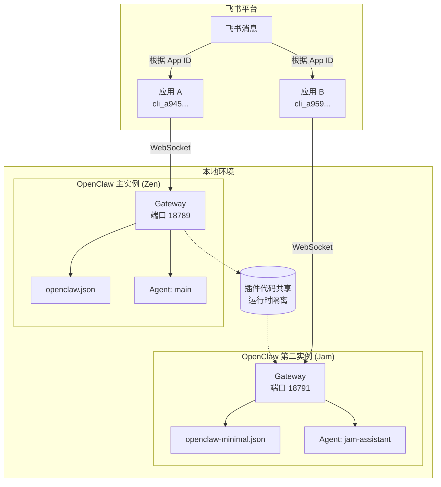

# 飞书接入指南

> **前置知识**：本章节面向具备基础 TypeScript/Node.js 经验的开发者。
> **目标读者**：希望在 OpenClaw 中接入飞书即时通讯的用户。
> **维护状态**：本文档由实战经验总结得来，当前维护版本基于 OpenClaw v2026.3+。

---

## 目录

1. [环境要求](#1-环境要求)
2. [飞书开放平台创建应用](#2-飞书开放平台创建应用)
3. [OpenClaw 配置](#3-openclaw-配置)
4. [运行与验证](#4-运行与验证)
5. [权限清单](#5-权限清单)
6. [常见问题-faq](#6-常见问题-faq)
7. [多实例部署](#7-多实例部署)
8. [安全注意事项](#8-安全注意事项)

---

## 1. 环境要求

| 组件 | 版本要求 | 备注 |
|------|----------|------|
| Node.js | ≥ 20 或 24+ | 推荐 Node 24 以获得最佳兼容性 |
| pnpm | 最新版 | 也支持 npm/yarn |
| OpenClaw | v2026.3+ | 包含飞书 WebSocket 长连接支持 |
| 飞书应用 | 企业自建应用 | 需要开启机器人能力 |

**检查本地环境：**

```bash
node --version   # 应为 v20+ 或 v24+
pnpm --version   # 最新版
openclaw --version  # 确认已安装
```

---

## 2. 飞书开放平台创建应用

### 2.1 创建企业自建应用

1. 访问 [飞书开放平台](https://open.feishu.cn/) 并登录
2. 进入「开发者后台」→ 「创建企业自建应用」
3. 填写应用名称、描述，上传应用图标
4. 创建完成后，在「凭证与基础信息」中获取：
   - **App ID**：格式 `cli_xxx`
   - **App Secret**：格式 `xxx`，⚠️ 请勿泄露

### 2.2 开启机器人能力

1. 在应用详情页，点击「应用能力」→「机器人」
2. 点击「开启机器人」功能
3. 确认后，机器人能力即已启用

### 2.3 配置权限

⚠️ **安全警告**：以下权限是机器人正常工作的最低要求，请根据实际需要选择性添加：

| 权限标识 | 用途 | 必须 |
|----------|------|------|
| `im:message` | 消息基础读写 | ✅ |
| `im:message.p2p_msg:readonly` | 读取用户私信 | ✅ |
| `im:message.reactions:write_only` | 发送表情回应（思考中） | ✅ |
| `im:message:send_as_bot` | 机器人发送消息 | ✅ |
| `im:chat:readonly` | 获取群组信息 | ⬜ |
| `im:message.group_at_msg:readonly` | 接收群聊@消息 | ⬜ |

> 💡 **实战经验**：`im:message.reactions:write_only` 是最容易遗漏的权限。OpenClaw 在生成回复前会先发送一个"思考中"表情，若无此权限则静默失败。

### 2.4 发布应用

权限配置完成后，需要**创建版本并发布**，权限才能正式生效：

1. 点击「版本管理与发布」→「创建版本」
2. 填写版本号（建议 1.0.0）和更新说明
3. 选择发布范围（通常为「全员」或指定部门）
4. 提交审核（企业自建应用通常自动通过）

---

## 3. OpenClaw 配置

### 3.1 配置文件位置

飞书通道配置写入 `~/.openclaw/openclaw.json`（JSON5 格式，支持注释）。

### 3.2 最小配置示例

```json5
{
  // ⚠️ 安全提示：敏感信息禁止硬编码！
  // 推荐使用环境变量：${FEISHU_APP_ID}、${FEISHU_APP_SECRET}
  channels: {
    feishu: {
      enabled: true,
      connectionMode: "websocket", // 推荐长连接模式
      accounts: {
        default: {
          appId: "${FEISHU_APP_ID}",       // 从环境变量读取
          appSecret: "${FEISHU_APP_SECRET}" // 从环境变量读取
        }
      },
      // ⚠️ allowFrom 必须是数组格式，否则运行时报 ".map is not a function"
      allowFrom: ["ou_xxxxxxxx"], // 允许访问的用户 open_id
      dmPolicy: "allowlist"          // 直接消息策略: open/pairing/allowlist
    }
  }
}
```

### 3.3 环境变量配置（推荐方式）

创建或编辑 `~/.openclaw/.env` 文件：

```bash
# ⚠️ 安全警告：此文件包含敏感凭据，请妥善保管，切勿提交到 Git！
FEISHU_APP_ID=cli_xxxxxxxxxxxxxxxx
FEISHU_APP_SECRET=xxxxxxxxxxxxxxxxxxxxxxxxxxxxxxxx
```

### 3.4 完整配置示例

```json5
{
  meta: { lastTouchedVersion: "2026.4.1" },

  agents: {
    defaults: {
      model: { primary: "anthropic/minimax-m2.5" },
      hooks: ["session-memory", "command-logger"]
    }
  },

  models: {
    providers: {
      anthropic: {
        // ⚠️ MiniMax 使用 Anthropic 兼容接口
        baseUrl: "https://api.minimaxi.com/anthropic",
        apiKey: "${MINIMAX_API_KEY}", // 从环境变量读取
        models: [{ id: "minimax-m2.5", name: "MiniMax M2.5" }]
      }
    }
  },

  channels: {
    feishu: {
      enabled: true,
      connectionMode: "websocket",
      accounts: {
        default: {
          appId: "${FEISHU_APP_ID}",
          appSecret: "${FEISHU_APP_SECRET}"
        }
      },
      allowFrom: ["ou_xxxxxxxx", "ou_yyyyyyyyyyyyyyyy"],
      dmPolicy: "allowlist"
    }
  },

  gateway: { mode: "local" }
}
```

### 3.5 获取用户 open_id

在飞书应用中，向机器人发送任意消息，然后在 OpenClaw Gateway 日志中查找对应的 `sender_open_id`，将其填入 `allowFrom` 数组。

---

## 4. 运行与验证

### 4.1 启动 Gateway

⚠️ **关键步骤**：**必须先启动 Gateway，再在飞书后台保存长连接配置**。

```bash
# 启动 Gateway（会输出 ws client ready 日志）
openclaw gateway

# 或者使用配置文件路径启动
openclaw gateway --config ~/.openclaw/openclaw.json
```

### 4.2 配置飞书长连接

Gateway 启动后（看到 `ws client ready` 日志），再在飞书开放平台：

1. 进入应用 → 「事件订阅」
2. 长连接模式默认已选中
3. 点击「保存」

若顺序颠倒，网页会提示"未检测到应用连接信息"。

### 4.3 验证机器人

1. 在飞书中找到你的机器人
2. 向机器人发送一条消息（如 `/help`）
3. 观察 Gateway 日志，确认消息被接收并处理
4. 机器人应正常回复

### 4.4 诊断工具

```bash
# 诊断配置问题
openclaw doctor

# 查看 Gateway 状态
openclaw status

# 查看详细日志
openclaw gateway --verbose
```

---

## 5. 权限清单

### 5.1 必选权限（缺一不可）

| 权限 | 权限标识 | 说明 |
|------|----------|------|
| 发送消息 | `im:message:send_as_bot` | 机器人发送消息 |
| 接收消息 | `im:message.p2p_msg:readonly` | 读取用户发给机器人的消息 |
| 表情回应 | `im:message.reactions:write_only` | **高频踩坑点**：发送思考中表情 |

### 5.2 可选权限

| 权限 | 权限标识 | 适用场景 |
|------|----------|----------|
| 群组消息 | `im:message.group_at_msg:readonly` | 接收群聊@消息 |
| 群组信息 | `im:chat:readonly` | 获取群名称等元信息 |
| 表情管理 | `im:message.reactions:read` | 读取表情反应 |

### 5.3 权限发布注意

⚠️ **重要**：权限配置后必须**重新创建版本并发布**，旧版本中的权限不会自动更新。

---

## 6. 常见问题 FAQ

### Q1：网页显示"未检测到应用连接信息"

**原因**：Gateway 未先启动，网页端无法完成握手。

**解决**：
1. 先在终端执行 `openclaw gateway`
2. 等待日志出现 `ws client ready`
3. 再回到飞书网页点击「保存」

---

### Q2：飞书显示消息已发送，但机器人无回复

**排查步骤**：
1. 检查 Gateway 日志是否有 `Access denied` 错误
2. 确认是否缺少 `im:message.reactions:write_only` 权限
3. 确认应用已发布新版本

**原因**：OpenClaw 回复前会先发送一个"思考中"表情，缺乏此权限会导致静默中断。

---

### Q3：模型返回 HTTP 404 错误

**原因**：MiniMax 使用 Anthropic 兼容接口，配置错误会导致路径找不到。

**解决**：在 `models.providers.anthropic` 中正确配置：
```json5
{
  "baseUrl": "https://api.minimaxi.com/anthropic"
  // 注意：不要加 /v1 后缀！
}
```

---

### Q4：配置修改后 Gateway 启动失败

**原因**：OpenClaw 对配置文件实行严格 Schema 校验。

**解决**：
- 不要在 `providers` 或 `defaults` 中手动添加未文档化的字段（如 `stream: true`）
- 不要在错误的位置添加 `hooks`
- 查阅 [配置详解](./index.md#6-配置详解) 确认字段位置

---

### Q5：`allowFrom` 报错 `.map is not a function`

**原因**：`allowFrom` 必须使用数组格式，不能是字符串。

**解决**：确保配置为数组格式：
```json5
"allowFrom": ["ou_xxxxxxxx"]  // ✅ 正确
// "allowFrom": "ou_xxxxxxxx" // ❌ 错误
```

---

### Q6：Gateway 显示 `already running`

**解决**：执行精准清理脚本（避免误杀其他 Node 进程）：

```powershell
Get-WmiObject Win32_Process -Filter "name='node.exe'" |
  Where-Object { $_.CommandLine -notlike "*gemini-cli*" } |
  ForEach-Object { Stop-Process $_.ProcessId -Force }
```

---

### Q7：流式输出（Streaming）不工作

**原因**：MiniMax + 飞书组合在开启 stream 时存在协议握手不匹配。

**解决**：保持默认 `renderMode: "raw"`（纯文本模式），虽然无打字效果，但能确保 100% 响应成功率。

---

### Q8：如何实现隐身运行？

```powershell
Start-Process node -ArgumentList 'path/to/openclaw.mjs', 'gateway', '--force', '--allow-unconfigured' -WindowStyle Hidden
```

---

## 7. 多实例部署

在实际生产环境中，你可能需要运行**多个 OpenClaw 实例**来服务不同的机器人身份。OpenClaw 支持两种典型的部署模式：

| 模式 | 说明 | 适用场景 |
|------|------|----------|
| **单进程多账户** | 一个 Gateway 进程，通过 `accounts` 配置多个飞书应用 | 同一业务线需要多个机器人身份 |
| **多进程多实例** | 多个独立的 Gateway 进程，各自配置不同的飞书应用 | 完全隔离的机器人（不同团队/业务） |

### 7.1 单 OpenClaw 多账户（推荐）

**优势**：资源占用少，配置集中，易于管理。

**配置方式**：在同一个 `openclaw.json` 中使用 `accounts` 嵌套多个账户。

```json5
{
  channels: {
    feishu: {
      enabled: true,
      connectionMode: "websocket",
      accounts: {
        // 默认账户（使用全局配置的 appId/appSecret）
        default: {},

        // 第二个账户（例如：客服机器人）
        support: {
          appId: "${FEISHU_SUPPORT_APP_ID}",
          appSecret: "${FEISHU_SUPPORT_APP_SECRET}",
          botName: "Support Bot",
          dmPolicy: "allowlist",
          allowFrom: ["ou_support_user_1", "ou_support_user_2"]
        },

        // 第三个账户（例如：HR 机器人）
        hr: {
          appId: "${FEISHU_HR_APP_ID}",
          appSecret: "${FEISHU_HR_APP_SECRET}",
          botName: "HR Assistant",
          dmPolicy: "open"
        }
      },

      // 全局白名单（配合 dmPolicy: "allowlist" 使用）
      allowFrom: ["ou_main_user"]
    }
  },

  // 绑定 agent 到特定账户
  bindings: [
    { agentId: "main-assistant", match: { channel: "feishu", accountId: "default" } },
    { agentId: "support-assistant", match: { channel: "feishu", accountId: "support" } },
    { agentId: "hr-assistant", match: { channel: "feishu", accountId: "hr" } }
  ]
}
```

**工作原理**：
- 飞书消息根据 `appId` 自动匹配到对应的 `accounts.xxx` 配置
- `bindings` 决定消息由哪个 agent 处理
- 不同账户可以使用不同的 `allowFrom`、`dmPolicy` 等参数

**注意事项**：
- 所有账户的飞书应用都需要开通 `im:message:send_as_bot` 权限并发布
- 不同账户的 `bot_open_id` 是不同的，互不影响
- 共享同一个 Gateway 进程，若一个账户的模型调用慢，可能影响其他账户

---

### 7.2 多 OpenClaw 多实例（完全隔离）

**优势**：完全隔离，配置独立，一个实例崩溃不影响其他；可使用不同模型、不同版本。

**部署方式**：每个实例使用**独立的配置目录**和**不同的端口**。

#### 示例：部署两个实例（Zen + Jam）

**目录结构**：
```plaintext
~/
├── .openclaw/                    # 主实例（Zen）配置
│   ├── openclaw.json
│   ├── workspace/
│   └── logs/
└── jam/.openclaw/               # 第二实例（Jam）配置
    ├── openclaw-minimal.json
    ├── workspace/
    └── logs/
```

**主实例配置**（`~/.openclaw/openclaw.json`）：
```json5
{
  channels: {
    feishu: {
      appId: "cli_a945afaaf7361bcd",      // Zen 应用
      appSecret: "Rqjc6GcnbANV6M6Rxk8dIf04FDocFazz",
      connectionMode: "websocket",
      allowFrom: ["ou_a7be71fa38ba3ed6adecc8f4038df287"],
      dmPolicy: "allowlist"
    }
  }
}
```

**第二实例配置**（`~/jam/.openclaw/openclaw-minimal.json`）：
```json5
{
  plugins: {
    allow: ["openclaw-lark"]  // 显式允许插件，避免自动加载警告
  },

  agents: {
    defaults: {
      workspace: "/Users/chengle/jam/.openclaw/workspace"
    },
    list: [{ id: "jam-assistant", name: "Jam Assistant", default: true }]
  },

  channels: {
    feishu: {
      connectionMode: "websocket",
      dmPolicy: "allowlist",
      requireMention: true,
      streaming: true,
      allowFrom: [
        "ou_a7be71fa38ba3ed6adecc8f4038df287",
        "ou_f99b26afd4079022fd7e8be375f584e3"
      ],
      accounts: {
        default: {
          appId: "cli_a9593caf177d1bda",     // Jam 应用（不同 App ID）
          appSecret: "PPpoA8jQ8LUf2iAYpMA2Ph6Ljv7OtStG",
          enabled: true
        }
      }
    }
  },

  bindings: [
    { agentId: "jam-assistant", match: { channel: "feishu", accountId: "default" } }
  ],

  gateway: {
    port: 18791,                    // 与主实例不同端口
    token: "jam-secure-token-2026"  // 独立认证 token
  }
}
```

**启动命令**：
```bash
# 主实例（Zen）- 端口 18789
openclaw gateway --port 18789

# 第二实例（Jam）- 端口 18791，指定配置文件
OPENCLAW_CONFIG_PATH="$HOME/jam/.openclaw/openclaw-minimal.json" \
  openclaw gateway --port 18791 --token "jam-secure-token-2026"
```

**隔离性保证**：
- ✅ 不同端口：18789 vs 18791
- ✅ 不同 PID：独立进程
- ✅ 不同配置目录：`~/.openclaw/` vs `~/jam/.openclaw/`
- ✅ 不同 workspace：各自独立
- ✅ 插件代码共享，但运行时隔离（插件版本一致即可）

**消息路由**：
- 飞书消息根据 `appId` 自动分发到对应的 OpenClaw 实例
- 用户需要**主动选择聊天对象**（@Zen 或 @Jam）
- 每个实例的 `allowFrom` 白名单独立控制谁可以向它发消息

---

#### 架构图：多实例部署



---

#### 常见问题

##### Q1：如何判断消息发给了哪个实例？

查看 OpenClaw 日志中的通道标识：
- `feishu[zen]` → 主实例（账户名 `zen`）
- `feishu[default]` → 使用 `default` 账户的实例

##### Q2：多实例可以共享同一个模型缓存吗？

不可以。每个实例有独立的 workspace，模型缓存默认在 `~/.cache/` 共享，但会话内存不共享。

##### Q3：如何同时管理多个实例？

使用进程管理器（如 `pm2`、`systemd` 或 `supervisor`）分别管理：
```bash
# 启动所有实例
pm2 start "openclaw gateway --port 18789" --name zen
pm2 start "OPENCLAW_CONFIG_PATH=~/jam/.openclaw/openclaw-minimal.json \
  openclaw gateway --port 18791" --name jam

# 查看状态
pm2 status
```

##### Q4：多实例部署会增加飞书 API 配额消耗吗？

是的。每个独立的应用（不同 `appId`）有各自的 API 配额。确保各应用的服务费/配额充足以免超限。

---

## 8. 安全注意事项

### 8.1 敏感信息管理

⚠️ **强制要求**：
- **禁止**将 `App Secret`、API Key 等硬编码到配置文件中
- 使用环境变量或 `${VAR_NAME}` 占位符
- `~/.openclaw/.env` 文件**不要**提交到 Git
- 生产环境建议使用 Vault 或秘钥管理服务

### 8.2 访问控制

- 生产环境建议将 `dmPolicy` 设置为 `allowlist`
- 明确配置 `allowFrom` 白名单，不使用通配符 `*`
- 定期审计访问日志

---

## 延伸阅读

- [OpenClaw 官方文档](https://docs.openclaw.ai/)
- [飞书开放平台](https://open.feishu.cn/)
- [MiniMax 接入指南](https://platform.minimaxi.com/docs/guides/text-ai-coding-tools)
- [源码分析 - 通道接入](./source-code/channels.md)
