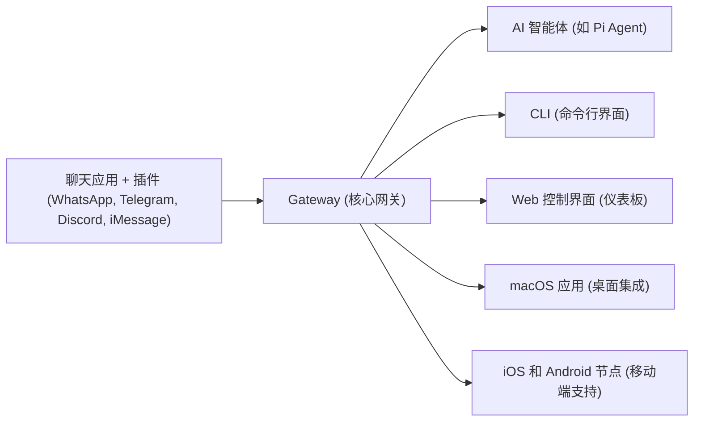

# OpenClaw 精通手册

## 1. 核心概述：OpenClaw 的力量与愿景

### 1.1 OpenClaw 是什么？

OpenClaw 是一个**自托管的 AI 智能体网关**，旨在将 WhatsApp、Telegram、Discord、iMessage 等主流即时通讯应用无缝连接到 AI 编码智能体（如 Pi）。它允许用户在自己的硬件（本地机器或服务器）上运行一个 Gateway 进程，充当消息应用与 AI 助手之间的智能桥梁。这意味着你的 AI 助手不再局限于单一平台，而是能够跨越多个通信渠道，在你的掌控下执行任务 [1].

**核心价值主张：**

* **数据主权与隐私**：所有数据和操作均在用户控制的硬件上进行，确保敏感信息不离开你的环境，实现真正的自托管。
* **跨平台互联**：一个 Gateway 进程即可管理多个消息应用，极大地简化了 AI 助手的部署和管理复杂性。
* **智能体原生设计**：从底层为 AI 智能体的核心能力（如工具调用、会话管理、记忆、多智能体路由）而优化，而非简单的聊天机器人封装。
* **开放与可扩展**：基于 MIT 协议开源，拥有活跃的社区和丰富的插件生态，支持高度定制和功能扩展。

### 1.2 架构总览：Gateway 作为核心枢纽

OpenClaw 的架构以 **Gateway** 进程为中心，它是整个系统的“单一真相来源”（Single Source of Truth），负责会话管理、消息路由和通道连接。Gateway 通过 **WebSocket** 接口（默认 `127.0.0.1:18789`）对外提供 API，连接并协调以下关键组件 [1]:



这种模块化设计使得 OpenClaw 能够灵活地集成各种前端（聊天应用、CLI、Web UI、移动应用）和后端（AI 智能体），形成一个强大而统一的 AI 自动化生态系统。

## 2. 快速入门：从安装到首次交互

本章将引导你完成 OpenClaw 的安装和基本配置，让你在短时间内启动并运行你的第一个 AI 助手。

### 2.1 系统要求

在开始安装之前，请确保你的系统满足以下要求 [1]:

* **操作系统**：macOS、Linux 或 Windows (强烈推荐使用 WSL2)。
* **Node.js**：推荐使用 **Node 24**，Node 22 LTS (`22.16+`) 仍受支持。

### 2.2 安装 OpenClaw

OpenClaw 提供了多种安装方式，以适应不同的用户偏好和环境。官方脚本是最便捷的入门方式 [1].

#### 2.2.1 官方安装脚本（推荐）

这是最简单、最推荐的安装方法，脚本会自动处理大部分依赖和配置。

**macOS/Linux:**

```bash
curl -fsSL https://openclaw.ai/install.sh | bash
```

**Windows (PowerShell):**

```powershell
iwr -useb https://openclaw.ai/install.ps1 | iex
```

#### 2.2.2 npm/pnpm 手动安装

如果你更喜欢手动控制安装过程，可以使用 npm 或 pnpm 进行全局安装：

```bash
npm install -g openclaw@latest
openclaw onboard --install-daemon
```

#### 2.2.3 从源码构建

对于开发者或需要深度定制的用户，可以从 GitHub 仓库克隆源码并自行构建：

```bash
git clone https://github.com/openclaw/openclaw.git
cd openclaw
pnpm install && pnpm ui:build && pnpm build
pnpm link --global
```

#### 2.2.4 Docker 部署

Docker 提供了一种容器化的部署方式，适合追求环境隔离和便捷部署的用户：

```bash
./docker-setup.sh   # 在仓库根目录运行此脚本
```

### 2.3 安装后验证

安装完成后，使用以下 CLI 命令检查 OpenClaw 的运行状态和配置健康度 [1]:

```bash
openclaw doctor         # 诊断潜在的配置问题和依赖缺失
openclaw status         # 查看 Gateway 进程的当前运行状态
openclaw dashboard      # 在浏览器中打开 Web 控制界面
```

### 2.4 首次运行：引导向导与通道连接

#### 2.4.1 运行引导向导

首次运行 `openclaw onboard --install-daemon` 命令将启动一个交互式向导，指导你完成核心配置，包括 [1]:

1. **模型/认证**：配置 AI 模型的 API Key、OAuth 凭证或 setup-token。
2. **工作区**：指定智能体的工作目录，默认路径为 `~/.openclaw/workspace`。
3. **Gateway 配置**：设置 Gateway 的监听端口、绑定地址和认证模式。
4. **通道集成**：配置你希望连接的即时通讯应用（如 WhatsApp、Telegram、Discord）。
5. **守护进程**：设置 OpenClaw 作为系统服务（macOS LaunchAgent 或 Linux systemd），确保其在后台持续运行。

#### 2.4.2 登录通道（以 WhatsApp 为例）

完成引导向导后，你需要登录你选择的通道。以 WhatsApp 为例，你需要通过扫描二维码将你的 WhatsApp 账号与 OpenClaw Gateway 配对 [1]:

```bash
openclaw channels login --channel whatsapp
# 按照提示，使用你的手机扫描终端显示的二维码
```

#### 2.4.3 启动 Gateway

如果 Gateway 没有自动启动，你可以手动启动它 [1]:

```bash
openclaw gateway --port 18789
# 或者，如果你已安装守护服务，可以使用：
openclaw gateway status
```

#### 2.4.4 打开控制界面

Gateway 启动后，通过浏览器访问 Web 控制界面，开始与你的 AI 助手交互 [1]:

```bash
openclaw dashboard
# 默认地址: http://127.0.0.1:18789/
```

### 2.5 最小配置文件示例

OpenClaw 的核心配置存储在 `~/.openclaw/openclaw.json` 文件中，该文件支持 JSON5 格式（允许注释和尾随逗号）。以下是一个最小配置示例，展示了如何设置智能体工作区和 WhatsApp 通道的访问权限 [1]:

```json5
{
  agents: { defaults: { workspace: "~/.openclaw/workspace" } },
  channels: { whatsapp: { allowFrom: ["+15555550123"] } },
}
```

## 3. 核心概念：OpenClaw 的基石

深入理解 OpenClaw 的核心概念是掌握其强大功能的关键。本章将详细解释工作区、会话、智能体循环、记忆系统、上下文压缩、沙盒、子智能体和技能。

### 3.1 工作区（Workspace）：智能体的“大脑”与“记忆”

工作区是 OpenClaw 智能体的核心存储区域，包含了智能体的指令、个性、记忆和技能等所有关键文件。默认情况下，工作区位于 `~/.openclaw/workspace`。将其视为智能体的“大脑”和“长期记忆” [1].

**工作区文件映射：**

| 文件/目录 | 作用 | 备注 |
|---|---|---|
| `AGENTS.md` | 智能体的操作指令和行为准则 | 每次会话加载，指导智能体行为 |
| `SOUL.md` | 智能体的个性、语气和边界 | 定义智能体的“灵魂”，影响对话风格 |
| `USER.md` | 用户档案和称呼方式 | 存储用户偏好，实现个性化交互 |
| `IDENTITY.md` | 智能体名称、风格和表情 | 定义智能体的对外形象 |
| `TOOLS.md` | 本地工具使用规范 | 仅指导智能体如何使用工具，不控制工具可用性 |
| `HEARTBEAT.md` | 心跳运行的简短清单 | 用于配置周期性任务和检查 |
| `BOOT.md` | 网关重启时的启动检查清单 | 定义 Gateway 启动时的初始化任务 |
| `BOOTSTRAP.md` | 首次运行仪式 | 完成后通常会被删除 |
| `memory/YYYY-MM-DD.md` | 每日记忆日志 | 记录日常交互，按日期追加 |
| `MEMORY.md` | 精心整理的长期记忆 | 仅在主私有会话加载，存储重要信息 |
| `skills/` | 工作区专属技能 | 存放自定义工具和工作流 |

**不应放在工作区的内容（应存放在 `~/.openclaw/`）：**

* `openclaw.json`：主配置文件。
* `credentials/`：敏感凭证，如 API Key。
* `agents/<agentId>/sessions/`：会话记录，由系统管理。

**最佳实践：工作区版本控制**

强烈建议将工作区初始化为私有 Git 仓库。这不仅便于版本控制，还能在配置错误或数据丢失时进行快速恢复 [1].

```bash
cd ~/.openclaw/workspace
git init
git add AGENTS.md SOUL.md TOOLS.md IDENTITY.md USER.md HEARTBEAT.md memory/
git commit -m "初始化智能体工作区"
```

### 3.2 会话（Session）：管理对话的连续性与隔离性

会话是 OpenClaw 中管理对话上下文和状态的核心机制，确保不同用户或不同对话之间的数据不会混淆，并维持对话的连续性 [1].

**会话范围（`session.dmScope`）：**

| 值 | 行为 | 适用场景 |
|---|---|---|
| `main`（默认） | 所有直接消息（DM）共享一个主会话 | 适合单用户、个人使用 |
| `per-peer` | 按发送者 ID 隔离会话 | 适用于多用户，但每个用户在所有通道共享一个会话 |
| `per-channel-peer` | 按通道 + 发送者 ID 隔离会话 | **多用户推荐**，每个用户在不同通道有独立会话 |
| `per-account-channel-peer` | 按账户 + 通道 + 发送者 ID 隔离会话 | 适用于多账户场景，提供最高级别的隔离 |

**安全 DM 模式：**

对于多用户环境，为了确保会话的隔离性和安全性，强烈建议将 `session.dmScope` 设置为 `per-channel-peer` [1].

```json5
{
  session: { dmScope: "per-channel-peer" }
}
```

**会话重置触发器：**

用户可以通过以下斜杠命令手动控制会话的生命周期 [1]:

* `/new` 或 `/reset`：立即开启一个新的会话，清除当前上下文。
* `/compact [指令]`：触发上下文压缩，根据指令精简会话历史，减少模型输入长度。
* `/stop`：中止当前智能体的运行。

**会话键格式：**

OpenClaw 使用结构化的会话键来唯一标识和管理不同类型的会话 [1]:

* **直接消息**：`agent:<agentId>:<mainKey>`
* **群组消息**：`agent:<agentId>:<channel>:group:<id>`
* **定时任务**：`cron:<jobId>`

**会话维护配置：**

为了防止会话数据无限增长，OpenClaw 提供了会话维护机制，可以配置定期修剪旧会话、限制条目数量和文件大小 [1].

```json5
{
  session: {
    maintenance: {
      mode: "enforce",      // 维护模式：enforce (强制执行), warn (警告), off (关闭)
      pruneAfter: "45d",    // 会话数据保留时长，例如 45 天
      maxEntries: 800,      // 每个会话的最大条目数
      rotateBytes: "20mb",  // 会话日志文件达到此大小时进行轮换
    }
  }
}
```

### 3.3 智能体循环（Agent Loop）：AI 助手的生命周期

智能体循环描述了 OpenClaw 智能体处理一个请求的完整生命周期，从接收用户消息到生成最终回复的整个过程。理解这个循环有助于开发者在不同阶段进行调试和优化 [1].

```
接收消息 → 验证参数 → 解析会话 → 加载技能快照
→ 组装上下文/系统提示 → 模型推理
→ 工具执行 → 流式回复 → 持久化
```

**关键事件流：**

在智能体循环中，OpenClaw 会触发一系列事件，这些事件对于监控和调试智能体行为至关重要 [1]:

* `lifecycle`：表示智能体运行的开始、结束或发生错误。
* `assistant`：智能体生成流式文本回复时触发。
* `tool`：智能体调用外部工具时触发。

**Hook 拦截点（插件 API）：**

OpenClaw 提供了丰富的 Hook 拦截点，允许开发者在智能体循环的关键阶段插入自定义逻辑或插件，实现高级功能扩展 [1]:

| Hook | 触发时机 | 作用 |
|---|---|---|
| `before_model_resolve` | 模型解析前 | 在选择和初始化 AI 模型之前 |
| `before_prompt_build` | 提示构建前 | 在将所有上下文组装成最终提示发送给模型之前 |
| `agent_end` | 运行结束后 | 智能体完成一次运行（无论成功或失败）后 |
| `before_tool_call` / `after_tool_call` | 工具调用前后 | 在智能体调用外部工具之前和之后 |
| `before_compaction` / `after_compaction` | 压缩前后 | 在上下文压缩操作执行之前和之后 |

### 3.4 记忆系统（Memory）：智能体的知识库

OpenClaw 的记忆系统是其智能体能够学习和适应的关键。它独特地将记忆存储为**工作区中的纯 Markdown 文件**，这意味着记忆是可读、可编辑且易于版本控制的“单一真相来源” [1].

**两层记忆结构：**

1. `memory/YYYY-MM-DD.md`：**每日追加日志**。记录智能体日常的交互、观察和学习，按日期组织。这层记忆侧重于近期和详细的事件记录。
2. `MEMORY.md`：**精心整理的长期记忆**。存储经过智能体或用户提炼和总结的重要知识、经验和决策。这层记忆仅在主私有会话中加载，用于提供核心的、长期的背景信息。

**记忆工具：**

智能体可以通过以下内置工具与记忆系统进行交互 [1]:

* `memory_search`：执行语义检索，根据查询内容在记忆中查找相关信息。
* `memory_get`：读取特定记忆文件或指定行范围的内容。

**向量记忆搜索：**

OpenClaw 支持基于向量嵌入的语义搜索，能够理解查询的含义而非仅仅匹配关键词。它会自动选择可用的嵌入提供商，优先级顺序为：`local` → `openai` → `gemini` → `voyage` → `mistral` [1].

```json5
agents: {
  defaults: {
    memorySearch: {
      provider: "openai",                     // 指定嵌入提供商
      model: "text-embedding-3-small",      // 指定嵌入模型
    }
  }
}
```

**混合搜索（BM25 + 向量）：**

为了进一步提高搜索的准确性和多样性，OpenClaw 提供了混合搜索功能，结合了传统关键词搜索（BM25）和语义搜索（向量）的优势。它还支持 MMR (最大边际相关性) 和时间衰减等高级特性 [1] [2]:

```json5
agents: {
  defaults: {
    memorySearch: {
      query: {
        hybrid: {
          enabled: true,                      // 启用混合搜索
          vectorWeight: 0.7,                  // 向量搜索权重
          textWeight: 0.3,                    // 关键词搜索权重
          mmr: { enabled: true, lambda: 0.7 }, // 最大边际相关性，平衡相关性与多样性
          temporalDecay: { enabled: true, halfLifeDays: 30 } // 时间衰减，新记忆权重更高
        }
      }
    }
  }
}
```

**嵌入缓存：**

OpenClaw 可以将块嵌入缓存到 SQLite 数据库中，避免重复计算，尤其在会话记录频繁更新时，显著提升性能 [2].

```json5
agents: {
  defaults: {
    memorySearch: {
      cache: {
        enabled: true,                      // 启用嵌入缓存
        maxEntries: 50000                   // 最大缓存条目数
      }
    }
  }
}
```

**会话记忆搜索（实验性）：**

此实验性功能允许将智能体的会话记录索引起来，并通过 `memory_search` 进行检索。默认关闭，需要显式启用 [2].

```json5
agents: {
  defaults: {
    memorySearch: {
      experimental: { sessionMemory: true }, // 启用会话记忆索引
      sources: ["memory", "sessions"]       // 指定搜索来源包括常规记忆和会话
    }
  }
}
```

**SQLite 向量加速 (sqlite-vec)：**

当系统安装了 `sqlite-vec` 扩展时，OpenClaw 会利用 SQLite 虚拟表 (`vec0`) 存储嵌入并执行向量距离查询，从而在数据库层面加速搜索，减少内存占用 [2].

```json5
agents: {
  defaults: {
    memorySearch: {
      store: {
        vector: {
          enabled: true,                      // 启用 sqlite-vec 加速
          extensionPath: "/path/to/sqlite-vec" // sqlite-vec 扩展路径
        }
      }
    }
  }
}
```

**本地嵌入模型自动下载：**

当 `memorySearch.provider` 设置为 `local` 时，OpenClaw 会自动下载默认的本地嵌入模型 (`hf:ggml-org/embeddinggemma-300m-qat-q8_0-GGUF/embeddinggemma-300m-qat-Q8_0.gguf`)。如果本地设置失败，系统会自动回退到远程嵌入服务（如 OpenAI） [2].

### 3.5 上下文压缩（Compaction）：优化模型效率

随着对话的进行，智能体的上下文（即对话历史和相关信息）会不断增长，最终可能超出 AI 模型的上下文窗口限制。上下文压缩是 OpenClaw 解决这一问题的机制，它通过精简历史信息来优化模型输入，确保对话的连续性和效率 [1].

```
/compact Focus on decisions and open questions
```

* **自动压缩**：当检测到上下文接近模型限制时，OpenClaw 会自动触发压缩。
* **手动压缩**：用户可以通过 `/compact [指令]` 命令手动触发压缩，并提供指令指导智能体如何精简上下文，例如“Focus on decisions and open questions”。
* **pre-compaction memory flush**：在压缩之前，智能体可以被提示将重要的信息提炼并写入持久记忆（`MEMORY.md` 或 `memory/YYYY-MM-DD.md`），以防止关键信息在压缩过程中丢失。

```json5
{
  agents: {
    defaults: {
      compaction: {
        model: "openrouter/anthropic/claude-sonnet-4-5", // 用于执行压缩的模型
        memoryFlush: { enabled: true }                     // 启用压缩前记忆刷新
      }
    }
  }
}
```

### 3.6 沙盒（Sandboxing）：安全与隔离

沙盒是 OpenClaw 提供的一项关键安全功能，用于隔离智能体的执行环境，防止其对宿主系统造成意外或恶意的修改。这对于运行高权限 AI 智能体至关重要 [3].

**沙盒模式 (`sandbox.mode`)：**

* **`none`**：不使用沙盒，智能体直接在宿主系统上执行。**不推荐用于生产环境或不信任的智能体。**
* **`non-main`**：仅在非主会话中启用沙盒。主会话（通常是用户与智能体的直接对话）可能在宿主上运行，而其他自动化任务则在沙盒中。
* **`always`**：始终启用沙盒。所有智能体操作都在隔离环境中进行，提供最高级别的安全性。

**沙盒范围 (`sandbox.scope`)：**

* **`session`**：每个会话拥有独立的沙盒环境。会话结束后，沙盒环境被销毁。
* **`agent`**：每个智能体拥有独立的沙盒环境。智能体生命周期内，沙盒环境保持不变。

**工作区访问 (`sandbox.workspaceAccess`)：**

* **`none`**：沙盒内无法访问工作区文件。
* **`read-only`**：沙盒内对工作区文件只读访问。
* **`read-write`**：沙盒内对工作区文件读写访问。**需谨慎使用，可能引入风险。**

**Docker 沙盒：**

OpenClaw 可以利用 Docker 容器作为沙盒环境，提供强大的进程和文件系统隔离。默认情况下，Docker 沙盒容器是**没有网络访问权限**的，这进一步增强了安全性 [3].

```json5
{
  agents: {
    defaults: {
      sandbox: {
        mode: "non-main",
        scope: "session",
        workspaceAccess: "none",
        docker: {
          image: "openclaw-sandbox:bookworm-slim", // 沙盒镜像
          network: "none",                          // 默认无网络
          readOnlyRoot: true,                       // 根文件系统只读
          user: "openclaw",                         // 容器内运行用户
          setupCommand: "",                         // 容器创建后的一次性设置命令
          env: {},                                  // 传递给容器的环境变量
        }
      }
    }
  }
}
```

**`setupCommand` (一次性容器设置)：**

`setupCommand` 是在沙盒容器首次创建后**只运行一次**的命令，用于安装必要的依赖或进行初始化配置。需要注意的是，由于默认无网络和只读根文件系统，你可能需要调整 `docker.network` 和 `readOnlyRoot` 设置才能成功执行包安装等操作 [3].

**工具策略 + 逃生舱：**

沙盒规则在工具的允许/拒绝策略之后应用。如果一个工具被全局或按智能体拒绝，即使在沙盒中也无法使用。`tools.elevated` 是一个明确的“逃生舱”，允许在宿主系统上执行 `exec` 命令，但需要严格的授权和审批流程 [3].

### 3.7 子智能体（Subagents）：任务分解与协作

OpenClaw 支持子智能体机制，允许将复杂的任务分解为更小、更专业的子任务，并由不同的子智能体处理。这不仅提高了任务执行的效率和模块化程度，也使得管理和调试复杂工作流变得更加容易 [4].

**子智能体配置示例：**

```json5
{
  agents: {
    defaults: {
      subagents: {
        enabled: true,                      // 启用子智能体功能
        model: "anthropic/claude-sonnet-4-5", // 用于协调子智能体的模型
        maxDepth: 3,                        // 子智能体调用的最大深度
        timeoutMs: 60000,                   // 子智能体任务的超时时间
      }
    }
  }
}
```

### 3.8 技能（Skills）：扩展智能体的能力

技能是扩展 OpenClaw 智能体功能的模块化组件。它们可以是自定义工具、复杂的工作流、与外部服务的集成，甚至是智能体行为的特定指令集。技能通常以 Markdown 文件的形式存在于工作区的 `skills/` 目录下 [5].

**技能的构成：**

一个技能通常包含以下部分：

* **`SKILL.md` 文件**：定义技能的名称、描述、使用说明以及可能包含的工具定义。
* **工具定义**：以 JSON 格式嵌入在 `SKILL.md` 中，描述工具的名称、功能、参数和执行逻辑。
* **辅助文件**：可能包含脚本、配置文件或其他资源，以支持技能的功能。

**创建技能示例：**

以下是一个简单的技能示例，它定义了一个用于问候用户的自定义工具 [5]:

```markdown
# My Custom Skill

This skill provides a custom tool to greet the user.

## Tools

```json
{
  "name": "greet_user",
  "description": "Greets the user with a personalized message.",
  "parameters": {
    "type": "object",
    "properties": {
      "name": {
        "type": "string",
        "description": "The name of the user to greet."
      }
    },
    "required": ["name"]
  },
  "function": "console.log(`Hello, ${name}!`)"
}
```

```

**技能加载优先级：**

OpenClaw 技能加载遵循优先级规则：工作区技能 > 本地技能 > 捆绑默认技能。这意味着你可以在不修改系统文件的情况下，通过在工作区中创建同名技能来覆盖或定制任何行为 [6].

## 4. 通道配置：连接你的 AI 助手

OpenClaw 支持与多种即时通讯应用集成，每个通道都可以进行精细配置，以满足不同的访问控制和交互需求。

### 4.1 访问控制策略：谁可以与你的 AI 助手对话？

OpenClaw 提供了灵活的直接消息（DM）访问控制策略，以管理谁可以与你的 AI 助手进行交互 [1].

**DM 策略（`dmPolicy`）：**

| 策略 | 行为 | 描述 |
|---|---|---|
| `pairing`（默认） | 未知发送者获得配对码，需要所有者批准 | 提供安全且受控的访问方式，适用于个人或小型团队 |
| `allowlist` | 只允许 `allowFrom` 列表中指定的发送者 | 最严格的访问控制，适用于高度私密或受限的环境 |
| `open` | 允许所有入站 DM（需 `allowFrom: ["*"]`） | 完全开放的访问，适用于公共服务或测试环境 |
| `disabled` | 忽略所有 DM | 完全禁用直接消息功能 |

### 4.2 WhatsApp 配置

WhatsApp 是 OpenClaw 最常用的通道之一。以下是其配置示例，包括 DM 策略和群组消息的处理 [1]:

```json5
{
  channels: {
    whatsapp: {
      dmPolicy: "pairing",                               // DM 策略设置为配对模式
      allowFrom: ["+15551234567"],                       // 允许来自特定号码的 DM
      groupPolicy: "allowlist",                          // 群组策略设置为白名单模式
      groups: { "*": { requireMention: true } },         // 所有群组都需要 @提及 才能响应
    },
  },
}
```

**扫码登录：**

```bash
openclaw channels login --channel whatsapp
# 如果你有多个 WhatsApp 账户，可以使用 --account 参数：
openclaw channels login --channel whatsapp --account work
```

### 4.3 Telegram 配置

集成 Telegram 需要先通过 `@BotFather` 创建一个 Bot 并获取其 Token。然后，你可以在配置文件中设置或通过环境变量 `TELEGRAM_BOT_TOKEN` 提供 [1]:

```json5
{
  channels: {
    telegram: {
      enabled: true,
      botToken: "YOUR_TELEGRAM_BOT_TOKEN",             // 你的 Telegram Bot Token
      dmPolicy: "pairing",                             // DM 策略设置为配对模式
      groups: { "*": { requireMention: true } },         // 所有群组都需要 @提及 才能响应
    },
  },
}
```

### 4.4 DM 配对管理

当 `dmPolicy` 设置为 `pairing` 时，你需要管理配对请求。可以使用 CLI 命令查看待处理的配对请求并进行批准 [1]:

```bash
openclaw pairing list telegram                     // 列出 Telegram 通道的所有待处理配对请求
openclaw pairing approve telegram <CODE>           // 批准特定配对码的请求
```

**注意**：配对码是 8 位大写字母，**1 小时后过期**，每个通道最多同时有 3 个待处理请求。

## 5. 模型配置：驱动智能体的智能

OpenClaw 提供了灵活的模型配置选项，允许用户选择和管理不同的 AI 模型提供商，以满足性能、成本和特定任务的需求。

### 5.1 选择模型 Provider

OpenClaw 支持多种内置的 AI 模型提供商。这些提供商通常通过环境变量配置 API Key，无需在 `models.providers` 中进行额外配置 [1]:

| Provider | 环境变量 | 示例模型 |
|---|---|---|
| `openai` | `OPENAI_API_KEY` | `openai/gpt-5.4` |
| `anthropic` | `ANTHROPIC_API_KEY` | `anthropic/claude-opus-4-6` |
| `openai-codex` | OAuth (ChatGPT) | `openai-codex/gpt-5.4` |

### 5.2 模型配置示例

你可以在 `openclaw.json` 中为智能体配置主模型（`primary`）和备用模型（`fallbacks`），并为常用模型设置别名（`alias`），以简化配置和使用 [1]:

```json5
{
  agents: {
    defaults: {
      model: {
        primary: "anthropic/claude-sonnet-4-5", // 默认使用的主模型
        fallbacks: ["openai/gpt-5.2"],          // 当主模型不可用时，按顺序尝试的备用模型
      },
      models: {
        "anthropic/claude-sonnet-4-5": { alias: "Sonnet" }, // 为模型设置别名
        "openai/gpt-5.2": { alias: "GPT" },
      },
    },
  },
}
```

### 5.3 模型 CLI 命令

OpenClaw 提供了强大的 CLI 命令来管理模型配置，包括列出可用模型、查看状态、设置主模型和添加别名 [1]:

```bash
openclaw models list           # 列出所有可用的 AI 模型
openclaw models status         # 查看当前智能体正在使用的模型和认证状态
openclaw models set anthropic/claude-opus-4-6  # 设置智能体默认使用的主模型
openclaw models aliases add Opus anthropic/claude-opus-4-6  # 为模型添加一个更易记的别名
openclaw models fallbacks add openai/gpt-5.2  # 添加一个备用模型，当主模型失败时使用
```

### 5.4 聊天中切换模型

在与智能体进行交互时，你可以通过斜杠命令动态切换模型，这对于测试不同模型性能或在特定任务中使用特定模型非常有用 [1]:

```
/model                    # 显示模型选择器，允许你交互式选择模型
/model list               # 列出所有可用的模型及其别名
/model openai/gpt-5.2     # 立即将当前会话的模型切换到 openai/gpt-5.2
/model status             # 查看当前会话正在使用的模型状态
```

## 6. 配置详解：定制你的 OpenClaw

本章将深入探讨 OpenClaw 的配置机制，包括配置文件格式、热重载、环境变量和高级配置技巧。

### 6.1 配置文件位置和格式

OpenClaw 的主配置文件是 `~/.openclaw/openclaw.json`。它采用 **JSON5 格式**，这意味着你可以使用注释（`//` 或 `/* */`）和尾随逗号，这在编辑复杂配置时非常方便 [1].

**编辑方式：**

* `openclaw onboard`：交互式引导向导，适合新手进行首次设置或重大配置更改。
* `openclaw configure`：配置向导，提供更细粒度的交互式配置选项。
* `openclaw config get <key>`：读取配置中特定键的值，例如 `openclaw config get agents.defaults.workspace`。
* `openclaw config set <key> <value>`：设置配置中特定键的值，例如 `openclaw config set agents.defaults.heartbeat.every "2h"`。
* `openclaw config unset <key>`：删除配置中特定键。

### 6.2 配置热重载：动态更新设置

OpenClaw Gateway 会持续监视 `openclaw.json` 配置文件。大多数配置更改无需重启 Gateway 即可生效，这大大提高了配置效率 [1].

**热重载模式 (`gateway.reload.mode`)：**

| 模式 | 行为 | 描述 |
|---|---|---|
| `hybrid`（默认） | 安全更改即时生效，关键更改自动重启 | 推荐模式，平衡了便利性和稳定性 |
| `hot` | 只热应用安全更改，需要重启时记录警告 | 适用于需要严格控制重启的场景 |
| `restart` | 任何更改都重启 | 最激进的模式，确保所有更改立即生效 |
| `off` | 禁用文件监视 | 不进行热重载，所有更改都需要手动重启 Gateway |

```json5
{
  gateway: { reload: { mode: "hybrid", debounceMs: 300 } } // 默认配置，300ms 防抖
}
```

**无需重启的设置：** `channels.*`、`agents`、`models`、`routing`、`hooks`、`cron`、`session`、`tools`、`skills`。

**需要重启的设置：** `gateway.*`（如端口、绑定地址、认证模式）、`plugins`。

### 6.3 环境变量：灵活管理敏感信息

OpenClaw 支持通过环境变量进行配置，这对于管理敏感信息（如 API Key）和在不同环境中部署非常有用。环境变量的加载优先级如下 [1]:

1. 父进程的环境变量。
2. 当前工作目录下的 `.env` 文件。
3. `~/.openclaw/.env` 文件（作为全局后备）。

**关键环境变量：**

* `OPENCLAW_HOME`：指定 OpenClaw 内部路径解析的主目录。
* `OPENCLAW_STATE_DIR`：指定状态文件的存储目录。
* `OPENCLAW_CONFIG_PATH`：指定配置文件的路径。
* `OPENCLAW_GATEWAY_TOKEN`：用于 Gateway 认证的令牌。

**在配置中引用环境变量：**

你可以在 `openclaw.json` 文件中使用 `${VAR_NAME}` 语法引用环境变量 [1]:

```json5
{
  gateway: { auth: { token: "${OPENCLAW_GATEWAY_TOKEN}" } },
}
```

### 6.4 拆分配置文件（`$include`）：模块化管理

对于复杂的部署，你可以使用 `$include` 指令将 `openclaw.json` 拆分为多个文件，实现模块化管理。这有助于提高配置的可读性和可维护性 [1].

## 7. 工具（Tools）：智能体的“手脚”

OpenClaw 智能体通过工具与外部世界交互，执行各种任务，从浏览网页到执行系统命令。工具是智能体实现自动化和解决实际问题的关键。

### 7.1 `browser` 工具：智能体的“眼睛”与“鼠标”

`browser` 工具允许智能体模拟人类用户的浏览器行为，访问网页、提取信息、填写表单甚至执行复杂的网页自动化任务 [6].

**主要功能：**

* **导航**：访问指定的 URL。
* **信息提取**：从网页中读取文本内容、链接、图片、表格等。
* **交互**：模拟用户点击、输入、滚动等操作。
* **截图**：捕获网页的视觉快照。

**配置示例：**

```json5
{
  tools: {
    browser: {
      enabled: true,                      // 启用浏览器工具
      headless: true,                     // 以无头模式运行浏览器（无图形界面）
      args: ["--no-sandbox"],             // 传递给 Chromium 的额外启动参数
      // ... 其他配置，如代理、用户代理等
    }
  }
}
```

### 7.2 `exec` 工具：智能体的“命令行”

`exec` 工具是 OpenClaw 中最强大但也最需要谨慎配置的工具。它允许智能体在宿主系统或沙盒环境中执行命令行命令，从而实现系统级的自动化 [7].

**执行模式 (`host`)：**

* **`host=gateway`**：在 Gateway 进程所在的宿主系统上执行命令。**权限最高，风险也最高。**
* **`host=sandbox`**：在沙盒容器内执行命令。提供隔离性，是推荐的执行环境。
* **`host=node`**：在绑定的远程节点上执行命令。适用于分布式部署。

**安全策略：**

`exec` 工具具有严格的安全控制机制，以防止恶意或意外的系统操作 [3] [7]:

* **`security=allowlist`**：只允许执行预定义的白名单命令。这是最安全的模式。
* **`ask=on-miss`**：当智能体尝试执行不在白名单中的命令时，需要用户手动批准。
* **`safeBins`**：定义安全的二进制文件，通常是无副作用的流式过滤器（如 `jq`, `sed`）。**不应将解释器/运行时二进制文件（如 `python3`, `node`, `bash`）添加到 `safeBins`，除非有明确的 `safeBinProfiles` 策略。**
* **`tools.elevated`**：一个明确的“逃生舱”，允许在宿主系统上执行 `exec` 命令，但需要严格的授权和审批流程。**此配置是全局的，不按智能体配置。**

**配置示例：**

```json5
{
  tools: {
    exec: {
      enabled: true,                      // 启用 exec 工具
      security: "allowlist",              // 启用白名单安全模式
      ask: "on-miss",                     // 未知命令需要用户批准
      allowlist: ["ls", "cat", "grep"],    // 允许执行的命令白名单
      safeBins: ["jq", "sed"],            // 安全的二进制文件
      // ... 其他配置，如超时、工作目录等
    }
  }
}
```

**会话覆盖 (`/exec`)：**

在聊天会话中，你可以使用 `/exec` 命令临时覆盖 `exec` 工具的配置，例如更改执行宿主、安全级别或节点 [7]:

```
/exec host=gateway security=allowlist ask=on-miss node=mac-1
```

**`apply_patch` (实验性)：**

`apply_patch` 是 `exec` 工具的一个子工具，专门用于结构化的多文件编辑。它需要显式启用，并且通常只适用于 OpenAI/OpenAI Codex 模型 [7].

```json5
{
  tools: {
    exec: {
      applyPatch: {
        enabled: true,                      // 启用 apply_patch 功能
        workspaceOnly: true,                // 限制只能在工作区内进行文件修改
        allowModels: ["gpt-5.2"],           // 允许使用此功能的模型
      },
    },
  },
}
```

## 8. 高级技巧与最佳实践：迈向精通

本章将分享 OpenClaw 的高级使用技巧和社区总结的最佳实践，帮助你更高效、更安全地运行和管理 AI 智能体。

### 8.1 模型分层路由：优化成本与性能

**问题**：许多新用户常犯的错误是将所有任务都交给最强大、最昂贵的模型（如 Claude Sonnet 或 GPT-4 级别模型）处理。然而，心跳检查、定时任务和常规状态查询等低复杂度任务并不需要顶级的推理能力，它们只需要可靠的工具调用和最低的成本 [6].

**最佳实践**：配置一个**分层模型堆栈**。将廉价模型（如 Haiku、Gemini Flash 或通过 Ollama 运行的本地模型）设为主模型，用于处理通用任务。将 Sonnet 或 Opus 等高级模型作为备用模型，仅在需要复杂推理链时才调用 [6].

* **配置示例**：

    ```json5
    {
      agents: {
        defaults: {
          model: {
            primary: "anthropic/claude-haiku", // 默认使用廉价模型
            fallbacks: ["anthropic/claude-sonnet-4-5", "openai/gpt-5.2"], // 复杂任务回退到高级模型
          },
        },
      },
    }
    ```

* **动态切换**：OpenClaw 支持通过 `/model` 命令在会话中动态切换模型，使得分层路由在实际操作中非常灵活 [1].

### 8.2 构建行为护栏：通过 `SKILL.md` 约束智能体

**问题**：开箱即用的 OpenClaw 智能体可能存在不稳定性，例如陷入循环、重复行为、丢失上下文或做出不符合预期的决策。这通常源于缺乏足够的行为约束 [6].

**最佳实践**：在工作区的 `skills/` 文件夹中创建自定义的 `SKILL.md` 文件，为智能体构建**行为护栏**。`SKILL.md` 文件包含 YAML Frontmatter（名称、描述）和 Markdown 指令，精确定义智能体在特定场景下的行为方式。它们可以被视为带有强制执行能力的“系统提示” [6].

* **有效护栏示例**：
  * **防循环规则**：当检测到重复行为时，智能体应中断并重新评估。
  * **压缩摘要**：在长时间对话中，定期精简已处理的信息，防止上下文膨胀。
  * **任务检查点**：在将任务升级给用户之前，完成基本的验证步骤。
* **定制化**：根据你的具体工作流，研究并编写定制化的指令集，以确保智能体行为符合预期。

### 8.3 后台任务管理：使用 Cron Jobs 实现自动化

**问题**：一个常见的误解是，当你关闭聊天窗口后，OpenClaw 智能体仍会继续工作。然而，会话仅在连接保持开放时才具有状态。关闭窗口会导致智能体失去工作上下文 [6].

**最佳实践**：对于真正的后台自动化任务，应使用 OpenClaw 内置的 **Cron 调度器**。配置 Cron Jobs 时，应指定独立的会话目标，系统会按计划启动独立的智能体会话并向你报告结果 [6].

* **一次性延迟任务**：对于“明天早上发送这封邮件”之类的任务，更健壮的模式是使用任务队列（如 Notion 数据库、SQLite 文件或纯文本文件），并配合一个定期检查队列的 Cron Job。
* **与子智能体的区别**：子智能体可以在父会话的生命周期内运行并行任务，而 Cron Jobs 则用于需要独立持久化机制的后台任务。

### 8.4 端到端工作流集成：循序渐进

**问题**：试图同时设置电子邮件、日历、Telegram、网页抓取和 Cron Jobs 等多个集成，是导致混乱的最快途径。每个集成都是一个独立的故障模式，任何一个连接的问题都会使整个系统难以调试 [6].

**最佳实践**：**一次只集成一个完整的工作流**。例如，先完美实现一个“早间新闻简报”的 Cron Job，从触发到交付都确保无误。只有在此之后，再添加下一个集成。这种方法与企业级 AI 自动化的普遍原则一致：在一个用例中验证价值，建立信心，然后横向扩展 [6].

* **故障诊断**：当出现问题时，`openclaw doctor --fix` 命令可以诊断并修复常见的配置问题，包括 DM 策略、PATH 环境变量和技能依赖等。

### 8.5 持久化有效知识：维护工作区文件

**问题**：OpenClaw 的上下文压缩机制会随着长时间使用逐渐丢失重要上下文。如果你的智能体每次启动新会话时都必须重新学习你的偏好和过去的决策，其性能会持续下降 [6].

**最佳实践**：**积极维护工作区的核心文档文件**。将关键决策和成功的配置写入这些文件，可以显著减少智能体的重新学习开销 [6].

* `USER.md`：存储你的个人信息和偏好。
* `AGENTS.md`：定义智能体的角色和行为准则。
* `HEARTBEAT.md`：配置定时检查的时间和内容。
* `MEMORY.md`：保存长期记忆和关键决策记录。

### 8.6 模型质量决定智能体质量

**问题**：许多用户将对 OpenClaw 的不满归因于其自身，但实际上，这往往源于底层模型在工具调用可靠性方面的局限性。聊天质量和智能体质量是不同的问题。一个能够生成流畅对话回复的模型，可能在可靠调用工具、解析返回结果和链式执行多步操作方面表现不佳 [6].

**最佳实践**：**选择高质量的模型作为主要协调者**。根据社区反馈，Claude 或 GPT 等前沿模型在智能体上下文中表现更佳，而廉价模型则可用于处理心跳任务和子任务 [6].

* **模型选择的重要性**：OpenClaw 会组装大量的提示（系统指令、对话历史、工具模式、技能和记忆）。这种巨大的上下文负载需要一个前沿模型才能有效处理。

### 8.7 安全实践：高权限 AI 智能体的防护

运行高权限 AI 智能体需要严格的安全实践。以下是 SlowMist 团队提供的安全指南总结 [3]:

**核心原则：**

1. **零摩擦操作**：在不触及“红线”的情况下，减少手动安全设置的负担，保持日常交互的流畅性。
2. **高风险需确认**：不可逆或敏感操作必须暂停，等待人工批准。
3. **明确的夜间审计**：所有核心指标（包括健康指标）都应被报告，避免静默通过。
4. **默认零信任**：假设提示注入、供应链投毒和业务逻辑滥用始终可能发生。

**三层防御矩阵：**

1. **操作前（Pre-action）**：行为黑名单和严格的技能安装审计协议（反供应链投毒）。
2. **操作中（In-action）**：权限收窄和跨技能预检（业务风险控制）。
3. **操作后（Post-action）**：夜间自动化明确审计（13 项核心指标）和 Git 灾难恢复。

**推荐配置：**

* 使用 `chattr +i` 锁定关键配置文件（`openclaw.json`, `exec-approvals.json`），防止未经授权的修改。
* 配置审计脚本（`scripts/nightly-security-audit.sh`）每晚运行，生成报告并轮换日志。
* 对高风险操作启用明确确认机制。
* 持续更新系统，并关注 OpenClaw 的安全公告。

### 8.8 循序渐进：OpenClaw 的学习曲线

**问题**：OpenClaw 并非一个开箱即用的“成品”。GitHub 上展示的“我的智能体一夜之间构建了一个完整的应用程序”的案例，通常省略了数周的调优工作。演示与日常使用之间存在真实的差距 [6].

**最佳实践**：给自己足够的时间去学习和实践。从简单的任务开始，逐步增加复杂性。利用社区资源，并积极参与讨论。OpenClaw 的学习曲线是真实存在的，但通过循序渐进的方法，你可以逐步掌握它。

## 9. 故障排除：常见问题与解决方案

本章将介绍 OpenClaw 常见的问题及其诊断和解决方案。

### 9.1 `openclaw doctor`：你的诊断助手

`openclaw doctor` 命令是 OpenClaw 内置的诊断工具，可以帮助你检查配置问题、依赖缺失、环境设置错误等常见问题。它会提供详细的诊断报告，并可能给出修复建议 [1] [6].

```bash
openclaw doctor         # 运行全面的诊断检查
openclaw doctor --fix   # 尝试自动修复检测到的常见问题
```

### 9.2 常见问题与排查

* **Gateway 无法启动**：
  * 检查 Node.js 版本是否符合要求。
  * 检查端口是否被占用，尝试更改 `gateway.port`。
  * 查看 Gateway 日志 (`~/.openclaw/logs/gateway.log`) 获取详细错误信息。
* **通道无法连接**：
  * 检查网络连接是否正常。
  * 确认 API Key 或 Bot Token 是否正确。
  * 检查 `dmPolicy` 和 `allowFrom` 配置是否允许当前发送者。
  * 对于 WhatsApp，确保手机保持在线并已扫描二维码。
* **智能体行为异常**：
  * 检查 `AGENTS.md` 和 `SOUL.md` 文件中的指令是否清晰明确。
  * 查看智能体日志 (`~/.openclaw/agents/<agentId>/sessions/*.jsonl`) 了解其推理过程。
  * 尝试使用 `/compact` 命令精简上下文。
  * 考虑调整模型分层路由，确保为任务选择了合适的模型。
* **工具执行失败**：
  * 检查 `exec` 工具的 `security` 和 `allowlist` 配置。
  * 确认沙盒环境是否正确配置，例如网络访问权限和文件系统写入权限。
  * 查看工具执行日志获取详细错误信息。

## 10. 延伸阅读与学习资源

为了帮助你更深入地学习和掌握 OpenClaw，以下是一些推荐的资源：

* **OpenClaw 官方文档**：[https://docs.openclaw.ai/](https://docs.openclaw.ai/) - 最权威、最全面的文档，涵盖所有功能和配置细节。
* **OpenClaw GitHub 仓库**：[https://github.com/openclaw/openclaw](https://github.com/openclaw/openclaw) - 访问源代码，了解最新开发进展，参与社区贡献。
* **OpenClaw 安全实践指南 (SlowMist)**：[https://github.com/slowmist/openclaw-security-practice-guide](https://github.com/slowmist/openclaw-security-practice-guide) - 针对高权限 AI 智能体的安全部署和防护建议 [3].
* **Medium 文章：Seven Hard-Won Lessons for Running OpenClaw Without Burning Out**：[https://medium.com/@tentenco/seven-hard-won-lessons-for-running-openclaw-without-burning-out-65e3d97dda3d](https://medium.com/@tentenco/seven-hard-won-lessons-for-running-openclaw-without-burning-out-65e3d97dda3d) - 社区总结的实用经验和教训 [6].
* **Reddit 社区 (r/OpenClawCentral)**：[https://www.reddit.com/r/OpenClawCentral/](https://www.reddit.com/r/OpenClawCentral/) - 与其他 OpenClaw 用户交流，获取帮助和分享经验。
* **Awesome OpenClaw Skills**：[https://github.com/VoltAgent/awesome-openclaw-skills](https://github.com/VoltAgent/awesome-openclaw-skills) - 社区维护的技能集合，提供丰富的扩展示例。
* **Awesome OpenClaw Usecases**：[https://github.com/hesamsheikh/awesome-openclaw-usecases](https://github.com/hesamsheikh/awesome-openclaw-usecases) - 实际用例集合，启发你的 AI 自动化思路。
