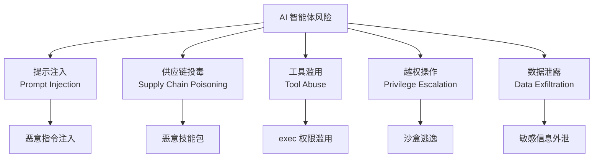

# OpenClaw 安全配置指南

> 本章节涵盖 OpenClaw 的安全配置、风险管理和最佳实践。
> **前置知识**：了解 OpenClaw 架构和基本配置。
> **维护状态**：本文档基于社区安全实践总结，建议结合 [SlowMist 安全指南](https://github.com/slowmist/openclaw-security-practice-guide) 一起阅读。

---

## 1. 安全风险概述

运行高权限 AI 智能体面临多种安全风险：



---

## 2. 三层防御矩阵

### 2.1 防御层次总览

| 层次 | 阶段 | 措施 |
|------|------|------|
| **操作前 (Pre-action)** | 执行前 | 行为黑名单、技能安装审计 |
| **操作中 (In-action)** | 执行时 | 权限收窄、跨技能预检 |
| **操作后 (Post-action)** | 执行后 | 夜间审计、Git 灾难恢复 |

### 2.2 核心安全原则

1. **零摩擦操作**：不触及"红线"时，保持日常交互流畅
2. **高风险需确认**：不可逆或敏感操作必须暂停，等待人工批准
3. **明确的夜间审计**：所有核心指标应被报告，避免静默通过
4. **默认零信任**：假设提示注入、供应链投毒和业务逻辑滥用始终可能发生

---

## 3. 访问控制配置

### 3.1 DM 策略配置

```json5
{
  channels: {
    feishu: {
      dmPolicy: "allowlist",  // 生产环境必须使用 allowlist
      allowFrom: ["ou_xxx", "ou_yyy"],  // 明确的白名单
    },
    telegram: {
      dmPolicy: "allowlist",
      allowFrom: ["user_id_1", "user_id_2"],
    }
  }
}
```

### 3.2 群组策略

```json5
{
  channels: {
    feishu: {
      groupPolicy: "allowlist",  // 群组也使用白名单
      groups: {
        // 明确允许的群组 ID
        "oc_group_xxx": {
          requireMention: true,  // 必须 @ 机器人
        }
      }
    }
  }
}
```

### 3.3 会话隔离

```json5
{
  session: {
    dmScope: "per-channel-peer"  // 多用户环境必须使用
  }
}
```

---

## 4. 工具安全配置

### 4.1 exec 工具安全

`exec` 是最危险的工具，必须严格配置：

```json5
{
  tools: {
    exec: {
      enabled: true,
      security: "allowlist",  // 必须使用白名单模式
      ask: "on-miss",          // 白名单外命令需要用户批准
      
      // 白名单：只允许执行特定命令
      allowlist: [
        "ls", "cat", "grep", "find", "git",
        "npm", "pnpm", "node",
        "curl", "wget"
      ],
      
      // 安全二进制（无副作用）
      safeBins: ["jq", "sed", "awk", "cut"],
      
      // 危险：无副作用的脚本解释器
      // ⚠️ 谨慎使用，可能被用于恶意脚本
      allowedInterpreters: ["python3", "node"],
      
      // 执行超时（毫秒）
      timeoutMs: 30000,
      
      // 单次执行最大输出（字节）
      maxOutputBytes: 1048576  // 1MB
    }
  }
}
```

### 4.2 沙盒配置

```json5
{
  agents: {
    defaults: {
      sandbox: {
        mode: "non-main",  // 非主会话启用沙盒
        scope: "session",   // 按会话隔离
        
        // 工作区访问控制
        workspaceAccess: "read-only",  // 生产环境用只读
        
        docker: {
          image: "openclaw-sandbox:bookworm-slim",
          network: "none",        // 默认无网络
          readOnlyRoot: true,     // 根文件系统只读
          user: "openclaw",
          
          // 容器资源限制
          limits: {
            memory: "512m",
            cpuShares: 256,
            pidsLimit: 64
          }
        }
      }
    }
  }
}
```

### 4.3 逃生舱配置

`tools.elevated` 是明确的"逃生舱"，允许在宿主系统执行：

```json5
{
  tools: {
    // 全局配置，不按智能体
    elevated: {
      enabled: true,
      
      // 审批流程
      approvalRequired: true,
      approvalTimeout: "5m",
      
      // 批准后执行
      commands: ["git", "npm install"]
    }
  }
}
```

---

## 5. 提示注入防护

### 5.1 输入验证与清洗

```json5
{
  agents: {
    defaults: {
      // 输入提示清洗
      promptSanitization: {
        enabled: true,
        removeSystemPromptOverride: true,  // 防止覆盖系统提示
        escapeCodeBlocks: true,             // 转义代码块
        normalizeWhitespace: true            // 规范化空白字符
      }
    }
  }
}
```

### 5.2 技能来源验证

```json5
{
  skills: {
    // 仅允许来自可信来源的技能
    allowedSources: [
      "workspace",      // 工作区本地
      "bundled"        // 捆绑的默认技能
    ],
    
    // 禁止从 ClaWHub 安装未审核技能
    requireApproval: true,
    
    // 技能签名验证
    verifySignatures: true
  }
}
```

### 5.3 输出审核

```json5
{
  hooks: {
    configs: {
      "output-moderation": {
        enabled: true,
        
        // 敏感信息过滤
        filterPatterns: [
          "API_KEY.*",
          "password.*",
          "-----BEGIN.*PRIVATE KEY-----"
        ],
        
        // 阻断关键词
        blockPatterns: [
          "rm -rf /",
          "format.*drive",
          "DROP TABLE"
        ]
      }
    }
  }
}
```

---

## 6. 供应链安全

### 6.1 技能安装审计

```json5
{
  skills: {
    audit: {
      // 记录所有技能安装
      logInstallations: true,
      
      // 安装前检查
      preInstallCheck: {
        // 检查恶意模式
        scanForMaliciousCode: true,
        
        // 验证依赖安全性
        checkDependencies: true,
        
        // 签名验证
        verifySignature: true
      }
    }
  }
}
```

### 6.2 可信技能列表

```json5
{
  skills: {
    trustedList: [
      // 只允许安装列表中的技能
      "openclaw/skill-memory",
      "openclaw/skill-web-search",
      "openclaw/skill-file-operations"
    ],
    
    // 禁止列表
    blockList: [
      "untrusted-skill-xxx",
      "malicious-skill-yyy"
    ]
  }
}
```

---

## 7. 夜间安全审计

### 7.1 审计指标

建议每晚执行安全审计，检查以下 13 项核心指标：

| 序号 | 指标 | 检查项 |
|------|------|--------|
| 1 | 会话异常 | 新建会话数、会话丢失 |
| 2 | 命令执行 | 高风险命令执行记录 |
| 3 | 工具调用 | 失败的工具调用 |
| 4 | 认证失败 | 多次认证失败 |
| 5 | 配置变更 | 配置文件修改 |
| 6 | 插件变更 | 插件安装/卸载 |
| 7 | 资源使用 | CPU/内存异常 |
| 8 | 网络流量 | 异常外网连接 |
| 9 | 文件变更 | 敏感文件修改 |
| 10 | 日志完整性 | 日志文件篡改 |
| 11 | 进程异常 | 未知子进程 |
| 12 | 权限变更 | 用户/权限变更 |
| 13 | 备份状态 | 备份成功/失败 |

### 7.2 审计脚本示例

创建 `scripts/nightly-security-audit.sh`：

```bash
#!/bin/bash
# OpenClaw 夜间安全审计脚本

LOG_DIR="~/.openclaw/logs"
REPORT_FILE="/tmp/openclaw-audit-$(date +%Y%m%d).json"

# 1. 检查配置完整性
check_config_integrity() {
  # 校验配置文件哈希
  echo '{"check": "config_integrity", "status": "checking"}"
}

# 2. 分析命令执行日志
analyze_command_logs() {
  # 高风险命令统计
  echo '{"check": "command_analysis", "status": "ok"}'
}

# 3. 会话异常检测
detect_session_anomalies() {
  # 新建会话数、会话丢失检测
  echo '{"check": "session_anomalies", "status": "ok"}'
}

# 主流程
main() {
  echo "开始安全审计..."
  
  check_config_integrity
  analyze_command_logs
  detect_session_anomalies
  
  echo "审计完成，报告: $REPORT_FILE"
}

main
```

### 7.3 定时执行审计

```bash
# 添加到 crontab
crontab -e

# 每天凌晨 3 点执行审计
0 3 * * * /path/to/scripts/nightly-security-audit.sh >> ~/.openclaw/logs/audit.log 2>&1
```

---

## 8. Git 灾难恢复

### 8.1 工作区版本控制

```bash
cd ~/.openclaw/workspace

# 初始化 Git 仓库
git init
git add AGENTS.md SOUL.md USER.md IDENTITY.md memory/
git commit -m "Initial: 智能体工作区"

# 设置远程仓库（私有）
git remote add origin git@github.com:your-private/repo.git
git push -u origin main
```

### 8.2 配置变更跟踪

```bash
# 对配置目录也进行版本控制
cd ~/.openclaw

# 添加 .gitignore
cat > .gitignore << 'EOF'
.env
credentials/
logs/
sessions/
*.log
*.json.bak
EOF

git init
git add .gitignore openclaw.json
git commit -m "Initial: OpenClaw 配置"

# 重要配置变更后立即提交
git add openclaw.json
git commit -m "Update: 修改 dmPolicy 为 allowlist"
```

### 8.3 快速恢复流程

```bash
# 从 Git 恢复配置
git clone git@github.com:your-private/repo.git temp-recover
cp temp-recover/openclaw.json ~/.openclaw/
cp -r temp-recover/workspace/* ~/.openclaw/workspace/
rm -rf temp-recover
```

---

## 9. 文件权限加固

### 9.1 配置文件权限

```bash
# 配置文件只允许所有者读写
chmod 600 ~/.openclaw/openclaw.json

# 敏感目录权限
chmod 700 ~/.openclaw/credentials
chmod 700 ~/.openclaw/.env

# 使用 chattr 锁定关键文件（不可修改）
chattr +i ~/.openclaw/openclaw.json
chattr +i ~/.openclaw/exec-approvals.json

# 查看是否被锁定
lsattr ~/.openclaw/openclaw.json
```

### 9.2 日志权限

```bash
# 日志目录权限
chmod 750 ~/.openclaw/logs

# 日志轮转（防止无限增长）
# /etc/logrotate.d/openclaw
/Users/username/.openclaw/logs/*.log {
    daily
    rotate 7
    compress
    delaycompress
    missingok
    notifempty
}
```

---

## 10. 监控与告警

### 10.1 关键监控指标

| 指标 | 阈值 | 告警级别 |
|------|------|----------|
| Gateway 进程存活 | DOWN | 🔴 紧急 |
| 认证失败次数 | > 5/min | 🟡 警告 |
| 高风险命令执行 | ANY | 🔴 紧急 |
| 配置文件修改 | ANY | 🟡 警告 |
| 磁盘使用率 | > 80% | 🟡 警告 |
| 内存使用率 | > 90% | 🟡 警告 |
| API 调用失败率 | > 5% | 🟡 警告 |

### 10.2 告警通知配置

```json5
{
  monitoring: {
    enabled: true,
    
    // 告警渠道
    channels: {
      // 飞书通知
      feishu: {
        enabled: true,
        webhook: "${FEISHU_ALERT_WEBHOOK}",
        atUsers: ["ou_xxx"]
      },
      
      // 邮件通知
      email: {
        enabled: false,
        smtp: "smtp.example.com",
        to: ["admin@example.com"]
      }
    },
    
    // 告警规则
    rules: {
      "gateway_down": {
        check: "process.exists",
        condition: "== false",
        severity: "critical",
        channel: "feishu"
      },
      "auth_failure_spike": {
        check: "metrics.auth_failures",
        condition: "> 5",
        window: "1m",
        severity: "warning",
        channel: "feishu"
      },
      "config_modified": {
        check: "file.modified",
        targets: ["~/.openclaw/openclaw.json"],
        severity: "warning",
        channel: "feishu"
      }
    }
  }
}
```

---

## 11. 安全配置清单

### 11.1 必做项（生产环境）

- [ ] `dmPolicy` 设为 `allowlist`
- [ ] `allowFrom` 配置明确的白名单
- [ ] `session.dmScope` 设为 `per-channel-peer`
- [ ] `tools.exec.security` 设为 `allowlist`
- [ ] `tools.exec.ask` 设为 `on-miss`
- [ ] 配置文件权限设为 `600`
- [ ] `.env` 不提交到 Git
- [ ] API Keys 使用环境变量
- [ ] 沙盒 `mode` 设为 `non-main` 或 `always`
- [ ] 沙盒 `workspaceAccess` 设为 `read-only`

### 11.2 推荐项

- [ ] 启用夜间安全审计
- [ ] 工作区纳入 Git 版本控制
- [ ] 配置文件用 `chattr +i` 锁定
- [ ] 配置日志轮转
- [ ] 启用监控告警
- [ ] 定期备份

### 11.3 禁止项

- ❌ `dmPolicy: "open"` 在生产环境
- ❌ `allowFrom: ["*"]` 在生产环境
- ❌ `tools.exec.security: "deny"` 设为全局 deny
- ❌ API Keys 直接硬编码在配置文件中
- ❌ `.env` 提交到 Git
- ❌ `chmod 777` 任何配置文件

---

## 12. 应急响应

### 12.1 紧急停止

```bash
# 立即停止 Gateway
pkill -f "openclaw gateway"

# 或通过 PM2
pm2 stop openclaw

# 或通过 systemd
systemctl stop openclaw
```

### 12.2 恢复步骤

1. 停止 Gateway
2. 检查配置文件完整性
3. 从 Git 恢复干净配置
4. 重启 Gateway
5. 验证功能正常
6. 检查日志异常

### 12.3 事后分析

```bash
# 导出会话日志
openclaw logs export --session <session-key> --output /tmp/session-log.jsonl

# 导出会话记录
openclaw sessions export <session-key> --output /tmp/session.json

# 生成审计报告
./scripts/nightly-security-audit.sh --from <timestamp> --to <timestamp>
```

---

## 延伸阅读

- [SlowMist OpenClaw 安全实践指南](https://github.com/slowmist/openclaw-security-practice-guide)
- [飞书接入安全配置](../feishu)
- [沙盒配置](../index)
- [工具安全配置](../index)
