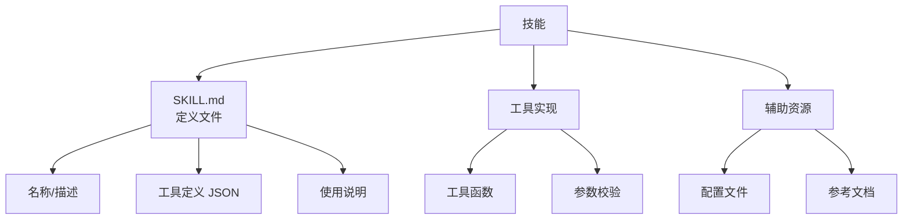

# OpenClaw 技能开发指南

> 本章节详细介绍如何开发自定义技能（Skills），扩展 OpenClaw 智能体能力。
> **前置知识**：了解 OpenClaw 基本概念、工具系统和 JSON 格式。
> **技能加载优先级**：工作区技能 > 本地技能 > 捆绑默认技能。

---

## 1. 技能系统概述

### 1.1 什么是技能

技能（Skills）是扩展 OpenClaw 智能体功能的模块化组件：

- 自定义工具定义
- 复杂工作流封装
- 外部服务集成
- 智能体行为指令

### 1.2 技能结构



### 1.3 技能目录结构

```
~/.openclaw/workspace/skills/
└── <skill-name>/
    ├── SKILL.md          # 技能定义（必需）
    ├── tools/             # 工具实现目录
    │   ├── index.ts      # 工具入口
    │   └── *.ts          # 其他工具文件
    ├── references/        # 参考资料
    │   └── *.md
    └── assets/           # 静态资源
        └── *
```

---

## 2. SKILL.md 格式详解

### 2.1 完整结构

```markdown
# <技能名称>

<技能描述，说明这个技能做什么。>

## Tools

```json
[
  {
    "name": "tool_name",
    "description": "工具描述",
    "parameters": {
      "type": "object",
      "properties": {
        "param1": {
          "type": "string",
          "description": "参数描述"
        }
      },
      "required": ["param1"]
    },
    "function": "async (params) => { ... }"
  }
]
```

## Usage

<使用说明和示例。>

## Examples

<更多使用示例。>
```

### 2.2 工具定义详解

```json
{
  "name": "get_weather",           // 工具唯一名称
  "description": "获取指定城市的天气",  // AI 看到描述决定是否调用
  "parameters": {                   // JSON Schema 参数定义
    "type": "object",
    "properties": {
      "city": {
        "type": "string",
        "description": "城市名称（支持中英文）"
      },
      "format": {
        "type": "string",
        "description": "返回格式：celsius（默认）或 fahrenheit",
        "enum": ["celsius", "fahrenheit"]
      }
    },
    "required": ["city"]
  },
  "function": "async ({ city, format = 'celsius' }) => { ... }"
}
```

### 2.3 工具函数签名

工具函数支持两种签名风格：

```javascript
// 风格 1：解构参数（推荐）
async ({ param1, param2 }) => {
  // 函数体
  return result;
}

// 风格 2：完整参数对象
async (params) => {
  const { param1, param2 } = params;
  // 函数体
  return result;
}
```

---

## 3. 技能开发示例

### 3.1 简单天气技能

创建 `~/.openclaw/workspace/skills/weather/SKILL.md`：

```markdown
# Weather 天气查询技能

获取指定城市的当前天气信息和天气预报。

## Tools

```json
[
  {
    "name": "get_current_weather",
    "description": "获取指定城市的当前天气，包括温度、湿度、风速等",
    "parameters": {
      "type": "object",
      "properties": {
        "city": {
          "type": "string",
          "description": "城市名称（中文或英文）"
        },
        "country": {
          "type": "string",
          "description": "国家代码，如 CN、US"
        }
      },
      "required": ["city"]
    },
    "function": "async ({ city, country = 'CN' }) => {\n  const response = await fetch(`https://api.weather.com/v3/wx/conditions/current?city=${encodeURIComponent(city)}&country=${country}&apikey=${process.env.WEATHER_API_KEY}`);\n  const data = await response.json();\n  return {\n    city: data.location,\n    temperature: data.temp,\n    humidity: data.humidity,\n    description: data.weather\n  };\n}"
  },
  {
    "name": "get_forecast",
    "description": "获取指定城市未来几天的天气预报",
    "parameters": {
      "type": "object",
      "properties": {
        "city": {
          "type": "string",
          "description": "城市名称"
        },
        "days": {
          "type": "number",
          "description": "预报天数（1-7）",
          "minimum": 1,
          "maximum": 7
        }
      },
      "required": ["city", "days"]
    },
    "function": "async ({ city, days }) => {\n  const response = await fetch(`https://api.weather.com/v3/wx/forecast/daily?city=${encodeURIComponent(city)}&days=${days}&apikey=${process.env.WEATHER_API_KEY}`);\n  const data = await response.json();\n  return {\n    city: data.location,\n    forecasts: data.forecast.map(f => ({\n      date: f.date,\n      high: f.highTemp,\n      low: f.lowTemp,\n      condition: f.condition\n    }))\n  };\n}"
  }
]
```

## Usage

```
用户：今天北京天气怎么样？
助手：调用 get_current_weather({ city: "北京" })
```

## Environment Variables

需要设置以下环境变量：

- `WEATHER_API_KEY`：Weather API 密钥
```

### 3.2 Git 操作技能

创建 `~/.openclaw/workspace/skills/git-operations/SKILL.md`：

```markdown
# Git Operations Git 操作技能

封装常用 Git 操作，简化代码管理。

## Tools

```json
[
  {
    "name": "git_status",
    "description": "查看 Git 仓库状态，显示已修改、已暂存、待提交的文件",
    "parameters": {
      "type": "object",
      "properties": {
        "path": {
          "type": "string",
          "description": "仓库路径，默认当前目录"
        }
      }
    },
    "function": "async ({ path = '.' }) => {\n  const { stdout } = await exec(`git -C ${path} status --short`);\n  return stdout || '工作区干净';\n}"
  },
  {
    "name": "git_commit",
    "description": "提交所有更改到 Git 仓库",
    "parameters": {
      "type": "object",
      "properties": {
        "message": {
          "type": "string",
          "description": "提交信息"
        },
        "path": {
          "type": "string",
          "description": "仓库路径"
        }
      },
      "required": ["message"]
    },
    "function": "async ({ message, path = '.' }) => {\n  await exec(`git -C ${path} add .`);\n  const { stdout } = await exec(`git -C ${path} commit -m ${JSON.stringify(message)}`);\n  return stdout;\n}"
  },
  {
    "name": "git_log",
    "description": "查看 Git 提交历史",
    "parameters": {
      "type": "object",
      "properties": {
        "path": {
          "type": "string",
          "description": "仓库路径"
        },
        "limit": {
          "type": "number",
          "description": "显示最近 N 条记录",
          "default": 10
        }
      }
    },
    "function": "async ({ path = '.', limit = 10 }) => {\n  const { stdout } = await exec(`git -C ${path} log --oneline -n ${limit}`);\n  return stdout;\n}"
  }
]
```

## Usage

```
用户：查看当前仓库状态
助手：调用 git_status()

用户：提交所有更改
助手：调用 git_commit({ message: "feat: 添加新功能" })
```

### 3.3 数据库查询技能

```markdown
# Database Query 数据库查询技能

执行只读数据库查询，返回格式化结果。

## Tools

```json
[
  {
    "name": "db_query",
    "description": "执行 SELECT 查询（仅支持查询，禁止修改数据）",
    "parameters": {
      "type": "object",
      "properties": {
        "sql": {
          "type": "string",
          "description": "SQL SELECT 语句"
        },
        "limit": {
          "type": "number",
          "description": "最大返回行数",
          "default": 100
        }
      },
      "required": ["sql"]
    },
    "function": "async ({ sql, limit = 100 }) => {\n  // 安全检查：只允许 SELECT\n  const normalized = sql.trim().toUpperCase();\n  if (!normalized.startsWith('SELECT')) {\n    throw new Error('只允许执行 SELECT 查询');\n  }\n  \n  // 参数化查询防止注入\n  const { stdout } = await exec(`psql -t -c ${JSON.stringify(sql + ' LIMIT ' + limit)}`);\n  return stdout;\n}"
  }
]
```

---

## 4. 高级技能开发

### 4.1 带状态管理的技能

对于需要维护状态的技能，可以使用文件系统存储状态：

```markdown
# Todo List 待办事项技能

管理待办事项列表。

## Tools

```json
[
  {
    "name": "todo_add",
    "description": "添加待办事项",
    "parameters": {
      "type": "object",
      "properties": {
        "task": {
          "type": "string",
          "description": "待办事项内容"
        },
        "priority": {
          "type": "string",
          "description": "优先级",
          "enum": ["low", "medium", "high"]
        }
      },
      "required": ["task"]
    },
    "function": "async ({ task, priority = 'medium' }) => {\n  const fs = require('fs');\n  const path = process.env.OPENCLAW_STATE_DIR + '/todo.json';\n  let todos = [];\n  if (fs.existsSync(path)) {\n    todos = JSON.parse(fs.readFileSync(path, 'utf8'));\n  }\n  const newTodo = {\n    id: Date.now(),\n    task,\n    priority,\n    done: false,\n    created: new Date().toISOString()\n  };\n  todos.push(newTodo);\n  fs.writeFileSync(path, JSON.stringify(todos, null, 2));\n  return newTodo;\n}"
  },
  {
    "name": "todo_list",
    "description": "列出所有待办事项",
    "parameters": {
      "type": "object",
      "properties": {}
    },
    "function": "async () => {\n  const fs = require('fs');\n  const path = process.env.OPENCLAW_STATE_DIR + '/todo.json';\n  if (!fs.existsSync(path)) return [];\n  const todos = JSON.parse(fs.readFileSync(path, 'utf8'));\n  return todos.filter(t => !t.done);\n}"
  },
  {
    "name": "todo_done",
    "description": "标记待办事项为已完成",
    "parameters": {
      "type": "object",
      "properties": {
        "id": {
          "type": "number",
          "description": "待办事项 ID"
        }
      },
      "required": ["id"]
    },
    "function": "async ({ id }) => {\n  const fs = require('fs');\n  const path = process.env.OPENCLAW_STATE_DIR + '/todo.json';\n  let todos = JSON.parse(fs.readFileSync(path, 'utf8'));\n  const todo = todos.find(t => t.id === id);\n  if (!todo) throw new Error('待办事项不存在');\n  todo.done = true;\n  todo.completed = new Date().toISOString();\n  fs.writeFileSync(path, JSON.stringify(todos, null, 2));\n  return todo;\n}"
  }
]
```

### 4.2 异步任务技能

对于长时间运行的任务，使用任务队列模式：

```markdown
# Long Task 长任务技能

处理需要后台执行的长时间任务。

## Tools

```json
[
  {
    "name": "task_submit",
    "description": "提交长时间任务到队列",
    "parameters": {
      "type": "object",
      "properties": {
        "taskType": {
          "type": "string",
          "description": "任务类型"
        },
        "params": {
          "type": "object",
          "description": "任务参数"
        }
      },
      "required": ["taskType"]
    },
    "function": "async ({ taskType, params }) => {\n  const fs = require('fs');\n  const path = process.env.OPENCLAW_STATE_DIR + '/tasks';\n  if (!fs.existsSync(path)) fs.mkdirSync(path, { recursive: true });\n  \n  const task = {\n    id: Date.now().toString(36) + Math.random().toString(36).substr(2),\n    taskType,\n    params,\n    status: 'pending',\n    created: new Date().toISOString()\n  };\n  \n  fs.writeFileSync(\\`\\${path}/\\${task.id}.json\\`, JSON.stringify(task));\n  return { taskId: task.id, status: 'queued' };\n}"
  },
  {
    "name": "task_status",
    "description": "查询任务状态",
    "parameters": {
      "type": "object",
      "properties": {
        "taskId": {
          "type": "string",
          "description": "任务 ID"
        }
      },
      "required": ["taskId"]
    },
    "function": "async ({ taskId }) => {\n  const fs = require('fs');\n  const path = \\`\\${process.env.OPENCLAW_STATE_DIR}/tasks/\\${taskId}.json\\`;\n  if (!fs.existsSync(path)) throw new Error('任务不存在');\n  return JSON.parse(fs.readFileSync(path, 'utf8'));\n}"
  }
]
```

---

## 5. 技能发布与分享

### 5.1 打包技能

技能目录结构：

```
my-skill/
├── SKILL.md
├── README.md           # 使用说明
├── package.json       # 依赖定义（如有）
└── references/        # 参考文档
    └── api.md
```

### 5.2 技能市场 (ClaWHub)

```bash
# 发布技能到 ClaWHub
openclaw skills publish ./my-skill

# 从 ClaWHub 安装
openclaw skills install <skill-name>

# 搜索技能
openclaw skills search <keyword>
```

### 5.3 技能审核清单

发布前检查：

- [ ] SKILL.md 格式正确
- [ ] 工具描述清晰
- [ ] 参数定义完整
- [ ] 示例足够
- [ ] 无硬编码敏感信息
- [ ] 依赖已声明
- [ ] README 完整

---

## 6. 技能调试

### 6.1 本地测试

```bash
# 测试工具
openclaw tools test exec --command "echo 'test'"

# 查看技能加载日志
openclaw gateway --verbose | Select-String "skill"
```

### 6.2 模拟调用

```javascript
// 在 Node.js 中模拟工具调用
const skill = require('./skills/weather/SKILL.md');
const fn = eval('(' + skill.tools[0].function + ')');
const result = await fn({ city: '北京' });
console.log(result);
```

---

## 7. 技能最佳实践

### 7.1 设计原则

| 原则 | 说明 |
|------|------|
| **单一职责** | 每个技能只做一件事 |
| **清晰命名** | 工具名要清晰表达功能 |
| **完整文档** | 描述、参数、示例都要有 |
| **错误处理** | 正确处理并返回错误信息 |
| **幂等设计** | 重复调用不会产生副作用 |

### 7.2 安全建议

```markdown
## Security

此技能需要的权限：
- 网络访问（调用外部 API）
- 文件系统读取（缓存）
- 文件系统写入（状态存储）

此技能**不**需要的权限：
- exec 命令执行
- 系统配置修改
```

### 7.3 性能考虑

- 避免在工具函数中执行长时间操作
- 使用流式处理大文件
- 实施超时机制
- 缓存常用结果

---

## 8. 技能模板

### 8.1 最小模板

```markdown
# My Skill

这是一个示例技能。

## Tools

```json
[
  {
    "name": "hello_world",
    "description": "返回问候语",
    "parameters": {
      "type": "object",
      "properties": {}
    },
    "function": "async () => 'Hello, World!'"
  }
]
```

## Usage

```
用户：打招呼
助手：调用 hello_world()
```
```

### 8.2 完整模板

```markdown
# <Skill Name>

<详细描述这个技能做什么，什么时候应该使用。>

## Prerequisites

- 环境变量：`API_KEY` - API 密钥
- 依赖：无需额外依赖

## Tools

```json
[
  {
    "name": "tool_name",
    "description": "<清晰描述工具功能>",
    "parameters": {
      "type": "object",
      "properties": {
        "param1": {
          "type": "<string|number|boolean|object|array>",
          "description": "<参数描述>"
        }
      },
      "required": ["param1"]
    },
    "function": "async ({ param1 }) => {\n  // 实现代码\n}"
  }
]
```

## Usage Examples

### Example 1

```
用户：<场景描述>
助手：调用 tool_name({ param1: 'value' })
```

### Example 2

```
用户：<场景描述>
助手：调用 tool_name({ param1: 'value' })
```

## Error Handling

| 错误 | 原因 | 处理方式 |
|------|------|----------|
| API 错误 | 外部 API 调用失败 | 返回错误信息，提示重试 |
| 参数错误 | 参数格式不正确 | 返回参数要求说明 |
| 权限错误 | 缺少必要权限 | 提示配置环境变量 |

## See Also

- [相关技能](../other-skill/)
- [官方文档](https://docs.openclaw.ai/)
```

---

## 延伸阅读

- [官方技能示例](https://github.com/VoltAgent/awesome-openclaw-skills)
- [技能参考](../index.md#38-技能skills)
- [工具系统](../index.md#7-工具tools)
