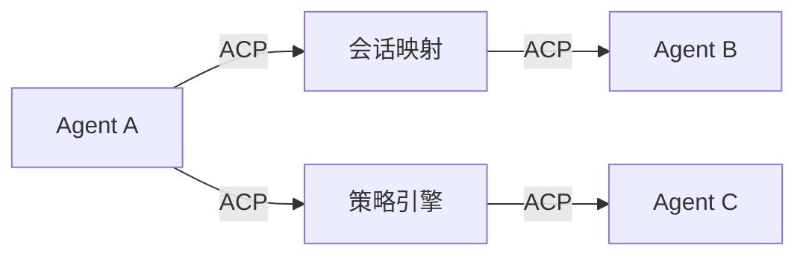
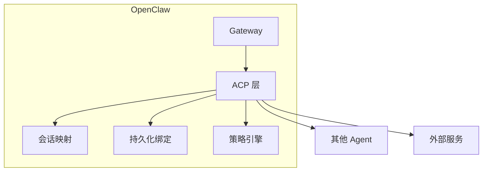
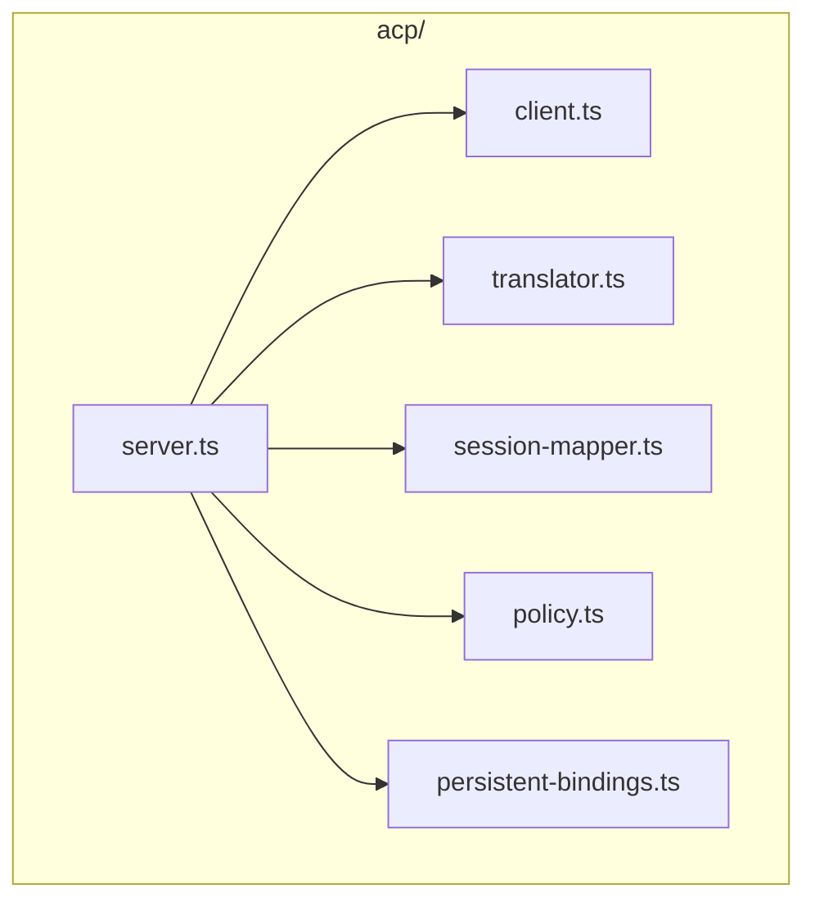
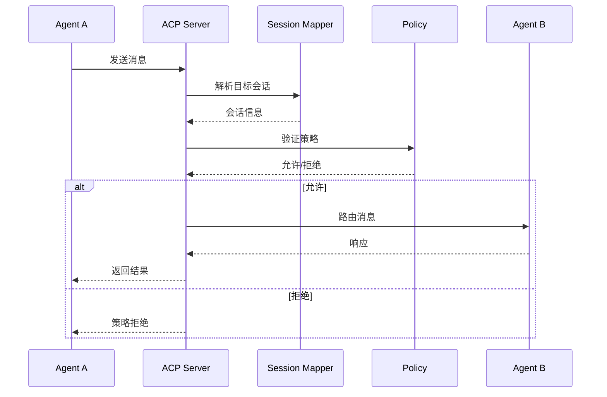
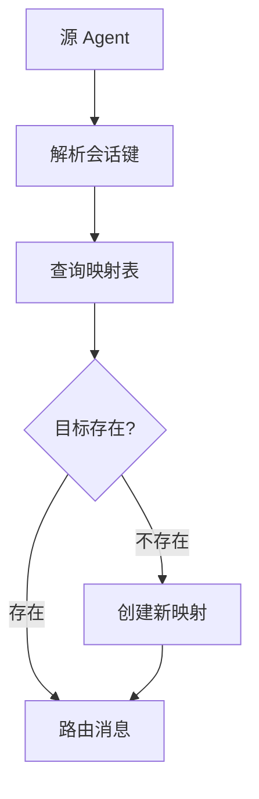
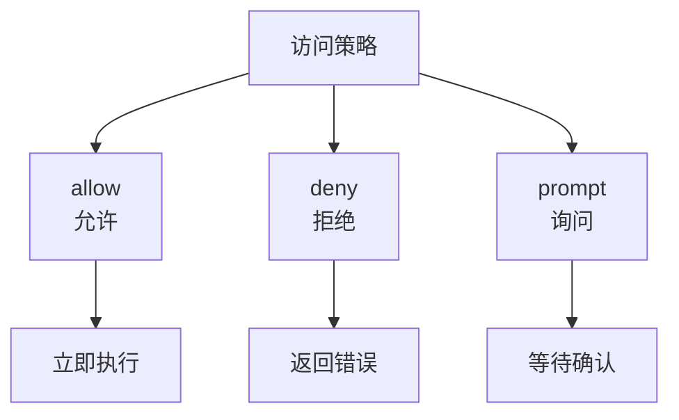
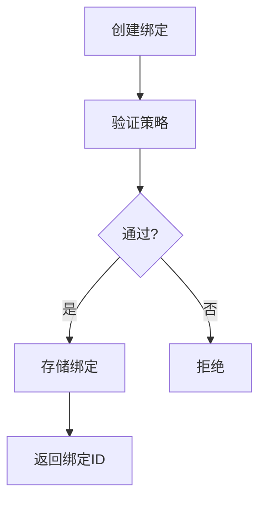
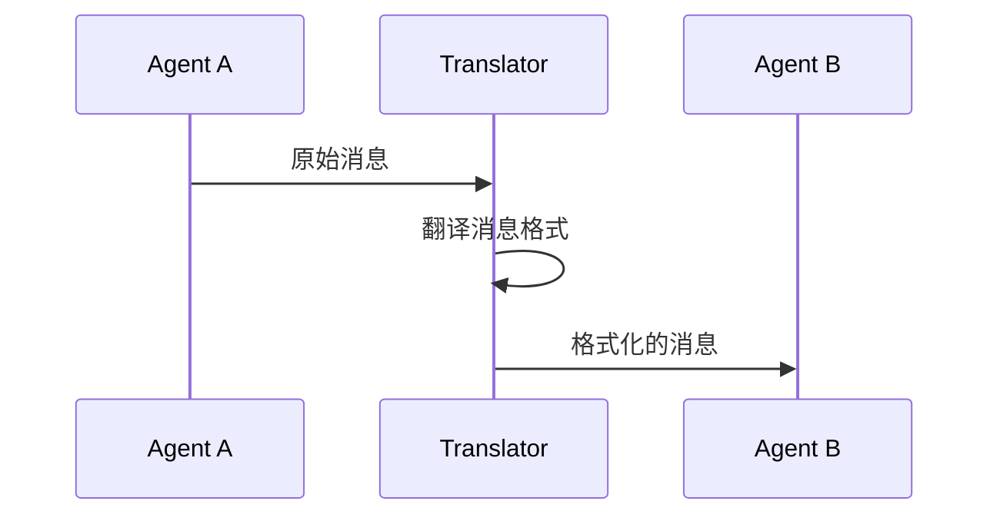
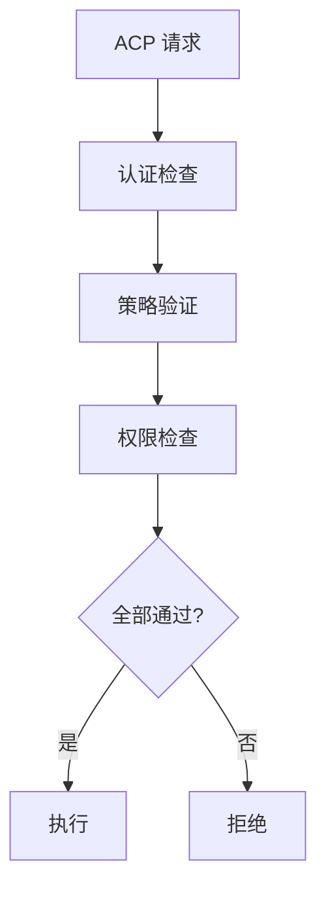
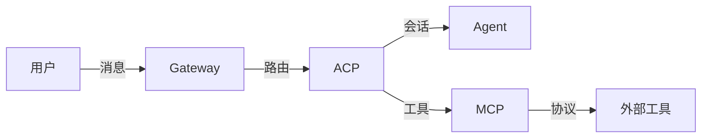

# ACP Agent Communication Protocol 详解

> 本章详解 OpenClaw 的 ACP (Agent Communication Protocol) 协议——多智能体通信机制。

---

## 1. ACP 概述

### 1.1 什么是 ACP

ACP (Agent Communication Protocol) 是 OpenClaw 内部的多智能体通信协议，支持：



### 1.2 ACP 在架构中的位置



---

## 2. ACP 源码结构

### 2.1 核心文件

| 文件 | 职责 |
|------|------|
| `acp/server.ts` | ACP 服务端 |
| `acp/client.ts` | ACP 客户端 |
| `acp/session.ts` | 会话管理 |
| `acp/session-mapper.ts` | 会话映射 |
| `acp/translator.ts` | 消息翻译 |
| `acp/policy.ts` | 访问策略 |
| `acp/persistent-bindings.ts` | 持久化绑定 |

### 2.2 架构图



---

## 3. ACP 工作流程

### 3.1 消息路由流程



### 3.2 会话映射流程



---

## 4. 会话映射

### 4.1 会话映射类型

| 类型 | 说明 |
|------|------|
| `session-mapper` | 会话 ID 映射 |
| `persistent-bindings` | 持久化绑定 |
| `policy` | 访问策略 |

### 4.2 会话键格式

```
# 标准 ACP 会话
acp:<agent-id>:<session-id>

# 跨 Agent 会话
acp:<agent-a>:<session-x>@<agent-b>
```

---

## 5. 策略引擎

### 5.1 策略类型



### 5.2 策略配置

```json5
{
  acp: {
    policy: {
      // 默认策略
      default: "prompt",
      
      // 特定操作策略
      operations: {
        "exec:*": "deny",
        "file:write": "prompt",
        "session:read": "allow"
      }
    }
  }
}
```

---

## 6. 持久化绑定

### 6.1 绑定类型

| 类型 | 说明 |
|------|------|
| `persistent-bindings.lifecycle` | 生命周期绑定 |
| `persistent-bindings.resolve` | 解析绑定 |
| `persistent-bindings.types` | 绑定类型定义 |

### 6.2 绑定管理



---

## 7. 消息翻译

### 7.1 翻译器功能

| 功能 | 说明 |
|------|------|
| `prompt-prefix` | 提示前缀翻译 |
| `session-rate-limit` | 会话限流翻译 |
| `stop-reason` | 停止原因翻译 |

### 7.2 翻译流程



---

## 8. ACP 安全

### 8.1 安全机制



### 8.2 安全配置

```json5
{
  acp: {
    security: {
      // 认证方式
      auth: "token",
      
      // 加密传输
      encryption: true,
      
      // 审计日志
      audit: true
    }
  }
}
```

---

## 9. ACP 与其他协议的关系

### 9.1 协议对比

| 协议 | 用途 | 范围 |
|------|------|------|
| ACP | Agent 间通信 | OpenClaw 内部 |
| MCP | 工具调用协议 | 标准化外部 |
| WebSocket | 实时通信 | 传输层 |
| HTTP | API 调用 | 传输层 |

### 9.2 集成架构



---

## 10. 调试 ACP

### 10.1 查看 ACP 状态

```bash
# 查看 ACP 连接
openclaw acp status

# 查看会话映射
openclaw acp sessions list

# 查看策略
openclaw acp policy list
```

### 10.2 常见问题

| 问题 | 原因 | 解决方案 |
|------|------|----------|
| 消息路由失败 | 会话不存在 | 创建会话映射 |
| 策略拒绝 | 权限不足 | 更新策略配置 |
| 连接超时 | 网络问题 | 检查网络配置 |

---

## 11. 延伸阅读

- [Gateway 架构](./architecture.md#2-gateway消息中枢)
- [插件系统](./plugins.md)
- [钩子机制](./hooks.md)
