# ACP Agent Communication Protocol 详解

> **前置知识**：本章节面向具备 TypeScript/Node.js 基础、了解智能体架构的开发者。  
> **目标读者**：需要构建多智能体系统、实现智能体间通信与协作的开发者。  
> **维护状态**：本文档基于 OpenClaw v2026.4+ 编写，ACP 是较新的协议仍在演进中。

---

## 1. ACP 概述

### 1.1 什么是 ACP

ACP (Agent Communication Protocol) 是 OpenClaw 内部的多智能体通信协议，设计用于：

- **多智能体间通信**：多个 OpenClaw 智能体之间的消息路由
- **会话映射**：跨智能体的会话状态同步
- **持久化绑定**：建立智能体之间的稳定通信链路
- **访问策略控制**：细粒度的权限管理

### 1.2 ACP 与其他协议的关系

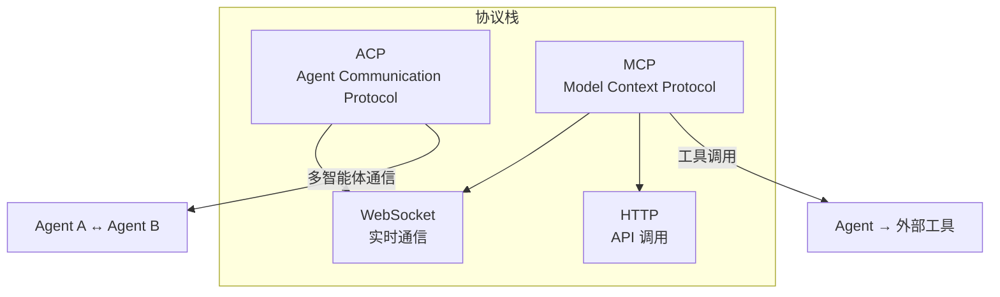

| 协议 | 层级 | 用途 |
|------|------|------|
| **ACP** | 应用层 | 多智能体之间的消息传递和协作 |
| **MCP** | 工具层 | AI 模型与外部工具/服务的标准化交互 |
| **WebSocket** | 传输层 | 实时双向通信 |
| **HTTP** | 传输层 | RESTful API 调用 |

---

## 2. ACP 源码结构

### 2.1 核心文件

| 文件 | 职责 |
|------|------|
| `acp/server.ts` | ACP 服务端，处理连接和管理 |
| `acp/client.ts` | ACP 客户端，发起请求 |
| `acp/session.ts` | 会话生命周期管理 |
| `acp/session-mapper.ts` | 会话 ID 映射和路由 |
| `acp/translator.ts` | 消息格式翻译 |
| `acp/policy.ts` | 访问策略引擎 |
| `acp/persistent-bindings.ts` | 持久化绑定存储 |

### 2.2 架构图

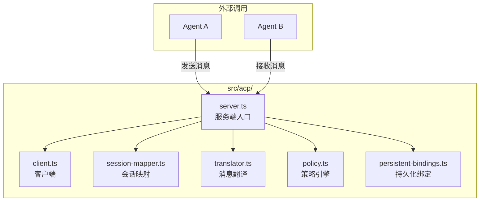

---

## 3. ACP 工作流程

### 3.1 消息路由流程

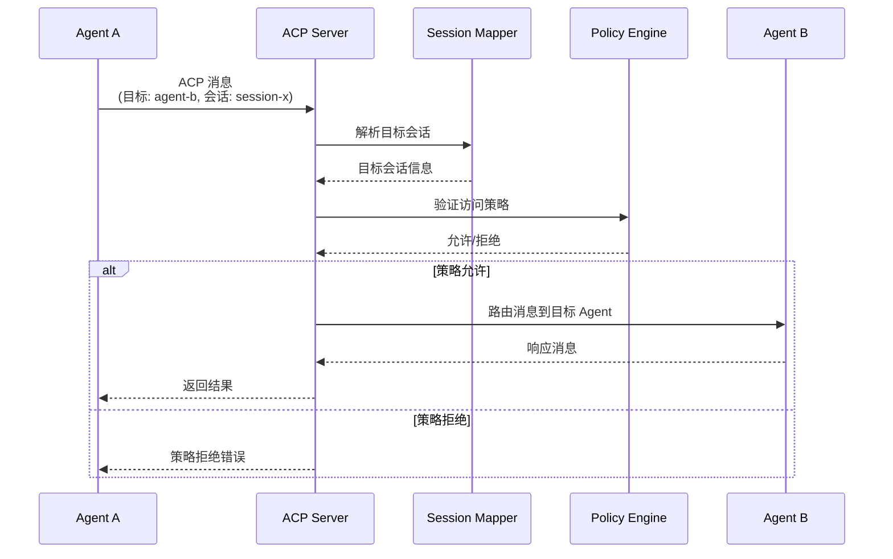

### 3.2 会话映射流程

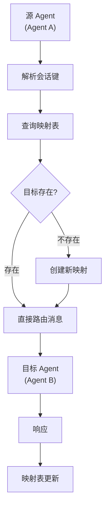

---

## 4. 实际使用场景

### 4.1 场景一：专家会诊模式

当用户提出复杂问题时，主智能体可以将子任务分发给专业领域的智能体：

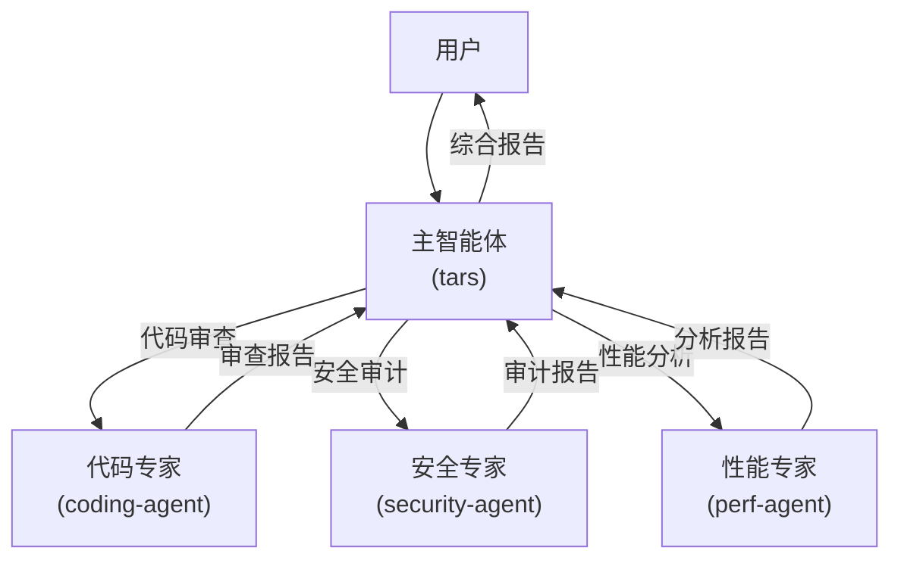

**配置示例**：

```json5
{
  agents: {
    defaults: {
      model: { primary: "anthropic/claude-sonnet-4-5" }
    },
    agents: {
      "coding-agent": {
        workspace: "~/.openclaw/workspaces/coding",
        model: { primary: "anthropic/claude-opus-4-6" }
      },
      "security-agent": {
        workspace: "~/.openclaw/workspaces/security",
        model: { primary: "anthropic/claude-opus-4-6" }
      }
    }
  },
  acp: {
    // 专家智能体配置
    agents: {
      "coding-agent": {
        endpoint: "http://localhost:18789"
      },
      "security-agent": {
        endpoint: "http://localhost:18790"
      }
    }
  }
}
```

### 4.2 场景二：流水线处理

多智能体组成处理流水线，每个智能体负责特定阶段：

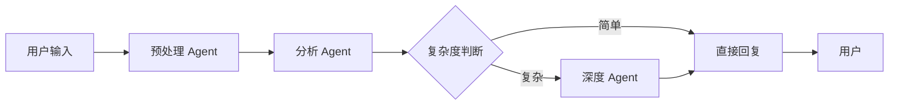

### 4.3 场景三：多通道协调

不同通道的智能体协同工作：

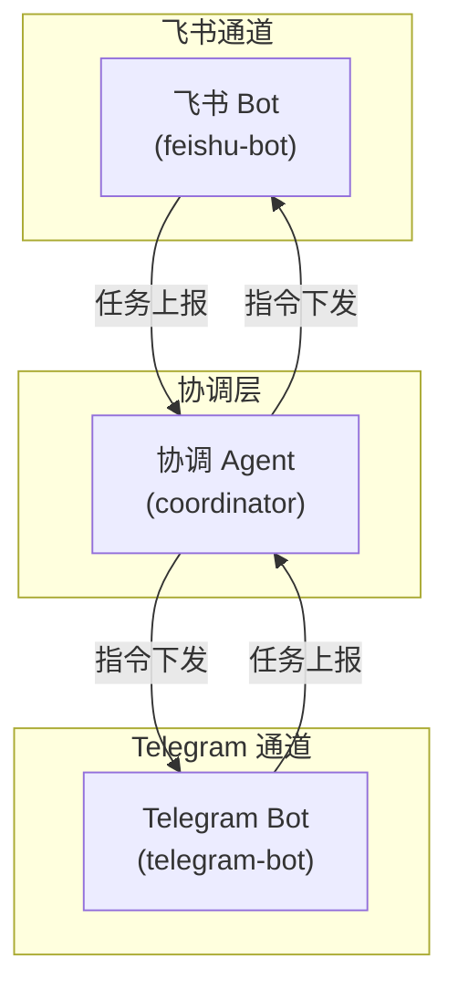

---

## 5. 会话映射

### 5.1 会话映射类型

| 类型 | 说明 | 使用场景 |
|------|------|----------|
| `session-mapper` | 会话 ID 到目标的映射 | 消息路由 |
| `persistent-bindings` | 持久化绑定关系 | 长期协作关系 |
| `policy` | 访问控制策略 | 权限管理 |

### 5.2 会话键格式

```
# 标准 ACP 会话
acp:<agent-id>:<session-id>

# 跨 Agent 会话
acp:<agent-a>:<session-x>@<agent-b>

# 带通道信息的会话
acp:<agent-id>:<channel>:<peer-id>
```

### 5.3 会话映射配置

```json5
{
  acp: {
    sessionMapping: {
      // 启用会话映射
      enabled: true,
      
      // 映射存储方式
      store: "memory", // 或 "file", "redis"
      
      // 映射过期时间
      ttl: "24h"
    }
  }
}
```

---

## 6. 策略引擎

### 6.1 策略类型

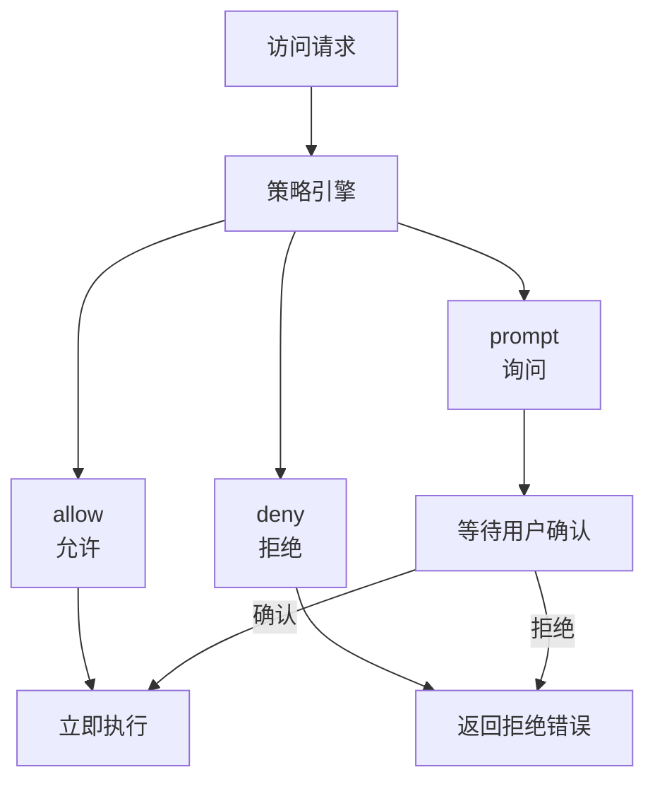

### 6.2 策略配置

```json5
{
  acp: {
    policy: {
      // 默认策略
      default: "prompt",
      
      // 按操作类型配置策略
      operations: {
        // 高风险操作：拒绝
        "exec:*": "deny",
        "file:write:*": "deny",
        
        // 中风险操作：询问
        "browser:*": "prompt",
        
        // 低风险操作：允许
        "session:read": "allow",
        "memory:search": "allow"
      },
      
      // 按调用者配置
      callers: {
        "untrusted-agent": {
          default: "deny",
          exceptions: ["memory:read", "session:read"]
        }
      }
    }
  }
}
```

---

## 7. 持久化绑定

### 7.1 绑定类型

| 类型 | 说明 | 生命周期 |
|------|------|----------|
| `lifecycle` | 绑定到智能体生命周期 | 智能体运行期间 |
| `resolve` | 动态解析的绑定 | 每次请求时解析 |
| `persistent` | 持久化存储的绑定 | 跨会话持久化 |

### 7.2 绑定管理

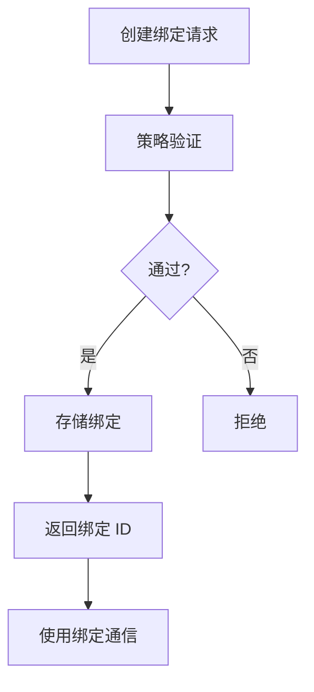

### 7.3 绑定配置

```json5
{
  acp: {
    persistentBindings: {
      enabled: true,
      
      // 绑定存储
      store: {
        type: "file",      // 或 "memory", "redis"
        path: "~/.openclaw/acp-bindings.json"
      },
      
      // 绑定类型
      types: {
        "lifecycle": {
          autoCleanup: true   // 智能体结束时自动清理
        },
        "persistent": {
          autoCleanup: false   // 需要手动清理
        }
      }
    }
  }
}
```

---

## 8. 消息翻译器

### 8.1 翻译器功能

| 功能 | 说明 |
|------|------|
| `prompt-prefix` | 为跨智能体消息添加上下文前缀 |
| `session-rate-limit` | 跨智能体消息的速率限制 |
| `stop-reason` | 翻译停止原因 |
| `tool-result` | 工具结果的格式转换 |

### 8.2 翻译流程

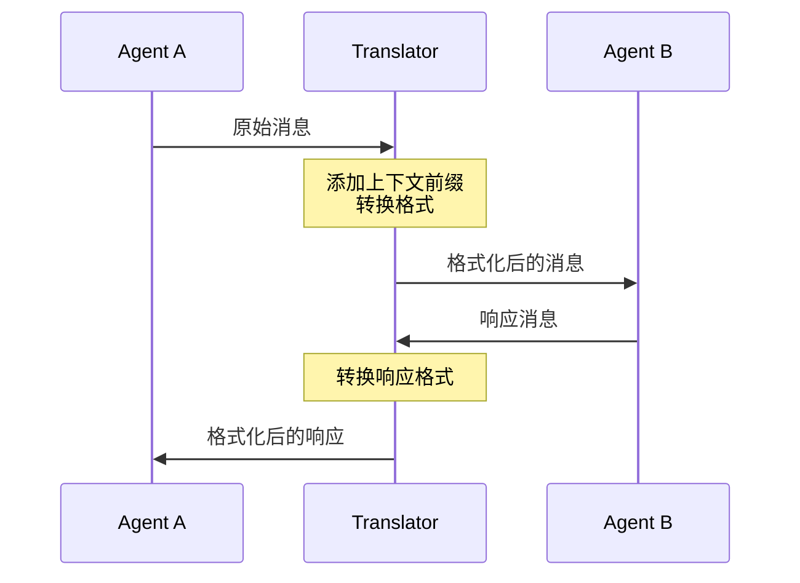

---

## 9. 安全配置

### 9.1 安全机制

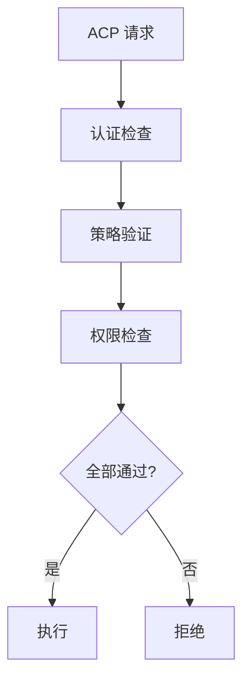

### 9.2 安全配置

```json5
{
  acp: {
    security: {
      // 认证方式
      auth: {
        type: "token",          // token / mTLS / none
        token: "${ACP_AUTH_TOKEN}"
      },
      
      // 加密传输
      encryption: true,
      
      // 审计日志
      audit: {
        enabled: true,
        destination: "~/.openclaw/logs/acp-audit.jsonl"
      },
      
      // 速率限制
      rateLimit: {
        enabled: true,
        maxRequests: 100,
        windowMs: 60000
      }
    }
  }
}
```

---

## 10. 多 Agent 通信拓扑图

### 10.1 星型拓扑（推荐）

中心 Agent 协调所有通信：

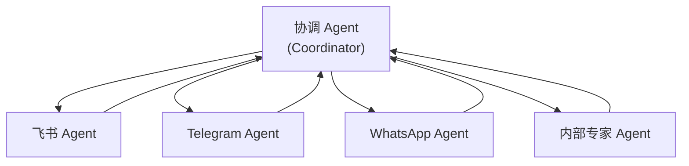

### 10.2 网状拓扑

智能体之间直接通信：

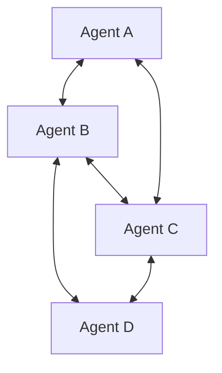

### 10.3 分层拓扑

分层级的智能体结构：

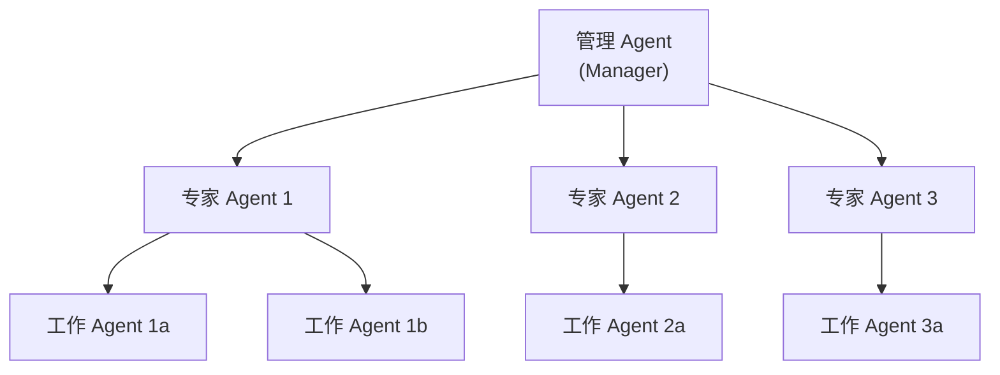

---

## 11. 调试 ACP

### 11.1 查看 ACP 状态

```bash
# 查看 ACP 连接
openclaw acp status

# 查看会话映射
openclaw acp sessions list

# 查看策略
openclaw acp policy list

# 查看绑定
openclaw acp bindings list
```

### 11.2 常见问题

| 问题 | 原因 | 解决方案 |
|------|------|----------|
| 消息路由失败 | 会话不存在 | 创建会话映射 `openclaw acp session create` |
| 策略拒绝 | 权限不足 | 更新策略配置 `openclaw acp policy set` |
| 连接超时 | 网络问题或目标 Agent 宕机 | 检查网络配置，确认目标 Agent 正在运行 |
| 绑定丢失 | 存储后端不可用 | 检查存储配置，尝试重建绑定 |

---

## 12. 延伸阅读

- [Gateway 架构](./architecture.md#2-gateway消息中枢)
- [智能体引擎](./agents.md)
- [会话管理](./sessions.md)
- [插件系统](./plugins.md)
- [钩子机制](./hooks.md)
