# Agents 智能体引擎详解

> 本章详解 OpenClaw 的智能体核心——如何接收消息、调用模型、执行工具、返回结果。

---

## 1. Agent 循环概述

### 1.1 完整生命周期

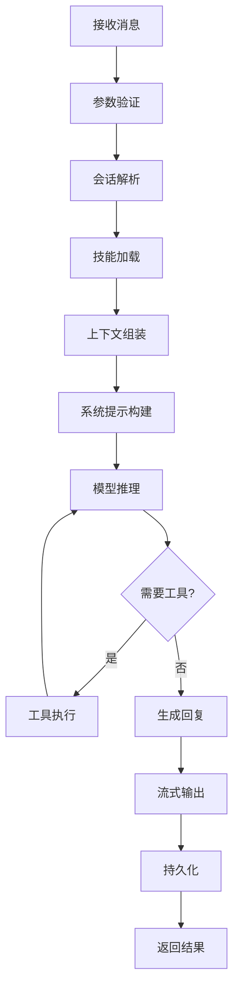

### 1.2 源码文件对应

| 阶段 | 主要文件 | 关键函数 |
|------|----------|----------|
| 入口 | `pi-embedded-runner/run.ts` | `runEmbeddedPiAgent()` |
| 模型 | `pi-embedded-runner/model.ts` | `resolveModelAsync()` |
| 上下文 | `pi-embedded-runner/compaction-*.ts` | 上下文压缩 |
| 工具 | `pi-embedded-runner/run/attempt.ts` | `runEmbeddedAttempt()` |
| 输出 | `pi-embedded-runner/stream-*.ts` | 流式处理 |

---

## 2. 上下文组装

### 2.1 上下文组成

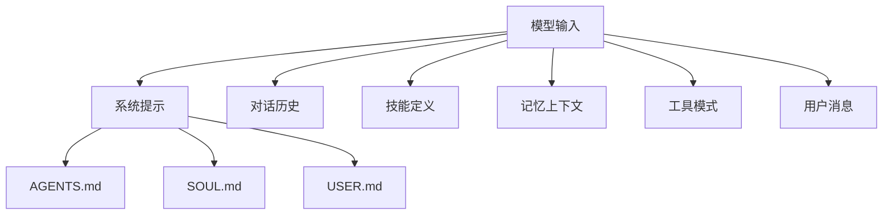

### 2.2 系统提示构建流程

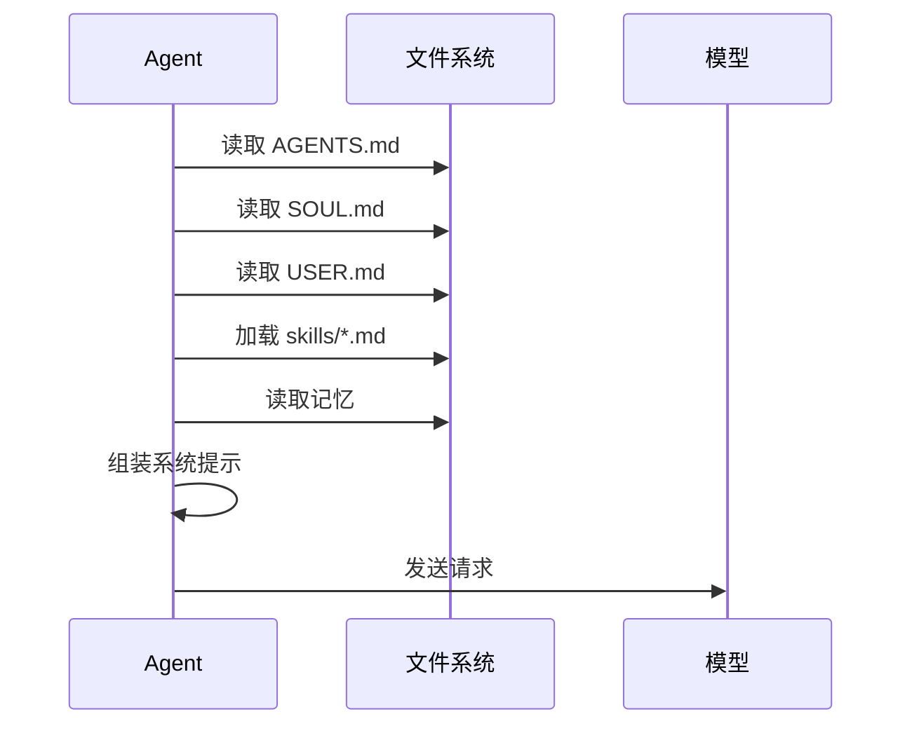

---

## 3. 模型选择

### 3.1 多模型配置

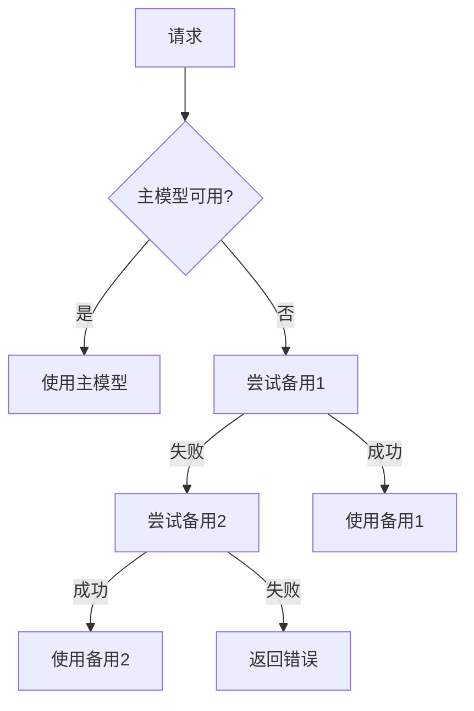

### 3.2 模型配置示例

```json5
{
  agents: {
    defaults: {
      model: {
        primary: "anthropic/claude-sonnet-4-5",
        fallbacks: [
          "openai/gpt-4",
          "anthropic/claude-haiku"
        ]
      }
    }
  }
}
```

### 3.3 提供商配置

```json5
{
  models: {
    providers: {
      anthropic: {
        apiKey: "${ANTHROPIC_API_KEY}",
        baseUrl: "https://api.anthropic.com"
      },
      openai: {
        apiKey: "${OPENAI_API_KEY}"
      }
    }
  }
}
```

---

## 4. 工具执行

### 4.1 工具调用流程

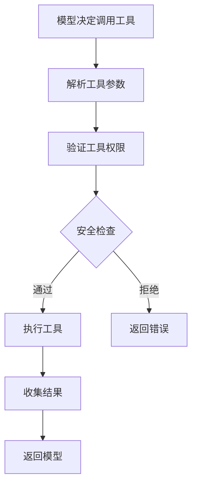

### 4.2 内置工具

| 工具 | 文件 | 功能 |
|------|------|------|
| `exec` | `tools/exec.ts` | 执行系统命令 |
| `browser` | `tools/browser.ts` | 网页浏览 |
| `file_read` | `tools/file-*.ts` | 文件读取 |
| `file_write` | `tools/file-*.ts` | 文件写入 |
| `search` | `web-search-*.ts` | 网页搜索 |

### 4.3 exec 工具安全

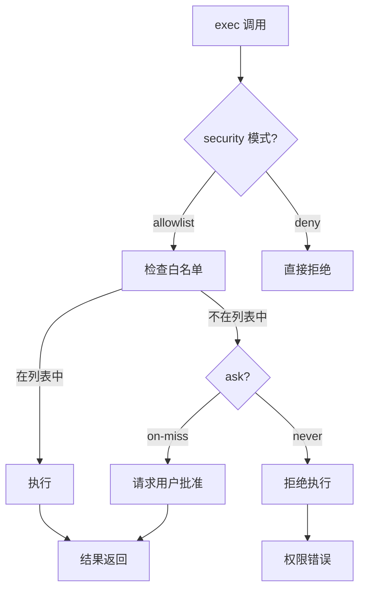

### 4.4 工具权限配置

```json5
{
  tools: {
    exec: {
      enabled: true,
      security: "allowlist",
      ask: "on-miss",
      allowlist: ["ls", "cat", "grep", "git"],
      safeBins: ["jq", "sed"]
    }
  }
}
```

---

## 5. 上下文压缩

### 5.1 压缩触发条件

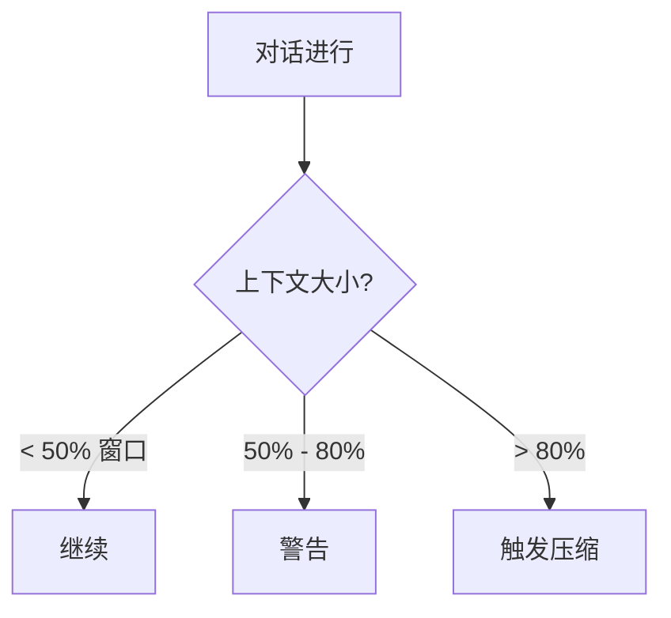

### 5.2 压缩流程

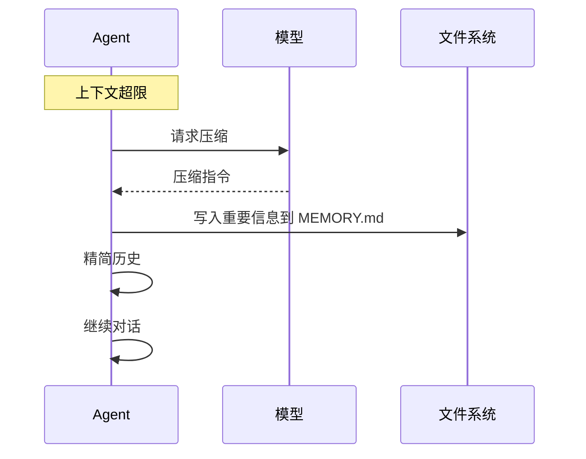

### 5.3 手动压缩

```
/compact Focus on decisions and open questions
```

---

## 6. 子智能体

### 6.1 子智能体架构

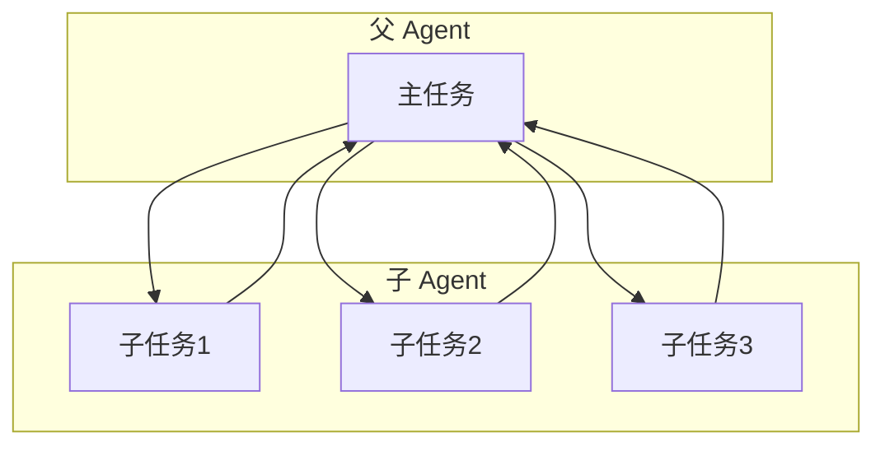

### 6.2 配置示例

```json5
{
  agents: {
    defaults: {
      subagents: {
        enabled: true,
        maxDepth: 3,
        timeoutMs: 60000
      }
    }
  }
}
```

---

## 7. 会话管理

### 7.1 会话状态

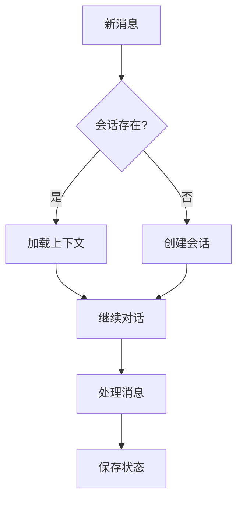

### 7.2 会话范围

| 值 | 隔离级别 | 场景 |
|------|----------|------|
| `main` | 所有 DM 共享 | 单用户默认 |
| `per-peer` | 按发送者 | 多用户 |
| `per-channel-peer` | 通道+发送者 | **推荐多用户** |
| `per-account-channel-peer` | 账户+通道+发送者 | 多账户 |

---

## 8. 流式输出

### 8.1 流式处理流程

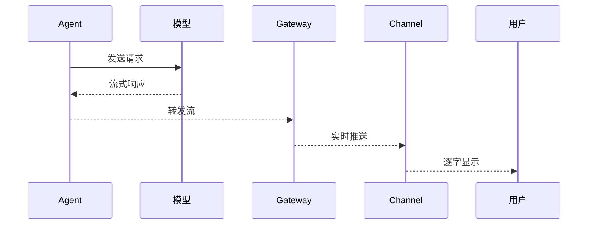

### 8.2 渲染模式

```json5
{
  channels: {
    feishu: {
      renderMode: "raw"  // 默认纯文本
    }
  }
}
```

> ⚠️ 注意：飞书建议使用 `raw` 模式，避免流式输出导致协议不匹配。

---

## 9. 错误处理与重试

### 9.1 重试策略

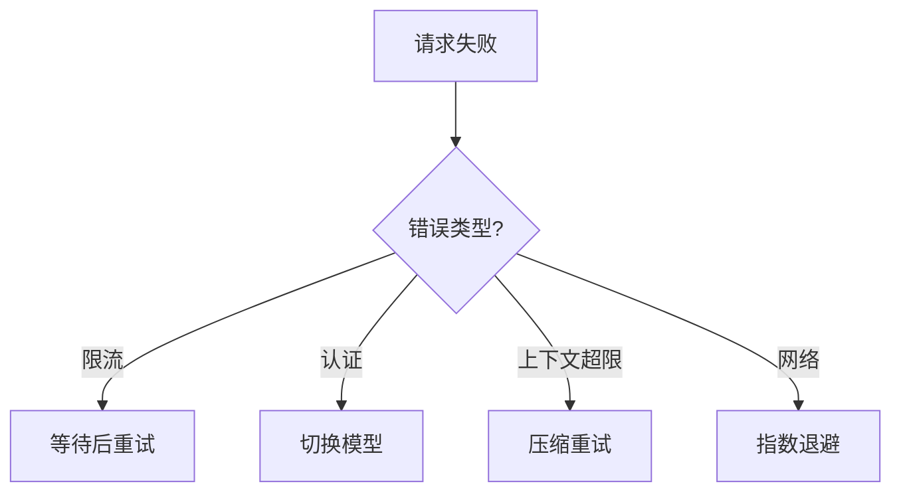

### 9.2 错误类型

| 类型 | 处理方式 |
|------|----------|
| `rate_limit` | 等待后重试 |
| `auth_error` | 切换认证文件 |
| `context_overflow` | 触发压缩 |
| `network_error` | 指数退避 |

---

## 10. 调试与监控

### 10.1 查看运行日志

```bash
# 实时查看 Agent 日志
openclaw gateway --verbose

# 查看特定会话
openclaw sessions view <session-id>
```

### 10.2 关键指标

| 指标 | 说明 |
|------|------|
| 模型延迟 | 请求到响应的时间 |
| 工具调用次数 | 解决问题的工具数 |
| 上下文大小 | 消耗的 token 数 |
| 压缩次数 | 触发压缩的次数 |

---

## 11. 延伸阅读

- [Gateway 架构](./architecture.md#3-agents智能体引擎)
- [会话管理](./sessions.md)
- [工具系统](../index.md#7-工具tools)
- [安全配置](../index.md#87-安全实践)
