# OpenClaw 源码架构解析

> **前置知识**：本章节面向具备 TypeScript/Node.js 基础的开发者，建议先阅读 [使用手册](../index.md) 了解 OpenClaw 的基本使用。
> **目标读者**：希望从源码层面理解 OpenClaw 架构设计的开发者或贡献者。
> **维护状态**：本文档基于 OpenClaw v2026.4.4 源码分析，描述的是当前实现细节。

---

## 1. 整体架构总览

### 1.1 系统定位

OpenClaw 是一个**自托管的 AI 智能体网关**，其核心职责是：

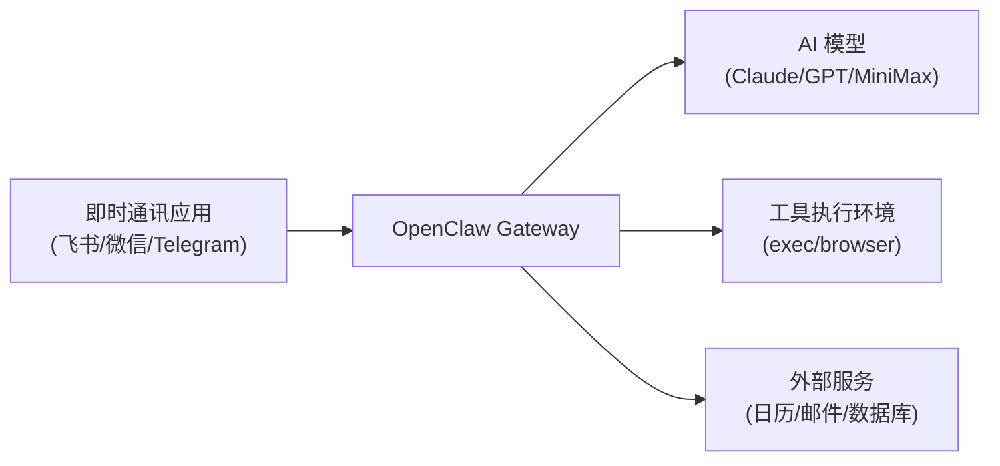
```mermaid
graph LR
    A["即时通讯应用<br/>(飞书/微信/Telegram)"] --> B["OpenClaw Gateway"]
    B --> C["AI 模型<br/>(Claude/GPT/MiniMax)"]
    B --> D["工具执行环境<br/>(exec/browser)"]
    B --> E["外部服务<br/>(日历/邮件/数据库)"]
```

### 1.2 源码目录结构

```
openclaw/src/
├── gateway/             # 网关核心 - 消息入口/路由/会话管理
├── agents/             # 智能体引擎 - AI 推理/工具调用/上下文管理
│   ├── pi-embedded-runner/  # 核心 Runner
│   ├── skills/         # 技能系统
│   └── tools/          # 内置工具定义
├── sessions/           # 会话管理 - 对话上下文/状态/历史
├── channels/           # 通道接入 - 飞书/微信/Telegram/Discord 等
├── plugins/            # 插件系统 - 扩展机制/钩子
├── memory-host-sdk/    # 记忆系统 - 向量搜索/BM25/混合搜索
├── cron/               # 定时任务 - 调度器/心跳/自动化
├── config/             # 配置管理 - 热重载/环境变量/Schema
├── hooks/              # 钩子系统 - 生命周期事件/拦截点
├── mcp/                # MCP 协议 - Model Context Protocol
├── acp/                # ACP 协议 - Agent Communication Protocol
└── infra/              # 基础设施 - 日志/监控/安全
```

---

## 2. Gateway：消息中枢

### 2.1 Gateway 在架构中的角色

Gateway 是整个系统的**中央枢纽**，负责：

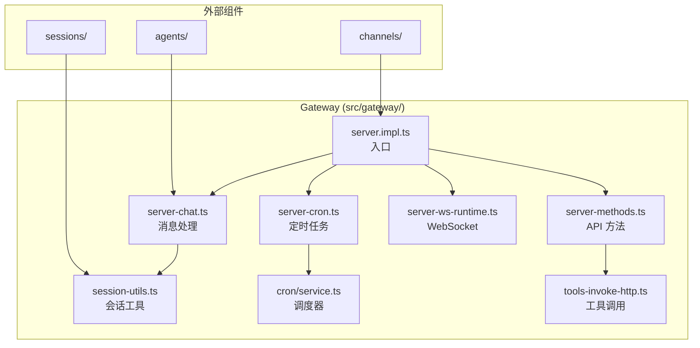
```mermaid
graph TD
    subgraph Gateway["Gateway (src/gateway/)"]
        A["server.impl.ts<br/>入口"] --> B["server-chat.ts<br/>消息处理"]
        A --> C["server-cron.ts<br/>定时任务"]
        A --> D["server-methods.ts<br/>API 方法"]
        A --> E["server-ws-runtime.ts<br/>WebSocket"]
        B --> F["session-utils.ts<br/>会话工具"]
        C --> G["cron/service.ts<br/>调度器"]
        D --> H["tools-invoke-http.ts<br/>工具调用"]
    end
    
    subgraph External["外部组件"]
        I["channels/"] --> A
        J["agents/"] --> B
        K["sessions/"] --> F
    end
```

### 2.2 消息处理流程

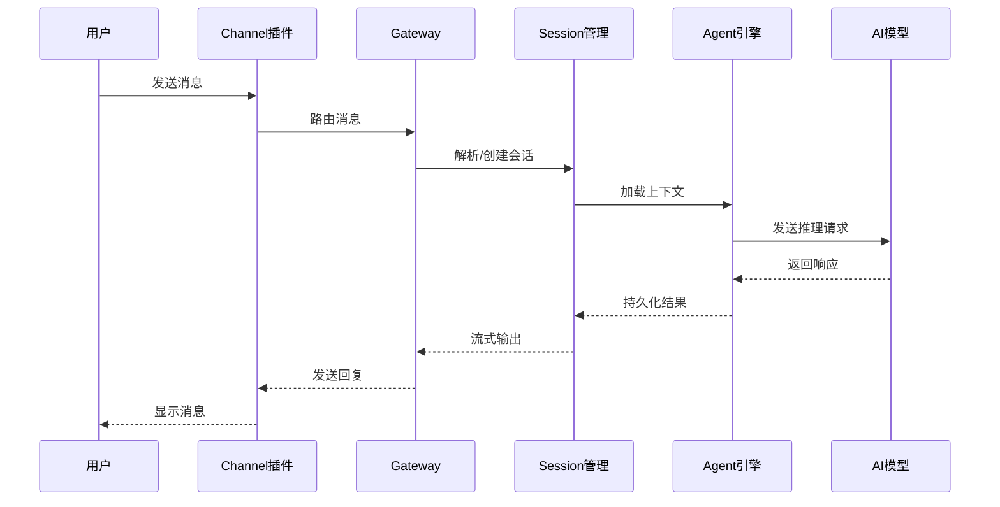
```mermaid
sequenceDiagram
    participant User as 用户
    participant Channel as Channel插件
    participant Gateway as Gateway
    participant Session as Session管理
    participant Agent as Agent引擎
    participant Model as AI模型

    User->>Channel: 发送消息
    Channel->>Gateway: 路由消息
    Gateway->>Session: 解析/创建会话
    Session->>Agent: 加载上下文
    Agent->>Model: 发送推理请求
    Model-->>Agent: 返回响应
    Agent-->>Session: 持久化结果
    Session-->>Gateway: 流式输出
    Gateway-->>Channel: 发送回复
    Channel-->>User: 显示消息
```

### 2.3 核心文件说明

| 文件 | 职责 | 关键导出 |
|------|------|----------|
| `server.impl.ts` | Gateway 启动入口 | `startGatewayServer()` |
| `server-chat.ts` | 消息处理核心 | `createAgentEventHandler()` |
| `server-cron.ts` | 定时任务调度 | `buildGatewayCronService()` |
| `server-methods.ts` | RPC 方法列表 | `coreGatewayHandlers` |
| `server-ws-runtime.ts` | WebSocket 处理 | `attachGatewayWsHandlers()` |
| `config-reload.ts` | 配置热重载 | `startGatewayConfigReloader()` |
| `boot.ts` | 启动引导 | `runGatewayBoot()` |

### 2.4 配置热重载机制

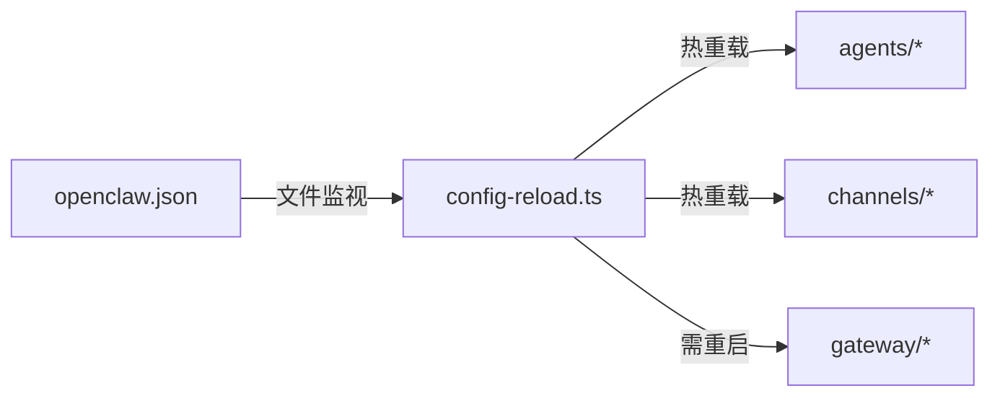
```mermaid
graph LR
    A["openclaw.json"] -->|"文件监视"| B["config-reload.ts"]
    B -->|"热重载"| C["agents/*"]
    B -->|"热重载"| D["channels/*"]
    B -->|"需重启"| E["gateway/*"]
```

---

## 3. Agents：智能体引擎

### 3.1 Agent 循环完整流程

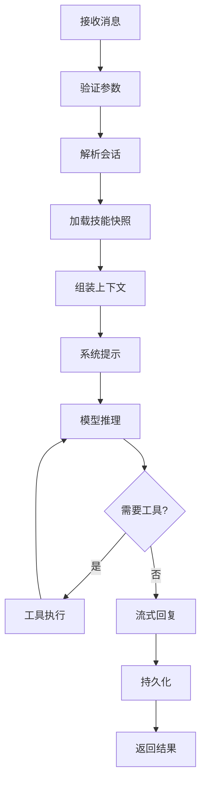
```mermaid
flowchart TD
    A["接收消息"] --> B["验证参数"]
    B --> C["解析会话"]
    C --> D["加载技能快照"]
    D --> E["组装上下文"]
    E --> F["系统提示"]
    F --> G["模型推理"]
    G --> H{"需要工具?"}
    H -->|是| I["工具执行"]
    I --> G
    H -->|否| J["流式回复"]
    J --> K["持久化"]
    K --> L["返回结果"]
```

### 3.2 源码文件对应

| 阶段 | 源码文件 | 关键函数 |
|------|----------|----------|
| 入口 | `pi-embedded-runner/run.ts` | `runEmbeddedPiAgent()` |
| 模型推理 | `pi-embedded-runner/model.ts` | `resolveModelAsync()` |
| 工具调用 | `pi-embedded-runner/run/attempt.ts` | `runEmbeddedAttempt()` |
| 上下文压缩 | `pi-embedded-runner/compact.ts` | `runPostCompactionSideEffects()` |
| 工具定义 | `agents/` | `bash-tools.exec.ts`, `bash-tools.ts` |

### 3.3 模型选择与降级

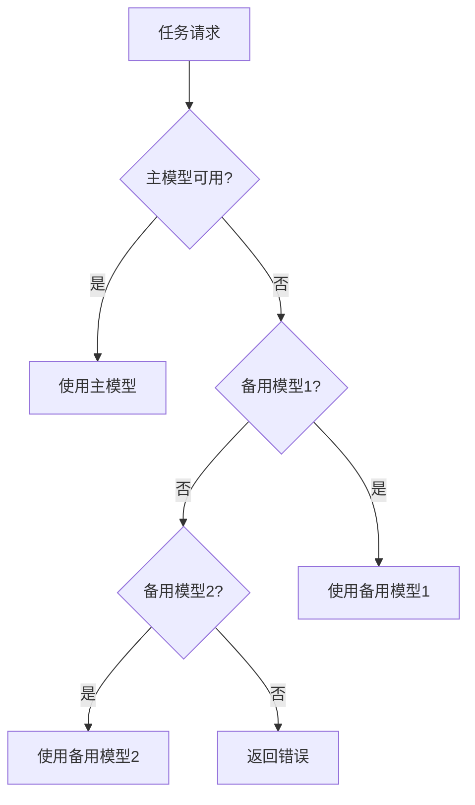
```mermaid
graph TD
    A["任务请求"] --> B{"主模型可用?"}
    B -->|是| C["使用主模型"]
    B -->|否| D{"备用模型1?"}
    D -->|否| E{"备用模型2?"}
    D -->|是| F["使用备用模型1"]
    E -->|是| G["使用备用模型2"]
    E -->|否| H["返回错误"]
```

---

## 4. Sessions：会话管理

### 4.1 会话范围体系

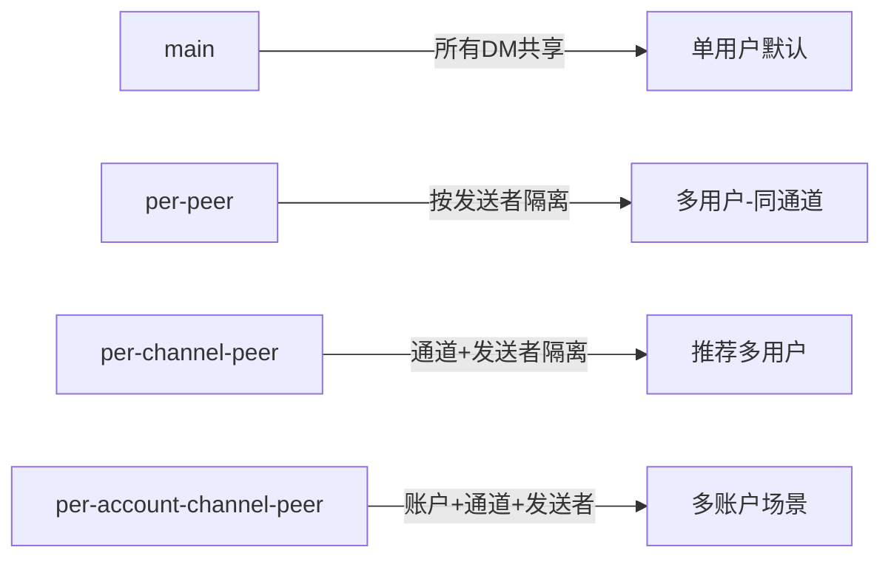
```mermaid
graph LR
    A["main"] -->|"所有DM共享"| Z["单用户默认"]
    B["per-peer"] -->|"按发送者隔离"| Y["多用户-同通道"]
    C["per-channel-peer"] -->|"通道+发送者隔离"| X["推荐多用户"]
    D["per-account-channel-peer"] -->|"账户+通道+发送者"| W["多账户场景"]
```

### 4.2 会话键格式

```
直接消息: agent:<agentId>:main
群组消息: agent:<agentId>:<channel>:group:<id>
定时任务: cron:<jobId>
```

### 4.3 上下文压缩机制

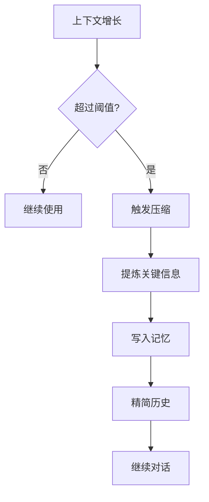
```mermaid
graph TD
    A["上下文增长"] --> B{"超过阈值?"}
    B -->|否| Z["继续使用"]
    B -->|是| C["触发压缩"]
    C --> D["提炼关键信息"]
    D --> E["写入记忆"]
    E --> F["精简历史"]
    F --> G["继续对话"]
```

---

## 5. Channels：通道接入

### 5.1 通道插件架构

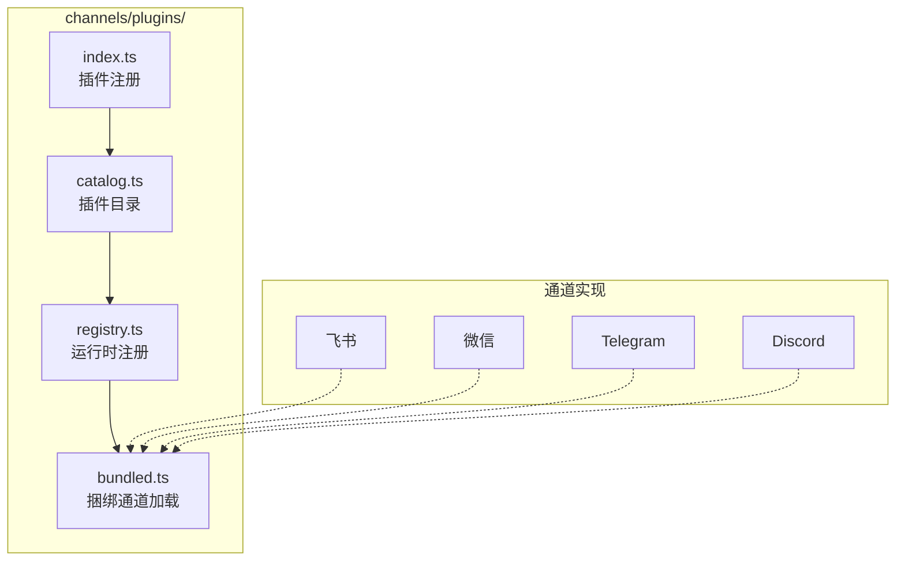
```mermaid
graph TD
    subgraph channels/plugins/
        A["index.ts<br/>插件注册"] --> B["catalog.ts<br/>插件目录"]
        B --> C["registry.ts<br/>运行时注册"]
        C --> D["bundled.ts<br/>捆绑通道加载"]
    end
    
    subgraph 通道实现
        E["飞书"] -.-> D
        F["微信"] -.-> D
        G["Telegram"] -.-> D
        H["Discord"] -.-> D
    end
```

### 5.2 飞书接入原理

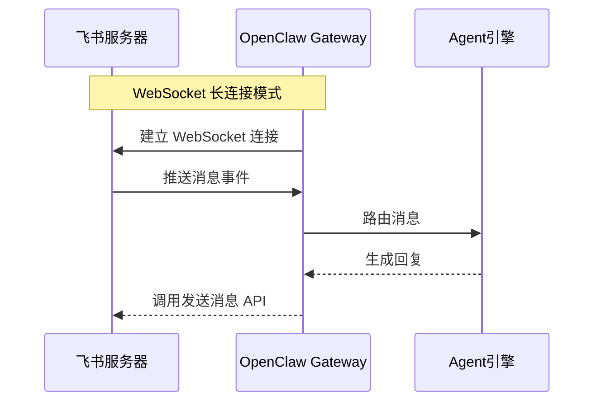
```mermaid
sequenceDiagram
    participant Feishu as 飞书服务器
    participant OC as OpenClaw Gateway
    participant Agent as Agent引擎

    Note over Feishu,OC: WebSocket 长连接模式
    OC->>Feishu: 建立 WebSocket 连接
    Feishu->>OC: 推送消息事件
    OC->>Agent: 路由消息
    Agent-->>OC: 生成回复
    OC-->>Feishu: 调用发送消息 API
```

---

## 6. Plugins：插件系统

### 6.1 插件架构

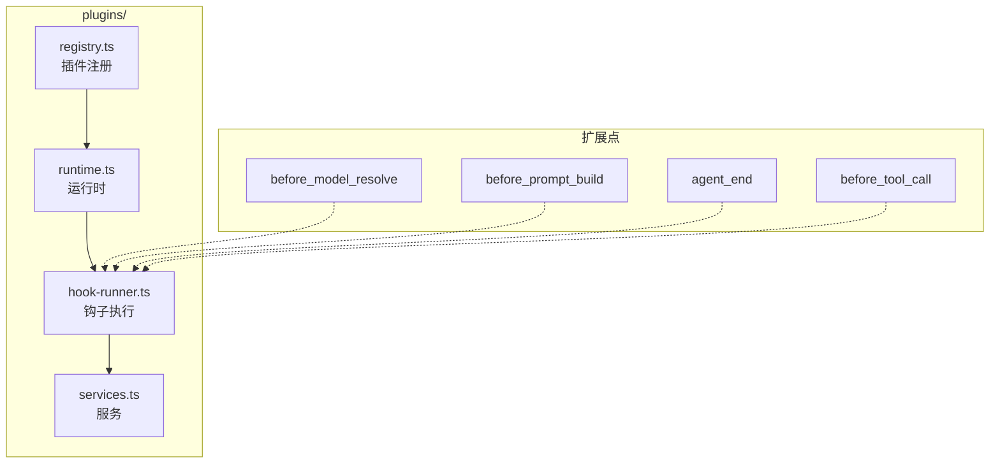
```mermaid
graph TD
    subgraph plugins/
        A["registry.ts<br/>插件注册"] --> B["runtime.ts<br/>运行时"]
        B --> C["hook-runner.ts<br/>钩子执行"]
        C --> D["services.ts<br/>服务"]
    end
    
    subgraph 扩展点
        E["before_model_resolve"] -.-> C
        F["before_prompt_build"] -.-> C
        G["agent_end"] -.-> C
        H["before_tool_call"] -.-> C
    end
```

### 6.2 插件类型

| 类型 | 说明 |
|------|------|
| Channel Plugin | 通道接入（飞书/微信/Telegram） |
| Tool Plugin | 工具扩展 |
| Memory Plugin | 记忆提供者 |
| Provider Plugin | AI 模型提供商 |

---

## 7. Hooks：钩子系统

### 7.1 生命周期钩子

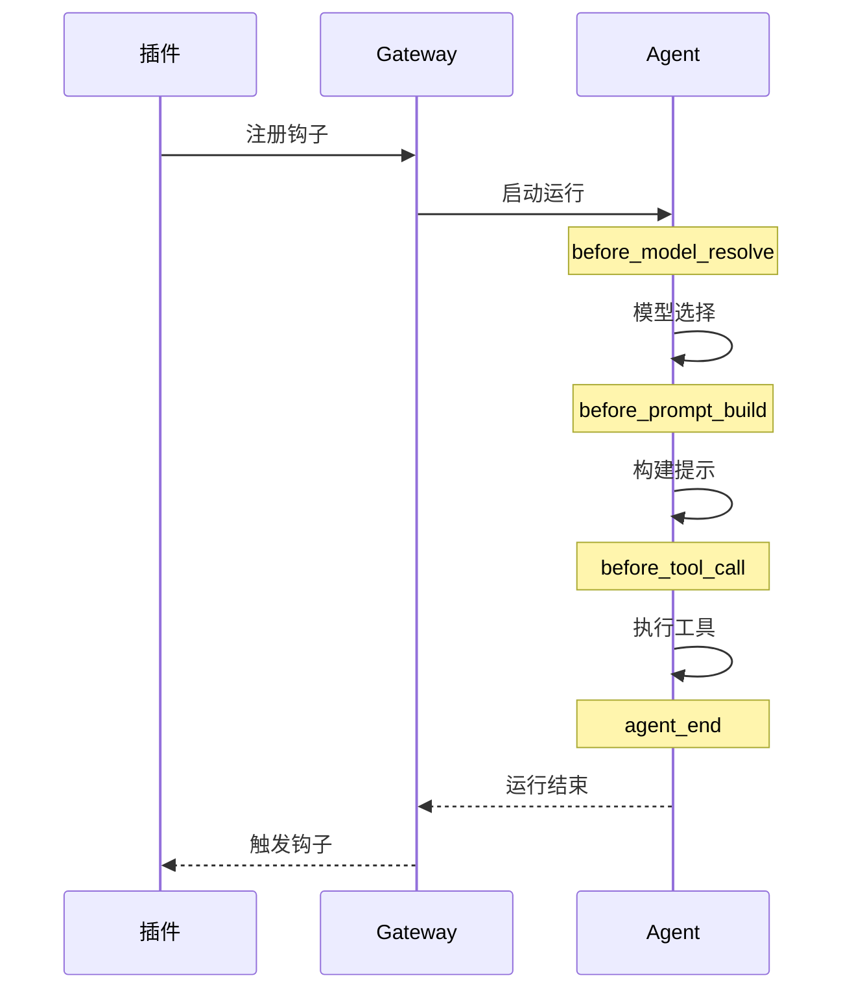
```mermaid
sequenceDiagram
    participant P as 插件
    participant G as Gateway
    participant A as Agent

    P->>G: 注册钩子
    G->>A: 启动运行
    Note over A: before_model_resolve
    A->>A: 模型选择
    Note over A: before_prompt_build
    A->>A: 构建提示
    Note over A: before_tool_call
    A->>A: 执行工具
    Note over A: agent_end
    A-->>G: 运行结束
    G-->>P: 触发钩子
```

### 7.2 钩子类型

| 钩子 | 触发时机 | 作用 |
|------|----------|------|
| `before_model_resolve` | 模型解析前 | 选择和初始化 AI 模型 |
| `before_prompt_build` | 提示构建前 | 组装上下文到最终提示 |
| `agent_end` | 运行结束后 | 智能体完成一次运行 |
| `before_tool_call` | 工具调用前 | 拦截和验证工具参数 |
| `after_tool_call` | 工具调用后 | 处理工具返回结果 |

---

## 8. MCP：Model Context Protocol

### 8.1 MCP 架构

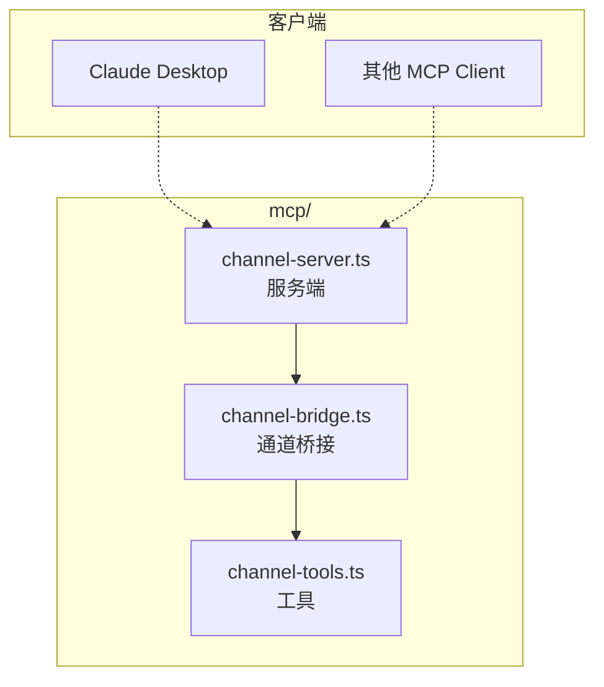
```mermaid
graph TD
    subgraph mcp/
        A["channel-server.ts<br/>服务端"] --> B["channel-bridge.ts<br/>通道桥接"]
        B --> C["channel-tools.ts<br/>工具"]
    end
    
    subgraph 客户端
        D["Claude Desktop"] -.-> A
        E["其他 MCP Client"] -.-> A
    end
```

### 8.2 MCP 用途

- 允许外部 MCP 客户端（如 Claude Desktop）连接到 OpenClaw
- 提供标准化的工具调用协议
- 支持动态发现和调用工具

---

## 9. ACP：Agent Communication Protocol

### 9.1 ACP 架构

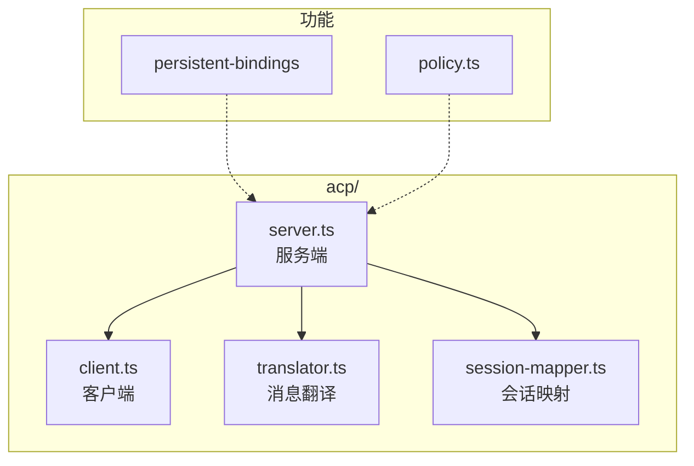
```mermaid
graph TD
    subgraph acp/
        A["server.ts<br/>服务端"] --> B["client.ts<br/>客户端"]
        A --> C["translator.ts<br/>消息翻译"]
        A --> D["session-mapper.ts<br/>会话映射"]
    end
    
    subgraph 功能
        E["persistent-bindings"] -.-> A
        F["policy.ts"] -.-> A
    end
```

### 9.2 ACP 用途

- 多智能体间的通信协议
- 持久化绑定管理
- 会话状态同步
- 访问策略控制

---

## 10. Skills：技能系统

### 10.1 技能加载优先级

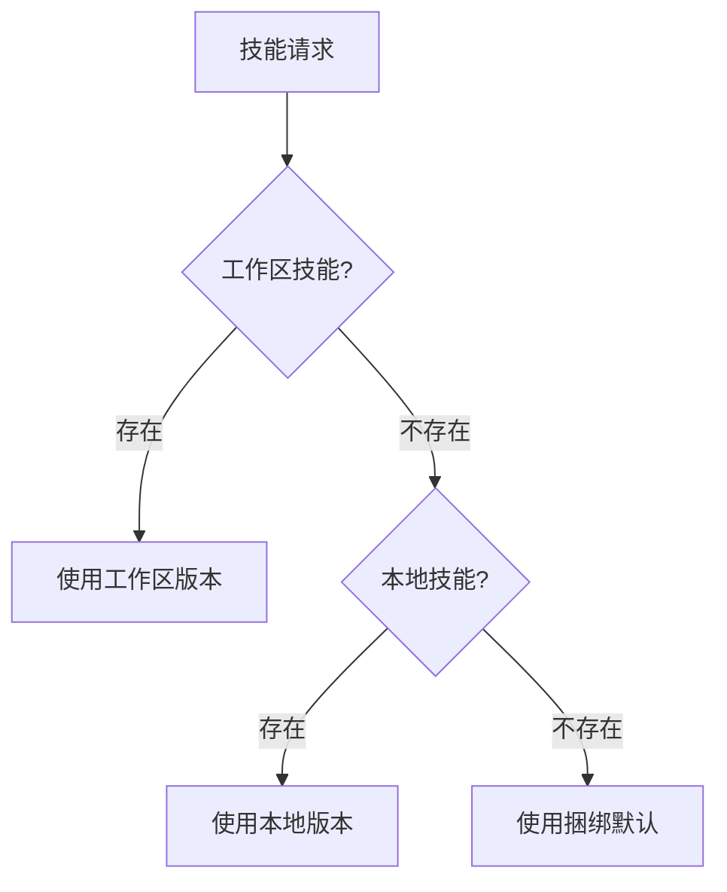
```mermaid
graph TD
    A["技能请求"] --> B{"工作区技能?"}
    B -->|存在| C["使用工作区版本"]
    B -->|不存在| D{"本地技能?"}
    D -->|存在| E["使用本地版本"]
    D -->|不存在| F["使用捆绑默认"]
```

### 10.2 技能结构

```
skills/
└── <skill-name>/
    ├── SKILL.md          # 技能定义
    ├── tools/            # 工具实现
    └── references/        # 参考资料
```

---

## 11. Memory：记忆系统

### 11.1 两层记忆架构

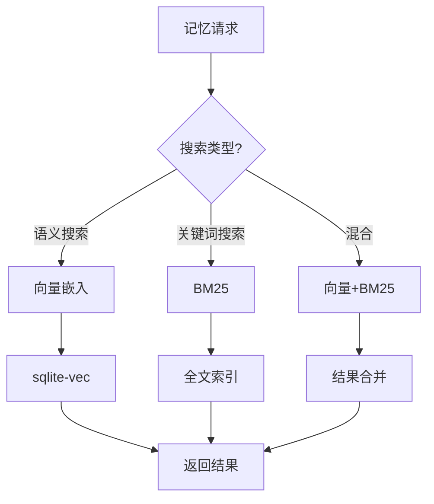
```mermaid
graph TD
    A["记忆请求"] --> B{"搜索类型?"}
    
    B -->|语义搜索| C["向量嵌入"]
    B -->|关键词搜索| D["BM25"]
    B -->|混合| E["向量+BM25"]
    
    C --> F["sqlite-vec"]
    D --> G["全文索引"]
    E --> H["结果合并"]
    
    F --> I["返回结果"]
    G --> I
    H --> I
```

### 11.2 记忆写入流程

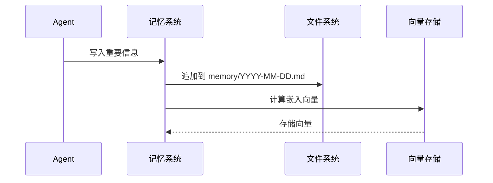
```mermaid
sequenceDiagram
    participant Agent as Agent
    participant Memory as 记忆系统
    participant File as 文件系统
    participant Vector as 向量存储

    Agent->>Memory: 写入重要信息
    Memory->>File: 追加到 memory/YYYY-MM-DD.md
    Memory->>Vector: 计算嵌入向量
    Vector-->>Memory: 存储向量
```

---

## 12. Cron：定时任务

### 12.1 定时任务架构

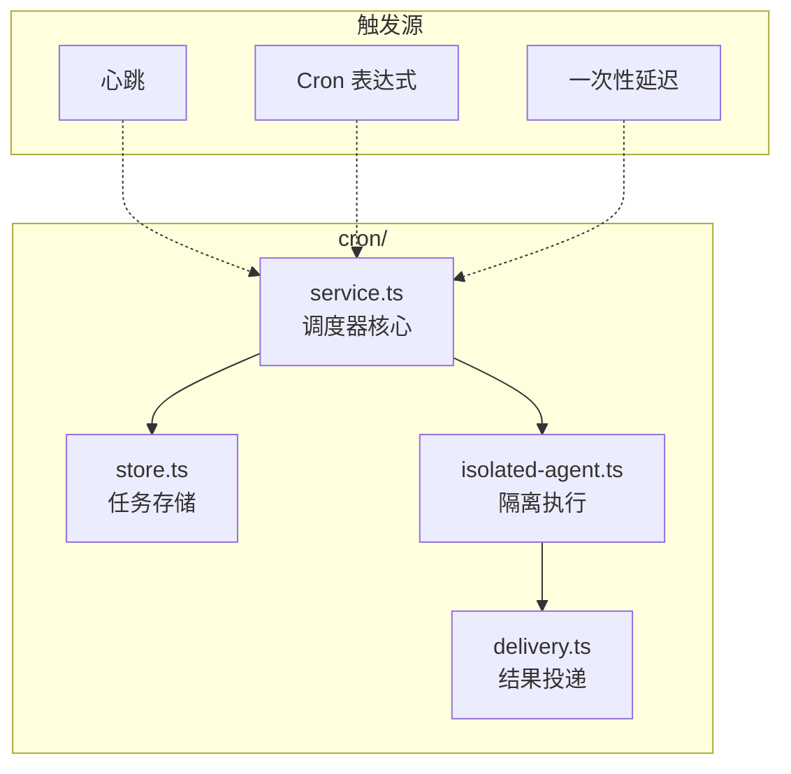
```mermaid
graph TD
    subgraph cron/
        A["service.ts<br/>调度器核心"] --> B["store.ts<br/>任务存储"]
        A --> C["isolated-agent.ts<br/>隔离执行"]
        C --> D["delivery.ts<br/>结果投递"]
    end
    
    subgraph 触发源
        E["心跳"] -.-> A
        F["Cron 表达式"] -.-> A
        G["一次性延迟"] -.-> A
    end
```

### 12.2 任务执行模式

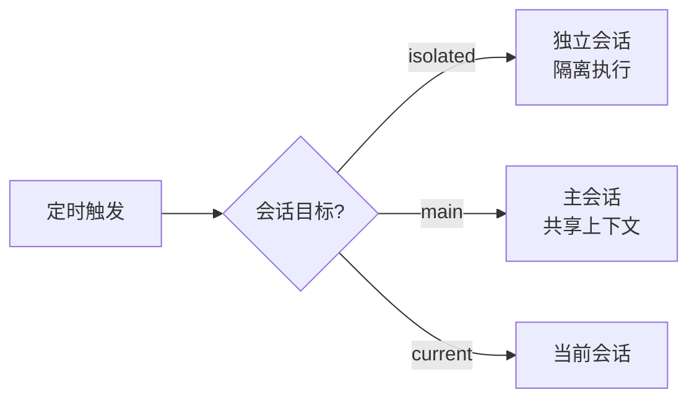
```mermaid
graph LR
    A["定时触发"] --> B{"会话目标?"}
    B -->|"isolated"| C["独立会话<br/>隔离执行"]
    B -->|"main"| D["主会话<br/>共享上下文"]
    B -->|"current"| E["当前会话"]
```

---

## 13. 配置系统

### 13.1 配置加载顺序

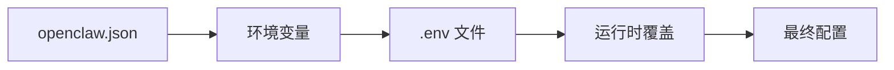
```mermaid
graph LR
    A["openclaw.json"] --> B["环境变量"]
    B --> C[".env 文件"]
    C --> D["运行时覆盖"]
    D --> E["最终配置"]
```

### 13.2 关键配置项

```mermaid
graph TD
    A["openclaw.json"] --> B["agents"]
    A --> C["channels"]
    A --> D["models"]
    A --> E["session"]
    A --> F["tools"]
    A --> G["skills"]
    A --> H["cron"]
    
    B --> B1["defaults.model"]
    B --> B2["defaults.subagents"]
    B --> B3["defaults.compaction"]
    
    C --> C1["feishu.*"]
    C --> C2["telegram.*"]
    
    D --> D1["providers.*"]
    D --> D2["primary"]
```

---

## 14. 安全机制

### 14.1 沙盒隔离

```mermaid
graph TD
    A["exec 工具调用"] --> B{"沙盒模式?"}
    
    B -->|"none"| C["直接宿主执行<br/>⚠️ 高风险"]
    B -->|"non-main"| D["非主会话沙盒"]
    B -->|"always"| E["所有会话沙盒"]
    
    D --> F["Docker 容器"]
    E --> F
```

### 14.2 访问控制

```mermaid
graph LR
    A["dmPolicy"] --> B["pairing"]
    A --> C["allowlist"]
    A --> D["open"]
    A --> E["disabled"]
    
    B -->|"配对码审批"| Z["安全访问"]
    C -->|"白名单"| Z
    D -->|"完全开放"| Y["⚠️ 仅测试"]
    E -->|"禁用"| X["无访问"]
```

---

## 15. 源码学习路径

### 15.1 推荐阅读顺序

```
1. 入门：理解整体架构
   └─ src/gateway/server.impl.ts (Gateway 入口)
   └─ src/gateway/boot.ts (启动引导)
   
2. 消息流：理解请求处理
   └─ src/gateway/server-chat.ts
   └─ src/channels/plugins/ (通道接入)
   
3. 智能体：理解 AI 推理
   └─ src/agents/pi-embedded-runner/run.ts
   └─ src/agents/model.ts
   
4. 会话：理解上下文管理
   └─ src/sessions/session-id.ts
   └─ src/sessions/session-key-utils.ts
   
5. 工具：理解执行机制
   └─ src/agents/bash-tools.exec.ts (exec 工具)
   └─ src/agents/tools/web-tools.ts (browser 工具)
   
6. 扩展：理解插件系统
   └─ src/plugins/registry.ts
   └─ src/hooks/hooks.ts
```

### 15.2 调试技巧

```bash
# 查看 Gateway 日志
openclaw gateway --verbose

# 诊断配置问题
openclaw doctor

# 查看会话历史
openclaw sessions list

# 测试工具调用
openclaw tools test <tool-name>
```

---

## 16. 关键类/函数索引

| 类/函数 | 文件 | 作用 |
|---------|------|------|
| `startGatewayServer` | `gateway/server.impl.ts` | 启动 Gateway |
| `runGatewayBoot` | `gateway/boot.ts` | 执行启动引导 |
| `createAgentEventHandler` | `gateway/server-chat.ts` | 创建消息处理器 |
| `runEmbeddedPiAgent` | `agents/pi-embedded-runner/run.ts` | 执行智能体 |
| `resolveModelAsync` | `agents/pi-embedded-runner/model.ts` | 异步获取模型 |
| `buildEmbeddedRunPayloads` | `agents/pi-embedded-runner/run/payloads.ts` | 构建请求载荷 |
| `runEmbeddedAttempt` | `agents/pi-embedded-runner/run/attempt.ts` | 执行单次尝试 |
| `sessionLikelyHasOversizedToolResults` | `agents/tool-result-truncation.ts` | 检测工具结果大小 |

---

## 17. 延伸阅读

- [OpenClaw 官方文档](https://docs.openclaw.ai/)
- [OpenClaw GitHub](https://github.com/openclaw/openclaw)
- [飞书接入指南](../feishu.md)
- [使用手册](../index.md)
- [通道详解](./channels.md)
- [插件系统](./plugins.md)
- [钩子机制](./hooks.md)
