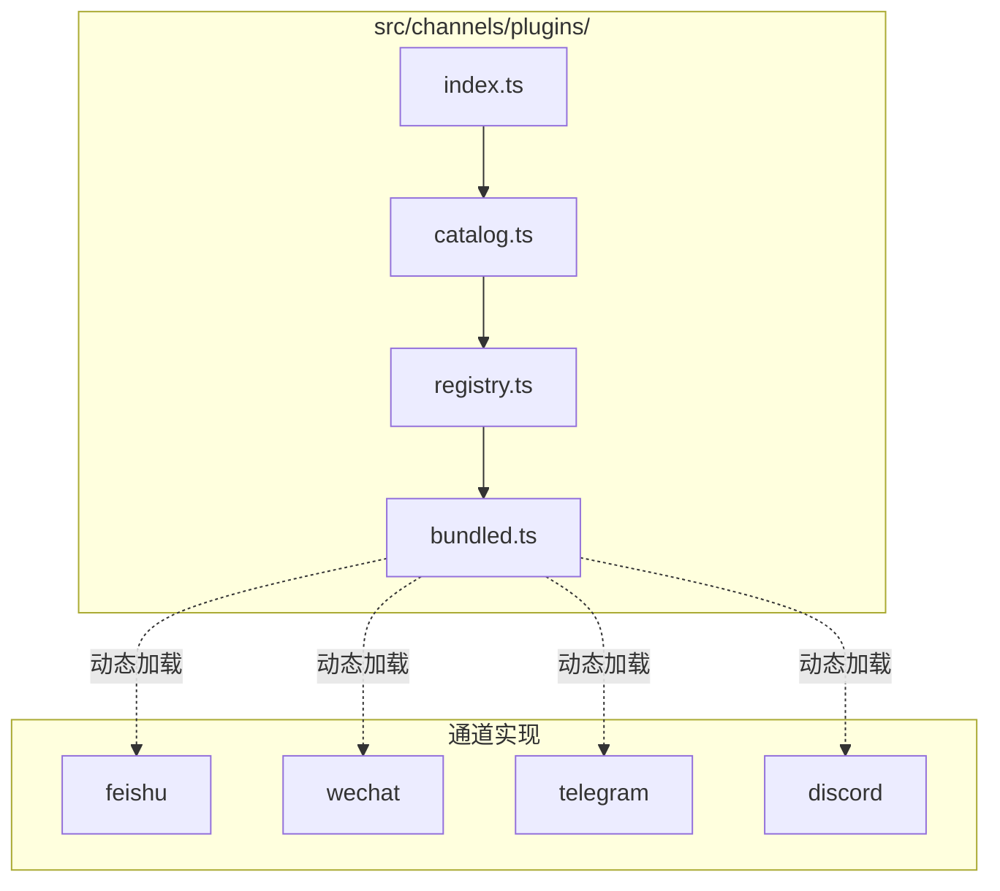
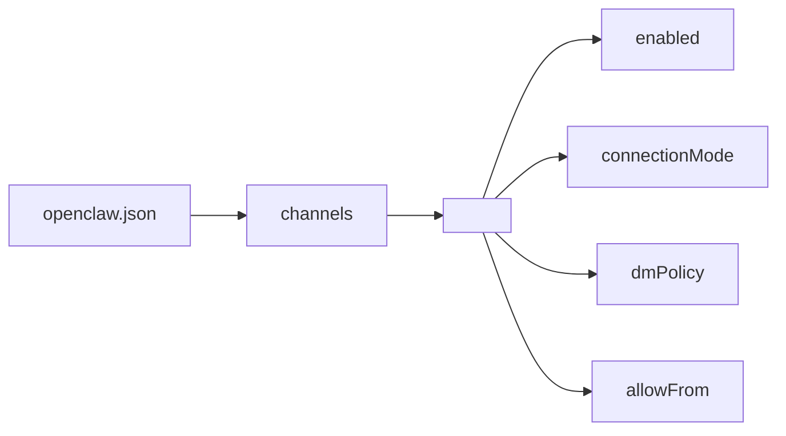
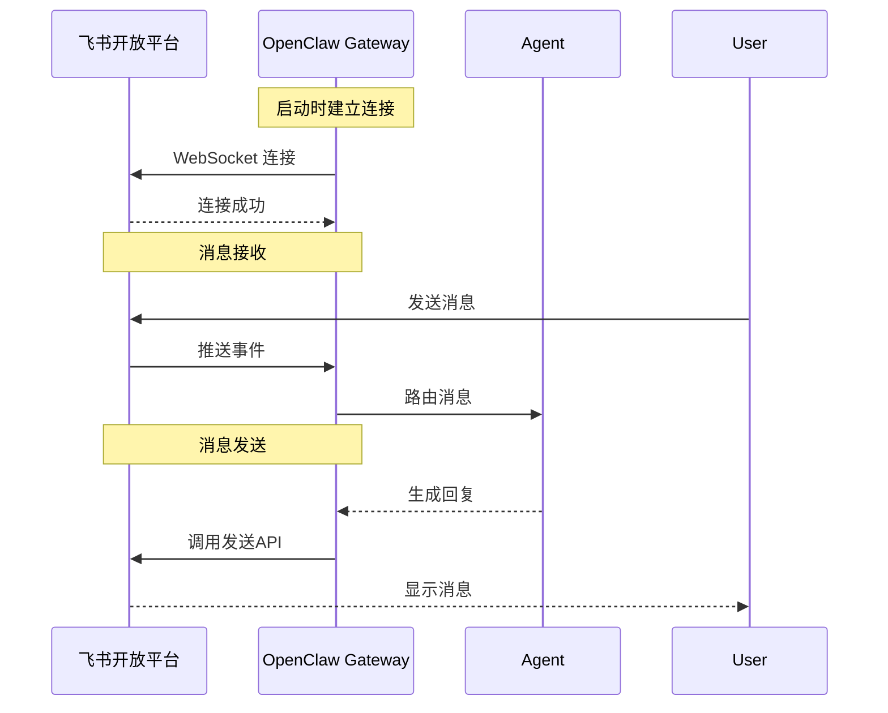
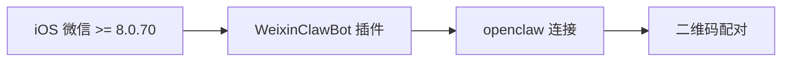
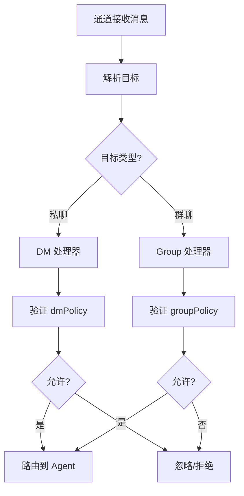
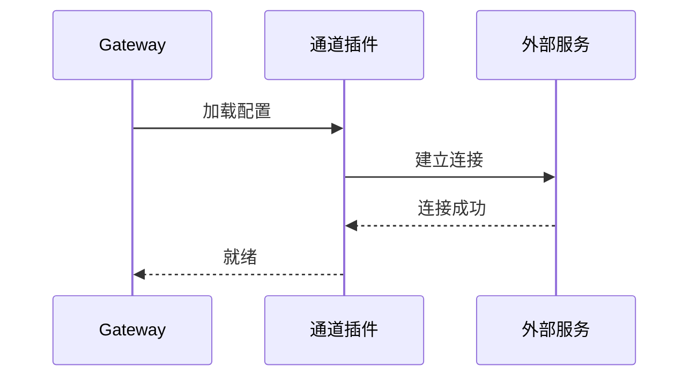
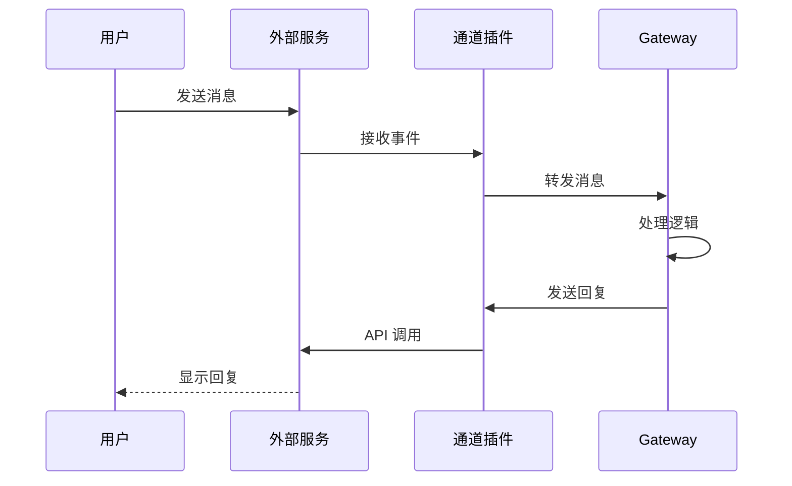

# Channels 通道接入详解

> **前置知识**：本章节面向具备 TypeScript/Node.js 基础、了解 WebSocket 和 HTTP 通信机制的开发者。
> **目标读者**：希望理解通道接入原理、进行通道插件开发的开发者。
> **维护状态**：本文档基于 OpenClaw v2026.4+ 源码分析。

---

## 1. 通道插件架构

### 1.1 架构概览



### 1.2 核心文件

| 文件 | 职责 |
|------|------|
| `index.ts` | 插件导出/注册 |
| `catalog.ts` | 通道插件目录 |
| `registry.ts` | 运行时注册表 |
| `bundled.ts` | 捆绑通道加载 |
| `types.ts` | 类型定义 |

---

## 2. 通道配置结构

### 2.1 统一配置模型



### 2.2 配置示例

```json5
{
  channels: {
    feishu: {
      enabled: true,
      connectionMode: "websocket",  // 或 "webhook"
      dmPolicy: "pairing",
      allowFrom: ["ou_xxx"],
    },
    telegram: {
      enabled: true,
      botToken: "xxx",
      dmPolicy: "pairing",
    }
  }
}
```

### 2.3 DM 策略

| 策略 | 说明 | 使用场景 |
|------|------|----------|
| `pairing` | 配对码审批 | 默认/最安全 |
| `allowlist` | 白名单 | 固定用户群 |
| `open` | 开放 | ⚠️ 仅测试 |
| `disabled` | 禁用 | 关闭 DM |

---

## 3. 飞书接入详解

### 3.1 两种连接模式

```mermaid
graph LR
    subgraph WebSocket["WebSocket 长连接 (推荐)"]
        A["飞书服务器"] <-->|"双向"| B["OpenClaw Gateway"]
    end
    
    subgraph Webhook["Webhook 回调"]
        C["飞书服务器"] -->|"POST| D["OpenClaw Gateway"]
        D -->|"回调确认"| C
    end
```

### 3.2 WebSocket 模式原理



### 3.3 关键配置项

```json5
{
  channels: {
    feishu: {
      enabled: true,
      connectionMode: "websocket",
      accounts: {
        default: {
          appId: "cli_xxx",
          appSecret: "xxx"
        }
      },
      // 访问控制
      allowFrom: ["ou_xxx"],  // 用户 open_id 列表
      dmPolicy: "pairing",     // 或 "allowlist"
    }
  }
}
```

### 3.4 飞书权限清单

| 权限 | 用途 | 必要性 |
|------|------|--------|
| `im:message` | 消息基础 | ✅ 必需 |
| `im:message.p2p_msg:readonly` | 读取单聊 | ✅ 必需 |
| `im:message.reactions:write_only` | 表情回复 | ⚠️ **不开启会静默失败** |
| `im:message:send_as_bot` | 机器人发言 | ✅ 必需 |
| `im:chat:readonly` | 群组信息 | ✅ 必需 |
| `im:message.group_at_msg:readonly` | 群@消息 | 如果需要群聊 |

---

## 4. 微信接入详解

### 4.1 iOS 微信方案



### 4.2 限制

- 仅支持 iOS
- 仅支持私聊
- 不支持群聊
- 需要手机保持在线

### 4.3 配置步骤

```bash
# 1. 安装插件
npx -y @tencent-weixin/openclaw-weixin-cli@latest install

# 2. 扫码配对
# 3. 在设置中启用插件
```

---

## 5. 通道消息路由

### 5.1 消息流程



### 5.2 会话键生成

```
私聊会话键: agent:<agentId>:<mainKey>
群聊会话键: agent:<agentId>:<channel>:group:<groupId>
```

---

## 6. 通道生命周期

### 6.1 启动流程



### 6.2 消息处理流程



---

## 7. 创建自定义通道

### 7.1 最小插件结构

```
my-channel/
├── channel-entry.ts      # 插件入口
├── src/
│   ├── my-channel.ts    # 主要实现
│   └── types.ts        # 类型定义
└── package.json
```

### 7.2 插件入口示例

```typescript
// channel-entry.ts
import type { ChannelPlugin } from './src/types.ts';

export const myChannelPlugin: ChannelPlugin = {
  id: 'my-channel',
  name: 'My Channel',
  
  async onStart(runtime) {
    // 连接外部服务
  },
  
  async onMessage(event) {
    // 处理收到的消息
    return { type: 'text', content: '...' };
  },
  
  async onStop() {
    // 清理资源
  }
};
```

### 7.3 注册插件

```typescript
// 在 bundled.ts 或配置中注册
import { myChannelPlugin } from './my-channel/channel-entry.ts';

export function listBundledChannelPlugins() {
  return [
    ...existingPlugins,
    myChannelPlugin
  ];
}
```

---

## 8. 调试与排错

### 8.1 常见问题

| 问题 | 原因 | 解决方案 |
|------|------|----------|
| 消息无响应 | dmPolicy 限制 | 检查 allowFrom 配置 |
| 无法连接 | 凭据错误 | 验证 AppID/AppSecret |
| 群聊无响应 | 未 @机器人 | requireMention 配置 |
| 回复延迟 | 网络问题 | 检查服务器网络 |

### 8.2 调试命令

```bash
# 查看通道状态
openclaw channels status

# 测试通道连接
openclaw channels test <channel-id>

# 查看详细日志
openclaw gateway --verbose
```

### 8.3 日志位置

```
~/.openclaw/logs/
├── gateway.log      # Gateway 日志
├── channels/        # 通道日志
└── sessions/        # 会话日志
```

---

## 9. 延伸阅读

- [飞书接入实战](../feishu.md)
- [Gateway 架构](./architecture.md#2-gateway消息中枢)
- [OpenClaw 官方通道文档](https://docs.openclaw.ai/channels)
