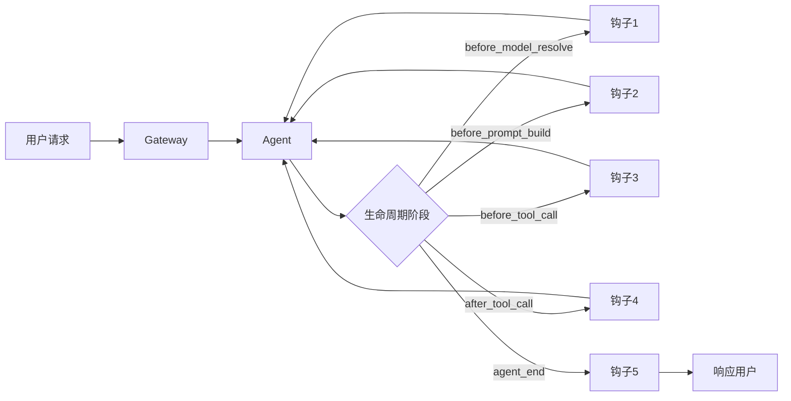
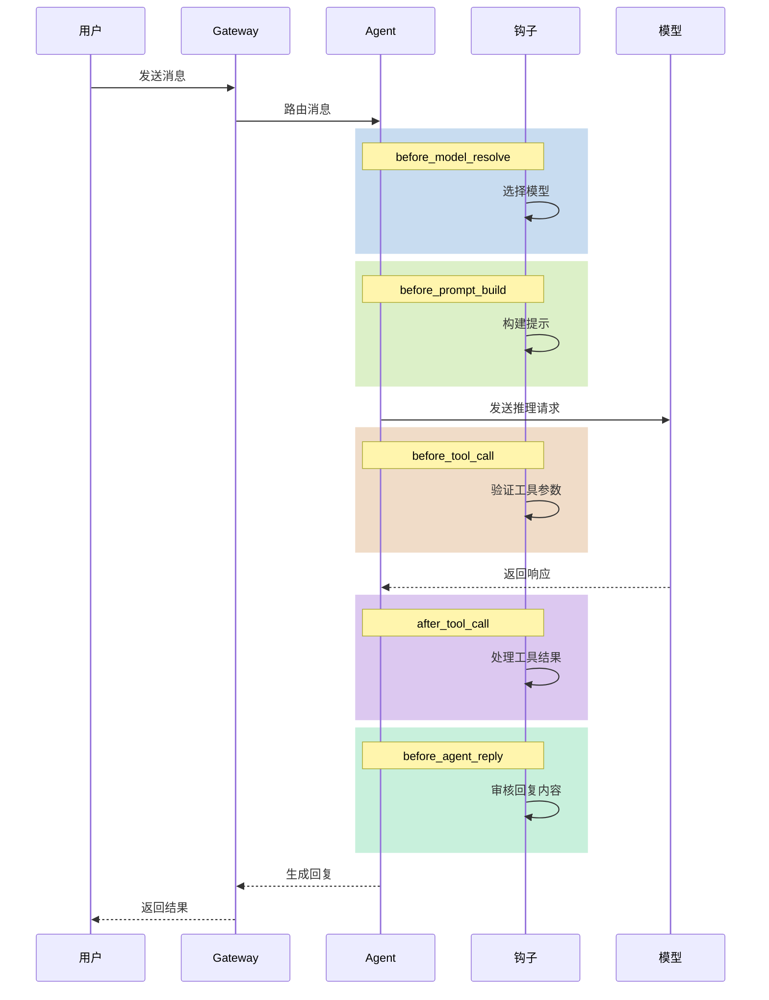
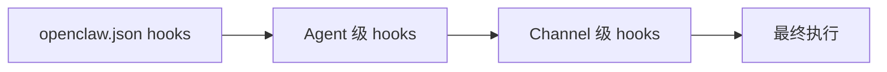
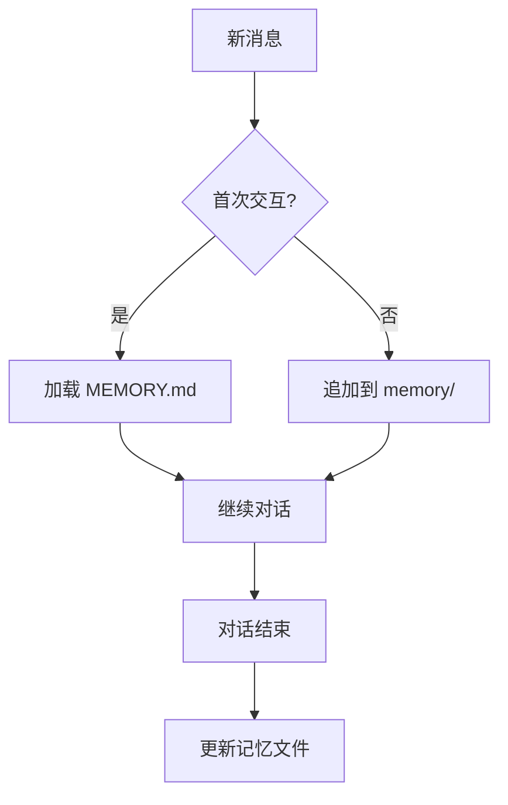
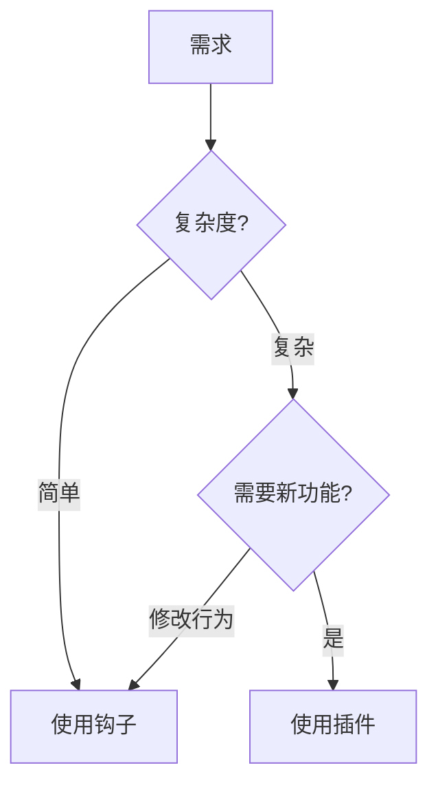

# Hooks 钩子系统详解

> **前置知识**：本章节面向具备 TypeScript/Node.js 基础、了解异步事件处理机制的开发者。
> **目标读者**：希望自定义智能体行为、实现中间件逻辑的开发者。
> **维护状态**：本文档基于 OpenClaw v2026.4+ 源码分析。

---

## 1. 钩子系统概述

### 1.1 钩子在架构中的位置



### 1.2 核心文件

| 文件 | 职责 |
|------|------|
| `hooks/hooks.ts` | 钩子核心定义 |
| `hooks/loader.ts` | 钩子加载器 |
| `hooks/policy.ts` | 钩子策略 |
| `hooks/types.ts` | 类型定义 |

---

## 2. 钩子类型

### 2.1 完整钩子列表

| 钩子 | 触发时机 | 用途 |
|------|----------|------|
| `before_model_resolve` | 模型解析前 | 选择模型、设置参数 |
| `before_prompt_build` | 提示构建前 | 修改上下文、添加信息 |
| `agent_start` | Agent 启动时 | 初始化、日志记录 |
| `before_tool_call` | 工具调用前 | 参数验证、安全检查 |
| `after_tool_call` | 工具调用后 | 结果处理、日志记录 |
| `before_agent_reply` | 回复发送前 | 内容审核、修改回复 |
| `agent_end` | Agent 结束时 | 最终处理、统计 |
| `before_compaction` | 压缩前 | 准备压缩内容 |
| `after_compaction` | 压缩后 | 验证压缩结果 |

---

## 3. 钩子执行流程

### 3.1 完整生命周期



---

## 4. 钩子配置

### 4.1 在 openclaw.json 中配置

```json5
{
  hooks: {
    // 全局钩子
    hooks: [
      "session-memory",      // 内置会话记忆钩子
      "command-logger"      // 命令日志钩子
    ],
    
    // 钩子特定配置
    configs: {
      "session-memory": {
        // 钩子配置
      }
    }
  }
}
```

### 4.2 钩子执行顺序



---

## 5. 内置钩子

### 5.1 session-memory 钩子

**功能**：自动保存和加载会话上下文到记忆系统



### 5.2 command-logger 钩子

**功能**：记录所有命令执行历史

```
[2024-01-01 10:00:00] Tool: exec | Command: ls -la | Status: success
[2024-01-01 10:00:05] Tool: exec | Command: git status | Status: success
```

---

## 6. 自定义钩子开发

### 6.1 钩子项目结构

```
my-hook/
├── package.json
├── hook-entry.ts    # 钩子入口
└── src/
    └── index.ts    # 主要逻辑
```

### 6.2 钩子入口示例

```typescript
// hook-entry.ts
import type { Hook } from 'openclaw';

export const myHook: Hook = {
  id: 'my-hook',
  name: 'My Hook',
  
  // 钩子配置
  config: {
    // 配置项
  },
  
  // 钩子实现
  async beforeModelResolve(params) {
    // 在模型解析前执行
    return params;
  },
  
  async beforePromptBuild(params) {
    // 在提示构建前执行
    return params;
  },
  
  async beforeToolCall(params) {
    // 在工具调用前执行
    return params;
  },
  
  async afterToolCall(params) {
    // 在工具调用后执行
    return params;
  }
};
```

### 6.3 钩子配置

```json5
{
  hooks: {
    hooks: ["my-hook"],
    configs: {
      "my-hook": {
        // 自定义配置
      }
    }
  }
}
```

---

## 7. 钩子与插件的区别

### 7.1 对比

| 特性 | 钩子 (Hook) | 插件 (Plugin) |
|------|-------------|---------------|
| 粒度 | 细粒度拦截 | 完整功能模块 |
| 范围 | 生命周期事件 | 通道/工具/记忆 |
| 用途 | 修改行为 | 添加功能 |
| 复杂度 | 简单 | 复杂 |

### 7.2 选择建议



---

## 8. 调试与排错

### 8.1 查看钩子执行日志

```bash
# 启用详细日志
openclaw gateway --verbose | grep hook
```

### 8.2 常见问题

| 问题 | 原因 | 解决方案 |
|------|------|----------|
| 钩子不执行 | 配置错误 | 检查 openclaw.json |
| 钩子顺序错误 | 执行顺序不对 | 调整 hooks 数组顺序 |
| 钩子超时 | 执行时间过长 | 优化钩子逻辑 |

---

## 9. 延伸阅读

- [Gateway 架构](./architecture.md#2-gateway消息中枢)
- [插件系统](./plugins.md)
- [Agent 引擎](./agents.md)
