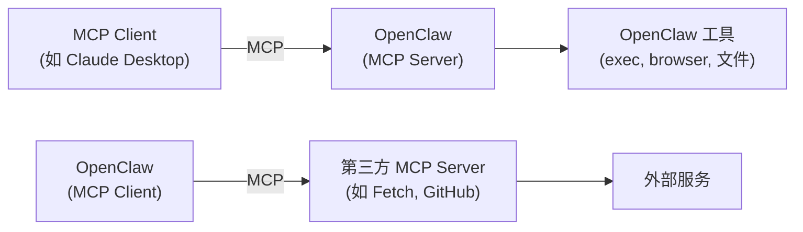
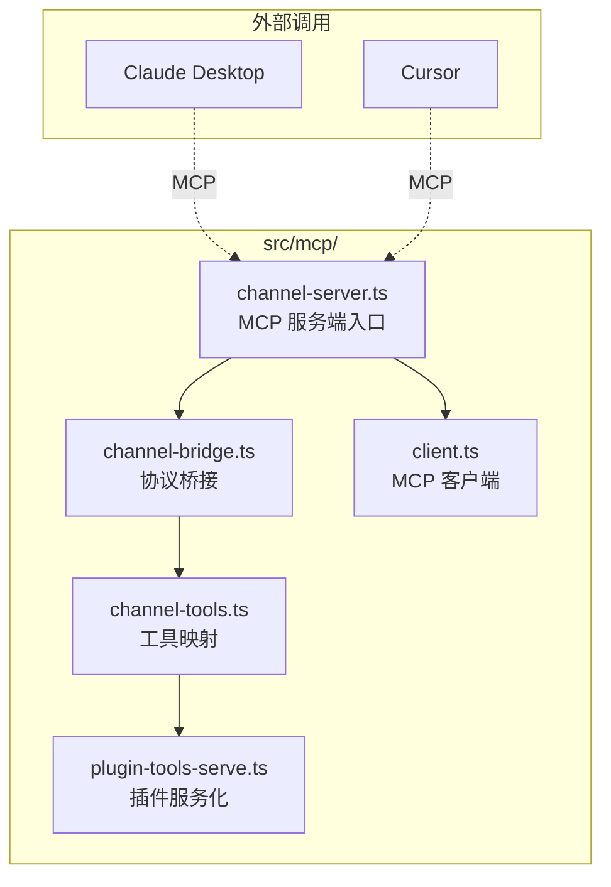
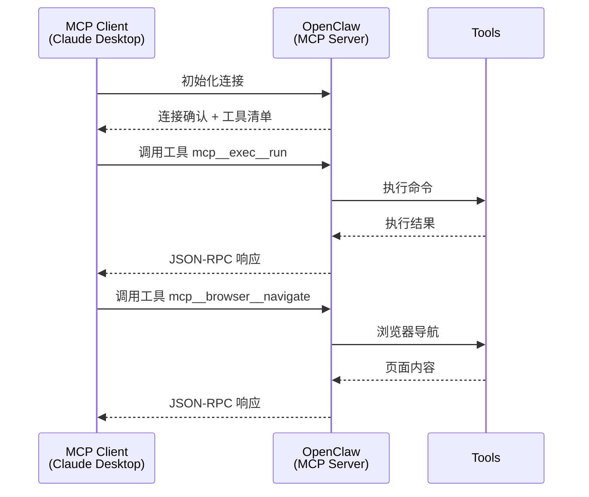
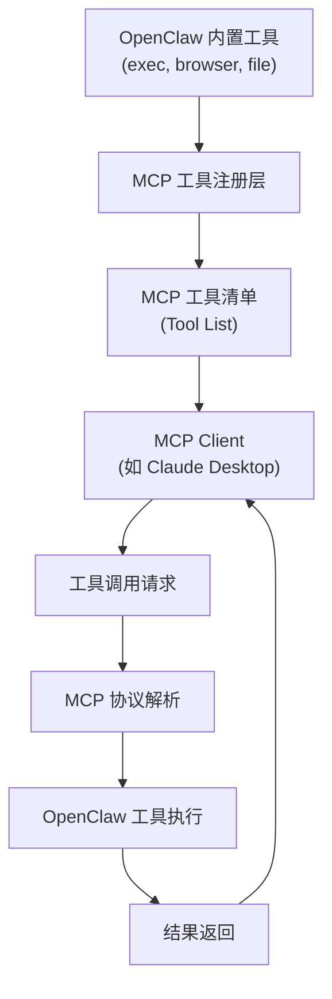
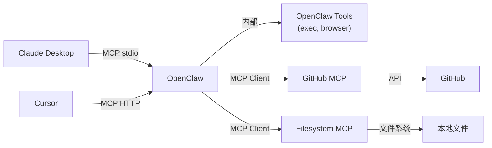

# MCP Model Context Protocol 详解

> **前置知识**：本章节面向具备 TypeScript/Node.js 基础、了解 AI 工具调用机制的开发者。  
> **目标读者**：希望将 OpenClaw 作为 MCP Server 使用，或开发自定义 MCP 工具的开发者。  
> **维护状态**：本文档基于 OpenClaw v2026.4+ 编写，MCP 功能仍在活跃开发中。

---

## 1. MCP 概述

### 1.1 什么是 MCP

MCP (Model Context Protocol) 是一种标准化协议，允许 AI 模型与外部工具和服务进行交互。OpenClaw 既可以作为 MCP Client 调用外部 MCP Server，也可以作为 MCP Server 被外部客户端（如 Claude Desktop）调用。



### 1.2 MCP 在 OpenClaw 中的双重角色

| 角色 | 说明 | 使用场景 |
|------|------|----------|
| **MCP Server** | OpenClaw 暴露工具给外部 MCP 客户端 | Claude Desktop 连接 OpenClaw |
| **MCP Client** | OpenClaw 调用外部 MCP Server 的工具 | 扩展 OpenClaw 的工具能力 |

---

## 2. MCP 源码结构

### 2.1 核心文件

| 文件 | 职责 |
|------|------|
| `mcp/channel-server.ts` | MCP 服务端实现 |
| `mcp/channel-bridge.ts` | 通道桥接协议转换 |
| `mcp/channel-tools.ts` | MCP 工具定义与注册 |
| `mcp/plugin-tools-serve.ts` | 插件工具服务化 |
| `mcp/client.ts` | MCP 客户端实现 |

### 2.2 目录架构



---

## 3. MCP Server：OpenClaw 作为工具服务器

### 3.1 工作原理

当 OpenClaw 作为 MCP Server 运行时，外部客户端（如 Claude Desktop）可以连接并调用 OpenClaw 内置的工具（exec、browser、文件操作等）。



### 3.2 启用 MCP Server

```json5
{
  // ⚠️ 安全提示：MCP Server 暴露工具给外部客户端，请谨慎配置访问控制
  mcp: {
    enabled: true,
    port: 18790,       // MCP 服务端口
    host: "127.0.0.1" // 仅本地访问
  }
}
```

### 3.3 安全配置

```json5
{
  mcp: {
    security: {
      // 允许连接的来源（建议限制为本地或指定 IP）
      allowedOrigins: ["https://claude.ai", "https://cursor.com"],
      
      // 工具权限控制
      toolPermissions: {
        "exec:*": ["read"],      // 只允许执行读命令
        "browser:*": ["read"],   // 只允许浏览
        "file:*": ["read"]       // 只允许读文件
      }
    }
  }
}
```

---

## 4. MCP Client：调用外部 MCP Server

### 4.1 配置外部 MCP Server

OpenClaw 可以作为 MCP Client，调用第三方 MCP Server 的工具：

```json5
{
  mcp: {
    servers: {
      // 文件系统 MCP Server
      "filesystem": {
        enabled: true,
        command: "npx",
        args: ["-y", "@modelcontextprotocol/server-filesystem", "/path/to/allowed/dir"],
        env: {}
      },
      
      // GitHub MCP Server
      "github": {
        enabled: true,
        command: "npx",
        args: ["-y", "@modelcontextprotocol/server-github"],
        env: {
          // ⚠️ 安全警告：API Key 必须通过环境变量注入！
          GITHUB_PERSONAL_ACCESS_TOKEN: "${GITHUB_TOKEN}"
        }
      },
      
      // Brave Search MCP Server
      "brave-search": {
        enabled: true,
        command: "npx",
        args: ["-y", "@modelcontextprotocol/server-brave-search"],
        env: {
          BRAVE_API_KEY: "${BRAVE_SEARCH_API_KEY}"
        }
      }
    }
  }
}
```

### 4.2 可用 MCP Server 列表

| MCP Server | 包名 | 用途 |
|------------|------|------|
| Filesystem | `@modelcontextprotocol/server-filesystem` | 本地文件读写 |
| GitHub | `@modelcontextprotocol/server-github` | GitHub API 操作 |
| Brave Search | `@modelcontextprotocol/server-brave-search` | 网页搜索 |
| Slack | `@modelcontextprotocol/server-slack` | Slack 消息收发 |
| Google Maps | `@modelcontextprotocol/server-google-maps` | 地图/位置服务 |

### 4.3 MCP Server 开发示例

以下是一个自定义 MCP Server 的最小实现：

```typescript
// my-mcp-server.mjs
// 依赖：npm install @modelcontextprotocol/sdk

import { McpServer } from "@modelcontextprotocol/sdk/server/index.js";
import { StdioServerTransport } from "@modelcontextprotocol/sdk/server/stdio.js";
import { z } from "zod";

const server = new McpServer({
  name: "my-weather-server",
  version: "1.0.0"
});

// 注册工具：get_weather
server.tool(
  "get_weather",
  "获取指定城市的天气信息",
  {
    city: z.string().describe("城市名称（中文或英文）")
  },
  async ({ city }) => {
    // 调用天气 API（这里用模拟数据）
    const weatherData = await fetch(`https://api.example.com/weather?city=${city}`);
    const data = await weatherData.json();
    
    return {
      content: [{
        type: "text",
        text: JSON.stringify(data)
      }]
    };
  }
);

// 启动服务器
const transport = new StdioServerTransport();
server.run(transport);
```

**在 OpenClaw 中使用自定义 Server**：

```json5
{
  mcp: {
    servers: {
      "my-weather": {
        enabled: true,
        command: "node",
        args: ["/path/to/my-mcp-server.mjs"],
        env: {
          // 环境变量
          API_BASE: "https://api.example.com"
        }
      }
    }
  }
}
```

---

## 5. MCP 工具注册机制

### 5.1 工具映射流程



### 5.2 工具命名约定

OpenClaw 暴露给 MCP 的工具使用以下命名格式：

| 工具类型 | MCP 工具名 | 说明 |
|----------|-----------|------|
| 执行命令 | `mcp__exec__run` | 执行系统命令 |
| 浏览器导航 | `mcp__browser__navigate` | 导航到 URL |
| 浏览器截图 | `mcp__browser__screenshot` | 截图当前页面 |
| 文件读取 | `mcp__file__read` | 读取文件内容 |
| 文件写入 | `mcp__file__write` | 写入文件内容 |

---

## 6. 调试 MCP

### 6.1 查看 MCP 状态

```bash
# 查看 MCP 连接状态
openclaw mcp status

# 列出可用的 MCP 工具
openclaw mcp tools list

# 测试 MCP Server 连接
openclaw mcp debug <server-name>
```

### 6.2 日志调试

```bash
# 启动带详细日志的 Gateway
openclaw gateway --verbose

# 查看 MCP 相关日志
openclaw logs --filter mcp
```

### 6.3 常见问题

| 问题 | 原因 | 解决方案 |
|------|------|----------|
| MCP Client 连接失败 | 端口被占用或防火墙阻止 | 检查端口配置，确认 `host` 设为 `0.0.0.0` 或指定 IP |
| 工具调用超时 | MCP Server 响应慢 | 增加超时配置，或检查 Server 状态 |
| 权限错误 | 工具权限未正确配置 | 检查 `toolPermissions` 配置 |
| Server 启动失败 | 依赖未安装 | 执行 `npx -y <server-package>` 确认可以运行 |

---

## 7. MCP 与 OpenClaw 工具系统对比

### 7.1 功能对比

| 特性 | MCP | OpenClaw 工具 |
|------|-----|---------------|
| 协议 | 标准化 JSON-RPC 2.0 | 内部函数调用 |
| 用途 | 外部集成互操作 | 内部任务执行 |
| 客户端 | Claude Desktop, Cursor 等 | OpenClaw |
| 服务端 | OpenClaw | 各 MCP Server |
| 传输 | stdio / HTTP + SSE | 内部函数调用 |
| 工具发现 | 动态发现 | 静态注册 |

### 7.2 集成架构



---

## 8. 延伸阅读

- [MCP 官方文档](https://modelcontextprotocol.io/)
- [OpenClaw MCP 支持](https://docs.openclaw.ai/mcp)
- [MCP SDK (Node.js)](https://github.com/modelcontextprotocol/sdk)
- [awesome-mcp-servers](https://github.com/secret-base/awesome-mcp-servers) - MCP Server 列表
- [工具系统](./agents.md#4-工具执行)
- [架构总览](./architecture.md)
