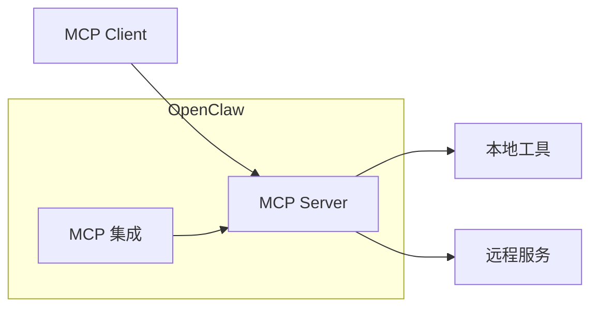
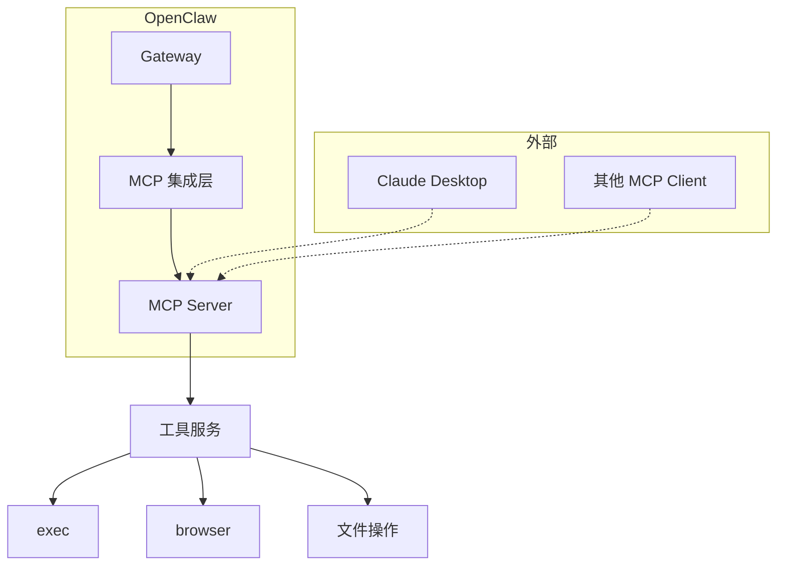
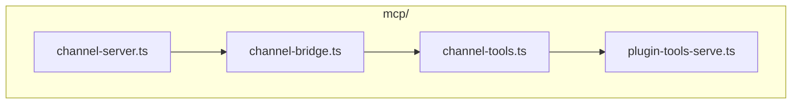
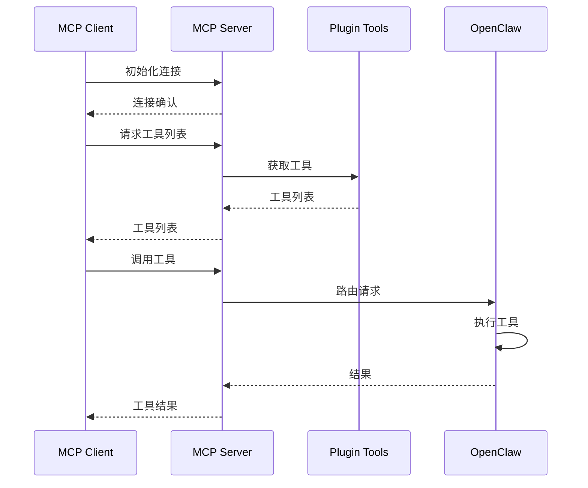
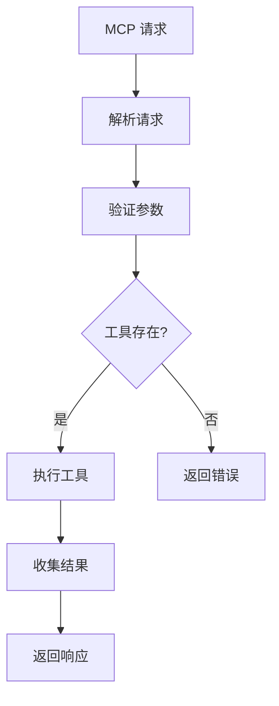
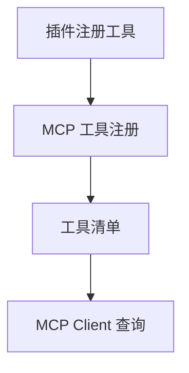
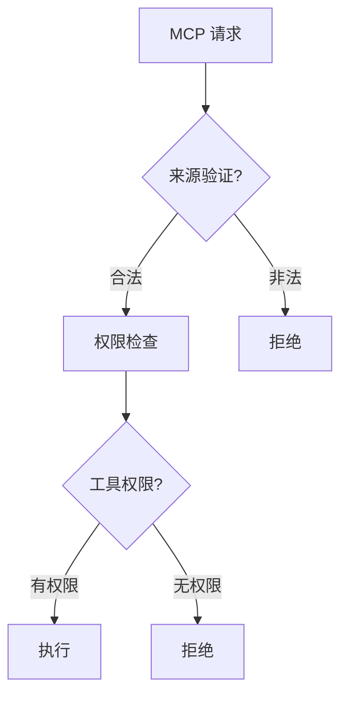
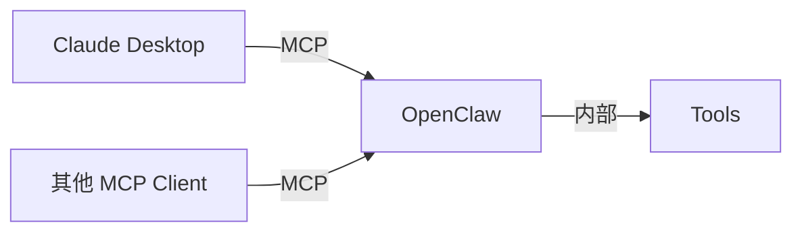

# MCP Model Context Protocol 详解

> 本章详解 OpenClaw 对 MCP (Model Context Protocol) 协议的支持与实现。

---

## 1. MCP 概述

### 1.1 什么是 MCP

MCP (Model Context Protocol) 是一种标准化协议，允许 AI 模型与外部工具和服务进行交互。



### 1.2 MCP 在 OpenClaw 中的位置



---

## 2. MCP 源码结构

### 2.1 核心文件

| 文件 | 职责 |
|------|------|
| `mcp/channel-server.ts` | MCP 服务端 |
| `mcp/channel-bridge.ts` | 通道桥接 |
| `mcp/channel-tools.ts` | MCP 工具 |
| `mcp/plugin-tools-serve.ts` | 插件工具服务 |

### 2.2 架构图



---

## 3. MCP 工作流程

### 3.1 消息流程



### 3.2 工具调用流程



---

## 4. MCP 配置

### 4.1 启用 MCP

```json5
{
  mcp: {
    enabled: true,
    port: 18790,  // MCP 服务端口
    host: "127.0.0.1"
  }
}
```

### 4.2 MCP 服务器配置

```json5
{
  mcp: {
    servers: {
      "my-server": {
        command: "npx",
        args: ["-y", "@my/mcp-server"],
        env: {
          "API_KEY": "xxx"
        }
      }
    }
  }
}
```

---

## 5. MCP 工具

### 5.1 内置 MCP 工具

| 工具 | 说明 |
|------|------|
| `mcp__file__read` | 读取文件 |
| `mcp__file__write` | 写入文件 |
| `mcp__exec__run` | 执行命令 |
| `mcp__browser__navigate` | 浏览器导航 |

### 5.2 工具注册



---

## 6. MCP 安全

### 6.1 安全机制



### 6.2 安全配置

```json5
{
  mcp: {
    security: {
      // 允许的来源
      allowedOrigins: ["https://claude.ai"],
      
      // 工具权限
      toolPermissions: {
        "file:*": ["read"],
        "exec:*": []
      }
    }
  }
}
```

---

## 7. MCP 与工具系统的关系

### 7.1 对比

| 特性 | MCP | OpenClaw Tools |
|------|-----|----------------|
| 协议 | 标准化 MCP | 内部协议 |
| 用途 | 外部集成 | 内部执行 |
| 客户端 | Claude Desktop | OpenClaw |
| 服务端 | OpenClaw | 各提供商 |

### 7.2 集成架构



---

## 8. 调试 MCP

### 8.1 查看 MCP 状态

```bash
# 查看 MCP 连接状态
openclaw mcp status

# 列出可用 MCP 工具
openclaw mcp tools list
```

### 8.2 常见问题

| 问题 | 原因 | 解决方案 |
|------|------|----------|
| 连接失败 | 端口被占用 | 更改 MCP 端口 |
| 工具不可用 | 未注册 | 检查插件状态 |
| 权限错误 | 权限配置 | 更新安全配置 |

---

## 9. 延伸阅读

- [MCP 官方文档](https://modelcontextprotocol.io/)
- [OpenClaw MCP 支持](https://docs.openclaw.ai/mcp)
- [工具系统](./agents.md#4-工具执行)
