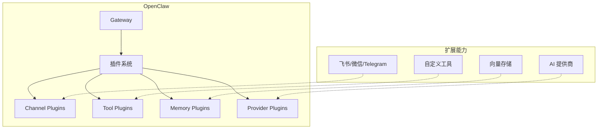
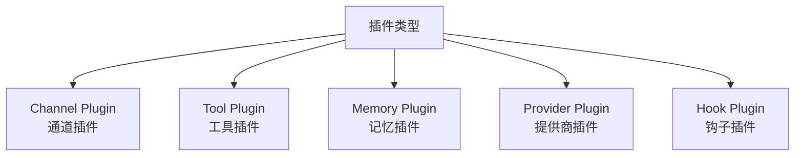
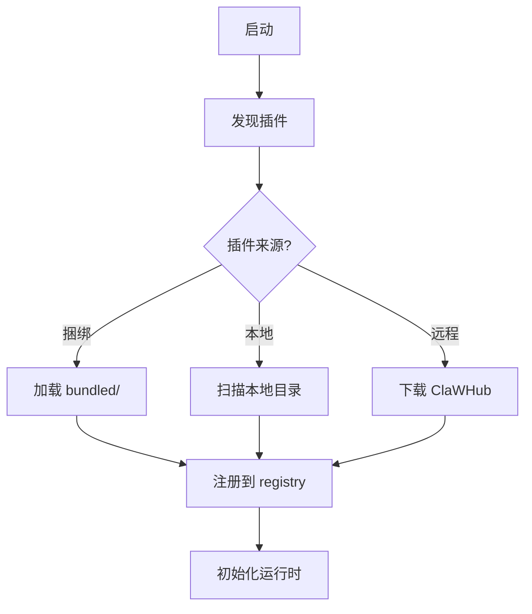
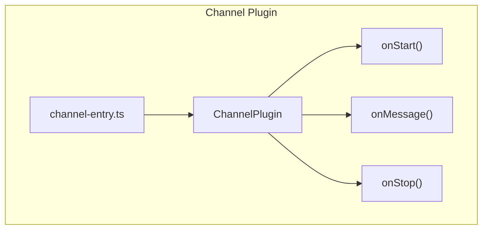
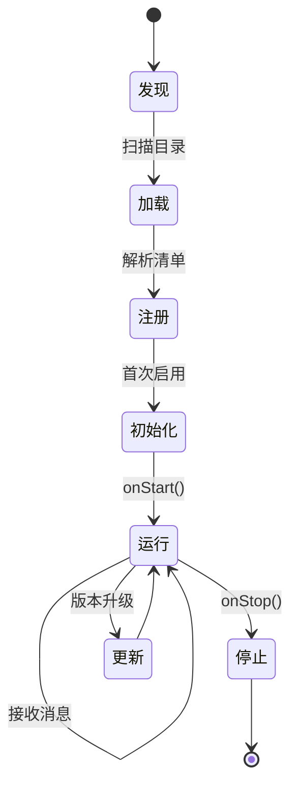
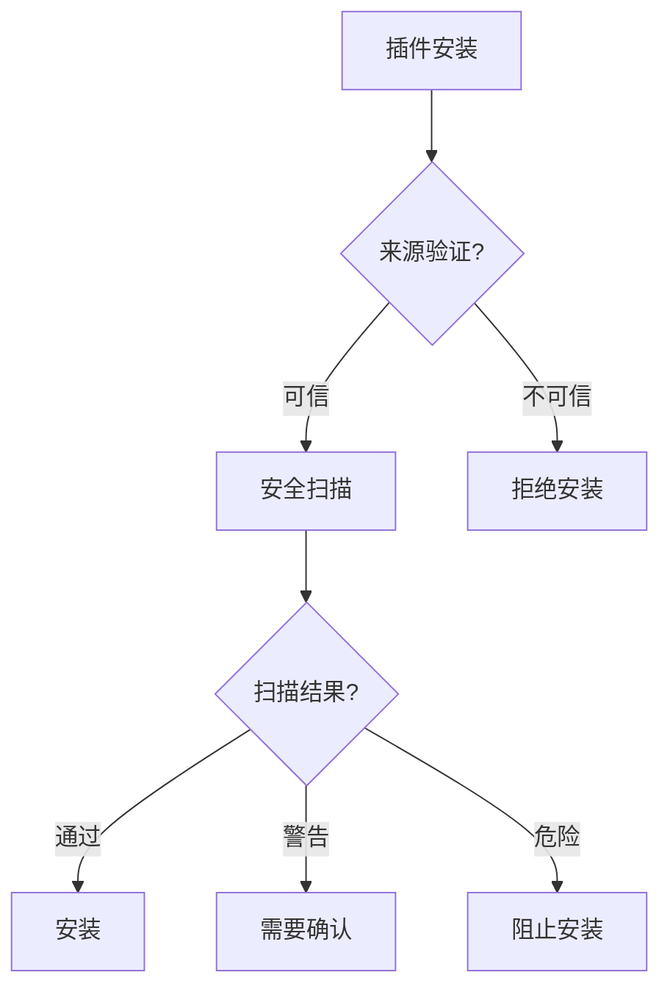
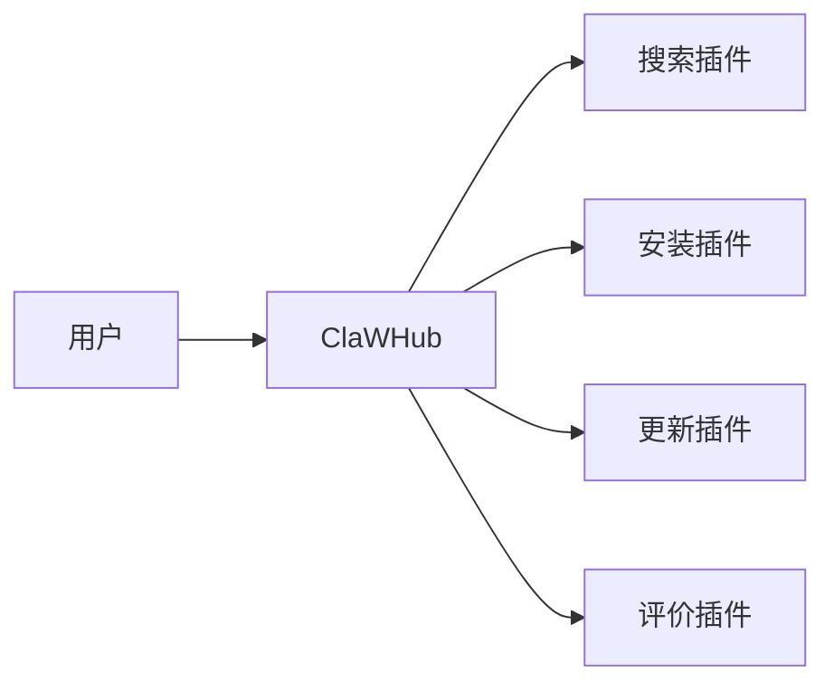

# Plugins 插件系统详解

> 本章详解 OpenClaw 的插件系统架构、插件类型、注册机制和生命周期管理。

---

## 1. 插件系统架构

### 1.1 插件在架构中的位置



### 1.2 核心文件

| 文件 | 职责 |
|------|------|
| `plugins/registry.ts` | 插件注册表 |
| `plugins/runtime.ts` | 插件运行时 |
| `plugins/loader.ts` | 插件加载器 |
| `plugins/bundle-*.ts` | 捆绑插件 |
| `plugins/discovery.ts` | 插件发现 |

---

## 2. 插件类型

### 2.1 插件类型体系



### 2.2 各类型说明

| 类型 | 说明 | 示例 |
|------|------|------|
| Channel | 通讯平台接入 | 飞书、微信、Telegram |
| Tool | 功能扩展 | exec、browser |
| Memory | 记忆存储 | sqlite-vec、embedding |
| Provider | AI 模型 | OpenAI、Anthropic |
| Hook | 生命周期拦截 | 自定义钩子 |

---

## 3. 插件注册机制

### 3.1 插件发现流程



### 3.2 插件配置

```json5
{
  plugins: {
    // 启用/禁用插件
    enabled: ["channel:feishu", "tool:exec"],
    
    // 插件配置
    configs: {
      "channel:feishu": {
        // 通道特定配置
      }
    }
  }
}
```

---

## 4. Channel 插件详解

### 4.1 通道插件结构



### 4.2 内置通道

| 通道 | 源码位置 |
|------|----------|
| 飞书 | `extensions/openclaw-channel-feishu/` |
| 微信 | `extensions/openclaw-channel-wechat/` |
| Telegram | `extensions/openclaw-channel-telegram/` |
| WhatsApp | `extensions/openclaw-channel-whatsapp/` |
| Discord | `extensions/openclaw-channel-discord/` |

### 4.3 通道配置示例

```json5
{
  channels: {
    feishu: {
      enabled: true,
      connectionMode: "websocket",
      accounts: {
        default: {
          appId: "cli_xxx",
          appSecret: "xxx"
        }
      }
    }
  }
}
```

---

## 5. 插件生命周期

### 5.1 生命周期状态机



### 5.2 生命周期钩子

| 钩子 | 时机 | 用途 |
|------|------|------|
| `onStart` | 启动时 | 初始化连接 |
| `onMessage` | 收到消息 | 处理消息 |
| `onStop` | 关闭时 | 清理资源 |
| `onConfigChange` | 配置变更 | 重新初始化 |

---

## 6. 插件安全

### 6.1 安全机制



### 6.2 安全扫描项

- 敏感权限检查
- 恶意代码检测
- 依赖安全审计
- 签名验证

---

## 7. 插件市场 (ClaWHub)

### 7.1 ClaWHub 功能



### 7.2 使用 ClaWHub

```bash
# 搜索插件
openclaw plugins search <keyword>

# 安装插件
openclaw plugins install <plugin-name>

# 更新插件
openclaw plugins update

# 卸载插件
openclaw plugins uninstall <plugin-name>
```

---

## 8. 开发自定义插件

### 8.1 插件项目结构

```
my-plugin/
├── package.json
├── manifest.json5       # 插件清单
├── channel-entry.ts    # 通道入口 (Channel 插件)
└── src/
    └── index.ts        # 主要逻辑
```

### 8.2 manifest.json5 示例

```json5
{
  id: "my-plugin",
  name: "My Plugin",
  version: "1.0.0",
  description: "插件描述",
  
  // 插件类型
  capabilities: ["channel", "tool"],
  
  // 入口文件
  entry: "./channel-entry.ts",
  
  // 权限需求
  permissions: ["exec", "file:read"]
}
```

### 8.3 插件入口示例

```typescript
import type { ChannelPlugin } from 'openclaw';

export const myChannelPlugin: ChannelPlugin = {
  id: 'my-channel',
  name: 'My Channel',
  
  async onStart(runtime) {
    // 初始化连接
    await connectToService();
  },
  
  async onMessage(event) {
    // 处理消息
    return { type: 'text', content: 'response' };
  },
  
  async onStop() {
    // 清理资源
    await disconnect();
  }
};
```

---

## 9. 调试与排错

### 9.1 常见问题

| 问题 | 原因 | 解决方案 |
|------|------|----------|
| 插件无法加载 | 依赖缺失 | 运行 `npm install` |
| 通道无法连接 | 凭据错误 | 检查配置文件 |
| 插件冲突 | 版本不兼容 | 禁用冲突插件 |

### 9.2 调试命令

```bash
# 列出已安装插件
openclaw plugins list

# 查看插件状态
openclaw plugins status <plugin-id>

# 启用/禁用插件
openclaw plugins enable <plugin-id>
openclaw plugins disable <plugin-id>

# 查看插件日志
openclaw gateway --verbose | grep <plugin-id>
```

---

## 10. 延伸阅读

- [Gateway 架构](./architecture.md#2-gateway消息中枢)
- [钩子机制](./hooks.md)
- [通道接入](./channels.md)
