# Sessions 会话管理详解

> **前置知识**：本章节面向具备 TypeScript/Node.js 基础、了解 WebSocket 实时通信的开发者。
> **目标读者**：希望深入理解 OpenClaw 会话管理内部实现、进行问题诊断或二次开发的开发者。
> **维护状态**：本文档基于 OpenClaw v2026.4+ 源码分析。

> 📖 **入门参考**：若您希望了解**如何使用**会话管理（而非其内部实现），请参阅 [使用手册](../index.md#32-会话session使用视角)。

---

## 1. 会话核心概念

### 1.1 会话的作用

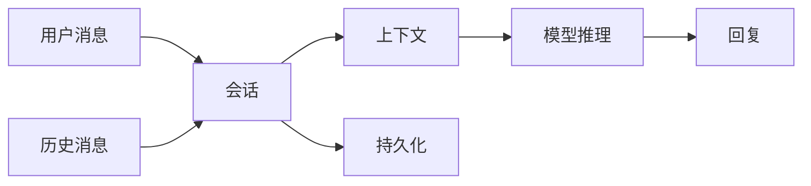

### 1.2 关键文件

| 文件 | 职责 |
|------|------|
| `session-id.ts` | 会话 ID 生成与解析 |
| `session-key-utils.ts` | 会话键工具 |
| `session-lifecycle-events.ts` | 生命周期事件 |
| `session-utils.ts` | 会话操作工具 |
| `transcript-events.ts` |  transcript 事件 |

---

## 2. 会话键 (Session Key)

### 2.1 会话键格式

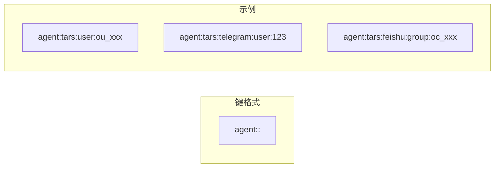

### 2.2 不同类型的会话键

| 类型 | 格式 | 说明 |
|------|------|------|
| 直接消息 | `agent:<id>:main` | 主会话 |
| 用户私聊 | `agent:<id>:user:<open_id>` | 按用户隔离 |
| 群组消息 | `agent:<id>:<channel>:group:<id>` | 群组会话 |
| 定时任务 | `cron:<job_id>` | Cron 任务会话 |

### 2.3 会话键解析

```typescript
// 解析会话键
const sessionKey = "agent:tars:user:ou_123";
// → { agentId: "tars", type: "user", id: "ou_123" }
```

---

## 3. 会话范围 (dmScope)

### 3.1 四种隔离级别

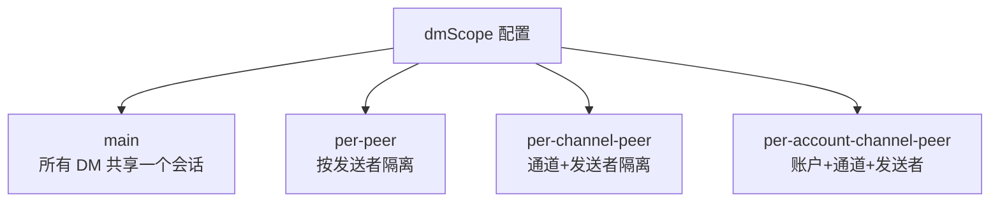

### 3.2 各范围对比

| 范围 | 私聊隔离 | 跨通道共享 | 推荐场景 |
|------|----------|------------|----------|
| `main` | ❌ | ✅ | 单用户 |
| `per-peer` | ✅ | ✅ | 多用户同通道 |
| `per-channel-peer` | ✅ | ❌ | **多用户多通道** |
| `per-account-channel-peer` | ✅ | ❌ | 多账户 |

### 3.3 配置示例

```json5
{
  session: {
    dmScope: "per-channel-peer"  // 推荐多用户使用
  }
}
```

---

## 4. 会话生命周期

### 4.1 生命周期状态机

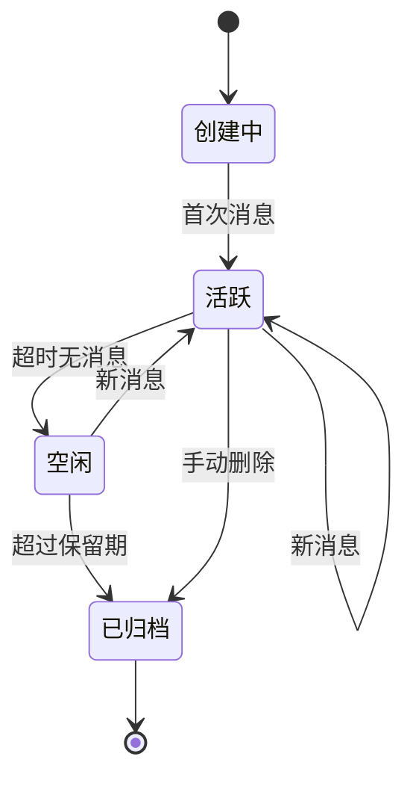

### 4.2 生命周期事件

```typescript
// 事件类型
type SessionLifecycleEvent = 
  | { type: 'created'; sessionKey: string }
  | { type: 'activated'; sessionKey: string }
  | { type: 'idle'; sessionKey: string; idleMs: number }
  | { type: 'archived'; sessionKey: string }
  | { type: 'deleted'; sessionKey: string };
```

### 4.3 会话维护配置

```json5
{
  session: {
    maintenance: {
      mode: "enforce",        // 强制执行
      pruneAfter: "45d",      // 45天后归档
      maxEntries: 800,       // 最大条目数
      rotateBytes: "20mb"     // 日志轮转大小
    }
  }
}
```

---

## 5. 上下文管理

### 5.1 上下文组成

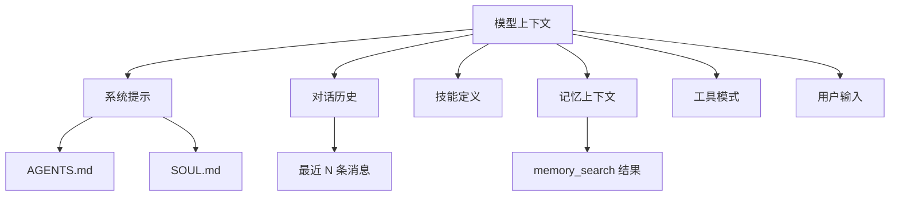

### 5.2 上下文大小限制

| 模型 | 上下文窗口 | 实际可用 |
|------|------------|----------|
| Claude Opus | 200K | ~180K |
| Claude Sonnet | 200K | ~180K |
| GPT-4 | 128K | ~115K |
| GPT-3.5 | 16K | ~14K |

### 5.3 上下文压缩触发

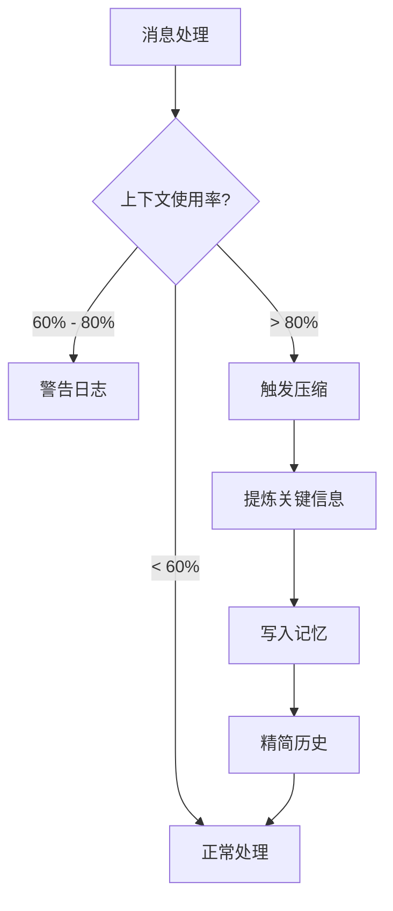

---

## 6. 会话持久化

### 6.1 存储结构

```mermaid
graph TD
    subgraph ~/.openclaw/
        A["agents/"]
        B["sessions/"]
        C["memory/"]
    end
    
    subgraph agents/<agentId>/
        D["sessions/"]
        E["memory/"]
    end
    
    B -.->|"跨会话共享"| D
    D --> E
```

### 6.2 会话文件格式

```
~/.openclaw/agents/<agentId>/sessions/
├── session-2024-01-01.jsonl   # 每日会话日志
├── session-2024-01-02.jsonl
└── ...
```

### 6.3 JSONL 格式

```json
{"type":"user","content":"你好","timestamp":"2024-01-01T10:00:00Z"}
{"type":"assistant","content":"你好！","timestamp":"2024-01-01T10:00:01Z"}
{"type":"tool","name":"exec","input":{"command":"ls"},"output":"..."}
```

---

## 7. 会话搜索

### 7.1 搜索类型

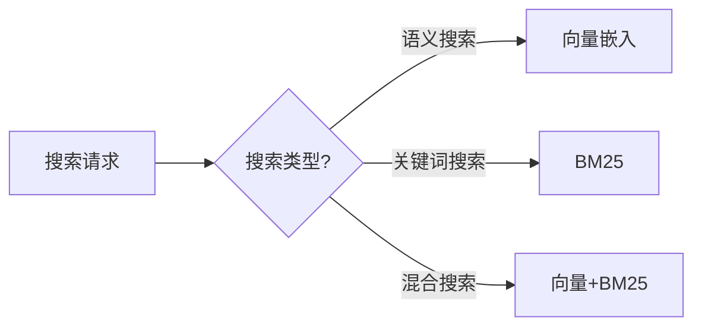

### 7.2 混合搜索配置

```json5
{
  agents: {
    defaults: {
      memorySearch: {
        query: {
          hybrid: {
            enabled: true,
            vectorWeight: 0.7,
            textWeight: 0.3,
            mmr: {
              enabled: true,
              lambda: 0.7
            }
          }
        }
      }
    }
  }
}
```

### 7.3 MMR (最大边际相关性)

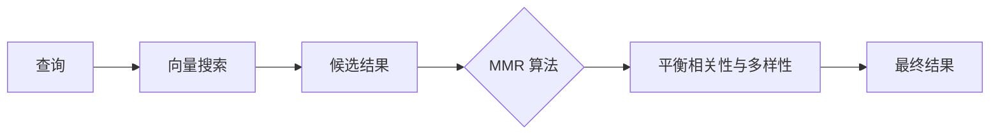

---

## 8. 会话重置与压缩

### 8.1 手动控制命令

| 命令 | 作用 |
|------|------|
| `/new` | 开始新会话 |
| `/reset` | 重置当前会话 |
| `/compact [指令]` | 压缩上下文 |

### 8.2 重置流程

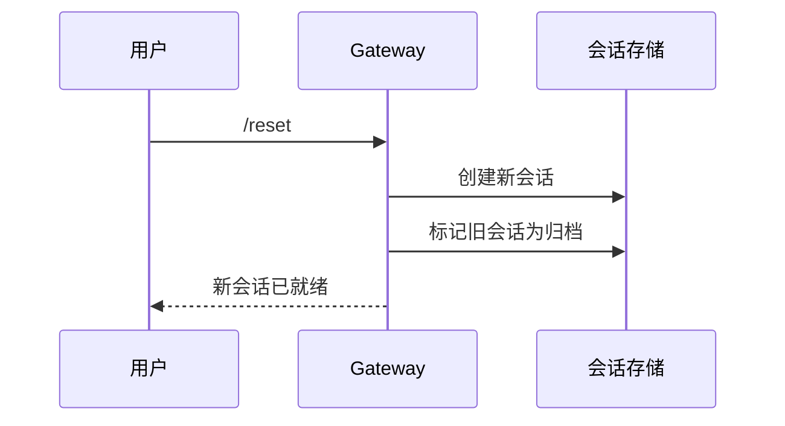

### 8.3 压缩流程

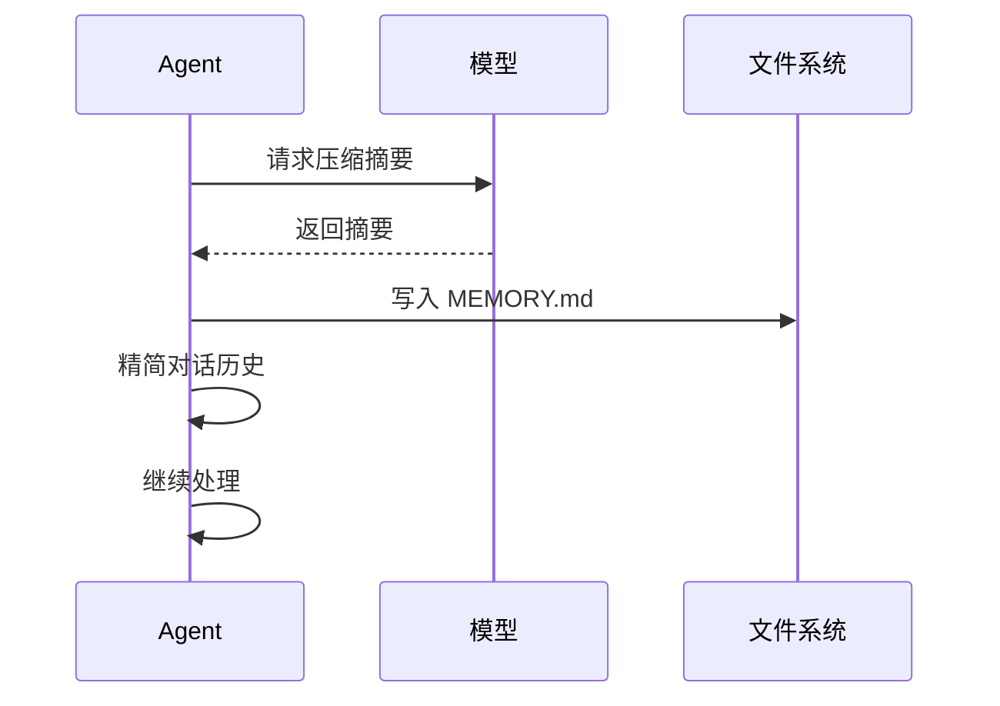

---

## 9. 多会话管理

### 9.1 并发会话

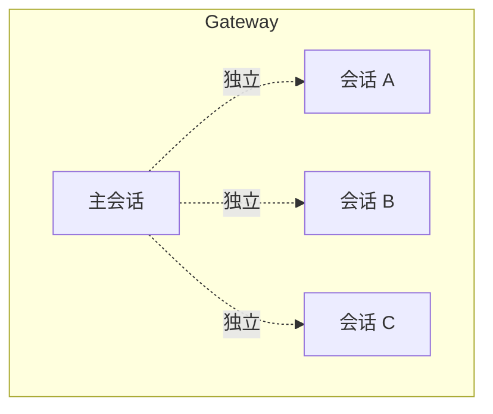

### 9.2 查看会话列表

```bash
# 列出所有会话
openclaw sessions list

# 查看特定会话
openclaw sessions view <session-key>

# 搜索会话
openclaw sessions search <query>
```

---

## 10. 安全与隔离

### 10.1 会话隔离原则

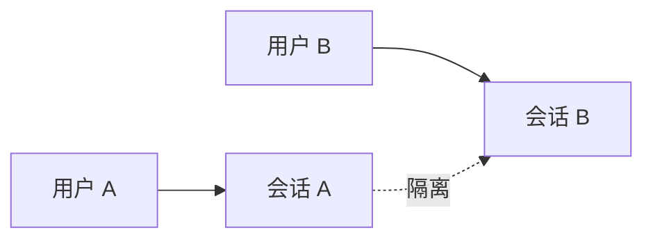

### 10.2 敏感数据处理

| 数据类型 | 处理方式 |
|----------|----------|
| API Keys | 存储在 `.env`，不写入会话 |
| 用户隐私 | 加密存储 |
| 对话历史 | 定期清理 |

---

## 11. 延伸阅读

- [Agent 引擎](./agents.md)
- [记忆系统](./architecture.md#7-memory记忆系统)
- [上下文压缩](../index.md#35-上下文压缩compaction)
