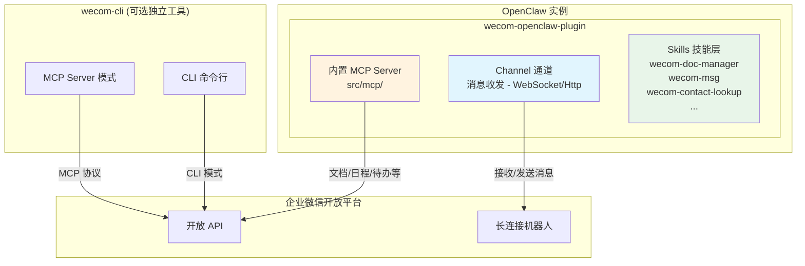

# 企业微信接入指南

> **前置知识**：本章节面向具备基础 TypeScript/Node.js 经验的开发者。
> **目标读者**：希望在 OpenClaw 中接入企业微信即时通讯的用户。
> **维护状态**：本文档由实战经验总结得来，当前维护版本基于 OpenClaw v2026.3+。

---

## 目录

1. [架构概述](#1-架构概述)
2. [环境要求](#2-环境要求)
3. [企业微信创建机器人](#3-企业微信创建机器人)
4. [OpenClaw 配置](#4-openclaw-配置)
5. [运行与验证](#5-运行与验证)
6. [企业微信 CLI（独立工具）](#6-企业微信-cli独立工具)
7. [常见问题-faq](#7-常见问题-faq)
8. [安全注意事项](#8-安全注意事项)
9. [附录-相关链接](#9-附录-相关链接)

---

## 1. 架构概述

在开始配置之前，理解企业微信相关工具的架构关系，有助于你选择正确的接入路径。

### 1.1 三个核心组件的关系

| 组件 | 类型 | 作用 | 与 OpenClaw 的关系 |
|------|------|------|-------------------|
| **wecom-openclaw-plugin** | OpenClaw 插件 | 企业微信 Channel（消息收发）+ 内置 MCP 工具 | 核心接入桥梁 |
| **wecom-cli** | 独立 CLI 工具 | 企业微信 API 的命令行封装，支持 MCP 协议 | 可选补充工具 |
| **企业微信开放文档** | 产品文档 | 说明 API 模式机器人的能力范围 | 参考资料 |

### 1.2 架构层次图



### 1.3 关键理解

| 理解要点 | 说明 |
|----------|------|
| **Channel ≠ MCP** | Channel 负责消息收发（IM 功能），MCP 负责文档/日程等业务操作（API 功能） |
| **wecom-openclaw-plugin 内置 MCP** | 插件已内置 MCP Server（`src/mcp/`），安装插件后 Skills 自动加载 |
| **wecom-cli 是独立工具** | 可单独安装使用，通过 `wecom-cli mcp run` 提供 MCP 协议接口 |
| **两者可协同工作** | 插件处理消息，CLI 提供独立的命令行能力 |

### 1.4 选择你的接入路径

| 场景 | 只需消息收发 | 需要消息 + 文档/日程/待办 | 完整能力（含 CLI） |
|------|-------------|--------------------------|-------------------|
| **推荐安装** | wecom-openclaw-plugin | wecom-openclaw-plugin | wecom-openclaw-plugin + wecom-cli |
| **MCP 来源** | 内置 | 内置 | 内置 + CLI MCP |
| **Skills** | 无 | 自动加载 | 自动加载 + CLI Skills |

> 💡 **实战经验**：对于大多数用户，安装 `wecom-openclaw-plugin` 即可满足需求。插件内置的 MCP Server 已包含文档读写、日程、待办等常用功能。

---

## 2. 环境要求

| 组件 | 版本要求 | 备注 |
|------|----------|------|
| Node.js | ≥ 18 | 推荐 Node 22+ 以获得最佳兼容性 |
| pnpm | 最新版 | 也支持 npm/yarn |
| OpenClaw | v2026.3+ | 包含企业微信长连接支持 |
| 企业微信 | 最新版 | 需支持长连接机器人 |

**检查本地环境：**

```bash
node --version   # 应为 v18+
pnpm --version   # 最新版
openclaw --version  # 确认已安装
```

---

## 3. 企业微信创建机器人

### 3.1 创建长连接机器人

1. 打开**企业微信** → 点击**工作台**
2. 找到**智能机器人** → 点击"创建机器人"
3. 选择 **API 模式** → 连接方式选择 **"长连接"**
4. 系统会生成 **Bot ID** 和 **Secret**，**妥善保存**
5. 配置可见成员范围，保存机器人

> ⚠️ **重要**：Bot ID 和 Secret 是敏感信息，请妥善保管，切勿泄露或提交到代码仓库。

### 3.2 获取机器人凭证

创建完成后，在机器人详情页可查看：
- **Bot ID**：格式 `xxxxxxxxxx`
- **Secret**：格式 `xxxxxxxxxx`

---

## 4. OpenClaw 配置

### 4.1 安装企业微信插件

```bash
openclaw plugins install @wecom/wecom-openclaw-plugin
```

### 4.2 配置机器人凭证

```bash
# 设置 Bot ID
openclaw config set channels.wecom.botId <YOUR_BOT_ID>

# 设置 Secret
openclaw config set channels.wecom.secret <YOUR_SECRET>

# 启用插件
openclaw config set channels.wecom.enabled true
```

### 4.3 重启 Gateway

```bash
openclaw gateway restart
```

### 4.4 验证通道状态

```bash
openclaw channels status
```

预期输出：
```
- 企业微信 default: enabled, configured, running
```

### 4.5 验证 Skills 加载

```bash
openclaw skills list 2>&1 | Select-String -Pattern "wecom"
```

预期输出包含以下 Skills（已内置，自动加载）：
- `wecom-doc-manager` — 文档/智能表格管理
- `wecom-contact-lookup` — 通讯录查询
- `wecom-msg` — 消息收发
- `wecom-schedule` — 日程管理
- `wecom-meeting-*` — 会议管理
- `wecom-todo-*` — 待办管理
- `wecom-preflight` — 前置条件检查

---

## 5. 运行与验证

### 5.1 配对（首次使用）

1. 在企业微信中找到你的机器人
2. 给机器人发送任意消息
3. 系统会提示配对码，按提示完成配对
4. 配对成功后即可正常使用

### 5.2 测试消息收发

尝试发送：
- `你好` → 应收到回复
- `状态` → 应收到 OpenClaw 状态信息

### 5.3 测试文档能力（可选）

> ⚠️ **前置条件**：文档功能需要企业在企业微信中开通「API 模式机器人」的文档权限（通常要求企业规模 10 人以上）。

使用内置的 `wecom-preflight` 检查配置：

1. 向机器人发送：帮我检查企业微信配置
2. 系统会自动检查 MCP 工具权限
3. 如有缺失会提示你修复

### 5.4 常见连接问题

| 问题 | 可能原因 | 解决方案 |
|------|----------|----------|
| `not configured` | 凭证未设置 | 检查 botId 和 secret 是否正确配置 |
| `stopped` | Gateway 未重启 | 执行 `openclaw gateway restart` |
| 收不到消息 | 机器人未添加到企业 | 确认机器人可见范围包含你的账号 |
| 文档读取失败 | 企业规模不足 10 人 | API 模式机器人文档功能限 10 人以上企业 |

---

## 6. 企业微信 CLI（独立工具）

企业微信 CLI 是企业微信官方提供的独立命令行工具，可单独安装使用。

### 6.1 安装 CLI

```bash
npm install -g @wecom/cli
```

### 6.2 CLI 与插件的关系

| 功能 | wecom-openclaw-plugin | wecom-cli |
|------|------------------------|-----------|
| 消息收发（IM） | ✅ Channel 模式 | ❌ 不支持 |
| 文档读写 | ✅ 内置 MCP | ✅ CLI 命令 |
| 日程管理 | ✅ 内置 MCP | ✅ CLI 命令 |
| 待办管理 | ✅ 内置 MCP | ✅ CLI 命令 |
| 会议管理 | ✅ 内置 MCP | ✅ CLI 命令 |
| 通讯录查询 | ✅ 内置 MCP | ✅ CLI 命令 |
| 独立 MCP Server | ✅ 内置 | ✅ `wecom-cli mcp run` |

### 6.3 CLI 命令一览

```bash
wecom-cli --help                    # 查看所有命令
wecom-cli init                     # 初始化配置（交互式）
wecom-cli doc --help               # 文档操作
wecom-cli contact --help            # 通讯录操作
wecom-cli msg --help               # 消息操作
wecom-cli schedule --help           # 日程操作
wecom-cli meeting --help            # 会议操作
wecom-cli todo --help              # 待办操作
```

### 6.4 CLI 作为 MCP Server（高级用法）

如果你需要通过 MCP 协议调用企业微信 API，可以将 CLI 作为 MCP Server 接入 OpenClaw：

```bash
# 在 OpenClaw 配置中添加
openclaw config patch mcp.servers.wecom-cli '{
  "command": "wecom-cli",
  "args": ["mcp", "run"],
  "env": {}
}'

# 重启 Gateway
openclaw gateway restart
```

> ⚠️ **注意**：此配置是可选的。`wecom-openclaw-plugin` 已内置 MCP Server，对于大多数场景无需额外配置。

### 6.5 读取腾讯文档示例

```bash
# 通过 URL 读取文档内容（CLI 模式）
wecom-cli doc get_doc_content '{"url": "https://doc.weixin.qq.com/doc/xxx", "type": 2}'

# 创建新文档
wecom-cli doc create_doc '{"doc_type": 3, "doc_name": "项目周报"}'
```

> **提示**：文档 URL 不同路径对应不同品类：
> - `/doc/` → 普通文档 → 使用 `get_doc_content`
> - `/smartsheet/` → 智能表格 → 使用 `get_doc_content`
> - `/smartpage/` → 智能文档（需使用导出接口）

---

## 7. 常见问题 FAQ

### Q1：企业微信机器人和企业微信 Channel 是什么关系？

**答**：`wecom-openclaw-plugin` 是 OpenClaw 的企业微信 Channel 实现，让 OpenClaw 能通过企业微信接收和发送消息。Channel 是消息通信层，负责 IM 功能。

### Q2：插件内置的 MCP Server 和 wecom-cli 有什么区别？

**答**：
- **内置 MCP Server**：随插件自动加载，开箱即用，无需额外配置
- **wecom-cli MCP Server**：独立安装，提供 CLI 和 MCP 两种使用方式，适合需要命令行操作的场景

两者调用的企业微信 API 相同，选择哪种取决于你的使用场景。

### Q3：支持多个企业微信机器人吗？

**答**：支持。OpenClaw 企业微信 Channel 支持多机器人配置：

```json5
{
  channels: {
    wecom: {
      enabled: true,
      accounts: {
        default: {
          botId: "${WECOM_BOT_ID_1}",
          secret: "${WECOM_SECRET_1}"
        },
        second: {
          botId: "${WECOM_BOT_ID_2}",
          secret: "${WECOM_SECRET_2}"
        }
      }
    }
  }
}
```

### Q4：企业微信和飞书可以同时使用吗？

**答**：可以。OpenClaw 支持同时配置多个 Channel，互不干扰。你可以在同一个 OpenClaw 实例中同时使用飞书和企业微信。

### Q5：机器人显示 `enabled, configured, stopped` 怎么办？

**答**：执行以下步骤：

```bash
# 1. 确认凭证正确
openclaw config get channels.wecom

# 2. 重启 Gateway
openclaw gateway restart

# 3. 再次检查状态
openclaw channels status
```

### Q6：文档读取失败，提示 `no authority` 或 `851003`

**答**：可能原因及解决方案：

| 错误码 | 含义 | 解决方案 |
|--------|------|----------|
| `851003` | 无权限 | 企业规模需 10 人以上；或机器人未开通文档权限 |
| `851002` | 文档品类不匹配 | 检查 URL 路径，使用正确的接口 |

### Q7：企业微信 CLI 需要认证吗？

**答**：是的，首次使用需要初始化：

```bash
wecom-cli init
```

按提示完成认证（通常为扫码认证）。

### Q8：MCP Server 配置后工具不生效？

**答**：检查以下事项：

1. **Gateway 重启**：配置变更后必须执行 `openclaw gateway restart`
2. **凭证有效**：`wecom-cli init` 已完成且凭证未过期
3. **企业权限**：确认企业在企业微信中开通了相关 API 权限

### Q9：如何调试 MCP 工具调用？

**答**：启用详细日志：

```bash
# 设置环境变量开启 CLI 调试日志
$env:WECOM_CLI_LOG_LEVEL = "debug"
$env:WECOM_CLI_LOG_FILE = "true"

# 然后执行命令，查看日志
wecom-cli doc get_doc_content '{"url": "你的文档URL", "type": 2}'
```

---

## 8. 安全注意事项

1. **凭证保管**：Bot ID 和 Secret 属于敏感信息，切勿提交到代码仓库或公开分享
2. **环境变量**：建议将敏感信息存储在环境变量中，而非硬编码
3. **最小权限**：机器人的可见范围应限制在最小必要范围内
4. **定期轮换**：建议定期更换机器人 Secret
5. **日志保护**：OpenClaw 日志可能包含敏感信息，请妥善保管日志文件

### 推荐的环境变量配置方式

```bash
# 通过环境变量设置凭证（推荐方式）
openclaw config set channels.wecom.botId $WECOM_BOT_ID
openclaw config set channels.wecom.secret $WECOM_SECRET
```

### .env 文件示例

创建或编辑 `~/.openclaw/.env` 文件：

```bash
# ⚠️ 安全警告：此文件包含敏感凭据，请妥善保管，切勿提交到 Git！
WECOM_BOT_ID=your_bot_id_here
WECOM_SECRET=your_secret_here
```

---

## 9. 附录-相关链接

### 官方仓库

- [wecom-openclaw-plugin](https://github.com/WecomTeam/wecom-openclaw-plugin) — OpenClaw 企业微信插件源码
- [wecom-cli](https://github.com/WecomTeam/wecom-cli) — 企业微信 CLI 工具源码

### 官方文档

- [企业微信接入指南](https://open.work.weixin.qq.com/help2/pc/cat?doc_id=21672) — API 模式机器人配置说明
- [企业微信开发文档](https://open.work.weixin.qq.com/help2/pc/21668) — 开放平台开发文档
- [企业微信 OpenClaw 专区](https://work.weixin.qq.com/nl/index/openclaw) — 企业微信 OpenClaw 官方专区

### 快速入门

- [企业微信 OpenClaw 接入指南（腾讯文档）](https://doc.weixin.qq.com/doc/w3_AFYA1wY6ACoCNRxfnyGRJQaSa6jjJ?scode=AJEAIQdfAAozF8eSCpAecArAYAAFM) — 官方详细接入步骤

---

## 延伸阅读

- [OpenClaw 官方文档](https://docs.openclaw.ai/)
- [飞书接入指南](./feishu.md)
- [OpenClaw 配置详解](./index.md#6-配置详解)
- [源码分析 - 通道接入](./source-code/channels.md)
