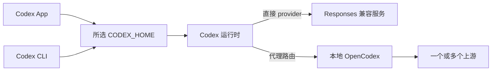

# Codex App 与 CLI 的第三方模型和双配置

**先把官方登录保留在 `~/.codex`，再用 `~/.codex-api` 试第三方模型。App 与 CLI 在同一种模式下读取同一个目录；切换模式时改变启动环境，不来回复制 `auth.json`。** 第三方接入能否完成，取决于协议、认证、模型目录和客户端版本四个条件。[S1][S2][E1]

本文把一次 Windows 原生 Codex 配置检查改写成通用教程。核验日期为 **2026-09-03**：CLI `0.153.0`、App 内置运行时 `0.153.0-alpha.5`、桌面包 `26.901.1978.0`、OpenCodex `2.14.0`。这些是实验版本，不是最低支持版本。[E1]

## 1. 概述

### 先解决哪个问题

| 你的目标 | 推荐做法 | 需要额外核验 |
| --- | --- | --- |
| App 和 CLI 共用官方 ChatGPT 登录 | 两者使用默认 `~/.codex` 与同一认证存储后端 | 新进程读取的 HOME、登录类型、官方模型列表 |
| CLI 临时试一个兼容模型 | 命名 profile，或独立 API HOME | CLI 的 `--profile` 行为与协议支持 |
| App 和 CLI 都切换到第三方 | 启动前共同选择 API HOME，在其根配置指定 provider | App 是否实际接收该 HOME、模型选择器、一次真实请求 |
| 同一个列表显示多个上游模型 | 能识别路由模型 ID 的代理，例如 OpenCodex | 路由规则、代理认证、服务启动与退出恢复 |
| 恢复纯官方模式 | 移除第三方覆盖，停止代理与自启动，再重启客户端 | 不能只看配置文件或服务停止提示 |

**先决条件**：能编辑 TOML，了解环境变量，会在 PowerShell 或终端检查进程；第三方服务需要你自行取得授权。**学习目标**：解释每个文件的职责、建立两套可选择配置、识别模型显示与请求成功的区别、恢复官方默认。[S1][S2]

范围是本机 App 与 CLI 的配置。本文不承诺任意“OpenAI 兼容”接口都可使用，不扩展到云端 Codex，也不提供个人账号、真实服务地址或认证文件。

## 2. 使用

### 第一步：给两种模式各留一个 HOME

```text
~/.codex/                      官方模式：App + CLI
  config.toml                  用户配置
  auth.json                    文件存储模式下的官方登录，私密
~/.codex-api/                  API 模式：App + CLI
  config.toml                  第三方 provider 配置
  catalog.json                 可选：与运行时兼容的模型目录
```

`CODEX_HOME` 不只影响配置，还影响认证和本地状态。两套 HOME 会形成两份会话与缓存；**同一模式共用一个 HOME** 才是本文的“复用”。独立 HOME 不意味着自动共享 MCP、插件、技能和历史；确实需要复用的非敏感设置应有自己的来源与同步方式。[S1][E1]

下载模板：[官方配置](/examples/codex-config/official.config.toml)、[第三方配置](/examples/codex-config/third-party.config.toml)、[模型目录示例](/examples/codex-config/catalog.example.json)、[Windows 启动脚本](/examples/codex-config/Start-Codex.ps1)。将模板**合并到目标文件**，不要覆盖已有的 MCP、项目规则或插件配置。

官方模式不需要手写模型名称、模型目录或服务地址。为了明确使用本机文件认证，模板只包含：

```toml
cli_auth_credentials_store = "file"
```

使用 `keyring` 或 `auto` 时，凭据位置会不同；先确认现有后端再决定是否更改。不要为了“共享”把 API key 写进官方 `auth.json`。同一 HOME、同一存储后端下的登录与退出可能影响两个入口。[S2]

### 第二步：配置一个 Responses 兼容的上游

把下面配置放进 **API HOME 的 `config.toml`**。`example_gateway`、模型 ID、域名均为占位符，需要按上游文档替换：

```toml
model_provider = "example_gateway"
model = "provider-model-id"

[model_providers.example_gateway]
name = "Example Responses gateway"
base_url = "https://gateway.example.com/v1"
env_key = "EXAMPLE_MODEL_API_KEY"
wire_api = "responses"
supports_websockets = false
```

在核验版本中，`wire_api` 仅接受 `responses`。只支持 `/chat/completions` 的接口需要协议适配层。`supports_websockets = false` 只是禁用可选传输；它不会修复错误的 Responses 事件流、工具调用或模型 ID。[S3]

从本地凭据管理器给启动进程提供 `EXAMPLE_MODEL_API_KEY`，不要把真实值写入模板、命令历史或 PR。App 从桌面图标启动时未必继承终端变量；需要令真正启动 App 的进程取得变量。也可使用官方支持的 `[model_providers.<id>.auth]` 命令型认证，从凭据管理器取短期 token；不得同时配置 `env_key`、内联 bearer 或 `requires_openai_auth`。[S1][S3]

`requires_openai_auth = true` 会选择 OpenAI 认证，并忽略 `env_key`；只有明确需要 OpenAI 登录透传的可信代理才使用它，不能把它当作“开启第三方支持”的开关。[S2]

### 第三步：让 App 与 CLI 选择同一模式

**Windows 原生**：在已配置好密钥环境的 PowerShell 中运行下载的启动脚本：

```powershell
.\Start-Codex.ps1 -Mode official -Surface cli
.\Start-Codex.ps1 -Mode api -Surface cli
.\Start-Codex.ps1 -Mode official -Surface app
.\Start-Codex.ps1 -Mode api -Surface app
```

这四条是**备选操作**，按需要运行一条。脚本仅在启动期间设置进程级 `CODEX_HOME`，随后恢复调用终端的值。启动 App 前要求完全退出旧实例，并从已安装 MSIX 包发现可执行文件。安装布局变化会明确报错。[E2]

**验收 HOME**：在 App 的设置中打开实际配置文件，核对路径；再核对其内置 app-server 的 `config/read`。不能用另一个终端里的 `$env:CODEX_HOME` 证明 GUI 已切换。若安装方式忽略启动环境，先停止切换并查清真实配置入口；不要盲目删除默认目录或创建目录联接。该脚本的语法已验证，跨所有安装方式的 GUI 切换尚未验证。[S4][E2]

**macOS / Linux CLI**：变量只作用于本次进程：

```bash
CODEX_HOME="$HOME/.codex" codex
CODEX_HOME="$HOME/.codex-api" codex
```

macOS GUI 可由终端向实际 App 可执行文件传递同一环境，但需要先确认安装路径并完全退出旧实例。本次没有验证 macOS GUI 双 HOME 启动，不将其写成通用复制命令。[E1]

### 第四步：需要模型选择器时再增加目录

`model` 选择请求使用的模型；`model_catalog_json` 提供启动时加载的模型元数据。两者职责不同。模型目录示例是完整的、用于结构测试的虚构条目；上下文长度、推理档位、图片和工具能力必须按真实上游填写。[S3][E2]

在 API 配置的**第一个表头之前**加入实际绝对路径，例如：

```toml
model_catalog_json = 'C:\Users\Example\.codex-api\catalog.json'
```

将 `Example` 替换为本机用户目录。TOML 中表头后的键属于该表：把这行放在 `[model_providers.example_gateway]` 后面会写到错误层级。

先按各自的真实可执行文件验证目录：

```powershell
codex debug models --help
codex -c 'model_catalog_json="C:\Users\Example\.codex-api\catalog.json"' debug models
```

随后用 **App 内置的 `codex.exe`** 重复同一检查，再重启 App 看选择器。全局 CLI 与 App 可能打包不同版本。不要直接把上游 `main` 分支的目录当作跨版本通用文件；已有版本不兼容的可复现报告。[S5][E2]

### 第五步：需要时才引入 OpenCodex

OpenCodex 是本地代理：它把带路由前缀的模型 ID 分发到相应 provider，也会修改 Codex 的模型目录和连接配置。在 `2.14.0` 的文档中，loopback 集成写入顶层 `openai_base_url`；非 loopback 使用命名 provider。它另有自己的 `OPENCODEX_HOME`，不能与 `CODEX_HOME` 混为一谈。[S6][E1]



在隔离测试目录下安装并阅读当前帮助，再初始化；`ocx init` 会修改所选 Codex 配置：

```powershell
$env:CODEX_HOME = Join-Path $env:USERPROFILE '.codex-api'
$env:OPENCODEX_HOME = Join-Path $env:USERPROFILE '.opencodex-lab'
npm install -g @bitkyc08/opencodex@2.14.0
ocx --help
ocx init
ocx start
```

完成后退出这个测试终端，避免环境变量影响下一次官方启动。provider 的认证与模型选择按 [OpenCodex Providers](https://opencodex.me/guides/providers/) 配置；这里不复制生产配置。官方 ChatGPT 登录透传、API key 路由、账号池是三种不同关系，不能通过修改模型名称相互替代。[S6][S7]

## 3. 原理

### 五个状态不能互相证明

| 状态 | 谁负责 | 不能证明什么 |
| --- | --- | --- |
| 配置目录 | 启动进程与 `CODEX_HOME` | 不能证明已有 GUI 进程重新加载 |
| 认证 | provider 的认证方式与凭据存储 | key 存在不代表有效或有模型权限 |
| 路由 | `model_provider`、provider URL，或代理覆盖 | 模型名称像 GPT 不代表直连官方 |
| 模型目录 | `model_catalog_json`、缓存、运行时内置/远端数据 | 列表可见不代表能完成推理 |
| 当前任务 | 创建或恢复任务时采用的配置 | 全局默认更改不代表历史任务自动迁移 |

以上分层来自配置接口与此次实证；排障应分别取证。[S1][S3][S4][E1]

### HOME 与 profile 怎么取舍

**HOME 用来隔离本地状态；profile 是同一 HOME 中的配置覆盖层。** 在 `0.134.0` 及以后，CLI `--profile gateway` 读取 `$CODEX_HOME/gateway.config.toml`，旧 `[profiles.gateway]` 与顶层 `profile = "gateway"` 不再适用。[S1]

只在 CLI 临时切换时，可将第三方模板保存成 `gateway.config.toml`：

```bash
codex --profile gateway
```

App 是否提供相同 profile 选择入口，要按安装版本核验。本文的双入口方案把选定 provider 放在各 HOME 的根 `config.toml`，不依赖 GUI 认识 CLI flag。[E1]

`models_cache.json` 是派生数据，不是配置真源。此次 Windows 检查中，两个 HOME 同时存在代理目录与数百条缓存项；停止服务后仍需要移除覆盖并重启。官方模型管理器也分别处理缓存刷新和静态目录。[E1][S8]

## 4. 开发

### 实战：把实验机恢复为官方默认

此次处理前，官方 HOME 保留 ChatGPT 认证但被代理改了默认模型与目录；API HOME 使用独立 API 认证。旧 GUI 切换脚本依赖目录联接，而现场已是普通目录；API 配置还给子进程注入了失效的 HOME 路径。这些是该机器的观察，不能推广为 Codex 的默认行为。[E1]

恢复顺序如下，先核对清单再操作：

1. **在原机保存必要恢复材料**，限制访问或加密；不上传 `auth.json`、环境文件、日志、历史数据库或代理账号数据。
2. 完全退出 App 与需要重新加载配置的 CLI。保留正常的官方登录文件。
3. 在卸载 CLI 包之前停止 OpenCodex 并移除其自启动；按当前帮助执行 `ocx service stop`、`ocx service uninstall`。`ocx restore` 只恢复配置，并不停止代理。[S9]
4. 从生效配置移除第三方 `model`、`model_provider`、`model_catalog_json`、base URL 覆盖与 `[model_providers.*]`；清理相应 `*.config.toml`、认证辅助脚本、代理注入文件、过期模型缓存。保留无关 MCP 与项目配置。
5. 清理启动脚本、用户环境和 `shell_environment_policy.set` 中的旧 HOME、模型 key 与代理覆盖。不要误删其他应用仍使用的凭据源。
6. 停用 API HOME，保留需要的历史数据；移除其独立 API 认证。需要彻底退出 OpenCodex 时，清理其运行状态并卸载包。
7. 从默认入口重启 App / CLI，运行下面的验收。恢复官方模式时不手工维护一个“官方模型白名单”，让原生运行时按当前账号取得默认列表。

**验收分层**：

| 检查 | 可接受证据 |
| --- | --- |
| 配置 | 无第三方 provider、目录和 URL 覆盖；App / CLI 解析到同一 HOME |
| 认证 | 两个运行时的 `account/read` 都是 `chatgpt`，需要官方认证；不输出邮箱或 token |
| 模型 | 两个运行时的 `model/list` 无代理前缀与第三方条目，分页已读完 |
| 后台 | 服务、计划任务、托盘、自动启动入口、原监听端口均无残留 |
| GUI | 重启后的新任务模型菜单与运行时结果一致 |
| 请求 | 如果要宣称模型可用，再做一次不含私密材料的最小请求 |

App Server 的 `initialize → initialized → config/read / account/read / model/list` 可以检查原生消费路径；`config/read` 可能包含敏感设置，应只输出必要字段。[S4]

### 常见陷阱与反面证据

| 现象 | 解释与处理 |
| --- | --- |
| CLI 可列出模型，App 菜单为空 | 已有选择器回归报告；检查内置版本、认证过滤和 GUI，本页不把 CLI 列表当作 GUI 成功。[S10] |
| 修改目录 JSON 后 App 没变化 | 配置参考说明目录在启动时加载；已有 app-server 缓存报告。重启后再核验。[S3][S11] |
| 某个客户端报 JSON 缺字段 | 用匹配运行时的目录结构，两种二进制分别解析。[S5] |
| 代理停了但 App 仍请求 localhost | 根 URL/profile 还在，或旧进程没有退出；服务停机不等于恢复路由。[E1] |
| App 正常，但它启动的 CLI 跑到另一个目录 | 检查 `shell_environment_policy.set.CODEX_HOME` 和终端包装器。[E1] |
| 旧任务仍显示以前的模型 | 新建任务检查默认值；恢复任务可能保留原来的 provider。不要为了整理菜单批量改写会话数据库。 |
| 本地服务检查正常，却不能回答 | 服务健康、模型可见、上游认证、Responses 流与工具回合是独立条件。 |

**证伪结果**：检索发现目录跨版本解析失败、App 选择器过滤、目录缓存三类反例，足以否定“填好 `base_url` 就全面支持第三方模型”。本教程保留逐入口验收，未验证的 GUI 或上游能力必须继续标为未验证。[S5][S10][S11]

**下一步**：完成一次“选择模型 → 普通文本 → 只读工具调用 → 工具结果继续推理”的闭环，再读 [项目集成](./integration) 配置 MCP，或回到 [CLI 教程](./codex-cli) 建立日常操作习惯。

## 5. 资料库

### 来源与验证范围

以下来源均于 **2026-09-03** 取用。在线文档未标独立发布日期时，以取用日与所列版本为准。

| 编号 | 来源 / 层级 | 用途与范围 |
| --- | --- | --- |
| S1 | [Advanced Configuration](https://learn.chatgpt.com/docs/config-file/config-advanced)，L0 | HOME、profile 版本迁移、自定义 provider、认证 helper |
| S2 | [Authentication](https://learn.chatgpt.com/docs/auth)，L0 | 文件/keyring 认证、第三方 provider 认证选择 |
| S3 | [Configuration Reference](https://learn.chatgpt.com/docs/config-file/config-reference)，L0 | Responses、模型目录、provider 和认证字段 |
| S4 | [App Server](https://learn.chatgpt.com/docs/app-server)，L0 | 原生配置、账号与模型 RPC；[App Settings](https://learn.chatgpt.com/docs/reference/settings) 为配置入口参考 |
| S5 | [Codex #38934](https://github.com/openai/codex/issues/38934)，L2 一手复现 | 2026-08-17 的 App 内置版本与 `main` 模型目录不兼容报告；不是官方支持承诺 |
| S6 | [OpenCodex Installation](https://opencodex.me/getting-started/installation/)，项目 L0 | HOME 所属、目录注入和 loopback 路由方式 |
| S7 | [OpenCodex Providers](https://opencodex.me/guides/providers/)，项目 L0 | 上游协议、ChatGPT 与 API key 路由边界 |
| S8 | [Codex 0.153.0 models manager](https://github.com/openai/codex/blob/rust-v0.153.0/codex-rs/models-manager/src/manager.rs)，L0 源码 | 运行时模型目录、刷新策略和缓存 |
| S9 | [OpenCodex CLI Lifecycle](https://opencodex.me/reference/cli/lifecycle/)，项目 L0 | 停止、恢复、服务卸载各自职责 |
| S10 | [Codex #34487](https://github.com/openai/codex/issues/34487)，L2 一手问题报告 | 自定义目录已加载但 GUI 不显示的版本相关反例 |
| S11 | [Codex #35129](https://github.com/openai/codex/issues/35129)，L2 一手问题报告 | app-server 静态目录缓存的反例 |
| E1 | 本文 Windows 脱敏实证，E | 两套 HOME 的配置/认证类型、OpenCodex 本机安装与服务、原生运行时检查；原始配置不公开 |
| E2 | 本仓可下载模板的结构检查，E | 两种 Codex 二进制的目录解析、TOML 解析与 PowerShell 语法；不代表真实上游调用或通用 GUI 兼容性 |

### 检索日志

| 渠道 | 原始查询或访问路径 | 命中 / 采用 |
| --- | --- | --- |
| 官方域搜索 | `Codex app custom model providers CODEX_HOME configuration` | 返回结果，改为直接访问配置正文 |
| 官方域搜索 | `Codex model_catalog_json model providers auth config` | 返回结果，采用 S1–S3 正文 |
| 官方文档 GET | `config-advanced`、`config-reference`、`auth`、`app/settings` | 4 页成功，旧 URL 重定向至 `learn.chatgpt.com` |
| 上游 issue 搜索 | `site:github.com/openai/codex "model_catalog_json" "app"` | 多条结果，打开并采用 S5、S10、S11 |
| 上游 issue 搜索 | `site:github.com/openai/codex "CODEX_HOME" "app" "provider"` | 返回配置相互影响的线索，未作为普遍结论 |
| OpenCodex GET | `getting-started/installation/`、`guides/providers/`、`reference/configuration/providers/`、`reference/cli/lifecycle/` | 4 页成功，采用安装/provider/生命周期边界 |
| 本机实证 | `--version`、`--help`、配置键检查、进程/任务/监听检查、App Server RPC | 只保留版本、结构、布尔状态与模型名 |

**尚未验证**：模板中虚构上游的真实推理与工具回合；所有系统/安装方式下的 GUI 双 HOME 启动；所有第三方模型在当前 App 选择器中的兼容性。配置模板是一套可检查的起点，不能替代这些验收。
