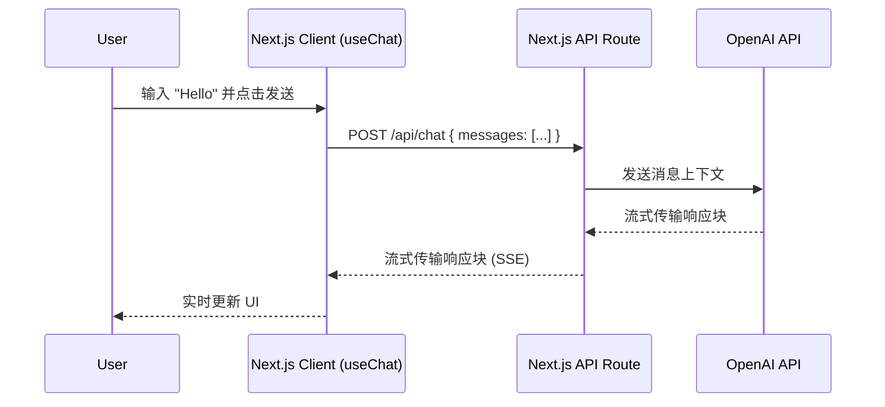

# 项目教程：构建你的第一个 AI 聊天机器人

**级别**: 初级
**时间**: 30-45 分钟
**技术栈**: Next.js 14, Vercel AI SDK, OpenAI

## 简介

在本教程中，你将构建一个功能齐全的 AI 聊天机器人，外观和感觉类似于 ChatGPT。你将学习 AI 工程的核心概念：**API 通信**、**流式传输 (Streaming)** 和 **状态管理**。

**你将构建什么**:
- 一个整洁、响应式的聊天界面
- 实时文本流（打字效果）
- 自动滚动消息列表
- API 问题的错误处理

[查看在线演示](#) | [查看源代码](#)

## 先决条件

- 已安装 Node.js 18+
- OpenAI API Key ([在这里获取](https://platform.openai.com/api-keys))
- 代码编辑器（推荐 VS Code）

## 架构

我们将使用 **Vercel AI SDK**，它为我们要处理流式传输的复杂部分。



---

## 步骤 1: 创建新的 Next.js 项目

打开终端并运行：

```bash
npx create-next-app@latest my-ai-chatbot
# 选择以下选项：
# - TypeScript: Yes
# - ESLint: Yes
# - Tailwind CSS: Yes
# - src/ directory: Yes
# - App Router: Yes
# - Import alias: @/*
```

进入你的文件夹：

```bash
cd my-ai-chatbot
```

## 步骤 2: 安装依赖

我们需要 Vercel AI SDK 和 OpenAI SDK。

```bash
npm install ai openai
```

## 步骤 3: 配置环境变量

在项目根目录下创建一个名为 `.env.local` 的文件：

```env
OPENAI_API_KEY=sk-your-openai-key-here
```

> **安全警告**: 永远不要将此文件提交到 Git！`.env.local` 文件默认已在 `.gitignore` 中。

## 步骤 4: 创建 API 路由

此后端路由将充当你的用户和 OpenAI 之间的安全代理。

创建 `src/app/api/chat/route.ts`:

```typescript
import { openai } from '@ai-sdk/openai';
import { streamText } from 'ai';

// 允许流式响应最长 30 秒
export const maxDuration = 30;

export async function POST(req: Request) {
  const { messages } = await req.json();

  const result = await streamText({
    model: openai('gpt-4o'),
    messages,
  });

  return result.toDataStreamResponse();
}
```

## 步骤 5: 构建聊天界面

现在是前端部分。我们将使用 `useChat` hook，它会自动处理：
- 发送消息
- 流式传输响应
- 更新消息历史状态

将 `src/app/page.tsx` 替换为：

```tsx
'use client';

import { useChat } from 'ai/react';

export default function Chat() {
  const { messages, input, handleInputChange, handleSubmit } = useChat();

  return (
    <div className="flex flex-col w-full max-w-md py-24 mx-auto stretch">
      {messages.length > 0 ? (
        messages.map(m => (
          <div key={m.id} className="whitespace-pre-wrap py-4">
            <span className="font-bold">{m.role === 'user' ? '用户: ' : 'AI: '}</span>
            {m.content}
          </div>
        ))
      ) : (
        <div className="text-center text-gray-500 my-10">
          开始对话吧！
        </div>
      )}

      <form onSubmit={handleSubmit} className="fixed bottom-0 w-full max-w-md p-4 bg-white border-t">
        <input
          className="w-full p-2 border border-gray-300 rounded shadow-xl"
          value={input}
          placeholder="说点什么..."
          onChange={handleInputChange}
        />
      </form>
    </div>
  );
}
```

## 步骤 6: 添加基础样式

让我们让它看起来更整洁。打开 `src/app/globals.css` 并确保保留 Tailwind 指令，但如果你想要一个干净的开始，可以清除其余部分。

`page.tsx` 中的类 (`flex flex-col`, `whitespace-pre-wrap` 等) 将处理布局。

## 步骤 7: 运行并测试

启动你的开发服务器：

```bash
npm run dev
```

打开 [http://localhost:3000](http://localhost:3000)。输入 "Tell me a joke" 并按回车。你应该能看到响应流式传输进来！

---

## 故障排除

**问题: 401 Unauthorized Error**
- **原因**: API Key 无效或缺少 `.env.local` 文件。
- **修复**: 检查 `.env.local` 是否存在且 `OPENAI_API_KEY` 是否正确。重启服务器。

**问题: 429 Too Many Requests**
- **原因**: 你的 OpenAI 额度用完了。
- **修复**: 在 OpenAI 控制台检查你的账单设置。

**问题: "Module not found"**
- **原因**: 依赖未安装。
- **修复**: 再次运行 `npm install ai openai`。

---

## 扩展：让它更好

现在你已经掌握了基础知识，尝试这些挑战：

### 级别 1: 更好的 UI
使用像 **shadcn/ui** 这样的组件库，让聊天气泡看起来像 iMessage 或 WhatsApp。
- 用户消息：蓝色背景，右对齐。
- AI 消息：灰色背景，左对齐。

### 级别 2: 添加系统提示词 (System Prompt)
给你的机器人一个个性。更新 `route.ts`:

```typescript
  const result = await streamText({
    model: openai('gpt-4o'),
    system: 'You are a pirate. Respond to everything in pirate speak.', // 添加这一行
    messages,
  });
```

### 级别 3: Markdown 支持
AI 返回 Markdown (粗体、列表、代码块)。使用 `react-markdown` 来正确渲染它。

```bash
npm install react-markdown
```

```tsx
import ReactMarkdown from 'react-markdown';

// 在你的 map 循环中:
<ReactMarkdown>{m.content}</ReactMarkdown>
```

---

## 下一步

恭喜！你已经构建了一个流式 AI 应用。

- **了解更多 API 信息**: [OpenAI 集成指南](../../integration/apis/openai.md)
- **尝试更大的项目**: [路径 2: 集成学习路径](../../paths/integration.md)