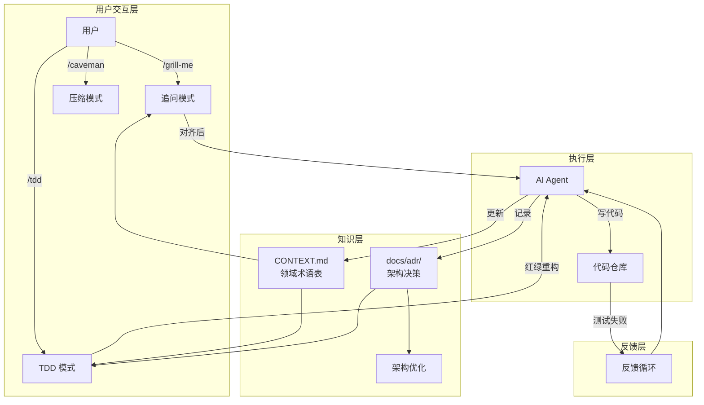
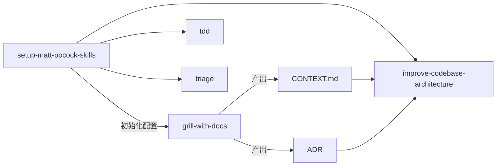
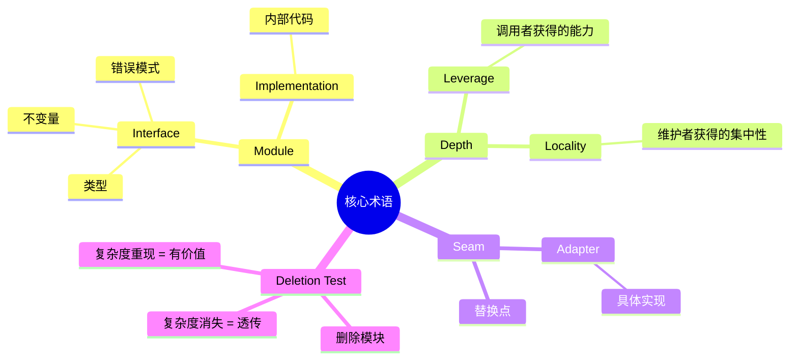
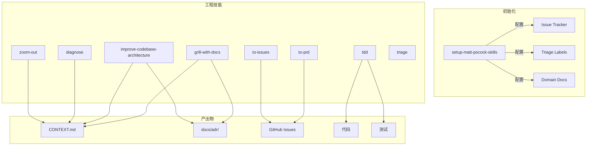
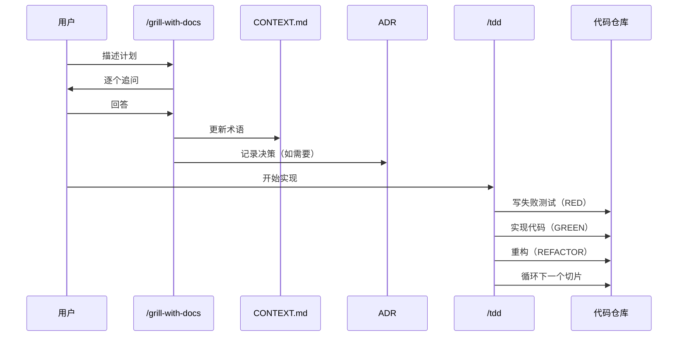

# mattpocock/skills 深度分析报告

> 分析时间：2026-05-01
> 分析维度：问题层 → 手段层 → 概念层 → 经验层 → 思维层 → 洞察层

---

## 🌍 1. 问题层（Problem）

### 核心问题

这个仓库解决的是 **AI Coding 的四大失败模式**：

| 失败模式 | 表现 | 后果 |
|----------|------|------|
| **#1 对齐失败** | 你以为 AI 知道你想要什么，但它做出来完全不是 | 浪费时间返工 |
| **#2 术语混乱** | AI 用 20 个词表达本该 1 个词说清的事 | Token 浪费，理解困难 |
| **#3 缺乏反馈** | AI 写的代码跑不通，但没有机制发现 | 飞行盲区，质量不可控 |
| **#4 架构腐化** | AI 加速编码 = 加速软件熵 | 代码变成泥球，无法维护 |

### 动机（Why）

Matt Pocock 在 README 中明确表达：

> "Developing real applications is hard. Approaches like GSD, BMAD, and Spec-Kit try to help by owning the process. But while doing so, they take away your control and make bugs in the process hard to resolve."

**核心洞察**：现有 AI Coding 框架（GSD/BMAD/Spec-Kit）试图"接管流程"，但这剥夺了工程师的控制权，且让流程本身的问题难以修复。

### 目标用户

- **不是**：Vibe Coder（快速原型、不关心质量）
- **而是**：Real Engineers（做生产级应用、关心长期维护性）

### 价值主张

> "These skills are designed to be small, easy to adapt, and composable. They work with any model. They're based on decades of engineering experience."

---

## 🔧 2. 手段层（Methods）

### 技术栈

| 层面 | 选择 | 说明 |
|------|------|------|
| **格式** | Markdown（SKILL.md） | 每个 Skill 一个文件，纯文本 |
| **运行时** | Claude Code / Codex / Cursor | AI Agent 宿主 |
| **安装** | `npx skills@latest add` | CLI 工具链 |
| **存储** | 每个仓库的 `.claude/` 或 `CLAUDE.md` | 本地配置 |
| **Issue 追踪** | GitHub / GitLab / Local Markdown | 可插拔 |
| **文档** | CONTEXT.md + ADR | 领域术语 + 架构决策 |

### 整体架构



### 核心依赖



---

## 💡 3. 概念层（Concepts）

### 核心抽象

| 概念 | 定义 | 类比 |
|------|------|------|
| **Skill** | 特定场景的可复用工作流 | 设计模式 |
| **CONTEXT.md** | 项目领域术语表 | DDD 的统一语言 |
| **ADR** | 架构决策记录 | 架构师的决策日志 |
| **Grilling** | 追问式对齐 | 代码审查的反向版 |
| **Vertical Slice** | 垂直切片（一个测试→一个实现） | 敏感的迭代单元 |
| **Deep Module** | 高杠杆模块（小接口，大实现） | John Ousterhout 的深度理论 |
| **Seam** | 接口存在的位置 | 可替换点 |

### 核心术语（来自 LANGUAGE.md）



### 设计模式

| 模式 | 应用场景 | 说明 |
|------|---------|------|
| **红绿重构循环** | TDD | 先写失败测试 → 实现 → 重构 |
| **垂直切片** | 增量开发 | 一个测试 → 一个实现，避免水平切片 |
| **追问式对齐** | 需求澄清 | 逐个问题解决设计树分支 |
| **术语驱动开发** | 全程 | 用统一语言命名一切 |
| **延迟创建** | 文档 | 有内容时才创建，不预建 |

---

## 🛠️ 4. 经验层（Learnings）

### 可直接借鉴的经验

#### 1. CONTEXT.md 共享术语表

**格式**：
```markdown
# {Context Name}

## Language

**Order**:
{定义}
_Avoid_: Purchase, transaction

## Relationships

- An **Order** produces one or more **Invoices**

## Example dialogue

> **Dev:** "When a **Customer** places an **Order**..."
> **Domain expert:** "No — an **Invoice** is only generated..."

## Flagged ambiguities

- "account" was used to mean both **Customer** and **User** — resolved: distinct concepts.
```

**价值**：
- 减少 token 消耗（20 词 → 1 词）
- 命名一致性
- 代码可导航性

#### 2. ADR 架构决策记录

**触发条件**（三个必须同时满足）：
1. **难以逆转** — 改变决策成本高
2. **没有上下文会困惑** — 未来读者会问"为什么这样做"
3. **真正的权衡** — 有真正的替代方案

**格式**：
```markdown
# {决策标题}

{1-3 句话：上下文、决定、原因}
```

**极简主义**：大多数 ADR 只需一段话，价值在于记录决策和原因。

#### 3. 垂直切片 TDD

**反模式（水平切片）**：
```
RED:   test1, test2, test3, test4, test5
GREEN: impl1, impl2, impl3, impl4, impl5
```

**正确方式（垂直切片）**：
```
RED→GREEN: test1→impl1
RED→GREEN: test2→impl2
RED→GREEN: test3→impl3
```

**关键洞见**：批量写测试会导致测试"想象的行为"而非"实际的行为"。

#### 4. /caveman Token 压缩

**规则**：
- 删除：冠词、填充词、客套话
- 保留：技术术语、代码、错误信息
- 模式：`[thing] [action] [reason]. [next step].`

**示例**：
```
Before: "Sure! I'd be happy to help you with that. The issue you're experiencing is likely caused by..."
After: "Bug in auth middleware. Token expiry check use `<` not `<=`. Fix:"
```

**效果**：Token 消耗减少 ~75%

### 工程实践优点

| 实践 | 说明 |
|------|------|
| **延迟创建** | 不预建文档目录，有内容时才创建 |
| **渐进式披露** | SKILL.md + supporting-info 分离 |
| **模型无关** | 纯 Markdown，任何 AI 都能用 |
| **组合性** | Skills 可自由组合 |
| **可配置** | Issue 追踪器、标签、文档结构都可插拔 |

---

## 🧠 5. 思维层（Thinking）

### 设计决策解析

#### 决策 1：小而可组合 vs 大而全

**Matt 的选择**：小而可组合

**原因**：
- 大框架（GSD/BMAD）接管流程 → 夺取控制权
- 小 Skills 可自由组合 → 保持灵活性
- 流程本身的 bug 难以修复

**权衡**：
- ✅ 灵活、可控、易调试
- ❌ 需要用户自己组合

#### 决策 2：Markdown vs 代码

**Matt 的选择**：纯 Markdown

**原因**：
- Skill 本质是"指令"，不是"程序"
- Markdown 可被任何 AI 模型理解
- 无需运行时依赖

**权衡**：
- ✅ 通用、简单、无依赖
- ❌ 无法做复杂逻辑判断

#### 决策 3：追问式对齐 vs 直接执行

**Matt 的选择**：追问式对齐（/grill-me）

**原因**：
> "No-one knows exactly what they wants" — 《Pragmatic Programmer》

**核心洞见**：需求对齐是软件开发最核心的问题，AI 时代依然如此。

#### 决策 4：术语驱动 vs 代码驱动

**Matt 的选择**：术语驱动（CONTEXT.md）

**原因**：
> "With a ubiquitous language, conversations among developers and expressions of the code are all derived from the same domain model." — Eric Evans, DDD

**核心洞见**：共享术语表是减少 token 消耗和提升命名一致性的关键。

### 因果链

```
AI 写代码太快
    ↓
加速软件熵
    ↓
代码变泥球
    ↓
需要主动治理
    ↓
/improve-codebase-architecture
    ↓
定期运行 + 深度模块理论
    ↓
保持架构健康
```

---

## 🔬 6. 洞察层（Insights）

### 深层洞察

#### 洞察 1：AI 的"盲飞"问题

**现象**：AI 写代码没有反馈循环 = 盲飞

**解决**：红绿重构循环（TDD）

**更深层**：这不仅是 TDD，而是**任何反馈循环**：
- 类型检查
- 浏览器访问
- 自动化测试
- 用户反馈

**结论**：AI 需要的不是"更好的提示"，而是"更快的反馈"。

#### 洞察 2：软件熵的加速器

**传统**：软件腐化需要几年

**AI 时代**：软件腐化可以几周

**原因**：AI 大幅降低了"写代码"的门槛，但没有降低"设计代码"的门槛

**对策**：
- 定期运行 `/improve-codebase-architecture`
- 用"删除测试"验证模块价值
- 关注"深度"而非"数量"

#### 洞察 3：术语表的复利效应

**短期**：减少 token 消耗

**中期**：命名一致性 → 代码可导航性

**长期**：形成项目独特的"方言" → 新成员学习成本降低

**更深层**：这是 DDD 统一语言在 AI 时代的具体实践。

#### 洞察 4：框架的陷阱

**GSD/BMAD 等框架的问题**：
- 接管流程 → 夺取控制权
- 流程本身的 bug 难以修复
- 用户变成"框架的执行者"而非"问题的解决者"

**Matt 的解法**：
- Skills 是"工具"而非"框架"
- 用户保持控制权
- 可以自由修改、组合

### 局限性

| 局限 | 说明 |
|------|------|
| **TypeScript 偏重** | 很多示例基于 TS/Node 生态 |
| **英文为主** | 术语表和 Skill 内容都是英文 |
| **Claude Code 特定** | 部分设计假设 Claude Code 工作流 |
| **缺乏外部集成** | 没有飞书、GitHub API、MCP 等外部系统集成 |
| **依赖人工对齐** | /grill-me 需要用户主动触发，无法自动执行 |

### 改进空间

1. **多语言支持**：中文术语表格式
2. **外部系统集成**：飞书、GitHub API、禅道等
3. **自动化触发**：当检测到需求模糊时自动追问
4. **质量度量**：追踪术语表使用率、TDD 覆盖率
5. **团队协作**：多人共享术语表的冲突解决

### 适用场景

| ✅ 适用 | ❌ 不适用 |
|---------|----------|
| 生产级应用开发 | 快速原型验证 |
| 长期维护的代码库 | 一次性脚本 |
| 团队协作 | 个人项目 |
| 复杂业务逻辑 | 简单 CRUD |
| TypeScript/JavaScript | 其他语言（需改造） |

---

## 📊 架构图

### 核心模块关系图



### 数据流图



---

## 🎯 对 OpenClaw Skills 的借鉴

### 可直接复用

1. **CONTEXT.md 概念** → 项目术语表
2. **ADR 架构决策记录** → 决策沉淀
3. **/caveman 压缩模式** → Token 优化
4. **垂直切片 TDD** → AI 编码质量

### 需要适配

1. **多语言支持** → 中文术语表格式
2. **外部系统集成** → 飞书、GitHub、禅道
3. **自动化触发** → 检测需求模糊时自动追问

### 互补关系

| mattpocock/skills | OpenClaw Skills |
|-------------------|-----------------|
| 内部工程规范 | 外部能力扩展 |
| 代码质量 | API 集成 |
| 对齐方法论 | 执行自动化 |

---

**报告完成时间**：2026-05-01 09:50
**分析深度**：标准分析（6 维度 + Mermaid 架构图）
**报告路径**：`D:\chengle\.openclaw\workspace\robot\analysis\skills.md`
