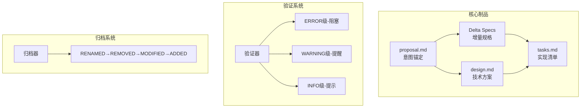
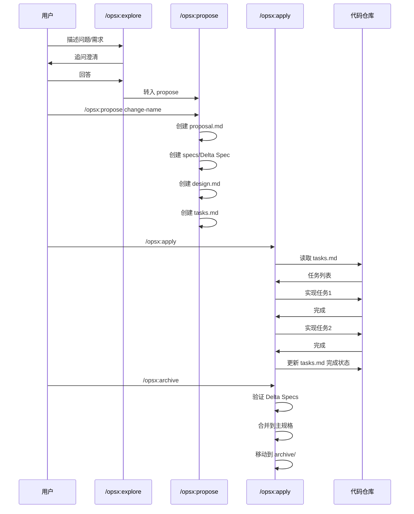

# OpenSpec：规格驱动开发框架

## 目标

用规格（Spec）驱动 AI 编程，在写代码之前先让人和 AI 对"做什么"达成一致，消除聊天记录中的需求漂移，实现生产级应用开发。

---

## 🌍 问题层（Problem）

### 这个框架解决什么问题？

AI 编程有四大失败模式：

| 失败模式 | 表现 | 后果 |
|---------|------|------|
| #1 对齐失败 | 你以为 AI 知道你想要什么，但它做出来完全不是 | 浪费时间返工 |
| #2 术语混乱 | AI 用 20 个词表达本该 1 个词说清的事 | Token 浪费，理解困难 |
| #3 缺乏反馈 | AI 写的代码跑不通，但没有机制发现 | 飞行盲区，质量不可控 |
| #4 架构腐化 | AI 加速编码 = 加速软件熵 | 代码变成泥球，无法维护 |

### 核心洞察

现有 AI Coding 框架（GSD/BMAD/Spec-Kit）试图"接管流程"，但这剥夺了工程师的控制权，且让流程本身的问题难以修复。

**不是**：Vibe Coder（快速原型、不关心质量）

**而是**：Real Engineers（做生产级应用、关心长期维护性）

### 目标用户

- AI 编程使用者（Cursor、Claude Code、Copilot 等）
- 需要管理需求变更的开发团队
- 关注长期代码质量的工程师

---

## 🔧 手段层（Methods）

### 技术架构

OpenSpec 由以下组件构成：



### 工具集成

| 工具 | 命令格式 |
|------|---------|
| Claude Code | `/opsx:propose` |
| Cursor | `/opsx-propose` |
| Windsurf | `/opsx-propose` |
| GitHub Copilot | `/opsx-propose` |
| Kimi CLI | `/skill:openspec-propose` |

### 安装方式

```bash
npm install -g @fission-ai/openspec
cd your-project
openspec init
```

---

## 💡 概念层（Concepts）

### 核心概念定义

| 概念 | 定义 | 类比 |
|------|------|------|
| **Delta Spec** | 增量规格，用四种操作（ADDED/MODIFIED/REMOVED/RENAMED）描述变更 | Git 的 diff 思维应用到规格管理 |
| **Artifact Graph** | 制品依赖图，用 proposal.md 固化意图，后续制品都引用它 | 意图的锚点，防止漂移 |
| **RFC 2119 关键字** | 行为契约，用 MUST/SHOULD/MAY 明确强制程度 | 法律条文级别的精确性 |
| **垂直切片** | 一个测试 → 一个实现，避免水平切片 | 敏感的迭代单元 |
| **Deep Module** | 小接口，大实现（John Ousterhout 的深度理论） | 高杠杆模块 |

### 核心机制详解

| 机制 | 说明 | 关键点 |
|------|------|--------|
| 🎯 意图锚定 | 用 proposal.md 固化"为什么做"和"做什么" | 所有后续制品都引用此文件，意图不漂移 |
| 📜 行为契约 | 每个需求用 RFC 2119 关键字明确强制程度 | MUST(100%) / SHOULD(~90%) / MAY(~50%) |
| 🔄 Delta Specs | 用四种操作描述变更 | 归档时按固定顺序自动合并到主规格 |
| ✅ 渐进式验证 | 分级验证：ERROR(阻塞) / WARNING(提醒) / INFO(提示) | 平衡严格和实用 |

### 制品依赖关系

```
proposal（无依赖，最先创建）
    ↓
specs（依赖 proposal）  ←→  design（依赖 proposal，可并行）
    ↓
tasks（依赖 specs 和 design）
```

> 依赖是"使能"不是"门控"，灵活但有序。

### 设计模式

| 模式 | 应用场景 | 说明 |
|------|---------|------|
| 红绿重构循环 | TDD | 先写失败测试 → 实现 → 重构 |
| 垂直切片 | 增量开发 | 一个测试 → 一个实现，避免水平切片 |
| 追问式对齐 | 需求澄清 | 逐个问题解决设计树分支 |
| 延迟创建 | 文档 | 有内容时才创建，不预建 |

---

## 🛠️ 经验层（Learnings）

### 可直接借鉴的工程实践

1. **保持变更聚焦** — 一个逻辑单元一个变更
2. **用 `/opsx:explore` 探索** — 需求不明确时先调查
3. **归档前验证** — 用 `/opsx:verify` 检查实现
4. **命名清晰** — `add-dark-mode`、`fix-login-bug`、`refactor-auth`
5. **渐进式使用** — 从小功能开始，逐步扩展

### 目录规范

```
openspec/
├── specs/              # 系统当前行为的"事实来源"
│   ├── auth/
│   │   └── spec.md
│   └── ui/
│       └── spec.md
│
├── changes/            # 提出的修改
│   ├── add-dark-mode/
│   │   ├── proposal.md     # 为什么做、做什么
│   │   ├── specs/          # 增量规格（Delta Specs）
│   │   │   └── ui/
│   │   │       └── spec.md
│   │   ├── design.md       # 怎么做（技术方案）
│   │   └── tasks.md        # 实现清单
│   └── archive/            # 已归档的变更
│       └── 2025-01-24-add-dark-mode/
│
├── schemas/            # 工作流定义
└── config.yaml         # 项目配置（可选）
```

| 目录 | 用途 | 文件命名 |
|------|------|---------|
| `specs/` | 系统当前行为的事实来源 | 按功能域分目录，文件名 `spec.md` |
| `changes/` | 提出的修改 | 目录名用 kebab-case（如 `add-dark-mode`） |
| `changes/archive/` | 已归档的变更 | 格式：`YYYY-MM-DD-change-name` |
| `schemas/` | 工作流定义 | 固定文件名 |

### Delta Spec 格式示例

```markdown
# Delta for Auth

## ADDED Requirements

### Requirement: Two-Factor Authentication
The system MUST support TOTP-based two-factor authentication.

#### Scenario: 2FA enrollment
- GIVEN a user without 2FA enabled
- WHEN the user enables 2FA in settings
- THEN a QR code is displayed for authenticator app setup

#### Scenario: 2FA login
- GIVEN a user with 2FA enabled
- WHEN the user submits valid credentials
- THEN an OTP challenge is presented
- AND login completes only after valid OTP

## MODIFIED Requirements

### Requirement: Session Expiration
The system MUST expire sessions after 15 minutes of inactivity.
(Previously: 30 minutes)

## REMOVED Requirements

### Requirement: Remember Me
(Deprecated in favor of 2FA)

## RENAMED Requirements

- FROM: `### Requirement: User Login`
- TO: `### Requirement: User Authentication`
```

### 格式规则

| 操作 | 说明 |
|------|------|
| `ADDED` | 新增需求 |
| `MODIFIED` | 修改现有需求（需注明之前的值） |
| `REMOVED` | 删除需求（需注明原因） |
| `RENAMED` | 重命名需求（OpenSpec 独创，Git 无原生支持） |

归档合并顺序：`RENAMED → REMOVED → MODIFIED → ADDED`

---

## 🧠 思维层（Thinking）

### 开发者的设计决策

**决策 1：选择小而可组合 vs 大框架接管流程**

GSD/BMAD 等框架的问题：
- 接管流程 → 夺取控制权
- 流程本身的 bug 难以修复
- 用户变成"框架的执行者"而非"问题的解决者"

OpenSpec 的解法：
- Skills 是"工具"而非"框架"
- 用户保持控制权
- 可以自由修改、组合

**决策 2：选择纯 Markdown vs 复杂运行时**

原因：
- Skill 本质是"指令"，不是"程序"
- Markdown 可被任何 AI 模型理解
- 无需运行时依赖

权衡：
- ✅ 通用、简单、无依赖
- ❌ 无法做复杂逻辑判断

**决策 3：选择追问式对齐（/opsx:explore）**

核心洞见：
"No-one knows exactly what they wants" — 《Pragmatic Programmer》

需求对齐是软件开发最核心的问题，AI 时代依然如此。

**决策 4：选择术语驱动（CONTEXT.md）**

核心洞见：
"With a ubiquitous language, conversations among developers and expressions of the code are all derived from the same domain model." — Eric Evans, DDD

共享术语表是减少 token 消耗和提升命名一致性的关键。

---

## 🔬 洞察层（Insights）

### 深层洞察

**洞察 1：AI 写代码太快 → 加速软件熵**

```
AI 写代码太快
     ↓
加速软件熵
     ↓
代码变泥球
     ↓
需要主动治理
     ↓
/improve-codebase-architecture
     ↓
定期运行 + 深度模块理论
     ↓
保持架构健康
```

**洞察 2：AI 编码缺乏反馈循环**

现象：AI 写代码没有反馈循环 = 盲飞

解决：红绿重构循环（TDD）

更深层：这不仅是 TDD，而是任何反馈循环：
- 类型检查
- 浏览器访问
- 自动化测试
- 用户反馈

结论：AI 需要的不是"更好的提示"，而是"更快的反馈"。

**洞察 3：软件腐化速度的变化**

传统：软件腐化需要几年

AI 时代：软件腐化可以几周

原因：AI 大幅降低了"写代码"的门槛，但没有降低"设计代码"的门槛

对策：
- 定期运行 `/opsx:verify`
- 用"删除测试"验证模块价值
- 关注"深度"而非"数量"

### 局限性

| 局限 | 说明 |
|------|------|
| 依赖人工对齐 | `/opsx:explore` 需要用户主动触发，无法自动执行 |
| 缺乏外部集成 | 没有飞书、GitHub API、MCP 等外部系统集成 |
| 中文生态 | 文档和示例主要面向英文 |

### 适用场景

| 场景 | 适用度 | 说明 |
|------|--------|------|
| AI 编程（Cursor、Claude Code、Copilot） | ⭐⭐⭐ | 核心设计目标 |
| 需求管理 | ⭐⭐⭐ | Delta Specs 适合迭代 |
| 代码重构 | ⭐⭐ | 需要明确变更边界 |
| 团队协作 | ⭐⭐ | 规格作为沟通媒介 |
| 项目文档化 | ⭐ | 可以但非最佳用途 |

### 未来扩展方向

- 多语言支持：中文术语表格式
- 外部系统集成：飞书、GitHub API、禅道等
- 自动化触发：当检测到需求模糊时自动追问
- 质量度量：追踪术语表使用率、TDD 覆盖率

---

## 工作流程

### 快速路径（推荐，core profile）

#### Step 1: 创建变更

```bash
/opsx:propose add-dark-mode
```

AI 执行：
1. 创建 `openspec/changes/add-dark-mode/proposal.md`（为什么做、做什么）
2. 创建 `openspec/changes/add-dark-mode/specs/ui/spec.md`（Delta 格式增量规格）
3. 创建 `openspec/changes/add-dark-mode/design.md`（怎么做，技术方案）
4. 创建 `openspec/changes/add-dark-mode/tasks.md`（实现清单）

#### Step 2: 实现任务

```bash
/opsx:apply
```

AI 执行：
1. 读取 `tasks.md`
2. 逐个实现任务
3. 更新 `tasks.md` 中的完成状态

#### Step 3: 归档

```bash
/opsx:archive
```

AI 执行：
1. 验证 Delta Specs 格式
2. 按 RENAMED → REMOVED → MODIFIED → ADDED 顺序合并到主规格
3. 移动到 `openspec/changes/archive/`

### 完整路径（expanded profile）

| 命令 | 用途 |
|------|------|
| `/opsx:new change-name` | 创建变更骨架 |
| `/opsx:continue` | 逐步创建下一个制品 |
| `/opsx:ff` | 一次性快速创建所有制品 |
| `/opsx:verify` | 验证实现是否匹配规格 |
| `/opsx:sync` | 合并 Delta Specs 到主规格 |
| `/opsx:bulk-archive` | 批量归档多个变更 |
| `/opsx:onboard` | 引导式教程 |

### 探索路径

| 命令 | 用途 |
|------|------|
| `/opsx:explore` | 调查问题、比较方案，澄清需求后转入 propose 或 new |

---

## 命令速查

### Core Profile（核心）

| 命令 | 用途 | 产出 |
|------|------|------|
| `/opsx:propose` | 创建变更并生成所有规划制品 | proposal + specs + design + tasks |
| `/opsx:explore` | 探索问题、比较方案 | 调研报告 |
| `/opsx:apply` | 实现任务 | 代码变更 |
| `/opsx:archive` | 归档完成的变更 | 合并到主规格 + 归档 |

### Expanded Profile（扩展）

| 命令 | 用途 |
|------|------|
| `/opsx:new` | 创建变更骨架 |
| `/opsx:continue` | 逐步创建制品 |
| `/opsx:ff` | 快速创建所有制品 |
| `/opsx:verify` | 验证实现 |
| `/opsx:sync` | 同步规格 |
| `/opsx:bulk-archive` | 批量归档 |

---

## 交互时序



---

## 参考链接

- GitHub：https://github.com/Fission-AI/OpenSpec
- 文档：https://github.com/Fission-AI/OpenSpec/tree/main/docs
- Discord：https://discord.gg/YctCnvvshC