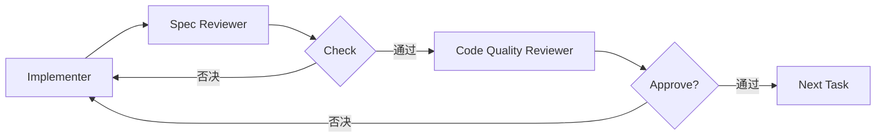
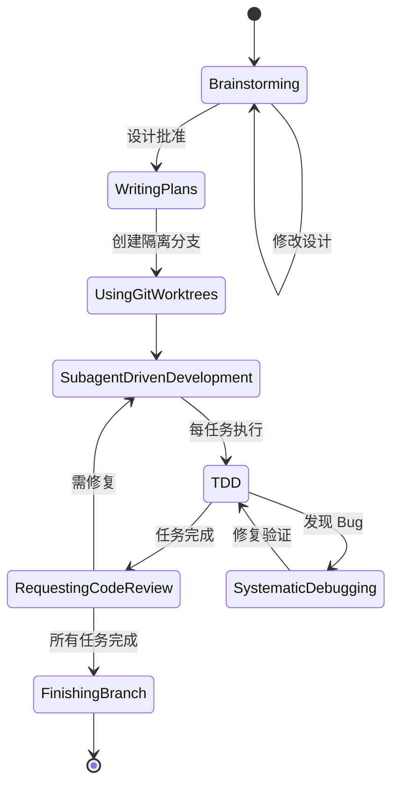
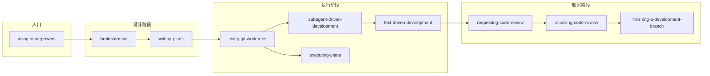

# Superpowers：AI 编程纪律框架

## 技能描述

Superpowers 是一套完整的 AI 编程方法论，通过组合多个 Skill 让 AI 代理从"随意的代码生成器"变成"有纪律的软件工程师"。

**解决的核心问题：** AI 编程失控——拿到需求就写代码，不理解真正的目标，缺乏系统性。

**核心创新：** HARD-GATE 强制门禁 + Subagent 双阶段审查 + TDD 铁律。

## 核心机制

### 1. HARD-GATE 强制门禁

用 `<HARD-GATE>` 标签强制关键步骤必须完成才能进入下一阶段：

```
<HARD-GATE>
Do NOT invoke any implementation skill, write any code...
until you have presented a design and the user has approved it.
</HARD-GATE>
```

软性建议会被 AI"合理化跳过"，HARD-GATE 强制门禁防止作弊。

### 2. 先设计后实现

> "Instead of jumping into trying to write code, it steps back and asks what you're really trying to do."

无论任务多简单，都要经过：brainstorming → design → plan → implementation。

### 3. 双阶段审查

每个任务完成后必须经过两阶段审查：



**先验证规范符合度，再验证代码质量。** 顺序不能颠倒。

### 4. TDD 铁律

```
NO PRODUCTION CODE WITHOUT A FAILING TEST FIRST
```

RED-GREEN-REFACTOR 循环：
- RED：写失败的测试
- GREEN：写最小代码让测试通过
- REFACTOR：重构清理

### 5. Subagent 隔离开发

主代理保持上下文协调，子代理专注执行，避免上下文污染：

- 同一会话内派发子代理
- 每个任务用 fresh subagent（无上下文污染）
- 2-5 分钟一个任务粒度

### 6. 模型分级使用

| 任务类型 | 模型选择 |
|----------|----------|
| 机械实现（1-2 文件，清晰规范） | 快速便宜模型 |
| 集成与判断（多文件协调） | 标准模型 |
| 架构设计与审查 | 最强模型 |

## 工作流程

### 完整开发流程



### Skill 依赖关系



## 核心 Skill

### brainstorming

**触发：** 任何创意工作之前（创建功能、构建组件、添加功能、修改行为）

**流程：**
1. 探索项目上下文
2. 提出视觉伴侣（如需要）
3. 逐个提问澄清需求
4. 提出 2-3 种方案（含权衡）
5. 分块展示设计，获取批准
6. 编写设计文档
7. Spec 自检
8. 用户审查
9. 调用 writing-plans

### subagent-driven-development

**触发：** 有实施计划，任务相对独立，在当前会话内执行

**流程：**
1. 读取计划，提取所有任务
2. 每个任务：派发 implementer → spec review → code quality review
3. 两阶段审查确保质量
4. 所有任务完成后最终代码审查

### test-driven-development

**触发：** 实现任何功能或修复 bug

**铁律：** 没有失败的测试就没有生产代码。

**循环：**
1. RED：写一个测试，展示预期行为
2. Verify RED：确认测试失败（不是因为错误）
3. GREEN：写最小代码让测试通过
4. Verify GREEN：确认测试通过
5. REFACTOR：清理重构

### writing-plans

将设计分解为 2-5 分钟可完成的小任务，每个任务有精确的文件路径、完整代码、验证步骤。

### systematic-debugging

4 步根因分析：
1. 复现问题
2. 收集症状
3. 追踪根因
4. 验证修复

### finishing-a-development-branch

任务完成后验证测试，提供选项：合并/PR/保留/丢弃，清理 worktree。

## 核心原则

| 原则 | 含义 |
|------|------|
| **YAGNI** | You Aren't Gonna Need It — 不要写不需要的代码 |
| **DRY** | Don't Repeat Yourself — 避免重复 |
| **TDD** | Test-Driven Development — 测试先行 |
| **人类 in-the-loop** | 每个关键阶段需要人类批准 |
| **Spec > Code** | 先确保实现对了，再确保代码写好了 |

## 适用场景

| 场景 | 适用度 |
|------|--------|
| ✅ 中大型功能开发 | ⭐⭐⭐⭐⭐ |
| ✅ 多人协作项目 | ⭐⭐⭐⭐⭐ |
| ✅ 需要高代码质量的项目 | ⭐⭐⭐⭐⭐ |
| ✅ 复杂系统重构 | ⭐⭐⭐⭐ |
| ❌ 简单脚本/原型 | ⭐ |
| ❌ 快速验证概念 | ⭐⭐ |
| ❌ 一次性任务 | ⭐⭐ |

## 与 OpenSpec 的对比

| 维度 | Superpowers | OpenSpec |
|------|-------------|----------|
| **核心理念** | AI 编程纪律 | 规格驱动开发 |
| **阶段重点** | 设计和 TDD | 规格和变更管理 |
| **审查方式** | 双阶段（spec + quality） | 验证命令 |
| **任务粒度** | 2-5 分钟 | 任务清单 |
| **适用工具** | Claude Code/Cursor 等 | 25+ AI 工具 |
| **变更管理** | Git Worktree 隔离 | Delta Specs |

## 安装

```bash
# Claude Code 官方市场
/plugin install superpowers@claude-plugins-official

# Claude Code 市场
/plugin marketplace add obra/superpowers-marketplace
/plugin install superpowers@superpowers-marketplace

# Cursor
/add-plugin superpowers

# OpenCode
Fetch and follow instructions from https://raw.githubusercontent.com/obra/superpowers/refs/heads/main/.opencode/INSTALL.md
```

## 参考链接

- GitHub：https://github.com/obra/superpowers
- Discord：https://discord.gg/35wsABTejz
- 作者：Jesse Vincent（fsck.com）
