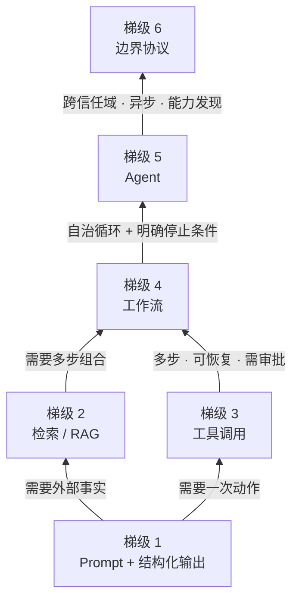

> **所在组**：Map · 总览 ｜ **上一组出口**：无 ｜ **本页出口**：能为任一需求选出最低复杂度方案，并说出它的升级触发条件
> **前置**：[技术地图](../index) ｜ **下一步**：[站点边界与知识 ownership](site-boundaries.md)；准备进入 Context 组的先读[提示词工程](../03-context/prompt)

## 1. 概述

**结论先讲**：面对任何 AI 需求，先在下面的阶梯里找到你的梯级，采用该梯级的**最低复杂度方案**；只有踩中明确的升级触发条件才上一级。这张表先于任何协议介绍——MCP、A2A、ACP、AG-UI 是梯级 6 的候选项，不是学习顺序。

### 心智模型：一张梯子

梯子只有一条规则：**默认在最低梯级，让证据把你推上去。** 上行的每一级都新增状态、边界和失败模式；下行的每一级都省掉一类你还没遇到的麻烦。

### 六级决策表

| 梯级 | 需求描述 | 最低复杂度方案 | 升级触发条件 | 降级反例 |
| --- | --- | --- | --- | --- |
| 1 | 固定输入 → 固定输出 | 提示词（prompt）+ 结构化输出（structured output） | 需要外部事实或动作 | 答案能写进 prompt / 上下文时，不要建检索管线 |
| 2 | 需要外部事实 | 检索 / RAG（Retrieval-Augmented Generation，检索增强生成） | 数据源多、权限 / 更新 / 延迟成为问题 | 知识量小且稳定时，直接放进上下文更便宜 |
| 3 | 需要一次受控动作 | 函数调用 / 工具调用（tool calling） | 多步、可恢复、需审批 → 梯级 4 | 单步操作不需要 agent 循环 |
| 4 | 需要多步决策 | 工作流（workflow）/ 同域子任务 | 需要自治循环和明确停止条件 → 梯级 5 | 步骤能静态枚举时，自治循环只增加风险 |
| 5 | 需要自治循环 | Agent（运行时 + 停止条件 + 权限边界） | 跨信任域、异步任务、能力发现、跨实现互操作 | 任务在同一进程内可完成时，不要跨边界协议 |
| 6 | 跨进程 / 组织 / 信任域 | 按连接方向选协议（MCP / A2A / ACP / AG-UI） | —（本阶梯顶） | 同 host 内的工具调用，直接函数 / HTTP 即可 |

### 决策对比表（每级新增了什么）

| 梯级 | 方向 | 控制权 | 新增状态 | 信任域 | 最低复杂度 |
| --- | --- | --- | --- | --- | --- |
| 1 | 读 | 你写 prompt，每次调用可改 | 无 | 进程内 | prompt + 输出 schema |
| 2 | 读 | 你控索引与更新节奏 | 检索库 + 数据新鲜度 | 数据源边界 | retrieval |
| 3 | 写（单次） | 函数边界 + 参数校验 | 调用结果与副作用 | 进程内 | tool calling |
| 4 | 写（多次） | 流程编排，步骤可静态枚举 | 多步状态与中间产物 | 进程内 | workflow |
| 5 | 读写循环 | 停止条件 + 权限边界 | 会话 / 记忆 / checkpoint | host 内 | agent runtime |
| 6 | 读写跨界 | 协议协商 + 能力发现 | 任务 / 消息 / artifact | 跨信任域 | 边界协议 |

「方向」指读世界（read world：检索、引用，默认无副作用）还是写世界（write world：工具、动作，改变外部状态）。写世界的每一级都必须显式处理权限、幂等、取消、重试与回滚。

### 何时使用 / 何时不用

- 用：动手前的选型、设计评审、判断「该不该上 agent / 协议」。
- 不用：已经确定梯级后的具体实现——去对应层的五段式章节。

历史版本里程碑：本阶梯于 2026-09 随 Issue #116 冻结，整合自旧版「训练决策树」与「workflow vs agent」讨论；更早来源未验证，不编造。

## 2. 使用

本页是决策工具，无可运行代码产物；「使用」= 决策演练（纸面即可，≤15 分钟）。验收标准：四个场景全部选中「最低复杂度方案 + 能说出为什么不上更高梯级」。

### 演练：四个场景

对每个场景，先自己选梯级，再对照预期输出。

**场景 A**：把客服邮件分成三类并给出置信度。
- 预期：梯级 1。固定输入 → 固定输出，prompt + 输出 schema 足够。
- 反例判断：不需要外部事实（不查工单库）、不需要动作（不改工单状态），无升级触发条件。

**场景 B**：问答必须基于公司内部 8000 篇 wiki。
- 预期：梯级 2。外部事实超出上下文预算，走检索 / RAG。
- 反例判断：如果只有 20 篇且每季更新，塞进上下文（梯级 1 + 长上下文）更便宜。

**场景 C**：用户确认后，把报销单写入审批系统。
- 预期：梯级 3。一次受控动作：工具调用 + 参数校验 + 权限边界。
- 反例判断：不需要模型决定「先查额度再写入再通知」的链条；若需要，才升梯级 4。

**场景 D**：研究助手自己读文献、交叉验证、写综述，何时停由它判断。
- 预期：梯级 5。自治循环成立的前提是你能写出**明确停止条件**（页数上限、时间上限、验证通过）和**权限边界**（只读沙箱）。
- 反例判断：如果步骤其实是「检索 → 摘要 → 汇总」的固定链，那是梯级 4 的工作流，不需要自治。

### 使用边界

- 本阶梯判断的是**系统形态**，不是模型能力：同一个模型可以服务所有梯级。
- 梯级之间可以组合（一个 agent 内部调用 RAG），但对外呈现的形态仍取最高涉及梯级，风险预算按该梯级评估。

## 3. 原理

### 为什么默认最低梯级

每一级升级都在三类成本上单调递增：

1. **状态**：梯级 1 无状态；梯级 2 有检索库与新鲜度；梯级 4 有多步中间产物；梯级 5 有会话、记忆与 checkpoint。状态越多，恢复与调试越贵。
2. **边界**：从进程内到数据源边界，再到跨信任域。每多一个边界，就多一类授权、版本与协议协商问题。
3. **失败模式**：梯级 1 失败是「输出不合 schema」，可当场重试；梯级 5 失败可能是「已经执行了三步副作用」，需要补偿与回滚。

低梯级方案的失败是**局部的、可重放的**；高梯级方案的失败是**分布式的、有副作用的**。这就是「证据推你上行」的原因：没有踩中触发条件就上行，你提前支付了还没有问题的那部分复杂度。

### 读世界 / 写世界是横切不变量

梯级 1–2 基本在读世界：提供证据，默认无副作用。梯级 3 起进入写世界：改变外部状态，必须显式处理权限、幂等、取消、重试、人工批准与回滚。这些不是某一级的专属话题，而是从梯级 3 起每一级都要回答的问题——行动、Agent 系统与生产各组的章节会反复回到这张清单。

### 为什么协议在梯顶

协议（梯级 6）解决的是「跨信任域的通信与能力发现」，它引入的不只是技术成本，还有组织成本：版本协商、安全边界、互操作性承诺。只有存在独立信任域、异步任务、能力发现或跨实现互操作需求时，协议才是正确选项。同一 host 内的工具接入，用直接函数调用或普通 HTTP 就够。

### 规范要求 vs 本地实测

本页是决策模式，无规范可实现测。各梯级方案的「规范 vs 实测」分栏见对应层章节：结构化输出与模型 API（推理与接口组）、RAG（知识接地组）、工具执行（行动组）、协议（互操作组）。

## 4. 开发

本页无代码集成；「开发」= 把阶梯用作设计与评审的门禁。

### 症状 → 证据 → 处理 → 完成标准

**症状**：系统随机失败、难调试，没人能说清一次请求经过了哪些组件。
**证据**：架构图里出现 agent / 协议，但需求描述落在梯级 1–3；trace 里大量与任务无关的循环步骤。
**处理**：按本表降级到满足验收的最低梯级；把被砍掉的能力列为显式待办（等触发条件出现再升级）。
**完成标准**：设计文档标注当前梯级、已核对的升级触发条件、以及「哪些触发条件已出现」的证据。

### 症状 → 证据 → 处理 → 完成标准

**症状**：团队争论「该不该上 agent」，各执一词。
**证据**：双方都写不出自治循环的**停止条件**与**权限边界**——这两个字段为空说明梯级 5 的准入条件不满足。
**处理**：先按梯级 4 工作流实现，把「步骤无法静态枚举」的案例收集起来作为升级证据。
**完成标准**：要么静态步骤清单跑通（留在梯级 4），要么攒到「枚举失败」的真实案例再升级。

### 症状 → 证据 → 处理 → 完成标准

**症状**：评审要求引入 MCP / A2A「以备将来对接」。
**证据**：当前所有协作都在同一 host / 进程内；没有第二个信任域、没有异步任务、没有能力发现需求。
**处理**：引用梯级 6 的升级触发条件逐条对照，全部未命中则改用进程内方案。
**完成标准**：设计文档写明「若未来出现 X（跨信任域 / 异步 / 能力发现），再引入协议 Y」。

### 反模式清单

- **名词驱动架构**：先选定热门协议 / 框架，再回头找能用它的场景。
- **跳级**：跳过输出 schema 与失败验收（梯级 1 的功课）直接上 agent——所有上层故障都会变成「模型不行」。
- **把 demo 当验收**：演示跑通 ≠ 停止条件、权限边界、回滚路径存在。这是「看似成功但证据不足」的典型路径。

## 5. 资料库

四级阅读路线：

- **Beginner**：读本页 + [技术地图](../index)的决策树；能复述六级与各自触发条件。
- **Builder**：进 [Context 组](../03-context/)，把梯级 1 做扎实（prompt + schema + 失败验收）。
- **Operator**：进 [Agent 系统组](../06-agent-systems/agent-runtime.md) 与 [Production 组](../08-production/)，学习梯级 3–5 的权限、幂等与回滚。
- **Researcher**：读下面 L1 级资料，理解业界对「workflow vs agent」边界的论证。

### 资源表

| 名称 | 证据层级 | canonical URL | 用途 | 支持的断言 | 下一步 |
| --- | --- | --- | --- | --- | --- |
| Building Effective Agents（Anthropic） | L1（维护者） | https://www.anthropic.com/research/building-effective-agents | workflow 与 agent 的边界、从简单组合开始的论证 | 「先组合后升级」的工程口径（retrievedAt 2026-09-01，HTTP 200） | 对照本页梯级 4 / 5 |
| MCP 官网 | L0（官方规范） | https://modelcontextprotocol.io/ | 梯级 6 候选项之一：Agent ↔ 工具 / 数据边界 | 协议解决边界通信（retrievedAt 2026-09-01，HTTP 200） | [MCP 章](../07-interoperability/mcp) |
| A2A 官网 | L0（官方规范） | https://a2a-protocol.org/ | 梯级 6 候选项之一：跨信任域 Agent 协作 | 跨信任域才需要远程协作协议（retrievedAt 2026-09-01，HTTP 200） | [A2A 章](../07-interoperability/a2a) |
| Learn LLM 第 11 章（RAG） | sibling | https://llm.zenheart.site/chapters/11-rag | 梯级 2 的底层原理（何时检索有效） | 检索原理归 Learn LLM（retrievedAt 2026-09-01，HTTP 200） | 本仓[知识接地组](../04-grounding/) |

### 主动证伪与未决问题

- 证伪入口：如果你找到了一个场景——梯级 N 的最低方案无法满足验收、且梯级 N-1 的触发条件未命中——本阶梯存在漏洞，应修订触发条件而不是掩盖场景。
- 未决：梯级 6 的「按连接方向选协议」细则（MCP / A2A / ACP / AG-UI 各自匹配的边界）在互操作组协议地图落地，本页只保留判断框架。

### learn-ai 到此为止 / 继续去哪

- 各梯级的实现细节：本仓各组对应章节。
- 梯级 2 / 5 的底层原理（检索数学、训练对行为的影响）：[Learn LLM](https://llm.zenheart.site/chapters/)。
- 证明每一级「做到位了」的评估方法：[evals](https://evals.zenheart.site/)。
