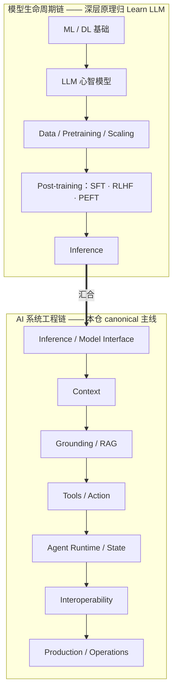

> **在哪一层**：层 0 · 方向与边界 ｜ **上一层出口**：无 ｜ **本层出口**：能说出模型生命周期如何影响工程决策（何时 prompt 不够、模型怎么选、成本怎么算），并知道深层原理去 Learn LLM 哪一章
> **前置**：[技术地图](../index) · [站点边界与知识 ownership](site-boundaries) ｜ **下一步**：[复杂度决策阶梯](complexity-ladder)；训练专题的附录桥接页（SFT / RLHF / PEFT）见 `appendices/model-lifecycle/`

## 1. 概述

**结论先讲**：模型生命周期（从数据、预训练、后训练到推理）必须在技术地图上有位置，否则你看不懂自己系统的上下游；但本仓只在它**影响工程决策**的深度上讲它——训练数学、实验细节与完整推导归 [Learn LLM](https://llm.zenheart.site/chapters/)。本页是 bridge（桥接定位页），不是教程。

### 心智模型：两条链在 Inference 汇合

你写的每一行 AI 应用代码，都从左链的末端（Inference）开始。左链决定「你手里这个模型是什么、会什么」；右链决定「你用它造什么」。两条链在 Inference / Model Interface 处汇合——这就是为什么层 1 的第一个主题是交互契约而不是模型结构。

### 关键术语（首现全称）

- **SFT**（Supervised Fine-Tuning，监督微调）：用标注样本继续训练，改变模型行为。
- **RLHF**（Reinforcement Learning from Human Feedback，人类反馈强化学习）：用人类偏好信号训练奖励模型再优化策略。
- **PEFT**（Parameter-Efficient Fine-Tuning，参数高效微调）：只训练少量附加参数（如 LoRA）以降低训练成本。
- **Scaling**：模型规模、数据量与算力共同决定能力的经验规律。

### 决策表：改行为还是加知识

| 方案 | 方向 | 控制权 | 状态 | 信任域 | 最低复杂度 |
| --- | --- | --- | --- | --- | --- |
| 提示词 + 上下文（prompt + context） | 读，即时可改 | 每次调用可调整 | 无 | 进程内 | 最低——默认从这里开始 |
| RAG（检索增强生成） | 读，随数据更新 | 你控索引与刷新节奏 | 检索库 | 数据源边界 | 中 |
| SFT / RLHF / PEFT | 改模型本身 | 训练管线 + 权重版本管理 | 模型权重版本 | 模型供应链 | 最高——本仓不展开实现 |

**经验法则（本仓立场，非量化断言）**：绝大多数应用需求应先穷尽 prompt + 上下文，再考虑 RAG；只有当你需要**改变模型的行为方式**（而非补充事实）且拥有大量高质量标注数据、训练预算与相应工程能力时，才评估后训练。三者任一不具备，先回 RAG。旧版训练页中「10,000+ 样本 / $10,000+ 预算」等具体数字无一手来源，已删除，不作断言。

### 生命周期影响哪三个工程决策

1. **何时 prompt 不够**：知识缺失 → 先 RAG（本仓层 3）；行为不符（语气、格式、拒绝策略）→ 调 prompt 与 few-shot；两者都穷尽且需求稳定 → 才讨论后训练。
2. **模型选择**：base / instruct / 微调 / 量化版本在能力、成本、部署位置上差异巨大；量化与推理 runtime 的数学归 Learn LLM，选型决策框架归本仓层 2。
3. **成本结构**：训练是一次性大额支出，推理与检索是持续变动支出；本仓层 5 讲成本治理，训练成本估算不在本仓展开。

历史版本里程碑：本页于 2026-09 随 Issue #116 从旧 `tech/training/index.md` 收拢重写为 bridge；旧页的「黄金法则」决策树保留其结论，量化数字因无来源删除。

## 2. 使用

**不适用：本页为桥接定位页，无可运行产物。**

理由：本页的产出是「判断 + 跳转」，不是代码；给它配 fixture 会伪造一个本仓并不拥有的实现域。替代动作（约 5 分钟）：

1. 在上图找到你当前关心的环节（例如「模型为什么不肯稳定输出 JSON」→ 左链 Post-training 与右链 Context 的交界）。
2. 判断它是工程问题还是原理问题：输出不稳定先按右链走[层 1 · 交互契约](../01-contracts/)；想理解后训练如何塑造指令遵循，走下面的 Learn LLM 链接。
3. 记录你的停止点：本仓正文到「后训练影响行为与指令遵循」为止。

## 3. 原理

### 为什么左链必须在地图上、又不在本仓展开

**必须在地图上**：不懂「模型来自一条训练管线」的工程师会把所有问题都当成 prompt 问题——不知道 instruct 与 base 模型的行为差异来自后训练，不知道上下文预算来自推理期缓存结构，不知道模型版本升级可能改变一切工程假设。地图缺少左链，右链的每个「为什么」都悬空。

**不在本仓展开**：训练数学、数据工程、实验方法是一个完整学科，Learn LLM 已按 21 章覆盖（retrievedAt 2026-09-01）。本仓复制任何一段推导都会制造第二 canonical 并随时间漂移（规则见[站点边界](site-boundaries)）。

### 汇合点的工程含义

Inference 是两条链唯一共享的节点，它把左链的全部历史（数据、规模、后训练）压缩成三个工程可见的接口属性：

- **行为**：指令遵循、格式稳定性、拒答边界——层 1 契约的直接约束对象。
- **预算**：上下文长度与缓存成本——层 1 上下文工程与层 5 成本的约束来源。
- **能力边界**：能做什么、不能做什么——层 4 工具与 Agent 设计的输入假设。

工程上你永远通过这三个属性消费模型，而不是通过其训练细节。这就是「模型是可替换的外部能力」这一主线设定的依据。

### 规范要求 vs 本地实测

不适用：本页无协议规范。站点层面的「实测」是资源库中各 Learn LLM 章节 URL 的 200 状态（retrievedAt 2026-09-01）。

## 4. 开发

**不适用：本页为桥接定位页，无集成、测试与回滚语义。**

维护规则（替代 runbook）：当 Learn LLM 章节结构调整时，重新核验本页全部 deep-link 并更新 `lastVerified`；本仓侧新增与生命周期相关的工程决策主题（如模型版本升级策略）时，在对应层章节内展开，本页只加一行指针。

## 5. 资料库

四级阅读路线：

- **Beginner**：读本页 + [技术地图](../index)；能说出两条链与汇合点。
- **Builder**：进 [层 1 · 交互契约](../01-contracts/)，从汇合点的工程侧开始动手。
- **Operator**：关注模型版本升级对契约与成本的影响（层 5）。
- **Researcher**：沿下面的 Learn LLM 章节下沉到训练与推理原理。

### 资源表（Learn LLM 章节，均 HTTP 200，retrievedAt 2026-09-01）

| 章节 | canonical URL | 对应本页环节 | 支持的断言 | 下一步 |
| --- | --- | --- | --- | --- |
| 章节目录（全书 21 章地图） | https://llm.zenheart.site/chapters/ | 两条链的完整展开 | 深层原理归 Learn LLM | 按环节选章 |
| 第 8 章 TinyGPT | https://llm.zenheart.site/chapters/08-tinygpt | Data / Pretraining | 预训练从零实现可见 | 理解 base 模型从哪来 |
| 第 6 章 Training Stability | https://llm.zenheart.site/chapters/06-training-stability | 预训练工程 | 训练稳定性是工程问题 | — |
| 第 10 章 Post-training | https://llm.zenheart.site/chapters/10-post-training | SFT / RLHF / PEFT | 后训练塑造行为与指令遵循 | 本仓附录桥接页（Wave 3 落位） |
| 第 9 章 Inference & Cache | https://llm.zenheart.site/chapters/09-inference-cache | 汇合点：Inference | 推理期缓存约束上下文预算 | 本仓[层 1 上下文](../01-contracts/context) |

### 主动证伪与未决问题

- 证伪入口：如果你发现一个工程决策**必须**依赖训练细节才能做对（例如本地微调的显存估算），说明它属于附录桥接页或 Learn LLM，而不是本页——请把断言下沉到正确 owner，不要在本页扩写。
- 未决：SFT / RLHF / PEFT 三个附录桥接页（`model-lifecycle-sft` / `-rlhf` / `-peft`）在 Wave 3 落位；落位前本页是它们唯一的入口。
- 未决：LoRA / QLoRA 的选型决策影响（显存、延迟、合并策略）计划保留在 PEFT 附录桥接页，具体门槛待该页编写时核验。

### learn-ai 到此为止 / 继续去哪

- 训练目标与数学（SFT / DPO / LoRA 推导）：Learn LLM [第 10 章](https://llm.zenheart.site/chapters/10-post-training)——本仓到此为止。
- 用模型开始造东西：本仓[复杂度决策阶梯](complexity-ladder)与[层 1 · 交互契约](../01-contracts/)。
- 证明效果可上线：[evals](https://evals.zenheart.site/)。
