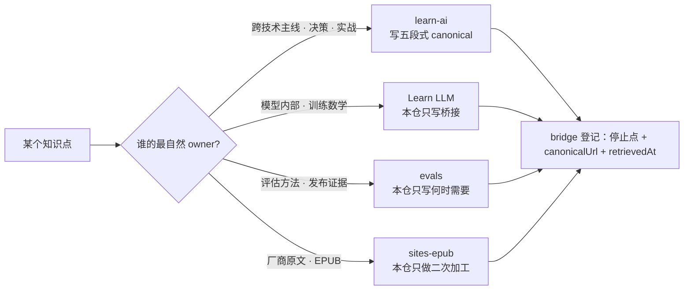

> **在哪一层**：层 0 · 方向与边界 ｜ **上一层出口**：无 ｜ **本层出口**：能判断一段知识该写在本仓还是跳转 sibling，并能写出合格的 bridge 链接
> **前置**：[技术地图](../index) ｜ **下一步**：[模型生命周期（桥接）](model-lifecycle-bridge)——本页规则的第一个完整示范

## 1. 概述

**结论先讲**：learn-ai 是跨技术主线的唯一 canonical，不是任何兄弟站的第二份拷贝。每个知识点只能有一个正文 owner；本仓遇到 sibling 已完整覆盖的主题时，只写「为什么它影响当前工程决策 + 停止点 + 下一跳」，禁止复制正文、完整推导、厂商长文或动态清单。

### 心智模型：一个知识点，一个 owner

### 四站 ownership 表

| Owner | 拥有（canonical） | 本仓保留 | 禁止复制 |
| --- | --- | --- | --- |
| **learn-ai**（本仓） | 跨技术主线、五段式章节、症状决策树、最小无密钥 fixture、调试 / 生产经验 | — | 不做任何 sibling 的第二 canonical |
| **Learn LLM** | 模型内部机制、训练数学、底层 RAG / Agent 原理 | 决策影响 + 停止点 + deep-link | 完整推导、训练实验细节 |
| **evals** | 评估方法、benchmark、scorer / judge、发布证据与评估流水线 | 何时需要证据 + 上线门如何接入 | 评估流水线实现、基准数据 |
| **sites-epub** | 厂商 docs / blog 原文捕获、EPUB 索引 | 跨厂商稳定概念的二次加工 + 阅读路线 | 厂商长文、动态命令 / 参数 / 套餐清单 |

### 决策表：一段内容写在哪

| 判断维度 | 写在本仓 | 跳转 sibling |
| --- | --- | --- |
| 方向 | 影响工程决策的主线知识 | 深层原理与方法论 |
| 控制权 | 本仓作者能维护、能验收 | 由 sibling 作者与流水线维护 |
| 状态 | 稳定概念，随版本演进慢 | 动态数字（章节数、价格、模型清单） |
| 信任域 | 本仓 reputation | sibling 的 canonical 地位 |
| 最低复杂度 | 一张 bridge 表 + 停止点 | — |

历史版本里程碑：四站分工于 2026-09 随 Issue #116 冻结；此前「Learn LLM 章节互链」散落在各页，本页收拢为唯一 ownership 规则页。

## 2. 使用

本页是规则页，无可运行代码产物；「使用」= bridge 链接演练（≤15 分钟，纸面即可）。验收标准：为三个真实主题各写出一条合格 bridge。

### 每站的停止点与下一跳

**Learn LLM**（https://llm.zenheart.site/）
- 停止点示例：讲到「KV Cache 决定了上下文预算的量级」即停，不展开注意力复杂度推导。
- 下一跳格式：链接到具体章节路径（如 `https://llm.zenheart.site/chapters/09-inference-cache`），不是首页。

**evals**（https://evals.zenheart.site/）
- 停止点示例：讲到「上线前需要可回放的证据」即停，不讲 judge 构建与基准设计。
- 下一跳格式：`https://evals.zenheart.site/book/` 下具体章节。

**sites-epub**（https://epub.zenheart.site/）
- 停止点示例：讲到「该概念出自某厂商文档」即停，不复制厂商命令与参数。
- 下一跳格式：站点索引页；当前站点 HTTPS 不可达（见下方核验表），引用前必须复核。

### 演练：写一条合格 bridge

以「嵌入（embedding）的向量几何」为例：

1. **判 owner**：数学与训练目标 → Learn LLM。
2. **找 canonical 具体路径**：`https://llm.zenheart.site/chapters/11-rag`（不是首页）。
3. **记 retrievedAt**：2026-09-01，HTTP 200。
4. **写停止点与下一跳**：「本仓讲到『嵌入把语义变成可比较的向量』为止；空间几何与训练目标见 Learn LLM 第 11 章。」

**负例**：只写「详见 Learn LLM」并链接首页——读者无法验证目标章节是否存在，也无法判断内容何时过期。

### 站点可访问性核验表

| 站点 | URL | 状态 | retrievedAt |
| --- | --- | --- | --- |
| Learn LLM | https://llm.zenheart.site/ | HTTP 200，正常 | 2026-09-01 |
| Learn LLM 章节目录 | https://llm.zenheart.site/chapters/ | HTTP 200，21 章地图可读 | 2026-09-01 |
| evals | https://evals.zenheart.site/ | HTTP 200，正常 | 2026-09-01 |
| evals 阅读入口 | https://evals.zenheart.site/book/ | HTTP 200 | 2026-09-01 |
| sites-epub | https://epub.zenheart.site/ | **warning**：TLS 证书不匹配（返回 `*.github.com` 证书），HTTPS 当前不可达 | 2026-09-01 |

sites-epub 的所有权声明继续有效（见 `_phase0/bridge-register.md`），但引用其内容前必须先复核站点恢复情况；本仓不基于不可达站点写死任何内容断言。

## 3. 原理

### 为什么一个知识点只能有一个 owner

复制正文的问题不是存储成本，而是**漂移成本**：sibling 更新后，本仓副本静默过期；读者看到两个版本，无法判断哪个可信；审计需要双倍核对。SSOT（single source of truth，单一事实源）原则把复制替换为**可验证的指针**：canonicalUrl + retrievedAt + 停止点。

### 为什么动态数字不进本仓

章节数、价格、可用性、模型清单都会变。静态复制它们等于在本仓埋定时过期数据。规则：这类事实只记 URL 与 retrievedAt，正文写稳定结论（「以站点当前为准」）。

### bridge 元数据字段

每条跨站跳转至少记录：

| 字段 | 含义 | 示例 |
| --- | --- | --- |
| canonicalTopicId | 本仓侧主题 ID | `context` |
| owner | 深层内容的 canonical 站点 | Learn LLM |
| 停止点（stop point） | 本仓正文到哪里为止 | 「KV Cache 限制上下文预算」 |
| canonicalUrl | 目标的具体路径（非首页） | `https://llm.zenheart.site/chapters/09-inference-cache` |
| sourceCommitOrVersion | 目标内容版本（可得时） | 章节修订号；不可得写「未提供」 |
| prerequisites / nextQuestion | 读者跳转前后的问题 | 「为什么上下文有预算」/「如何压缩上下文」 |
| lastVerified / retrievedAt | 最近核验日期 | 2026-09-01 |

完整登记表在仓库内 `_phase0/bridge-register.md` 维护（工程工件，不随站点发布）；对外页面只携带表中的 URL 与停止点。

### 规范要求 vs 本地实测

本页无协议规范。站点状态的「本地实测」即上方核验表；复核命令为对目标 URL 发起一次 HTTPS 请求并确认 200 与证书有效。

## 4. 开发

本页无代码集成；「开发」= ownership 冲突与链接失效的处置 runbook。

### 症状 → 证据 → 处理 → 完成标准

**症状**：同一主题在本仓与 sibling（或本仓两页）出现两份正文。
**证据**：内容审计发现重复论述；或两处版本说法不一致。
**处理**：判定 canonical owner——主线决策归本仓、深层原理归 sibling；败方改为 bridge（保留停止点 + 下一跳）或 redirect。
**完成标准**：该主题只剩一个 topicId、一份正文；bridge 登记表与 redirects.json 同步更新。

### 症状 → 证据 → 处理 → 完成标准

**症状**：资料库里的 sibling 深链 404 或内容对不上。
**证据**：retrievedAt 已超过一个季度；请求返回非 200。
**处理**：到 sibling 站点重新定位 canonical 路径，更新 canonicalUrl 与 retrievedAt；找不到等价内容时降级为首页链接并标注「具体章节未定位」。
**完成标准**：链接恢复 200 且锚点内容仍支持原断言。

### 症状 → 证据 → 处理 → 完成标准

**症状**：sibling 站点整体不可达（当前 sites-epub 的实况）。
**证据**：HTTPS 请求失败或证书不匹配。
**处理**：在涉及页面标注 warning 与 retrievedAt，不删除所有权记录，不基于该站新增内容断言。
**完成标准**：站点恢复 200 后更新状态行；期间新增引用为零。

### 反模式清单

- 「详见某站」+ 首页链接：不可验证、不可审计的桥。
- 把 sibling 章节翻译 / 摘要进本仓：制造第二 canonical。
- 静态复制动态数字（章节数、价格、模型列表）：埋定时过期数据。

## 5. 资料库

四级阅读路线：

- **Beginner**：读本页四站表；能判断「这段内容该写哪」。
- **Builder**：写第一条合格 bridge（见「使用」演练），并被复核。
- **Operator**：维护一个主题簇的 bridge 登记，季度复核 retrievedAt。
- **Researcher**：通读 sibling 站点结构，理解各自的知识定位。

### 资源表

| 名称 | 证据层级 | canonical URL | 用途 | 支持的断言 | 下一步 |
| --- | --- | --- | --- | --- | --- |
| Learn LLM | sibling | https://llm.zenheart.site/ | 模型内部机制的 canonical | 深层原理归该站（retrievedAt 2026-09-01，HTTP 200） | [章节目录](https://llm.zenheart.site/chapters/) |
| evals | sibling | https://evals.zenheart.site/ | 评估方法论的 canonical | 评估归该站（retrievedAt 2026-09-01，HTTP 200） | [阅读入口](https://evals.zenheart.site/book/) |
| evals 源码仓 | sibling | https://github.com/zenHeart/evals | 评估站的内容来源 | 仓站对应关系（retrievedAt 2026-09-01，HTTP 200） | — |
| sites-epub | sibling | https://epub.zenheart.site/ | 厂商原文与 EPUB 的 canonical | 所有权声明有效但站点当前不可达（retrievedAt 2026-09-01，warning） | 恢复后复核 |

### 主动证伪与未决问题

- 证伪入口：如果你发现某个 sibling 已完整覆盖的主题在本仓存在长正文（而非 bridge），本页规则被执行失败，应立案迁移而不是补充。
- 未决：sites-epub HTTPS 恢复时间未知；期间所有依赖该站的阅读路线都以 Learn LLM / evals 为替代入口。
- 未决：`sourceCommitOrVersion` 字段在多数 sibling 页面不可得，统一记「未提供」，待 sibling 提供稳定版本标识后升级。

### learn-ai 到此为止 / 继续去哪

- 本仓下一个示范：[模型生命周期（桥接）](model-lifecycle-bridge)——按本页规则写成的完整 bridge 页。
- 模型深层原理：[Learn LLM](https://llm.zenheart.site/chapters/)。
- 评估方法论：[evals](https://evals.zenheart.site/)。
