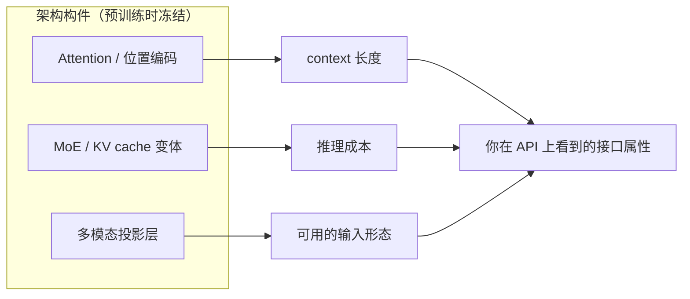

> **在哪一组**：组 01 · 模型生命周期（桥接组）｜ **上一组出口**：能判断知识归属、并为需求选出最低复杂度方案（00-map 组） ｜ **本页出口**：能把厂商发布里的架构术语（长上下文、MoE、缓存定价）翻译成 context 长度、推理成本与输入形态上的工程变量
> **前置**：[LLM 心智模型（桥接）](llm-mental-model.md) ｜ **下一步**：[数据、预训练与 Scaling（桥接）](data-pretraining-scaling.md)

## 1. 概述

**结论先讲**：应用工程师不需要会推导 Attention，但必须有**位置感**——架构在预训练时冻结，直接决定 context 长度、推理成本与多模态路径，这三样都出现在你的 API 账单和选型表里。本页给每个构件「是什么 / 影响你什么决策」的一句话定位；推导与手写实现归 Learn LLM 第 7、9、20 章。

### 一句话定位表

| 构件 | 是什么（一句话） | 影响你什么决策 |
| --- | --- | --- |
| Transformer | 基于 self-attention 的序列骨架，现代 LLM 的公共底座 | 换模型 = 换一组权重、接口不变；迁移成本远低于换范式 |
| Attention | 序列内 token 两两加权的关注机制；causal mask 保证逐 token 生成 | 注意力计算随序列长度增长——长上下文更贵的原因 |
| 位置编码（RoPE） | 把位置信息旋转进 query/key，让模型感知 token 顺序 | 模型标称 context 长度的来源；窗口扩展是版本升级的常变量 |
| MoE（混合专家） | 每层只激活部分专家参数：总参数大、单 token 激活小 | 参数量与每 token 成本脱钩；厂商定价差异的架构根源 |
| KV cache 与 MQA / GQA | 推理期缓存注意力的键值，及其体积压缩变体 | prefill / decode 成本结构与 prompt 前缀缓存定价 |

### 为什么是位置感而不是推导能力

架构是左链把物理约束冻结成接口属性的位置：训练结束后，谁也不能改这个模型的窗口假设或专家路由，只能等厂商发新版本。因此架构知识的工程形态是「读 release note 与定价页时的解码能力」，不是可写能力。厂商发布会上的「更长上下文」「更便宜档位」几乎都是架构变量——但落地约束以厂商文档为准。

## 2. 何时跳转

本页无可运行产物；按下表路由：

| 症状 / 问题 | 该读哪 | 为什么 |
| --- | --- | --- |
| 想看 Attention 手写实现、causal mask 为什么存在 | Learn LLM [第 7 章](https://llm.zenheart.site/chapters/07-attention) | Transformer 从零实现的 canonical |
| KV cache、量化、prefill / decode 成本模型 | Learn LLM [第 9 章](https://llm.zenheart.site/chapters/09-inference-cache) | 推理优化的工程细节 |
| MLA / MoE 记账 / 现代架构专题 | Learn LLM [第 20 章](https://llm.zenheart.site/chapters/20-deepseek) | DeepSeek 系架构专题 |
| API 计费、前缀缓存折扣怎么用 | 本仓 [Model API 契约](../02-inference-interface/model-api.md) | 应用侧消费方式归本仓 |
| 长会话该塞多少上下文 | 本仓 [03-context 组](../03-context/) | 上下文取舍是本仓主线 |
| 厂商新架构版本对线上的影响 | 本仓 [08-production 组](../08-production/) | 版本升级回归是运维问题 |

## 3. 原理

一段定位：Transformer 用 self-attention 替代循环结构获得训练并行性，代价是注意力计算随长度增长；RoPE 决定模型能外推到多长的上下文；MoE 用稀疏激活把「总参数」与「单次计算」解耦；KV cache 把 decode 从重算变成查表。这四句话就是应用工程师需要的全部架构原理——scaled dot-product 为什么除以 √d、RoPE 的复数形式、专家路由的负载均衡，Learn LLM 第 7、9、20 章逐步推导（retrievedAt 2026-09-01），本仓不复制。

## 4. 工程决策影响

| 工程决策 | 架构事实 | 工程动作 |
| --- | --- | --- |
| 长会话成本估算 | 注意力与 KV cache 体积随长度增长 | 长历史做摘要与裁剪；关注厂商前缀缓存定价 |
| 模型家族选型 | dense 与 MoE 的成本结构不同 | 按任务分级，对比每任务实际成本而非参数量 |
| 上下文窗口升级 | 窗口扩展常伴随行为变化 | 升级后先跑回归评估再切换 |
| 多模态接入 | 图像经投影层进 token 空间、按 token 计费 | 预算按 token 折算，不等同像素或分辨率 |
| 本地 / 边缘部署 | 量化变体改变精度-成本平衡 | 数学归 Learn LLM 第 9 章；选型决策走本仓 02-inference-interface 组 |

维护规则（替代 runbook）：Learn LLM 第 7/9/20 章结构调整时重验本页 deep-link 并更新 `lastVerified`；本页不维护各厂商的架构采用清单——那会随版本漂移，以各厂商模型文档为准。

## 5. 资料库

四级阅读路线：

| 级 | 读什么 | 为什么是这个顺序 |
| --- | --- | --- |
| Beginner | 本页定位表 + [组导览](./index) | 先建立「构件 → 接口属性」的映射 |
| Builder | 本仓 [Model API 契约](../02-inference-interface/model-api.md) | 在接口层消费这些架构属性 |
| Operator | [成本与性能](../08-production/cost-performance.md) | 把架构变量纳入成本治理 |
| Researcher | Learn LLM 第 7、9、20 章 + 三篇原始论文 | 下沉到机制与推导 |

### 资源表

| 名称 | 层级 | canonical URL | 支持的断言 | 下一步 |
| --- | --- | --- | --- | --- |
| Learn LLM 第 7 章 · Transformer | E | https://llm.zenheart.site/chapters/07-attention | Attention / causal mask / 多头的从零实现 | 手写 Transformer Block |
| Learn LLM 第 9 章 · 推理与量化 | E | https://llm.zenheart.site/chapters/09-inference-cache | RoPE、KV cache、MQA/GQA、量化的工程细节 | 理解推理成本结构 |
| Learn LLM 第 20 章 · DeepSeek 专题 | E | https://llm.zenheart.site/chapters/20-deepseek | MLA / MoE 记账与现代架构演进 | 扩展专题选读 |
| Attention Is All You Need（Vaswani et al., 2017） | L4 | https://arxiv.org/abs/1706.03762 | Transformer 架构的原始论文 | 读 attention 一节 |
| RoFormer（Su et al., 2021） | L4 | https://arxiv.org/abs/2104.09864 | RoPE 位置编码的提出 | 读旋转位置编码一节 |
| Switch Transformers（Fedus et al., 2021） | L4 | https://arxiv.org/abs/2101.03961 | 稀疏 MoE 的代表工作 | 读专家路由一节 |

（Learn LLM 章节经其章节目录核验、arXiv 链接为稳定 abs 地址，retrievedAt 均为 2026-09-01。）

### 主动证伪与未决问题

- 证伪入口：如果你发现某决策必须依赖架构推导才能做对（如自实现注意力内核），它属于 Learn LLM 或推理引擎团队，不是本页——请下沉断言，不要在此扩写。
- 未决：各厂商对 MQA / GQA / MLA 与长上下文外推的采用情况随版本快速漂移，本页不维护采用清单；使用时以各厂商模型卡与定价页为准。

### learn-ai 到此为止 / 继续去哪

- Attention、RoPE、MoE 的机制与推导：Learn LLM 第 7、9、20 章——本仓到此为止。
- 在接口层消费架构属性：本仓 [02-inference-interface 组](../02-inference-interface/)。
- 组内下一页：[数据、预训练与 Scaling（桥接）](data-pretraining-scaling.md)。
