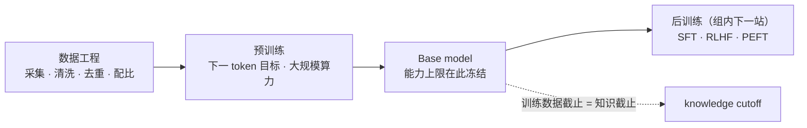

> **在哪一组**：组 01 · 模型生命周期（桥接组）｜ **上一组出口**：能判断知识归属、并为需求选出最低复杂度方案（00-map 组） ｜ **本页出口**：能解释 knowledge cutoff 的根源，并用「能力上限冻结于预训练」约束模型选型、时效知识方案与版本升级回归
> **前置**：[模型架构（桥接）](architecture.md) ｜ **下一步**：[后训练](post-training/)（组内子组）；深层原理去 [Learn LLM](https://llm.zenheart.site/chapters/)

## 1. 概述

**结论先讲**：base model 的能力上限在预训练结束那一刻冻结。数据配比、规模与算力的权衡（scaling law）决定「这个模型会什么、不会什么」。这条链解释三件应用层的事：knowledge cutoff 的根源、厂商模型档位与定价的结构、以及为什么某个模型在你的任务上不可靠。本页只讲这条链的工程含义；预训练全流程的从零实现归 [Learn LLM 第 8 章](https://llm.zenheart.site/chapters/08-tinygpt)。

### 链条

### 三个工程后果

1. **Knowledge cutoff 的根源在这条链**。模型的事实知识来自预训练语料的收集截止点；后训练与产品包装改变行为，不更新权重里的世界知识。时间敏感的事实必须走检索（[RAG](../04-grounding/rag.md)）；cutoff 是要核对的接口属性，不是缺陷。
2. **Scaling law 是厂商档位的结构**。Kaplan 与 Chinchilla 两篇工作确立了「损失随参数、数据、算力按可预测规律下降，且参数与数据存在算力最优配比」（本页不复述具体指数）。工程翻译：能力档位是可购买的算力决策，厂商把这条曲线切成分层定价——你的选型就是在这条曲线上选点。
3. **数据质量决定任务可靠性**。你的领域在预训练语料中的占比与清洗质量决定模型「开箱」的表现；评测集数据若混入预训练语料（contamination），榜单分数会被抬高。单一排行榜不可作为选型依据——用你自己的评估集（[evals](https://evals.zenheart.site/)、[评估](../08-production/evaluation.md)）。

## 2. 何时跳转

本页无可运行产物；按下表路由：

| 症状 / 问题 | 该读哪 | 为什么 |
| --- | --- | --- |
| 想看预训练从零跑通（TinyGPT、checkpoint、loss 曲线） | Learn LLM [第 8 章](https://llm.zenheart.site/chapters/08-tinygpt) | 预训练全流程的 canonical |
| 训练为什么 / 何时会不稳定 | Learn LLM [第 6 章](https://llm.zenheart.site/chapters/06-training-stability) | 训练稳定性工程 |
| scaling law 的原始论述 | Kaplan / Chinchilla 论文（见资料表） | 一手来源，本页只留结论 |
| 时间敏感的知识怎么办 | 本仓 [RAG](../04-grounding/rag.md) | 时效知识走检索不走权重 |
| 怎么可靠地选模型 | 本仓 [评估](../08-production/evaluation.md) + evals 站 | 榜单可能被污染，自建评估集 |
| 新知识要不要微调进权重 | 组内 [SFT（桥接）](post-training/sft.md) | 动权重的决策门 |

## 3. 原理

一段定位：预训练是把「下一 token 预测」目标在海量语料上跑足够多步；scaling law 是这条流水线的经验规律而非物理定律——它指导厂商的训练预算分配，并以模型档位与定价的形式被你消费。数据工程的细节（去重、配比、过滤）与训练稳定性归 Learn LLM 第 6、8 章（retrievedAt 2026-09-01）。本仓的停止点在「能力上限冻结于预训练」：这不是价值判断，而是改不动已发布权重的工程事实。

## 4. 工程决策影响

| 工程决策 | 由这条链推出的判断 | 错误预期会付出的代价 |
| --- | --- | --- |
| 模型选型 | 上限冻结于预训练；榜单分数可能被 contamination 抬高 | 按 leaderboard 选型，上线后任务表现不符 |
| 知识时效方案 | cutoff 是硬属性，不会因为提示而消失 | 指望新模型「应该知道」最近发生的事 |
| 版本升级 | 新版本 = 新数据 + 新预训练，工程假设可能全部变化 | 直接切 latest 版本，未跑回归评估 |
| 成本结构理解 | 档位定价是 scaling 曲线的切片 | 混淆「更贵」与「更适合我的任务」 |
| 领域可靠性验证 | 语料占比决定开箱表现 | 假设专业领域零样本可靠，不做样本测试 |

维护规则（替代 runbook）：Learn LLM 第 6/8 章结构调整时重验本页 deep-link 并更新 `lastVerified`；主流模型的具体 cutoff 日期与语料构成是厂商披露信息，本页不维护清单——使用时以各厂商模型卡为准。

## 5. 资料库

四级阅读路线：

| 级 | 读什么 | 为什么是这个顺序 |
| --- | --- | --- |
| Beginner | 本页 + [组导览](./index) | 建立「链条 → 三个工程后果」的映射 |
| Builder | [RAG](../04-grounding/rag.md) + [评估](../08-production/evaluation.md) | 把 cutoff 与可靠性问题接到主线方案 |
| Operator | [评估](../08-production/evaluation.md) 的版本回归视角 | 每次模型升级先跑回归 |
| Researcher | Learn LLM 第 6、8 章 + 两篇 scaling 论文 | 下沉到预训练与规模规律的一手论述 |

### 资源表

| 名称 | 层级 | canonical URL | 支持的断言 | 下一步 |
| --- | --- | --- | --- | --- |
| Learn LLM 第 8 章 · TinyGPT | E | https://llm.zenheart.site/chapters/08-tinygpt | 预训练、过拟合、checkpoint 与恢复的从零实现 | 跑通一次预训练 |
| Learn LLM 第 6 章 · 训练稳定性 | E | https://llm.zenheart.site/chapters/06-training-stability | 训练稳定性是工程问题 | 理解训练诊断 |
| Scaling Laws for Neural Language Models（Kaplan et al., 2020） | L4 | https://arxiv.org/abs/2001.08361 | 损失随参数/数据/算力的幂律关系的系统量化 | 读 loss-vs-scale 图 |
| Training Compute-Optimal LLMs（Chinchilla，Hoffmann et al., 2022） | L4 | https://arxiv.org/abs/2203.15556 | 参数与数据存在算力最优配比 | 对照 Kaplan 结论 |
| evals 站 | E | https://evals.zenheart.site/ | 评估方法与发布证据的 canonical sibling | 建自己的评估集 |

（Learn LLM 章节经其章节目录核验、arXiv 链接为稳定 abs 地址，retrievedAt 均为 2026-09-01。）

### 主动证伪与未决问题

- 证伪入口：需要具体训练预算、数据量或语料配比估算的决策（如自训模型的算力规划）属于 Learn LLM 或 ML 团队，不是本页——请下沉断言，不要在此扩写。
- 未决：contamination 的公开检测方法与各模型卡披露口径不统一，本页未逐模型核验；选型时以自建评估集结果为准。

### learn-ai 到此为止 / 继续去哪

- 训练数据工程与实验方法：Learn LLM 第 6、8 章——本仓到此为止。
- 给模型补充时效知识：本仓 [04-grounding 组](../04-grounding/)。
- 组内下一站：[后训练](post-training/)（SFT / RLHF / PEFT 的工程决策桥）。
