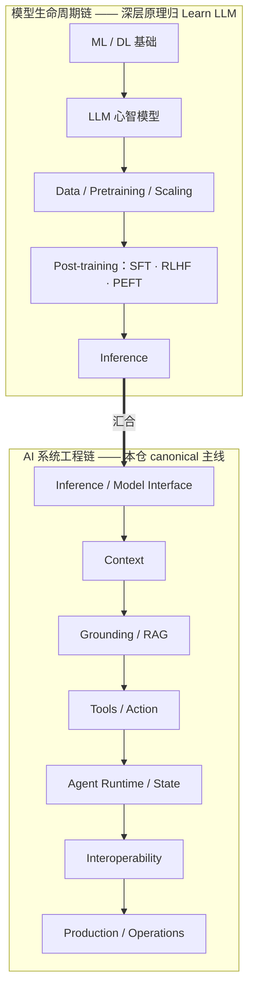

> **在哪一组**：组 01 · 模型生命周期（桥接组）｜ **上一组出口**：能判断知识归属、并为需求选出最低复杂度方案（00-map 组） ｜ **本组出口**：能说出模型生命周期如何影响工程决策（何时 prompt 不够、模型怎么选、成本怎么算），并知道深层原理去 Learn LLM 哪一章
> **前置**：[站点边界与知识 ownership](../00-map/site-boundaries.md) ｜ **下一步**：[LLM 心智模型（桥接）](llm-mental-model.md)；读完本组进 [02-inference-interface 组](../02-inference-interface/)

## 1. 概述

**结论先讲**：模型生命周期（从数据、预训练、后训练到推理）必须在技术地图上有位置，否则你看不懂自己系统的上下游；但本仓只在它**影响工程决策**的深度上讲它——训练数学、实验细节与完整推导归 [Learn LLM](https://llm.zenheart.site/chapters/)。本组是桥接组：四页各桥一个概念域，正文只写「概念定位 → 为什么应用工程师需要知道 → 决策影响 → 链接 Learn LLM」，不复制推导。

### 心智模型：两条链在 Inference 汇合

你写的每一行 AI 应用代码，都从左链的末端（Inference）开始。左链决定「你手里这个模型是什么、会什么」；右链决定「你用它造什么」。两条链在 Inference / Model Interface 处汇合——这就是为什么下一组（02-inference-interface）的第一个主题是接口契约而不是模型结构。

### 组内导航（4 页，按序读）

| 页 | 回答的问题 | 一句话结论 |
| --- | --- | --- |
| [LLM 心智模型](llm-mental-model.md) | 模型到底是什么 | 参数化条件概率模型：prompt 调用能力不注入知识、context 是硬约束、temperature 是采样参数 |
| [模型架构](architecture.md) | 架构术语如何变成账单 | 不必会推导，但要把 Attention / RoPE / MoE / KV cache 翻译成 context 长度与推理成本 |
| [数据、预训练与 Scaling](data-pretraining-scaling.md) | 模型的知识与上限从哪来 | 能力上限冻结于预训练：knowledge cutoff、定价档位、任务可靠性都源于这条链 |
| [后训练](post-training/)（子组三页） | 何时值得动权重 | SFT / RLHF / PEFT 的工程决策桥；先穷尽 prompt 与 RAG |

### 关键术语（首现全称）

- **SFT**（Supervised Fine-Tuning，监督微调）：用标注样本继续训练，改变模型行为。
- **RLHF**（Reinforcement Learning from Human Feedback，人类反馈强化学习）：用人类偏好信号训练奖励模型再优化策略。
- **PEFT**（Parameter-Efficient Fine-Tuning，参数高效微调）：只训练少量附加参数（如 LoRA）以降低训练成本。
- **Scaling**：模型规模、数据量与算力共同决定能力的经验规律。

## 2. 何时跳转

本组无可运行产物；替代动作（约 5 分钟）：在总图上找到你关心的环节（例如「模型为什么不肯稳定输出 JSON」→ 左链 Post-training 与右链 Context 的交界），判断它是工程问题还是原理问题（工程问题走右链的本仓组，原理问题跳 Learn LLM），并记录停止点——本组正文到「生命周期塑造接口属性」为止。查单个问题时直接按表进：

| 症状 / 问题 | 去哪 |
| --- | --- |
| 模型「不知道」某事实、知识过时 | [数据、预训练与 Scaling](data-pretraining-scaling.md) → [RAG](../04-grounding/rag.md) |
| 账单 / 延迟与预期不符 | [模型架构](architecture.md) → [成本与性能](../08-production/cost-performance.md) |
| 输出格式不稳定 | [结构化输出](../02-inference-interface/structured-output.md)（接口契约问题，不是模型理解问题） |
| 想真正理解训练与推理内部 | [Learn LLM 章节目录](https://llm.zenheart.site/chapters/)（全书 21 章） |

## 3. 原理

### 为什么左链必须在地图上、又不在本仓展开

**必须在地图上**：不懂「模型来自一条训练管线」的工程师会把所有问题都当成 prompt 问题——不知道 instruct 与 base 模型的行为差异来自后训练，不知道上下文预算来自推理期缓存结构，不知道模型版本升级可能改变一切工程假设。地图缺少左链，右链的每个「为什么」都悬空。

**不在本仓展开**：训练数学、数据工程、实验方法是一个完整学科，Learn LLM 已按 21 章覆盖（retrievedAt 2026-09-01）。本仓复制任何一段推导都会制造第二 canonical 并随时间漂移（规则见[站点边界](../00-map/site-boundaries.md)）。

### 汇合点的工程含义

Inference 是两条链唯一共享的节点，它把左链的全部历史（数据、规模、后训练）压缩成三个工程可见的接口属性：

- **行为**：指令遵循、格式稳定性、拒答边界——接口契约（02-inference-interface 组）的直接约束对象。
- **预算**：上下文长度与缓存成本——上下文工程（03-context 组）与成本治理（08-production 组）的约束来源。
- **能力边界**：能做什么、不能做什么——工具与 Agent 设计（05-action、06-agent-systems 组）的输入假设。

工程上你永远通过这三个属性消费模型，而不是通过其训练细节。这就是「模型是可替换的外部能力」这一主线设定的依据。

**规范要求 vs 本地实测**：不适用——本组无协议规范；站点层面的「实测」是资源库中各 Learn LLM 章节 URL 的 200 状态（retrievedAt 2026-09-01）。

## 4. 工程决策影响

### 决策表：改行为还是加知识

| 方案 | 方向 | 控制权 | 状态 | 信任域 | 最低复杂度 |
| --- | --- | --- | --- | --- | --- |
| 提示词 + 上下文（prompt + context） | 读，即时可改 | 每次调用可调整 | 无 | 进程内 | 最低——默认从这里开始 |
| RAG（检索增强生成） | 读，随数据更新 | 你控索引与刷新节奏 | 检索库 | 数据源边界 | 中 |
| SFT / RLHF / PEFT | 改模型本身 | 训练管线 + 权重版本管理 | 模型权重版本 | 模型供应链 | 最高——本仓不展开实现 |

**经验法则（本仓立场，非量化断言）**：绝大多数应用需求应先穷尽 prompt + 上下文，再考虑 RAG；只有当你需要**改变模型的行为方式**（而非补充事实）且拥有大量高质量标注数据、训练预算与相应工程能力时，才评估后训练。三者任一不具备，先回 RAG。旧版训练页中「10,000+ 样本 / $10,000+ 预算」等具体数字无一手来源，已删除，不作断言。

### 生命周期影响哪三个工程决策

1. **何时 prompt 不够**：知识缺失 → 先 RAG（04-grounding 组）；行为不符（语气、格式、拒绝策略）→ 调 prompt 与 few-shot；两者都穷尽且需求稳定 → 才讨论后训练（组内 [post-training/](post-training/)）。
2. **模型选择**：base / instruct / 微调 / 量化版本在能力、成本、部署位置上差异巨大；量化与推理 runtime 的数学归 Learn LLM，选型决策框架归 02-inference-interface 组。
3. **成本结构**：训练是一次性大额支出，推理与检索是持续变动支出；成本治理见 08-production 组，训练成本估算不在本仓展开。

维护规则（替代 runbook）：当 Learn LLM 章节结构调整时，重新核验本组全部 deep-link 并更新各页 `lastVerified`；本仓侧新增与生命周期相关的工程决策主题（如模型版本升级策略）时，在对应组章节内展开，本导览只加一行指针。

## 5. 资料库

四级阅读路线：

- **Beginner**：本导览 + [LLM 心智模型](llm-mental-model.md)——能说出两条链、汇合点与一个正确的心智模型。
- **Builder**：进 [02-inference-interface 组](../02-inference-interface/)，从汇合点的工程侧开始动手——本组给判断，接口组给实现。
- **Operator**：关注模型版本升级对契约与成本的影响（08-production 组）——升级会改变本组全部假设。
- **Researcher**：沿下面的 Learn LLM 章节下沉到训练与推理原理——深层原理的唯一 canonical。

### 资源表（Learn LLM 章节，均经章节目录核验，retrievedAt 2026-09-01）

| 章节 | canonical URL | 对应本组环节 | 支持的断言 | 下一步 |
| --- | --- | --- | --- | --- |
| 章节目录（全书 21 章地图） | https://llm.zenheart.site/chapters/ | 两条链的完整展开 | 深层原理归 Learn LLM | 按环节选章 |
| 第 4 章 字符语言模型 | https://llm.zenheart.site/chapters/04-probabilistic-lm | LLM 心智模型 | 条件概率与采样是核心机制 | 组内[心智模型页](llm-mental-model.md) |
| 第 7 章 Transformer | https://llm.zenheart.site/chapters/07-attention | 模型架构 | Attention / causal mask / 多头的从零实现 | 组内[架构页](architecture.md) |
| 第 8 章 TinyGPT | https://llm.zenheart.site/chapters/08-tinygpt | Data / Pretraining | 预训练从零实现可见 | 组内[数据预训练页](data-pretraining-scaling.md) |
| 第 6 章 Training Stability | https://llm.zenheart.site/chapters/06-training-stability | 预训练工程 | 训练稳定性是工程问题 | — |
| 第 10 章 Post-training | https://llm.zenheart.site/chapters/10-post-training | SFT / RLHF / PEFT | 后训练塑造行为与指令遵循 | 组内[后训练子组](post-training/) |
| 第 9 章 推理与量化 | https://llm.zenheart.site/chapters/09-inference-cache | 汇合点：Inference | 推理期缓存约束上下文预算 | [03-context 组](../03-context/) |

### 主动证伪与未决问题

- 证伪入口：如果你发现一个工程决策**必须**依赖训练细节才能做对（例如本地微调的显存估算），说明它属于组内后训练子组或 Learn LLM，而不是本导览——请把断言下沉到正确 owner，不要在此扩写。
- 未决：LoRA / QLoRA 选型影响的 owner 是组内 [PEFT 页](post-training/peft.md)；Learn LLM 章节深度链接以 2026-09-01 全量核验为基线，章节结构变化时随维护规则重验。

### learn-ai 到此为止 / 继续去哪

- 训练目标与数学（SFT / DPO / LoRA 推导）：Learn LLM [第 10 章](https://llm.zenheart.site/chapters/10-post-training)——本仓到此为止。
- 用模型开始造东西：本仓 [02-inference-interface 组](../02-inference-interface/)与[复杂度决策阶梯](../00-map/complexity-ladder.md)。
- 证明效果可上线：[evals](https://evals.zenheart.site/)。
