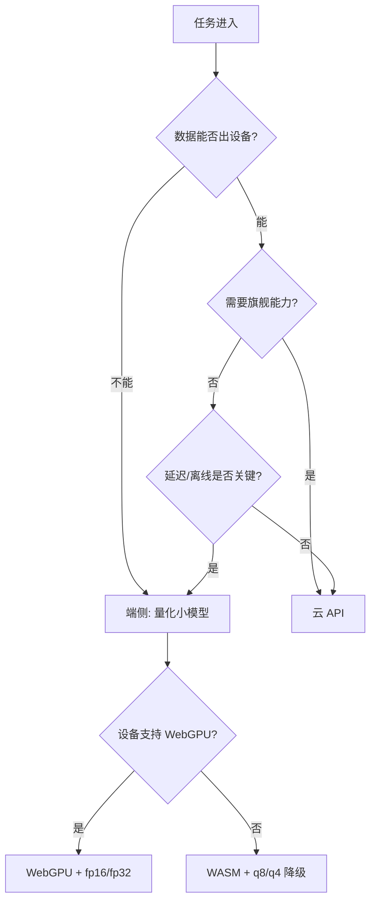

# 浏览器与端侧推理

> **在哪一层**：层 2 · 应用接入 ｜ **上一层出口**：能写并验证输入/输出 schema ｜ **本层出口**：能判断该不该端侧、选对运行库、设计带降级的接入链
> **前置**：[模型 API 契约](model-api.md) ｜ **下一步**：[嵌入与检索](../04-grounding/embeddings-retrieval)、[成本与性能](../08-production/cost-performance)

## 1. 概述

端侧推理（Edge Inference）解决的问题是：**有些任务不该把数据送出去，有些场景等不起网络**。把模型放到浏览器里跑，换来隐私（数据不出设备）、离线可用、零 per-token 费用与低延迟小任务；付出的代价是**模型质量上限**——端侧跑的是量化小模型，与云端旗舰不在一个能力量级。

本页是层 2 的一个**接入位置决策**：同一个"能力 → 产品交互"的问题，执行环境从云端 API 换成了设备本身。



### 何时使用 / 何时不用

- **用**：隐私敏感（输入不可离开设备）；离线场景；高频小任务（分类、抽取、嵌入）的边际成本控制；交互延迟敏感且小模型够用。
- **不用**：任务需要旗舰模型质量（复杂推理、长文写作）；首次加载带宽敏感且任务低频（为一次分类下载几十 MB 不值）；设备面必须覆盖 WebGPU 之外的旧浏览器且延迟要求又高。

### 决策表：云 API vs 端侧 vs 混合

| 方式 | 方向 | 控制权 | 状态 | 信任域 | 最低复杂度 |
| --- | --- | --- | --- | --- | --- |
| 云 API | 出站请求 | 厂商控制模型与容量 | 厂商侧会话便利层 | 数据离开设备 | fetch 即用 |
| 端侧推理 | 设备内执行 | 完全自管（模型分发/运行时） | 设备本地 | 数据不出设备 | 模型分发 + 运行时集成 |
| 混合 | 按任务分流 | 两套都要管 | 两边都有 | 敏感小任务端侧、复杂任务云 | 最高，两套链路 |

**混合是常态终点**：端侧做前置（分类、脱敏、嵌入），云端做重活（生成、推理）。

### 历史版本里程碑

- 执行环境从 WASM（CPU，全兼容）演进到 WebGPU（GPU，Chromium 系浏览器）；WebGL 处于维护模式，官方建议新项目用 WebGPU（ONNX Runtime Web 支持矩阵，retrievedAt 2026-09-01）。
- transformers.js 包名从 `@xenova/transformers`（v2）迁移到 `@huggingface/transformers`（v3+，官方文档当前命名，retrievedAt 2026-09-01）。
- WebGPU 在部分浏览器仍是实验性（Hugging Face 官方文档原话提醒，retrievedAt 2026-09-01）。

## 2. 使用

### 最小实战：环境检测与降级链（≤15 分钟，Node 可跑检测逻辑）

端侧代码需要浏览器环境才能完整验证，本 fixture 先在 Node 里验证**决策逻辑**（检测 → 选择 device/dtype），浏览器部分标"需要浏览器环境验证"。环境：Node ≥ 23.6。保存为 `edge-detect.mts`：

```ts
// fixture: 端侧接入的降级决策链（纯逻辑，Node 可验证）。
interface EdgeConfig { backend: 'webgpu' | 'wasm'; dtype: 'fp16' | 'fp32' | 'q8' | 'q4'; reason: string }

// 模拟浏览器的环境探测输入（真实环境由 navigator 采集）
function detectEnvironment(hasWebGPU: boolean, isLowPowerDevice: boolean): EdgeConfig {
  if (hasWebGPU && !isLowPowerDevice) {
    return { backend: 'webgpu', dtype: 'fp16', reason: 'GPU available, prefer half precision' };
  }
  if (hasWebGPU && isLowPowerDevice) {
    return { backend: 'webgpu', dtype: 'q4', reason: 'GPU available but memory constrained' };
  }
  return { backend: 'wasm', dtype: 'q8', reason: 'no WebGPU, fall back to CPU with 8-bit quantization' };
}

// 决策表验证：三种典型设备
const show = (name: string, cfg: EdgeConfig) => console.log(`${name}: ${JSON.stringify(cfg)}`);
show('desktop Chrome ', detectEnvironment(true, false));
show('low-end device ', detectEnvironment(true, true));
show('Safari/Firefox ', detectEnvironment(false, false));
```

运行与正常输出：

```text
$ node edge-detect.mts
desktop Chrome : {"backend":"webgpu","dtype":"fp16","reason":"GPU available, prefer half precision"}
low-end device : {"backend":"webgpu","dtype":"q4","reason":"GPU available but memory constrained"}
Safari/Firefox : {"backend":"wasm","dtype":"q8","reason":"no WebGPU, fall back to CPU with 8-bit quantization"}
```

负例：把 `hasWebGPU` 探测写死为 true 上线，Safari/Firefox 用户直接失败——这就是没有降级链的后果（对应"开发"段第一条 runbook）。验收：三条输出与上面一致。

### 浏览器侧完整接入（conceptual，需要浏览器环境验证）

```ts
// conceptual: transformers.js pipeline + 降级链。需在浏览器环境验证（含 WebGPU 分支）。
// npm install @huggingface/transformers
type Sentiment = { label: string; score: number };

async function createSentiment(): Promise<(text: string) => Promise<Sentiment[]>> {
  const { pipeline } = await import('@huggingface/transformers');
  // 真实探测：const hasWebGPU = typeof navigator !== 'undefined' && 'gpu' in navigator;
  const hasWebGPU = typeof navigator !== 'undefined' && 'gpu' in navigator;
  const classifier = await pipeline('sentiment-analysis',
    'Xenova/distilbert-base-uncased-finetuned-sst-2-english', {
    device: hasWebGPU ? 'webgpu' : 'wasm',   // 默认是 WASM(CPU)，GPU 需显式指定（官方文档）
    dtype: hasWebGPU ? 'fp16' : 'q8',         // dtype 选项见"原理"段量化表
  });
  return (text: string) => classifier(text) as Promise<Sentiment[]>;
}

// 性能纪律：推理放进 Web Worker，避免冻结主线程
// worker.js: import { pipeline } from '@huggingface/transformers';
// self.addEventListener('message', async (e) => self.postMessage(await pipe(e.data)));
```

本代码块按官方文档当前 API 编写（retrievedAt 2026-09-01），但**未在浏览器环境实测**——接入前在你的目标浏览器跑通再上生产。

### 场景矩阵

| 场景 | 输入 | 动作 | 输出 | 适用 | 不适用 |
| --- | --- | --- | --- | --- | --- |
| 基础：端侧情感分类 | 用户文本 | pipeline + q8 量化模型 | 标签+分数 | 隐私敏感的轻任务 | 需要旗舰质量 |
| 常见：端侧嵌入 | 文本块 | embedding pipeline | 向量 | 本地检索/语义缓存（→ [层 3](../04-grounding/embeddings-retrieval)） | 大规模索引（算力不够） |
| 组合：端侧预筛 + 云端生成 | 输入先本地分类 | 敏感走端侧、复杂走云 | 混合结果 | 生产级隐私产品 | 纯展示类任务 |

## 3. 原理

### 执行环境矩阵（ONNX Runtime Web 支持矩阵，retrievedAt 2026-09-01）

| 执行后端 | 硬件 | 兼容面 | 状态 |
| --- | --- | --- | --- |
| WebAssembly（WASM） | CPU | 所有主流浏览器 + Node（单线程） | 默认可用，transformers.js 的默认后端 |
| WebGPU | GPU | Chromium 系（Chrome/Edge；Windows 需 113+） | 实验性；Safari/Firefox 不支持 |
| WebGL | GPU | 广泛 | 维护模式，新项目用 WebGPU |
| WebNN | NPU | 需命令行开关 | 早期实验 |

推论：**任何端侧产品都必须有 WASM 降级路径**——WebGPU 的覆盖面决定它只能是增强，不是前提。

### 三库定位对比（各官方文档，retrievedAt 2026-09-01）

| 维度 | transformers.js | ONNX Runtime Web | TensorFlow.js |
| --- | --- | --- | --- |
| 定位 | Hugging Face 生态的易用高层（pipeline API） | 直接操控会话与张量的推理引擎 | 唯一支持浏览器内**训练**的全栈 |
| 底层 | 本身就构建在 ONNX Runtime 之上 | 就是运行时本体 | 自有后端（可转 ONNX） |
| 模型来源 | HF Hub 的 ONNX 化模型（Optimum 转换） | 任意 `.onnx` 文件 | 自有格式 + 转换器（tensorflowjs_converter） |
| 典型用途 | NLP/CV/音频/多模态推理 | 生产优化、自定义模型 | 迁移学习（如 KNN 分类器微调最后层） |
| 包名 | `@huggingface/transformers` | `onnxruntime-web`（WebGPU 从 `onnxruntime-web/webgpu` 子路径引入） | `@tensorflow/tfjs` |

选型规则：**跑现成模型选 transformers.js；有数据科学团队的自定义 `.onnx` 选 ONNX Runtime Web；要在用户数据上做浏览器内训练选 TensorFlow.js**。

### 量化（Quantization）

量化把权重从 32 位浮点压到更低位宽，直接决定下载体积与内存占用。transformers.js 的 `dtype` 选项（官方文档，retrievedAt 2026-09-01）：`fp32`（WebGPU 默认）、`fp16`、`q8`（WASM 默认）、`q4`。q8 约为 fp32 四分之一体积，q4 更小，代价是精度损失——**任务越复杂，量化容忍度越低，需按任务实测**。

量化为何可行、误差如何累积、有哪些算法变体——数学原理在 [Learn LLM 量化章](https://llm.zenheart.site/)，本仓到此为止（bridge，见 bridge-register）。

### 首载与分发

端侧的真实成本在**首次加载**：模型权重从 CDN 下载（几十 MB 起）、解析、编译。工程对策：量化压体积、Cache Storage/IndexedDB 持久缓存（二次访问免下载）、Web Worker 隔离（不冻结 UI）、懒加载（用到才拉模型）。

### 规范要求 vs 本地实测

| 断言 | 规范/官方文档 | 本地实测 |
| --- | --- | --- |
| transformers.js 默认 WASM，`device:'webgpu'` 显式启用 | HF 官方文档（L0） | 未测（需浏览器），见未决问题 |
| dtype 选项含 fp32/fp16/q8/q4 及默认值 | HF 官方文档（L0） | 未测（需浏览器） |
| WebGPU 仅 Chromium 系支持 | ONNX Runtime Web 矩阵（L0） | 未测（需多浏览器矩阵） |
| WebGL 处于维护模式 | ONNX Runtime Web 矩阵（L0） | 未测 |
| 降级决策链逻辑（三档设备） | 本页设计 | 实测：edge-detect.mts 三条输出 |
| Node 侧环境探测逻辑可单测 | — | 实测：fixture 在 Node 24 验证 |

## 4. 开发

### 集成与兼容性

- 引入路径要对：ONNX Runtime Web 的 WebGPU 支持从 `onnxruntime-web/webgpu` 子路径 import（实验特性，官方文档）。
- 模型 ID 与 dtype 一起 pin：量化变体是独立产物，升级要重测精度。
- 目标浏览器矩阵写进 CI 决策：WebGPU 分支无法在无 GPU 的环境验证时，降级路径必须有自动化覆盖。

### 调试 runbook

### 症状 → 证据 → 处理 → 完成标准
**症状**：支持 WebGPU 的机器上依然走 CPU，推理慢。
**证据**：运行日志显示 backend 为 wasm；代码未显式传 `device`。
**处理**：显式 `device:'webgpu'`；确认 import 路径（ORT 的 webgpu 子路径）；运行时探测 `navigator.gpu`。
**完成标准**：日志显示 WebGPU 后端；推理耗时对比 CPU 有量级改善。

### 症状 → 证据 → 处理 → 完成标准
**症状**：首次访问白屏等待模型下载，用户流失。
**证据**：网络面板模型权重传输体积与时长；无缓存命中。
**处理**：量化降体积（fp16→q8/q4）；权重进 Cache Storage；交互先行的骨架 + 模型懒加载。
**完成标准**：二次访问零下载；首屏可交互时间与模型就绪时间解耦。

### 症状 → 证据 → 处理 → 完成标准
**症状**：推理期间页面卡死、动画掉帧。
**证据**：Performance 面板主线程长任务与推理时间重合。
**处理**：推理迁移到 Web Worker；主线程只收结果。
**完成标准**：推理期间 UI 交互流畅，无长任务阻塞。

### 症状 → 证据 → 处理 → 完成标准
**症状**：部分浏览器用户端侧功能全挂。
**证据**：错误集中于 WebGPU 不可用且无降级分支。
**处理**：按 fixture 决策链补 WASM 降级；探测失败要有用户可见的降级说明。
**完成标准**：目标浏览器矩阵全绿，降级路径有日志可查。

### 反模式清单

- 写死 `device:'webgpu'` 不做探测——Safari/Firefox 全挂。
- 为一个低频小任务让所有用户预载大模型——首载成本错配。
- 推理跑在主线程——每次推理冻结 UI 一次。
- 量化级别拍脑袋定——不在目标任务上实测精度。
- 拿端侧小模型的输出直接当旗舰结论用——质量上限误判。

## 5. 资料库

### 四级阅读路线

- **Beginner**（2 条）：transformers.js 官方 Quick tour（pipeline API）；本页 fixture 理解降级链。
- **Builder**（2 条）：ONNX Runtime Web Get started（会话/张量 API）；transformers.js 量化指南（dtype 选项）。
- **Operator**（2 条）：WebGPU 浏览器兼容矩阵维护；首载体积与缓存策略的监控。
- **Researcher**（2 条）：[Learn LLM 量化章](https://llm.zenheart.site/)（量化数学）；WebGPU 规范（w3c.github.io/webgpu/）。

### 资源表

| 名称 | 层级 | canonical URL | 用途 | 支持的断言 | 下一步 |
| --- | --- | --- | --- | --- | --- |
| transformers.js 文档 | L0 | https://huggingface.co/docs/transformers.js | 端侧推理首选库 | pipeline API、device/dtype 选项、ONNX Runtime 底层 | 跑第一个 pipeline |
| ONNX Runtime Web Get started | L0 | https://onnxruntime.ai/docs/get-started/with-javascript/web.html | 引擎层接入 | 包名/引入路径/执行后端矩阵 | 自定义模型接入 |
| ONNX Runtime Web 兼容矩阵 | L0 | https://onnxruntime.ai/docs/get-started/with-javascript/web.html | 浏览器支持面 | WebGPU 仅 Chromium；WebGL 维护模式 | 定浏览器矩阵 |
| MDN WebGPU API | L0 | https://developer.mozilla.org/en-US/docs/Web/API/WebGPU_API | 环境探测依据 | navigator.gpu 探测 | 探测代码 |
| Learn LLM 量化章 | E | https://llm.zenheart.site/ | 量化数学原理 | bridge（本仓停止点） | 需要原理时深读 |
| 本页 fixture | E | edge-detect.mts（正文内联） | 降级决策验证 | 三档设备决策 | 并入产品代码 |

retrievedAt：全部网页资源 2026-09-01。

### 主动证伪与未决问题

- 浏览器侧代码（transformers.js pipeline、WebGPU 分支）**未在浏览器环境实测**——官方 API 以 retrievedAt 2026-09-01 文档为准，接入前须实机验证。
- "q8 约为 fp32 四分之一体积"是位宽推论（8/32），各家模型产物的实际体积与精度损失需逐模型实测。
- 端侧能跑的模型规模上限随硬件演化，本页不维护具体数字。

### learn-ai 到此为止 / 继续去哪

本页管"接入位置与运行时选型"。端侧嵌入如何进检索链 → [嵌入与检索](../04-grounding/embeddings-retrieval)；端侧 vs 云的成本建模 → [成本与性能](../08-production/cost-performance)；量化数学与推理 runtime 内部 → [Learn LLM](https://llm.zenheart.site/)；具体库的产品级用法（ml5 等）→ Products。
