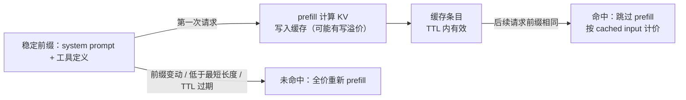

# 高效服务：让 token 更便宜

> **所在组**：组 2 · 推理与接口 ｜ **上一组出口**：能把一次延迟拆进排队 / prefill / decode / 网络四段 ｜ **本组出口**：能看懂账单上的 cached input / cache 写读字段从哪来，并把 prompt 与会话结构改造成缓存友好形态
> **前置**：[推理基础](inference-fundamentals.md) ｜ **下一步**：[模型 API 契约](model-api.md)、[成本与性能](../08-production/cost-performance)

## 1. 概述

[推理基础](inference-fundamentals.md) 给出了结构：prefill 决定 TTFT，decode 受访存约束，KV cache 随上下文线性吃显存。本页回答工程上最实际的那一步：**serving 侧靠什么把 token 变便宜，以及这些机制如何出现在你的账单上**。读懂这段映射，你才能解释"为什么 cached input 一个价、普通 input 另一个价"，也才能在自建与托管之间算清账。

四个杠杆，一句话一个：

- **量化（quantization）**：把权重从 16 位压到 INT8/INT4 等低精度——显存与访存变小，成本与延迟下降，精度是交换项。
- **Paged KV（分页 KV 管理）**：把 KV cache 切成小块按需分配（vLLM 的 PagedAttention 思路），消除"按最大上下文预分配"的显存碎片——同样显存塞进更多并发，吞吐上升。
- **前缀缓存（prefix caching）**：重复前缀（system prompt、工具定义、few-shot）的 KV 直接复用，prefill 被跳过——这是厂商能对 cached input 降价的物理基础。
- **投机解码（speculative decoding）**：小模型起草、大模型并行验证，一次前进多个 token——降 decode 延迟而不改输出分布。



### 何时使用 / 何时不用

- **用**：多轮会话成本失控、system prompt 很长且固定、需要理解或谈判 serving 成本、评估自建 serving 的收益上限。
- **不用**：量化的数学推导（INT8/INT4 怎么压缩、精度如何评估）→ [Learn LLM 第 9 章](https://llm.zenheart.site/chapters/09-inference-cache)；API 字段与错误语义 → [模型 API 契约](model-api.md)；整体成本治理与预算 → [成本与性能](../08-production/cost-performance)。

### 决策表：四个杠杆对比

| 杠杆 | 作用对象 | 谁能做 | 见效维度 | 你的接入动作 | 代价/边界 |
| --- | --- | --- | --- | --- | --- |
| 量化 | 权重精度 | 厂商默认在用；自建可选档位 | 成本、延迟、显存 | 选厂商的量化档或小模型；自建时选精度档 | 精度损失需评估集验证 |
| Paged KV | KV 显存碎片 | serving 引擎内部 | 吞吐（间接降单价） | 自建时选现代引擎；托管无动作 | 对单请求延迟无直接改善 |
| prefix caching | 重复前缀的计算 | 厂商侧（自动或显式）；自建可开 | 成本、TTFT | 把 prompt 重排成"稳定在前、动态在后" | 命中要求前缀逐字节一致 + 最短长度 + TTL |
| 投机解码 | decode 串行性 | 厂商侧开关；自建引擎可配 | 延迟 | 选用支持的模型/端点 | 输出不变，但不是所有模型可用 |

### 历史版本里程碑

- PagedAttention 随 vLLM 发布（其文档首页索引了"vLLM announcing blog post (intro to PagedAttention)"与 SOSP 2023 论文）。retrievedAt 2026-09-01。
- FlashAttention（arXiv 2205.14135，2022-05）：IO 感知注意力内核，serving 栈的底层组件之一。retrievedAt 2026-09-01。
- 各厂商前缀缓存上线时间线**未验证**，不编造。

## 2. 使用

### 最小实战：零 key 前缀缓存成本计算器（≤15 分钟）

无 API key、无依赖、纯确定性算术。模拟一个多轮会话：system prompt 是可缓存前缀，每轮重发全部历史（API 无状态）。单价表**模仿厂商计费的结构**——输入 token 分 cached / uncached 两价——数字是虚构的整数，结构才是重点。

环境：Node ≥ 23.6（直接运行 .mts）。保存为 `prefix-cache-cost.mts`：

```ts
// fixture: 零 key、零依赖的前缀缓存成本计算器。模仿厂商计费"结构"，数字虚构。
interface PriceTable {
  inputPerMTok: number;        // 未缓存输入价（每 1M token，虚构单位）
  cachedInputPerMTok: number;  // 缓存命中输入价
}

// 结构对照：OpenAI 定价表的 "Cached input" 列（自动前缀缓存，≥1024 token）
// 与 Anthropic 的 cache_read_input_tokens（显式 cache_control 断点）
const PRICE: PriceTable = { inputPerMTok: 3, cachedInputPerMTok: 0.3 }; // 命中价 = 基价 10%，模仿 cache read 档

interface TurnBill { turn: number; cacheHit: boolean; uncachedTokens: number; cachedTokens: number; cost: number }
interface SessionBill { turns: TurnBill[]; totalCost: number; cacheHitRatio: number }

function costOf(uncached: number, cached: number, p: PriceTable): number {
  return (uncached / 1e6) * p.inputPerMTok + (cached / 1e6) * p.cachedInputPerMTok;
}

// 一个多轮会话：system prompt 前缀可缓存；每轮把（全部历史 + 新消息）作为输入重发，
// 对应无状态 messages 数组每轮全量重发的事实。
function simulateSession(opts: {
  systemTokens: number; userTokensPerTurn: number; assistantTokensPerTurn: number;
  turns: number; prefixCaching: boolean; minCacheable: number; // 厂商最短可缓存前缀（如 1024）
}): SessionBill {
  const { systemTokens, userTokensPerTurn, assistantTokensPerTurn, turns, prefixCaching, minCacheable } = opts;
  const bills: TurnBill[] = [];
  let historyTokens = 0;
  for (let turn = 1; turn <= turns; turn++) {
    const newTokens = userTokensPerTurn;
    const totalInput = systemTokens + historyTokens + newTokens;
    // 缓存只覆盖稳定前缀（system prompt），且必须达到最短可缓存长度
    const prefixCacheable = prefixCaching && systemTokens >= minCacheable;
    const cachedTokens = prefixCacheable ? systemTokens : 0;
    const uncachedTokens = totalInput - cachedTokens;
    bills.push({ turn, cacheHit: cachedTokens > 0, uncachedTokens, cachedTokens, cost: costOf(uncachedTokens, cachedTokens, PRICE) });
    historyTokens += newTokens + assistantTokensPerTurn;
  }
  const totalCost = bills.reduce((s, b) => s + b.cost, 0);
  const allInput = bills.reduce((s, b) => s + b.uncachedTokens + b.cachedTokens, 0);
  const allCached = bills.reduce((s, b) => s + b.cachedTokens, 0);
  return { turns: bills, totalCost, cacheHitRatio: allCached / allInput };
}

const SESSION = { systemTokens: 20_000, userTokensPerTurn: 500, assistantTokensPerTurn: 500, turns: 6, minCacheable: 1024 };

const withCache = simulateSession({ ...SESSION, prefixCaching: true });
const noCache = simulateSession({ ...SESSION, prefixCaching: false });
// 负例：system prompt 低于最短可缓存长度 -> 结构静默失效
const tooShort = simulateSession({ ...SESSION, systemTokens: 800, prefixCaching: true });

const fmtCost = (c: number) => `$${c.toFixed(4)}`;
for (const [label, bill] of [['prefix caching ON', withCache], ['prefix caching OFF', noCache], ['ON but system prompt < 1024 tokens (negative)', tooShort]] as const) {
  console.log(`--- ${label} ---`);
  for (const t of bill.turns) {
    console.log(`turn ${t.turn}: input ${fmtCost(t.cost)} (uncached ${t.uncachedTokens.toLocaleString()} + cached ${t.cachedTokens.toLocaleString()})`);
  }
  console.log(`session total: ${fmtCost(bill.totalCost)}; cache hit ratio: ${(bill.cacheHitRatio * 100).toFixed(1)}% of input tokens\n`);
}
console.log(`savings from prefix caching: ${fmtCost(noCache.totalCost - withCache.totalCost)} (${(((1 - withCache.totalCost / noCache.totalCost)) * 100).toFixed(1)}%)`);
```

运行与正常输出：

```text
$ node prefix-cache-cost.mts
--- prefix caching ON ---
turn 1: input $0.0075 (uncached 500 + cached 20,000)
turn 2: input $0.0105 (uncached 1,500 + cached 20,000)
turn 3: input $0.0135 (uncached 2,500 + cached 20,000)
turn 4: input $0.0165 (uncached 3,500 + cached 20,000)
turn 5: input $0.0195 (uncached 4,500 + cached 20,000)
turn 6: input $0.0225 (uncached 5,500 + cached 20,000)
session total: $0.0900; cache hit ratio: 87.0% of input tokens

--- prefix caching OFF ---
turn 1: input $0.0615 (uncached 20,500 + cached 0)
...
turn 6: input $0.0765 (uncached 25,500 + cached 0)
session total: $0.4140; cache hit ratio: 0.0% of input tokens

--- ON but system prompt < 1024 tokens (negative) ---
turn 1: input $0.0039 (uncached 1,300 + cached 0)
...
turn 6: input $0.0189 (uncached 5,300 + cached 0)
session total: $0.0684; cache hit ratio: 0.0% of input tokens

savings from prefix caching: $0.3240 (78.3%)
```

（完整输出 18 行，此处省略中间轮次。）

负例解读：第三段**缓存开关是开的，命中率却是 0%**——system prompt 低于最短可缓存长度，请求照常成功、不报错。**"打开了缓存"不等于"缓存在工作"**，唯一可信证据是响应 usage 里的命中字段。

验收：三段命中率分别为 87.0% / 0.0% / 0.0%，节省 78.3%。清理：删除文件即可。

### 场景矩阵

| 场景 | 输入 | 动作 | 输出 | 适用 | 不适用 |
| --- | --- | --- | --- | --- | --- |
| 基础：会话成本核算 | system prompt + 轮数 | 跑 ON/OFF 两遍 | 会话级节省比例 | 多轮产品的成本预估 | 单轮一次性调用 |
| 常见：prompt 重排收益 | 动态内容混在前部 | 调整结构后重跑 | 命中率变化 | prompt 改版评估 | 输出长度问题（与 decode 相关） |
| 组合：换档估算 | 改两价比例或最短长度 | 重跑对比 | 新档位下的成本 | 厂商定价变动后的复核 | 讨价还价（找销售） |

## 3. 原理

### 四个机制的物理基础

**量化**。推理成本的大头是"把权重从显存搬进计算核"的带宽，而不是浮点运算本身。权重从 FP16 压到 INT8/INT4，搬运的字节数直接减半再减半——更小的模型副本、更高的 batch 密度、更便宜的单价。交换项是精度：量化误差是否可接受必须用你的评估集回答，不能用厂商的"几乎无损"营销口径替代。数学与实现 → [Learn LLM 第 9 章](https://llm.zenheart.site/chapters/09-inference-cache)。

**Paged KV**。KV cache 若按"每请求最大上下文"连续预分配，碎片与预留让显存利用率极低。PagedAttention 把 KV 切成固定小块、按需映射（操作系统分页的思路），显存浪费被压缩，同一张卡容纳更多并发——吞吐上升，摊薄单请求成本。vLLM 首页特性："Continuous batching of incoming requests, chunked prefill, prefix caching"（retrievedAt 2026-09-01）。

**前缀缓存**。同一前缀第二次出现时，prefill 已经算过、KV 已经在显存里——跳过重算只是"复用已有结果"。OpenAI 的文档把机制说得很直白：请求被路由到"最近处理过相同 prompt"的机器，缓存的是"attention 层在 **prefill** 期间产生的 key/value 张量"（retrievedAt 2026-09-01）。**厂商省下的计算让利成折扣价，这就是 cached input 更便宜的因果链**。它同时降 TTFT（prefill 被跳过）与成本。

**投机解码**。decode 串行是延迟下限的根源；让小模型先起草若干 token、大模型一次并行验证，接受合法前缀，等于一步走完多 token。输出分布不变，延迟下降（vLLM 支持 n-gram、EAGLE 等变体，retrievedAt 2026-09-01）。

### 机制 → 计费字段映射（核心交付）

| 机制 | OpenAI 侧 | Anthropic 侧 | 你的杠杆 |
| --- | --- | --- | --- |
| prefix caching（命中） | 定价表 `Cached input` 列；usage `prompt_tokens_details.cached_tokens` | `cache_read_input_tokens`；定价表 `Cache Hits & Refreshes` 列 | 稳定前缀在前、动态在后；轮次间隔压进 TTL |
| prefix caching（写入） | 无额外费用（自动缓存，retrievedAt 2026-09-01） | `cache_creation_input_tokens`；5m 写加价 25%、1h 写 2 倍（retrievedAt 2026-09-01） | 高频会话用短 TTL；间隔大于 5 分钟才考虑 1h |
| 量化 / Paged KV / 投机解码 | 不逐项暴露，折算进单价与档位 | 同左 | 选档位、选模型；自建时直接配引擎 |
| 批处理降价 | Batch API 折扣（定价页注明非时效任务可用） | Batch API 输入输出五折 | 非实时任务走 batch 通道 |

两家缓存模型的关键差异（结构对比，retrievedAt 2026-09-01）：

| 维度 | OpenAI | Anthropic |
| --- | --- | --- |
| 触发方式 | 自动（≥1024 token 的前缀） | 显式 `cache_control` 断点（最短 1024，Haiku 系 2048） |
| 写入费用 | 无额外费用 | 5m 写 1.25×、1h 写 2× 基价 |
| 命中费用 | Cached input 列定价 | 基价的 10% |
| 失效条件 | 前缀不一致；5–10 分钟不活动淘汰（至多 1 小时；扩展保留至 24 小时） | 前缀不一致（tools→system→messages 层级失效）；TTL 过期（命中即免费刷新） |

### 规范要求 vs 本地实测

| 断言 | 来源 | 本地 fixture 实测（上方） |
| --- | --- | --- |
| 输入 token 分两价：cached 便宜于 uncached | 两家定价页结构（L0） | 实测：两价表下 ON 比 OFF 省 78.3% |
| 命中要求前缀一致且达到最短长度 | 两家缓存文档（L0） | 实测：`systemTokens < minCacheable` 时命中率 0%、请求不报错 |
| 无状态 API 每轮重发全部历史 | [模型 API 契约](model-api.md) | 实测：turn N 的 uncached 随轮次线性增长 |
| Anthropic 写入有溢价、5m TTL 内命中免费刷新 | Anthropic 缓存文档（L0） | 未建模：fixture 忽略写溢价（见未决问题） |
| 命中同时降 TTFT 与成本 | prefill 被跳过的推论 | 未覆盖：fixture 只算钱不算延迟 |

### 与 Learn LLM 的边界

量化格式（GPTQ/AWQ/GGUF 等）的编码细节、精度损失的度量方法、KV cache 的块管理实现 → [Learn LLM 第 9 章](https://llm.zenheart.site/chapters/09-inference-cache)。本页只保留"哪个杠杆动哪个成本项"的决策深度。

## 4. 开发

### 缓存友好的工程清单

- prompt 结构固化：system prompt、工具定义、few-shot 放最前；用户数据、时间戳等动态内容放最后。
- 埋点命中率：把 `cached_tokens` / `cache_read_input_tokens` 记进请求日志——它是成本与 TTFT 双重视角的哨兵指标。
- 会话节奏：连续轮次间隔压进 TTL（Anthropic 5 分钟内、命中即刷新）；隔很久才继续的会话接受 miss 或评估长 TTL。
- 保持前缀字节级一致：工具开关、图像参数、`tool_choice` 的变动都会使前缀失效（Anthropic 文档列出的失效表，retrievedAt 2026-09-01）。

### 调试 runbook

### 症状 → 证据 → 处理 → 完成标准
**症状**：账单没降，尽管"已经打开了缓存"。
**证据**：usage 命中字段：`cached_tokens` / `cache_read_input_tokens` 长期为 0 或骤降。
**处理**：按顺序查——① 前缀是否被改坏（动态内容前移、模板版本号拼进 system prompt）；② 前缀是否低于最短可缓存长度；③ 请求间隔是否超出 TTL；④ 工具定义/图像参数是否轮轮在变。
**完成标准**：命中率回到基线并在成本曲线上可见回落。

### 症状 → 证据 → 处理 → 完成标准
**症状**：Anthropic 账单出现预期外的"写入"费用。
**证据**：`cache_creation_input_tokens` 占比高；写入与命中比例失衡。
**处理**：核对 TTL 档位（高频命中场景 5m 写更便宜，间隔大于 5 分钟才用 1h）；减少不必要的断点变动；低频任务改走 Batch API。
**完成标准**：写读比例与请求节奏一致；单位会话成本回落。

### 症状 → 证据 → 处理 → 完成标准
**症状**：换了"量化版/小杯"模型后，便宜了但回答质量滑坡。
**证据**：固定评估集上量化档与原档的得分对比（不是体感）。
**处理**：回退精度档；或混合路由——简单请求走量化/小模型、复杂请求走全精度（路由阈值进评估）。
**完成标准**：评估集得分回到门槛内；成本节省保留并在文档留痕。

### 反模式清单

- 把"缓存开关已打开"当成功标准——唯一证据是 usage 命中字段。
- 时间戳、随机 ID 拼进 system prompt 前部——每次请求都是 miss。
- 用厂商"几乎无损"的口径代替自己的评估集验证量化档。
- 只盯单价不盯结构：写溢价、最短长度、TTL 任何一个都能让"降价"变成"更贵"。
- "看似成功但证据不足"：成本下降但归因不到字段，可能是流量变化而不是优化生效。

## 5. 资料库

### 四级阅读路线

- **Beginner**（2 条）：跑通本页 fixture；读 [推理基础](inference-fundamentals.md) 的延迟分解表。
- **Builder**（2 条）：[OpenAI prompt caching 指南](https://platform.openai.com/docs/guides/prompt-caching)（自动缓存与 prompt 结构）；[Anthropic prompt caching 文档](https://docs.anthropic.com/en/docs/build-with-claude/prompt-caching)（显式断点与失效表）。
- **Operator**（2 条）：两家定价页（cached input 列结构、Batch 折扣）；[成本与性能](../08-production/cost-performance)（预算与治理）。
- **Researcher**（2 条）：vLLM 文档（PagedAttention / automatic prefix caching / speculative decoding 特性页）；[Learn LLM 第 9 章](https://llm.zenheart.site/chapters/09-inference-cache)（量化数学）。

### 资源表

| 名称 | 层级 | canonical URL | 用途 | 支持的断言 | 下一步 |
| --- | --- | --- | --- | --- | --- |
| OpenAI Prompt Caching 指南 | L0 | https://platform.openai.com/docs/guides/prompt-caching | 自动缓存工程 | ≥1024 token 自动缓存；`cached_tokens` 字段；缓存的是 prefill 产生的 KV 张量；写无额外费用 | 重排 prompt |
| Anthropic Prompt Caching 文档 | L0 | https://docs.anthropic.com/en/docs/build-with-claude/prompt-caching | 显式缓存工程 | `cache_control`；5m/1h TTL；写 1.25×/2×、读 10%；最短 1024/2048 | 设计断点位置 |
| OpenAI 定价页 | L0 | https://platform.openai.com/docs/pricing | 计费结构 | Input / Cached input / Output 三列结构；Batch 折扣；reasoning token 按输出计费 | 建立成本模型 |
| Anthropic 定价页 | L0 | https://docs.anthropic.com/en/docs/about-claude/pricing | 计费结构 | Base Input / 5m Write / 1h Write / Cache Hit / Output 五列结构 | 对照写读溢价 |
| vLLM 文档首页 | L1 | https://docs.vllm.ai/en/latest/ | 自建引擎特性 | continuous batching / chunked prefill / prefix caching / INT8、INT4 等量化 / 投机解码特性列表 | 深挖 feature 页 |
| Learn LLM 第 9 章 · 推理与量化 | E | https://llm.zenheart.site/chapters/09-inference-cache | 原理推导 | 量化与 KV cache 的数学归 Learn LLM | 手写量化实验 |
| 本页 fixture | E | prefix-cache-cost.mts（正文内联） | 零 key 验证 | 两价计费结构；最短长度导致静默 miss | 接自己项目的真实单价 |

retrievedAt：全部网页资源 2026-09-01。

### 主动证伪与未决问题

- fixture 忽略了 Anthropic 的写溢价与 OpenAI 的路由细节：turn 1 在真实厂商侧可能是"写价"而非全价，金额会略有出入；结构结论（两价、最短长度、命中率）不受影响。
- 单价为虚构整数：验证的是计费**结构**的理解，真实金额以厂商定价页当天为准（本仓不抄单价）。
- "命中同时降 TTFT"来自 prefill 被跳过的推论与 OpenAI"最高降 80% 延迟"的官方口径（retrievedAt 2026-09-01），未在本地实测。
- 量化精度损失的可接受阈值因任务而异，本仓不给出通用数字。

### learn-ai 到此为止 / 继续去哪

本页管"机制到账单的映射"。把这些认知写进调用代码 → [模型 API 契约](model-api.md)；整体成本治理与预算 → [成本与性能](../08-production/cost-performance)；量化与块管理的数学 → [Learn LLM 第 9 章](https://llm.zenheart.site/chapters/09-inference-cache)；端侧的量化实践 → [浏览器与端侧推理](browser-edge.md)。
