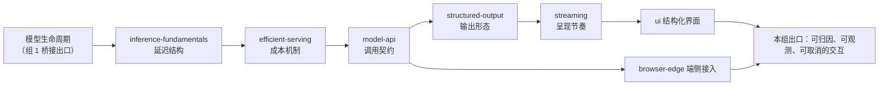

# 组 2 · 推理与接口

> **所在组**：组 2 · 推理与接口 ｜ **上一组出口**：能说出模型生命周期如何影响工程决策（模型是可替换的外部能力，带行为、预算、能力边界三个接口属性） ｜ **本组出口**：能交付一次可归因（延迟拆得开段）、可观测（usage 看得见）、可取消的用户可见交互
> **前置**：[模型生命周期（桥接）](../01-model-lifecycle/) ｜ **下一步**：[会话与状态](../03-context/session-memory.md)、[嵌入与检索](../04-grounding/rag)

## 1. 概述

本组回答一个问题：**参数如何变成在线服务与契约？** 它是一条从 prefill/decode 两阶段生成一直接到用户可见接口的线——前半段解释延迟与成本从哪来（你拿到的 TTFT 和账单不是玄学，是流水线的输出），后半段把模型能力接成产品交互（调用契约、输出形态、呈现节奏、接入位置）。

这条线此前缺了前半段：只学"怎么调 API"的工程师解释不了首字为什么慢、cached input 为什么便宜、什么时候该自建 serving。本组用七个主题补全：

- **服务侧**（模型发生了什么）：[推理基础](inference-fundamentals.md) 拆延迟结构，[高效服务](efficient-serving.md) 拆成本结构。
- **接口侧**（你怎么接）：[模型 API 契约](model-api.md) 稳住调用，[结构化输出](structured-output.md) 稳住形态，[流式响应](streaming.md) 稳住节奏，[生成式 UI](ui.md) 升级呈现，[浏览器与端侧推理](browser-edge.md) 换接入位置。



### 何时进入本组 / 何时不进

- **进**：要用模型造产品——先读前两页建立延迟与成本的心智模型，再进接口侧；或已在维护 AI 功能，需要归因延迟与成本。
- **不进**：训练与注意力的数学——回 [模型生命周期（桥接）](../01-model-lifecycle/) 的 Learn LLM 链；回答缺少私有事实——去 [嵌入与检索](../04-grounding/rag)；要让系统执行动作——去 [工具调用契约](../05-action/tool-calling)。

### 症状 → 主题导航

| 症状 | 去哪 | 读完你能 |
| --- | --- | --- |
| 说不清首字为什么慢、账单为什么涨 | [推理基础](inference-fundamentals.md) | 把一次延迟拆进排队 / prefill / decode / 网络四段并归因 |
| 看不懂 cached input 一个价、普通 input 一个价 | [高效服务](efficient-serving.md) | 把量化和前缀缓存映射到计费字段，改造 prompt 与会话结构 |
| 第一条请求还没发出去 / 429 一来就崩 | [模型 API 契约](model-api.md) | 写出带错误族分类与重试的调用循环 |
| 回答稳定但没法进程序（解析靠正则） | [结构化输出](structured-output.md) | 用 schema 约束并校验模型输出 |
| 接口通了，UI 要等整段才出字 | [流式响应](streaming.md) | 消费 SSE 流，可取消、可中断恢复 |
| 想让回答带组件而不只是文字 | [生成式 UI](ui.md) | 把模型输出渲染成白名单组件 |
| 想降延迟 / 保隐私 / 离线可用 | [浏览器与端侧推理](browser-edge.md) | 选对端侧运行库与降级链 |

### 决策表：接口侧的接入方式

| 方式 | 方向 | 控制权 | 状态 | 信任域 | 最低复杂度 |
| --- | --- | --- | --- | --- | --- |
| 直接 fetch 厂商 API | 出站请求/响应 | 全部自管 | 无（每轮自建） | 密钥在服务端 | 单文件可跑 |
| 官方 SDK | 出站请求/响应 | SDK 管重试与类型 | 无 | 密钥在服务端 | +1 依赖 |
| 前端 AI 框架 | 请求+流+UI 全包 | 框架接管 | 框架会话模型 | 密钥在服务端 | 引入框架契约 |
| 端侧推理 | 设备内执行 | 完全自管 | 设备本地 | 数据不出设备 | 模型分发+运行时 |

服务侧的形态决策（API / 自建 serving / 端侧）见 [推理基础](inference-fundamentals.md) 的决策表。选型原则一致：**从最低复杂度起步**，被卡住再加层。

### 历史版本里程碑

厂商 API 形态持续演化（如 OpenAI 从 Chat Completions 到 Responses API、Anthropic 采样参数随模型世代收缩、两家先后上线前缀缓存）。本组不维护厂商时间线，具体字段以官方文档当天页面为准；本仓记录的决策影响断言均标注 retrievedAt。本页于 2026-09 随 Issue #116 从 v5"应用接入"层导览改写为 v6"推理与接口"组导览。

## 2. 使用

本组最小实战是 [推理基础](inference-fundamentals.md) 的零 key 两阶段模拟器：

```bash
# 保存该页完整示例为 inference-sim.mts，然后：
node inference-sim.mts
```

验收：三段输出齐全——有 KV cache 的成本结构、无 cache 的负例（TTFT 相同、decode 放大 12 倍）、节省百分比。跑通后你已经亲手验证了"prompt 打 TTFT、输出打总时长"这条归因规则。

成本侧对应 [高效服务](efficient-serving.md) 的前缀缓存计算器（命中 / 未命中 / 低于最短长度三个场景）。组内各主题的使用段遵循同一约束：零 API key、单文件自包含、确定性输出、正常路径与负例路径成对出现。

## 3. 原理

在能力变换链上，本组把"一个可替换的外部能力"变成"一条可运营的交互链"：

```text
用户动作 → 请求组装（结构化输出 schema + 会话状态）
        → serving（推理基础：排队/prefill/decode；高效服务：缓存与量化）
        → API 调用（model-api：错误族、重试、用量）
        → 流式呈现（streaming：SSE、累积、取消）
        → 结构化渲染（ui：白名单组件）
```

- **不变量 1**：模型 API 无状态。每次请求重发全部所需历史；"对话记忆"是接入层的构造物（→ [会话与状态](../03-context/session-memory.md)）。
- **不变量 2**：模型输出是不可信输入。渲染前必须过 schema 与白名单。
- **不变量 3**：交互必须可取消、可观测。取消依赖 AbortController 贯通到服务端停止生成；观测依赖 usage（含缓存命中字段）贯通到成本面板。
- **不变量 4**：延迟与成本可归因。TTFT、ITL、输入输出 token、缓存命中分开埋点——拆不开就无法优化。

**出口标准（Exit criteria）**：能交付一次可归因（延迟拆得开段）、可观测（usage 与命中率看得见）、可取消（中途可停、停后状态一致）的用户可见交互。

## 4. 开发

进入接口侧前，先用三条诊断定位该读哪页。

### 症状 → 证据 → 处理 → 完成标准
**症状**：用户反馈"等很久才出第一个字"，出来之后流畅。
**证据**：流式埋点拆开 TTFT 与 ITL；prompt token 分布与缓存命中字段。
**处理**：按 [推理基础](inference-fundamentals.md) 的 TTFT runbook 排查排队 / prefill / 缓存失效。
**完成标准**：TTFT p50/p95 回到基线，能指着数据说出慢在哪一段。

### 症状 → 证据 → 处理 → 完成标准
**症状**：账单突增，调用量没涨。
**证据**：每轮 input tokens 随轮次线性膨胀；命中率下跌。
**处理**：按 [高效服务](efficient-serving.md) 与 [会话与状态](../03-context/session-memory.md) 修缓存友好结构与历史裁剪。
**完成标准**：单会话成本斜率回落，命中率回到基线。

### 症状 → 证据 → 处理 → 完成标准
**症状**：功能演示一切正常，上线后偶发失败。
**证据**：失败样本的 HTTP 状态码分布；429/5xx 占比。
**处理**：按 [模型 API 契约](model-api.md) 补错误族分类与退避重试；配额类错误先修配额。
**完成标准**：同样的流量下重试收敛、无未分类错误。

## 5. 资料库

### 四级阅读路线

- **Beginner**：[推理基础](inference-fundamentals.md)（跑通模拟器）→ [模型 API 契约](model-api.md)（发出第一条调用）。
- **Builder**：[高效服务](efficient-serving.md) → [结构化输出](structured-output.md) → [流式响应](streaming.md)。
- **Operator**：各主题"开发"段的 runbook → [可观测性](../08-production/observability)、[成本与性能](../08-production/cost-performance)。
- **Researcher**：[生成式 UI](ui.md) → [浏览器与端侧推理](browser-edge.md) → 组内资源表指向的论文与引擎文档（FlashAttention、vLLM）。

### 主动证伪与未决问题

- 本组断言"感知延迟由 TTFT 主导"来自流式传输的通用工程经验，具体产品的阈值需自行度量。
- 组内两页 fixture 的成本单位与单价是教学常数，验证的是结构与归因方法，不是任何厂商的真实数字。
- 厂商字段名、缓存档位与错误码随版本变化，本组表格只保留已核验版本，以官方文档为准。

### learn-ai 到此为止 / 继续去哪

本组回答"怎么把模型变成在线服务与接口"，不回答"模型这一轮看到什么"（→ [组 3 · 上下文](../03-context/session-memory.md)）、"如何引入参数之外的知识"（→ [嵌入与检索](../04-grounding/rag)）、"如何受控执行动作"（→ [工具调用契约](../05-action/tool-calling)）、"上线证据"（→ [可观测性](../08-production/observability)）。
