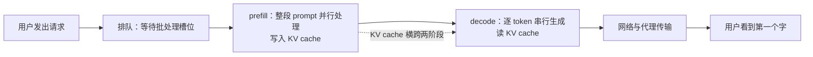

# 推理基础：延迟从哪来

> **所在组**：组 2 · 推理与接口 ｜ **上一组出口**：能说出模型生命周期如何影响工程决策（模型是带行为、预算、能力边界三个接口属性的可替换能力） ｜ **本组出口**：能把一次用户感知的延迟拆进排队 / prefill / decode / 网络四段，说出每段谁负责、你能拉哪根杠杆
> **前置**：[模型生命周期（桥接）](../01-model-lifecycle/) ｜ **下一步**：[高效服务](efficient-serving.md)、[模型 API 契约](model-api.md)

## 1. 概述

本页补上"模型"与"API"之间此前缺失的一层：**生成式模型不是"输入进、结果出"的同步函数，而是一条两阶段流水线**。不理解这条流水线，你解释不了首字为什么慢、后面的字为什么匀速出来、账单为什么和输出长度成正比，也判断不了什么时候该离开托管 API。

生成分两个阶段，延迟结构完全不同：

- **prefill（预填充）**：把整段 prompt 一次性并行处理，为每个 prompt token 计算注意力所需的 Key/Value。这一步决定**首字时间**（TTFT，Time To First Token）。
- **decode（解码）**：一个 token 一个 token 串行生成，每一步都要"看见"之前所有 token。这一步决定**字间延迟**（ITL，Inter-Token Latency）和总时长。



### 延迟分解表：用户感知的一次延迟由四段构成

| 段 | 发生什么 | 谁负责 | 你的杠杆 |
| --- | --- | --- | --- |
| 排队（queue） | 请求等待进入一个批次或实例槽位 | serving 平台（厂商或自建集群） | 并发整形、优先级档位、削峰 |
| prefill | 整段 prompt 并行算完，KV 写入缓存 | 模型服务进程 | 缩短 prompt、提高前缀缓存命中（→ [高效服务](efficient-serving.md)） |
| decode | 逐 token 生成，受显存带宽约束 | 模型服务进程 | 限制 `max_tokens`、投机解码（厂商侧） |
| 网络 | TLS、网关、代理缓冲（流式被缓冲会退化成整段到达） | 你的基础设施 + 厂商边缘节点 | 就近接入、确认流式不被代理缓冲（→ [流式响应](streaming.md)） |

**关键推论**：TTFT ≈ 排队 + prefill + 网络；总时长 ≈ TTFT + (输出 token 数 − 1) × 单步 decode。**prompt 长度主要打 TTFT，输出长度主要打总时长**——这是所有延迟优化的归因起点。

### 何时使用 / 何时不用

- **用**：做延迟预算与归因（TTFT 突高查哪）、读懂成本结构（为什么按 token 计费、输入输出不同价）、评估"该不该自建 serving"。
- **不用**：训练与注意力的数学推导——去 [Learn LLM 第 9 章](https://llm.zenheart.site/chapters/09-inference-cache)；厂商具体字段与错误码——去 [模型 API 契约](model-api.md)；把 token 渲染成界面——去 [生成式 UI](ui.md)。

### 决策表：模型消费的三种形态

| 形态 | 方向 | 控制权 | 状态 | 信任域 | 最低复杂度 |
| --- | --- | --- | --- | --- | --- |
| 厂商 API | 出站请求/响应 | 厂商管排队、batching、缓存；你管调用 | 无状态（KV cache 在厂商侧） | 数据出你的域 | 一个 fetch 就能跑 |
| 自建 serving（vLLM 等） | 你自己集群内执行 | 全部自管：批调度、KV 显存、量化 | KV cache 在你的 GPU 上 | 数据不出域 | GPU 运维 + 模型供应链 |
| 端侧推理 | 用户设备内执行 | 完全自管，受设备算力硬约束 | 设备本地 | 数据不出设备 | 模型分发 + 运行时（→ [浏览器与端侧推理](browser-edge.md)） |

**从最低复杂度起步**：绝大多数应用从厂商 API 开始；只有当成本、延迟、数据边界三者之一被 API 卡死时，才评估自建；端侧只在离线/隐私/尾延迟有硬需求时进入。

### 历史版本里程碑

- FlashAttention 论文（arXiv 2205.14135，2022-05）：IO 感知的精确注意力，减少 HBM 读写——现代 serving 内核的事实基线。retrievedAt 2026-09-01。
- vLLM 论文发表于 SOSP 2023（vLLM 官方文档首页列出）。retrievedAt 2026-09-01。
- 其余引擎与厂商时间线**未验证**，不编造。

## 2. 使用

### 最小实战：零 key 两阶段服务模拟器（≤15 分钟）

无 API key、无依赖、输出确定性。用一个 TypeScript 文件模拟"两阶段服务"：prefill 一次性处理 prompt，decode 逐 token 吐出，KV cache 用数组缓存已算过的 token。时间用抽象**成本单位**（cost units）计量，保证每次运行输出一致。

环境：Node ≥ 23.6（直接运行 .mts）；Node 22.6–23.5 加 `--experimental-strip-types`。保存为 `inference-sim.mts`：

```ts
// fixture: 零 key、零依赖的两阶段推理模拟。输出确定性，可重复。
const FORWARD_PER_TOKEN = 12; // 一个 token 完整 forward 的成本（无 cache 时整个前缀每步重算）
const KV_READ_PER_TOKEN = 1;  // 有 cache 的 decode：读一条 K/V 代替一次 forward

interface Timing {
  ttftCost: number;      // 排队 + prefill（本例排队 = 0，只有 prefill）
  decodeCost: number;    // 所有 decode 步之和
  totalCost: number;
  tokens: number;
  avgPerToken: number;
  stepsGrowth: number[]; // 第 1 步 / 中间步 / 最后一步的单步成本
}

function serve(promptTokens: number, newTokens: number, useCache: boolean): Timing {
  // 阶段 1：prefill —— 整段 prompt 只处理一次，每个 prompt token 的 K/V 写入缓存
  const prefillCost = promptTokens * FORWARD_PER_TOKEN;
  const kvCache: number[] = useCache ? Array.from({ length: promptTokens }, (_, i) => i) : [];

  // 阶段 2：decode —— 每步 1 个 token；新 token 必须"看见"之前所有 token
  let decodeCost = 0;
  const stepsGrowth: number[] = [];
  for (let step = 0; step < newTokens; step++) {
    const context = promptTokens + step; // 新 token 要注意到的 token 数
    let stepCost: number;
    if (useCache) {
      // 新 token 做 1 次 forward + 每个历史 token 读 1 次缓存
      stepCost = FORWARD_PER_TOKEN + context * KV_READ_PER_TOKEN;
      kvCache.push(promptTokens + step); // 新 token 的 K/V 追加进缓存，不再重算
    } else {
      // 负例：无缓存 —— 每步对整个前缀重跑 forward
      stepCost = (context + 1) * FORWARD_PER_TOKEN;
    }
    decodeCost += stepCost;
    if (step === 0 || step === Math.floor(newTokens / 2) || step === newTokens - 1) stepsGrowth.push(stepCost);
  }
  const totalCost = prefillCost + decodeCost;
  return {
    ttftCost: prefillCost,
    decodeCost,
    totalCost,
    tokens: newTokens,
    avgPerToken: Math.round((totalCost / newTokens) * 10) / 10,
    stepsGrowth,
  };
}

const PROMPT = 200; // prompt token 数
const OUT = 40;     // 生成 token 数

const withCache = serve(PROMPT, OUT, true);
const noCache = serve(PROMPT, OUT, false);

const fmt = (n: number) => n.toLocaleString('en-US');
const report = (label: string, t: Timing) => {
  console.log(`--- ${label} ---`);
  console.log(`TTFT (prefill):        ${fmt(t.ttftCost)} units`);
  console.log(`decode (${t.tokens} tokens): ${fmt(t.decodeCost)} units`);
  console.log(`total:                 ${fmt(t.totalCost)} units; avg/token: ${t.avgPerToken}`);
  console.log(`step cost (first/mid/last): ${t.stepsGrowth.map(fmt).join(' / ')}`);
};
report('with KV cache', withCache);
report('without KV cache (negative case)', noCache);
const saved = ((1 - withCache.totalCost / noCache.totalCost) * 100).toFixed(1);
console.log(`KV cache saved: ${saved}% of total cost`);
console.log(`throughput proxy (tokens per 1k units): cached ${(1000 / (withCache.totalCost / OUT)).toFixed(2)} vs no-cache ${(1000 / (noCache.totalCost / OUT)).toFixed(2)}`);
```

运行与正常输出：

```text
$ node inference-sim.mts
--- with KV cache ---
TTFT (prefill):        2,400 units
decode (40 tokens): 9,260 units
total:                 11,660 units; avg/token: 291.5
step cost (first/mid/last): 212 / 232 / 251
--- without KV cache (negative case) ---
TTFT (prefill):        2,400 units
decode (40 tokens): 105,840 units
total:                 108,240 units; avg/token: 2706
step cost (first/mid/last): 2,412 / 2,652 / 2,880
KV cache saved: 89.2% of total cost
throughput proxy (tokens per 1k units): cached 3.43 vs no-cache 0.37
```

负例解读（读三件事）：

1. **TTFT 完全相同**（2,400）：KV cache 不改变 prefill——prefill 本来就只算一次。
2. **两种情况的单步成本都在增长**（212→251 与 2,412→2,880）：decode 天然要读全部上下文，缓存去掉的是"重算 forward"，不是"读历史"这件事。
3. **常数差 12 倍**（`FORWARD_PER_TOKEN / KV_READ_PER_TOKEN`）：这正是 KV cache 存在的理由——读一条缓存远比重跑一层网络便宜。

验收：三段输出与上面一致；`KV cache saved` 为 `89.2%`。清理：删除文件即可，无网络无端口。

### 场景矩阵

| 场景 | 输入 | 动作 | 输出 | 适用 | 不适用 |
| --- | --- | --- | --- | --- | --- |
| 基础：TTFT 归因 | 用户反馈"等半天才出字" | 改 `PROMPT` 重跑，看 TTFT 变化 | TTFT 随 prompt 线性涨 | 长 prompt 场景先查 prefill | 输出阶段慢（改 `OUT` 看总时长） |
| 常见：输出长度预算 | 总时长随回答变长恶化 | 改 `OUT`，观察 decode 占比 | decode 占比随输出增长 | 设 `max_tokens` 上限的依据 | TTFT 问题 |
| 组合：长 prompt + 长输出 | 知识库上下文全塞 prompt | 大 `PROMPT` + 大 `OUT` | decode 单步成本被两头推高 | 理解为何要裁剪上下文（→ [会话与状态](../03-context/session-memory.md)） | — |

## 3. 原理

### prefill 与 decode 是两种不同的计算

**prefill 是并行的一次性计算**：prompt 的所有 token 同时过网络，GPU 的算力被喂饱，成本大致随 prompt 长度线性增长。它是 TTFT 的主要构成（叠加排队与网络）。

**decode 是串行的访存受限计算**：第 N 个 token 依赖第 N−1 个的输出，无法并行；每一步要把之前所有 token 的 Key/Value 从显存读一遍。现代 GPU 算力过剩、显存带宽是瓶颈，所以 decode 的快慢主要看"读多少显存"而不是"算多少浮点"。

### KV cache：为什么存在、代价是什么

**为什么存在**：decode 每一步都需要全部历史 token 的 K/V 参与注意力。不缓存，就等于每生成一个 token 都把前缀重新 forward 一遍（上面 fixture 的负例）。缓存后，历史部分从"重算网络"退化为"读一次缓存"。

**内存代价**：每个 token 的 KV 占用大致为

```text
2 (K 和 V) × 层数 × KV 头数 × 每头维度 × 每参数字节数
```

对给定模型这是一个**常数 × token 数**：KV 显存随上下文长度**线性增长**。这就是"context 长度是内存预算"的物理来源——厂商标注的最大上下文，本质是"KV cache + 权重 + 激活能塞进显存"的约束。工程含义：**上下文不是免费的**，每多留一轮历史，每个后续 token 的访存都更贵（fixture 中 212→251 的增长就是它的缩影）。

### batching：吞吐与延迟的权衡

单个请求的 decode 读不完显存带宽，GPU 大量算力闲置。把多个请求的 decode 步拼成一个批次，权重只读一遍、多个请求分摊，**吞吐上升而单请求延迟几乎不变**——直到算力饱和。**连续批处理**（continuous batching，vLLM 文档术语）进一步让新请求随时插入正在生成的批次，不必等整批完成（vLLM 首页特性列表：continuous batching、chunked prefill、prefix caching，retrievedAt 2026-09-01）。

对你的含义：**你共享厂商的批次**。排队延迟来自"等槽位"，prefill/decode 单步延迟相对稳定；高峰期 TTFT 恶化通常是排队在涨，而不是模型在变慢。

### serving 的基本形态

- **厂商 API**：排队、batching、KV cache、量化全部由厂商承担，你按 token 付费（计费结构 → [高效服务](efficient-serving.md)）。
- **自建 serving**：vLLM 一类引擎把上述机制产品化（PagedAttention 管理块状 KV、automatic prefix caching、INT8/INT4 量化、投机解码，术语见其文档首页，retrievedAt 2026-09-01）。你换取控制权，付出 GPU 运维与模型供应链。
- **端侧**：算力与显存被设备硬约束，模型必须裁剪（量化、小模型），详见 [浏览器与端侧推理](browser-edge.md)。

### 规范要求 vs 本地实测

| 断言 | 来源 | 本地 fixture 实测（上方） |
| --- | --- | --- |
| TTFT 由 prefill 决定，与输出长度无关 | 两阶段结构推论 | 实测：`OUT` 变化只影响 `decodeCost`，`ttftCost` 不动 |
| decode 单步成本随上下文线性增长 | 注意力每步读全部历史 | 实测：212 → 232 → 251（prompt 200 + 步数推进） |
| KV cache 消除的是前缀重算，不是历史读取 | KV cache 语义 | 实测：有/无 cache 单步成本都在增长，仅常数差 12 倍 |
| batching 提升吞吐而非单请求延迟 | vLLM 文档术语（L1） | 未覆盖：fixture 是单请求模型（见未决问题） |
| 排队在高峰会成为 TTFT 主项 | 通用 serving 经验 | 未覆盖：fixture 排队恒为 0（见未决问题） |

### 与 Learn LLM 的边界

prefill/decode 的手写实现、KV cache 的数值等价验证、量化（INT8/INT4）的原理推导，全部归 [Learn LLM 第 9 章（推理与量化）](https://llm.zenheart.site/chapters/09-inference-cache)。本页只保留"影响工程决策"的深度：延迟归因、内存预算、选型。

## 4. 开发

### 延迟预算的集成检查清单

- 把 TTFT 与 ITL 分开埋点（流式首 chunk 时间 ≠ 总时长）——没有分开的埋点，后面所有 runbook 都没有证据。
- 给 `max_tokens` 设上限并纳入评审：输出长度直接乘 decode 成本。
- prompt 长度分布纳入监控：TTFT 恶化先看它，再看缓存命中率，最后才怀疑厂商。

### 调试 runbook

### 症状 → 证据 → 处理 → 完成标准
**症状**：用户反馈"要等很久才出第一个字"，出来之后倒是流畅。
**证据**：流式埋点拆开看：TTFT 高、ITL 正常；按请求记录 prompt token 数分布；厂商返回的缓存命中字段（如 `cached_tokens`）。
**处理**：按顺序排查——① 排队（高峰时段对比、并发是否超配额）；② prefill（prompt 是否变长：历史全量重发、模板膨胀）；③ 前缀缓存是否失效（prompt 结构改版把动态内容挪到了前面）。
**完成标准**：TTFT p50/p95 回到基线；能指着数据说出"慢在哪一段"。

### 症状 → 证据 → 处理 → 完成标准
**症状**：账单突增，但调用量没涨。
**证据**：对账 usage：每轮请求的 input tokens 是否随轮次线性膨胀（context 整段重算）；缓存命中占比是否下跌。
**处理**：加会话历史裁剪与 token 预算（→ [会话与状态](../03-context/session-memory.md)）；把 prompt 重排为"稳定前缀在前、动态内容在后"（→ [高效服务](efficient-serving.md)）；核对 `max_tokens` 是否被调大。
**完成标准**：每轮 input tokens 不随轮次无限增长；单会话成本曲线斜率回落。

### 症状 → 证据 → 处理 → 完成标准
**症状**：生成中途卡顿、字与字之间偶尔停顿（ITL 抖动）。
**证据**：逐 chunk 时间戳看长尾；确认是 decode 抖动而非网络（本地直连对比）；检查输出中是否触发长推理段。
**处理**：网络侧确认代理不缓冲 SSE（→ [流式响应](streaming.md)）；decode 侧限制输出长度、拆分长任务；持续抖动属于厂商容量问题，走状态页与降级链（→ [浏览器与端侧推理](browser-edge.md)）。
**完成标准**：ITL p95 回稳；卡顿样本能归因到网络或 decode 之一。

### 反模式清单

- 用总时长当唯一延迟指标——TTFT 和 ITL 的优化手段完全不同，混在一起无法归因。
- 不限 `max_tokens`——输出长度是乘法项，失控输出直接放大成本与时长。
- 假设"上下文窗口大 = 随便塞"——每 token KV 显存与每步访存都在为长度付费。
- TTFT 一慢就换模型——先拆段归因，多数时候是排队或 prompt 变长。
- "看似成功但证据不足"：没有分段埋点就宣称"优化生效"。

## 5. 资料库

### 四级阅读路线

- **Beginner**（2 条）：跑通本页 fixture；读 [Learn LLM 第 9 章](https://llm.zenheart.site/chapters/09-inference-cache)的 prefill/decode 与 KV cache 小节。
- **Builder**（2 条）：[OpenAI prompt caching 指南](https://platform.openai.com/docs/guides/prompt-caching)（静态前缀在前的工程意义）；[模型 API 契约](model-api.md)（把本页认知落成调用代码）。
- **Operator**（2 条）：vLLM 文档首页（serving 术语总览：continuous batching / chunked prefill / prefix caching）；厂商状态页与延迟埋点看板。
- **Researcher**（2 条）：FlashAttention 论文（IO 感知注意力）；vLLM 论文（SOSP 2023，经 vLLM 文档首页索引）。

### 资源表

| 名称 | 层级 | canonical URL | 用途 | 支持的断言 | 下一步 |
| --- | --- | --- | --- | --- | --- |
| Learn LLM 第 9 章 · 推理与量化 | E | https://llm.zenheart.site/chapters/09-inference-cache | 原理与从零实现 | prefill/decode、KV cache、量化的深层归 Learn LLM | 手写一遍 cache/full 等价 |
| vLLM 文档首页 | L1 | https://docs.vllm.ai/en/latest/ | serving 术语与特性总览 | continuous batching、chunked prefill、prefix caching、量化、投机解码为 vLLM 特性 | 按 feature 页深挖 |
| OpenAI Prompt Caching 指南 | L0 | https://platform.openai.com/docs/guides/prompt-caching | 前缀缓存工程 | ≥1024 token 自动缓存；`cached_tokens` 字段；KV 张量在 prefill 产生 | 改造 prompt 结构 |
| Anthropic Prompt Caching 文档 | L0 | https://docs.anthropic.com/en/docs/build-with-claude/prompt-caching | 显式缓存断点 | `cache_control`、5 分钟 TTL、最短可缓存长度 | 对比两家缓存模型 |
| FlashAttention 论文 | L4 | https://arxiv.org/abs/2205.14135 | 内核层原理 | IO 感知注意力减少 HBM 读写（2022-05） | 阅读 tiling 设计 |
| 本页 fixture | E | inference-sim.mts（正文内联） | 零 key 验证 | 两阶段成本结构；KV cache 的收益与边界 | 改参数做归因练习 |

retrievedAt：全部网页资源 2026-09-01。

### 主动证伪与未决问题

- fixture 是单请求模型：batching 与排队只引用了 vLLM 术语与通用经验，未在本地实测。
- 成本单位是抽象的：12:1 的重算/读取比是**教学常数**，不是任何真实硬件的测量值；真实比值取决于模型层数、算子实现与硬件带宽。
- "TTFT ≈ 排队 + prefill + 网络"是结构分解，各段真实占比需在自己的埋点数据里验证。
- 推理 token 计费：OpenAI 定价页说明 reasoning token 不可见但按输出 token 计费并占用上下文（retrievedAt 2026-09-01）——本页未展开，归 [模型 API 契约](model-api.md)。

### learn-ai 到此为止 / 继续去哪

本页管"延迟与成本的结构"。这些机制如何变成账单上更便宜的字段 → [高效服务](efficient-serving.md)；把认知落成调用代码 → [模型 API 契约](model-api.md)；数学与从零实现 → [Learn LLM 第 9 章](https://llm.zenheart.site/chapters/09-inference-cache)；上线后的成本治理 → [成本与性能](../08-production/cost-performance)。
