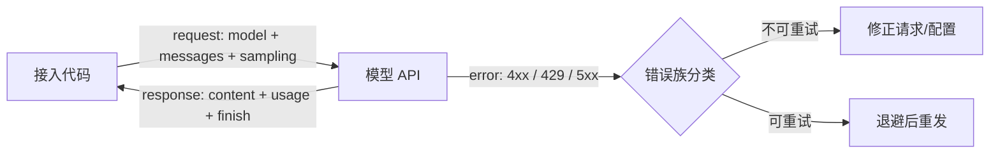

# 模型 API 契约

> **在哪一组**：推理与接口组 ｜ **上一组出口**：能写并验证输入/输出 schema ｜ **本页出口**：能写出带错误族分类、重试语义与用量观测的模型调用循环
> **前置**：[结构化输出](../02-inference-interface/structured-output) ｜ **下一步**：[流式响应](streaming.md)、[会话与状态](../03-context/session-memory.md)

## 1. 概述

模型 API 契约解决的问题是：**厂商接口细节多变，你的接入代码不该跟着变**。本页把一次模型调用抽象成五个稳定部分——消息（messages）、采样（sampling）、用量（usage）、错误（errors）、版本（pin）——并给出可直接跑的零 key 验证方式。



### 何时使用 / 何时不用

- **用**：任何要把模型能力接进产品的第一步；需要在多家厂商间保持可迁移。
- **不用**：厂商专属功能细节（具体 SDK 用法、价格、套餐）——去 Products 的厂商页；工具调用的 schema 契约——见 [工具调用契约](../05-action/tool-calling)。

### 决策表：调用方式怎么选

| 方式 | 方向 | 控制权 | 状态 | 信任域 | 最低复杂度 |
| --- | --- | --- | --- | --- | --- |
| 直接 fetch | 出站请求/响应 | 全部自管（错误、重试、类型） | 无状态 | 密钥在服务端 | 单文件，零依赖 |
| 官方 SDK | 出站请求/响应 | SDK 提供类型与默认重试 | 无状态 | 密钥在服务端 | +1 依赖 |
| AI 框架 | 请求+流+UI | 框架接管，配置换灵活 | 框架会话 | 密钥在服务端 | 引入整套框架契约 |

**最低复杂度起步**：直接 fetch 直到重试与类型让你重复劳动，再上 SDK；同时要流式、会话、UI 时再考虑框架。

### 历史版本里程碑

- OpenAI 推出 Responses API 并推荐其替代 Chat Completions（流式场景）——retrievedAt 2026-09-01，见资料库。
- Anthropic 新世代模型（4.6+/5 系）移除部分采样参数（发送 `temperature` 等返回 400）——retrievedAt 2026-09-01，见"原理"段分栏表。
- 其余厂商时间线**未验证**，不编造。

## 2. 使用

### 最小实战：零 key 调用循环（≤15 分钟）

无 API key、无依赖、干净环境可复现。用 `node:http` 起一个 OpenAI Chat Completions 兼容的 mock server，再用一个客户端演示**正常调用、429 重试、400 不重试**三条路径。

环境：Node ≥ 23.6（直接运行 .mts）；Node 22.6–23.5 加 `--experimental-strip-types`。保存为 `model-api-mock.mts`：

```ts
// fixture: 零 key、零依赖的模型 API 契约验证。输出确定性，可重复。
import * as http from 'node:http';

interface ChatMessage { role: 'system' | 'user' | 'assistant'; content: string }
interface ChatRequest { model?: string; messages?: ChatMessage[] }
interface ChatCompletion {
  id: string; object: 'chat.completion';
  choices: { message: ChatMessage; finish_reason: 'stop' }[];
  usage: { prompt_tokens: number; completion_tokens: number; total_tokens: number };
}

// ---- mock server：OpenAI Chat Completions 兼容形状 ----
let rateLimitHits = 0;
const server = http.createServer((req, res) => {
  let body = '';
  req.on('data', (c) => (body += c));
  req.on('end', () => {
    const payload = JSON.parse(body) as ChatRequest;
    const send = (status: number, json: unknown, headers: Record<string, string> = {}) => {
      res.writeHead(status, { 'Content-Type': 'application/json', ...headers });
      res.end(JSON.stringify(json));
    };
    // 负例 1：缺 messages -> 400，客户端不应重试
    if (!Array.isArray(payload.messages) || payload.messages.length === 0) {
      return send(400, { error: { message: 'messages: field is required', type: 'invalid_request_error', code: 'missing_messages' } });
    }
    // 负例 2：限流模型第一次 429（带 Retry-After），第二次放行
    if (payload.model === 'mock-rate-limited' && ++rateLimitHits === 1) {
      return send(429, { error: { message: 'Rate limit reached', type: 'rate_limit_error' } }, { 'Retry-After': '1' });
    }
    const last = payload.messages[payload.messages.length - 1].content;
    send(200, {
      id: 'chatcmpl-mock-001', object: 'chat.completion',
      choices: [{ message: { role: 'assistant', content: `echo: ${last}` }, finish_reason: 'stop' }],
      usage: { prompt_tokens: 12, completion_tokens: 8, total_tokens: 20 },
    } satisfies ChatCompletion);
  });
});

// ---- 客户端：错误族分类 + 尊重 Retry-After 的重试 ----
class ApiError extends Error {
  status: number;
  retryable: boolean;
  retryAfterMs?: number;
  constructor(status: number, retryable: boolean, retryAfterMs?: number) {
    super(`HTTP ${status}: request rejected`);
    this.status = status;
    this.retryable = retryable;
    this.retryAfterMs = retryAfterMs;
  }
}

async function chatOnce(base: string, body: ChatRequest): Promise<ChatCompletion> {
  const res = await fetch(`${base}/v1/chat/completions`, {
    method: 'POST',
    headers: { 'Content-Type': 'application/json', Authorization: 'Bearer mock-key' },
    body: JSON.stringify(body),
  });
  if (!res.ok) {
    // 错误族分类：429 与 5xx 可重试；4xx 不可重试
    const retryable = res.status === 429 || res.status >= 500;
    const retryAfterMs = Number(res.headers.get('retry-after') ?? 0) * 1000;
    throw new ApiError(res.status, retryable, retryAfterMs || undefined);
  }
  return (await res.json()) as ChatCompletion;
}

const sleep = (ms: number) => new Promise((r) => setTimeout(r, ms));

async function chatWithRetry(base: string, body: ChatRequest, maxRetries = 2): Promise<ChatCompletion> {
  for (let attempt = 0; ; attempt++) {
    try {
      return await chatOnce(base, body);
    } catch (e) {
      if (e instanceof ApiError && e.retryable && attempt < maxRetries) {
        const delay = e.retryAfterMs ?? 2 ** attempt * 100;  // 优先用服务端给的 Retry-After
        console.log(`  [retry] HTTP ${e.status}, waiting ${delay}ms (attempt ${attempt + 1}/${maxRetries})`);
        await sleep(delay);
        continue;
      }
      throw e;
    }
  }
}

// ---- 演示 ----
await new Promise<void>((resolve) => server.listen(0, '127.0.0.1', resolve));
const base = `http://127.0.0.1:${(server.address() as { port: number }).port}`;

console.log('--- normal call ---');
const ok = await chatWithRetry(base, { model: 'mock-model', messages: [{ role: 'user', content: 'hello' }] });
console.log('content:', ok.choices[0].message.content);
console.log('usage:', ok.usage);

console.log('--- 429 -> honor Retry-After -> success ---');
const limited = await chatWithRetry(base, { model: 'mock-rate-limited', messages: [{ role: 'user', content: 'again' }] });
console.log('content:', limited.choices[0].message.content);

console.log('--- 400 -> no retry, throw immediately ---');
try {
  await chatWithRetry(base, { model: 'mock-model', messages: [] });
} catch (e) {
  console.log((e as Error).message, '| retryable:', e instanceof ApiError && e.retryable);
}

server.close();
```

运行与正常输出：

```text
$ node model-api-mock.mts
--- normal call ---
content: echo: hello
usage: { prompt_tokens: 12, completion_tokens: 8, total_tokens: 20 }
--- 429 -> honor Retry-After -> success ---
  [retry] HTTP 429, waiting 1000ms (attempt 1/2)
content: echo: again
--- 400 -> no retry, throw immediately ---
HTTP 400: request rejected | retryable: false
```

负例输出即上面第三段：400 被**立即抛出**，没有 `[retry]` 日志——这就是错误族分类在起作用。验收：三条输出与上面一致。

清理：删除文件即可；mock 只监听 127.0.0.1 随机端口，进程退出即释放。

### 场景矩阵

| 场景 | 输入 | 动作 | 输出 | 适用 | 不适用 |
| --- | --- | --- | --- | --- | --- |
| 基础：单轮问答 | 一条 user 消息 | POST + 解析 choices | 文本 + usage | 所有产品起点 | 需要 UI 逐步出字（→ streaming） |
| 常见：限流恢复 | 高频请求 | 分类 + Retry-After 退避 | 重试后成功 | 生产必备 | 配额耗尽（重试无效，先充值/提额） |
| 组合：多厂商适配 | 两家以上供应商 | 统一内部类型 + 适配层 | 一套调用代码 | 需要可迁移性 | 单厂商且无切换预期 |

## 3. 原理

### 五个契约部分

**消息（messages）与角色（role）语义**。请求体核心是消息数组，角色决定指令优先级：

| 语义 | 说明 | OpenAI 命名 | Anthropic 命名 |
| --- | --- | --- | --- |
| 系统指令 | 应用开发者规则，优先级最高 | `system`（Chat Completions）/ `developer`（Responses） | 顶层 `system` 参数 |
| 用户输入 | 终端用户的指令与数据 | `user` | `user` |
| 模型历史 | 之前轮次的模型输出 | `assistant` | `assistant` |
| 工具结果 | 工具执行的回传 | `tool` | `user` 内的 `tool_result` 块 |

两个厂商差异要点（retrievedAt 2026-09-01）：OpenAI 的角色优先级链是 developer > user（模型规范定义）；Anthropic 的 messages 只接受 `user`/`assistant` 且必须交替，系统提示是顶层字段——违反交替会返回 400（`roles must alternate between "user" and "assistant"`）。

**关键推论：API 无状态，messages 数组就是会话状态**。每轮请求重发全部所需历史；"多轮记忆"由接入层构造（展开见 [会话与状态](../03-context/session-memory.md)）。

**采样（sampling）参数**。控制生成的随机性与长度上限：

| 参数 | 作用 | OpenAI | Anthropic |
| --- | --- | --- | --- |
| 温度 | 分布锐度 | `temperature` | `temperature` |
| 核采样 | 截断候选集 | `top_p` | `top_p` |
| 顶部 k | 只保留前 k 候选 | 无 | `top_k` |
| 输出上限 | 最大生成 token 数 | `max_completion_tokens`（Chat Completions）/ `max_output_tokens`（Responses） | `max_tokens`（**必填**） |
| 停止序列 | 命中即停 | `stop` | `stop_sequences` |

注意：采样面在收缩。Anthropic 4.6+/5 系模型已移除 `temperature`/`top_p`/`top_k`（发送即 400，retrievedAt 2026-09-01）。**不要把采样参数当永久契约**——迁移模型世代时先查当前支持面。

**用量（usage）与计费**。响应携带 usage 字段族：OpenAI 为 `prompt_tokens`/`completion_tokens`/`total_tokens`，Anthropic 为 `input_tokens`/`output_tokens`（另有缓存命中字段）。计费 = 单价 × token 数，因此 usage 是成本观测的第一手数据。**单价与套餐是动态数字，不写入架构文档**，以厂商定价页当天为准。

**错误族与重试语义**。按"能否重试"分族，比按厂商记忆错误码更稳定：

| 族 | 典型状态码 | 语义 | 处理 |
| --- | --- | --- | --- |
| 请求错误 | 400 / 404 / 413 | 你的请求有问题 | 修正请求，**不重试** |
| 认证/权限 | 401 / 403 | 密钥或权限问题 | 修配置，**不重试** |
| 限流/配额 | 429 | 过快（可退避）或配额耗尽（不可重试） | 看 `Retry-After` 与 `error.code` 区分 |
| 服务端 | 500 / 503 / 529 | 厂商侧问题 | 可退避重试 |

已核验的厂商细节（retrievedAt 2026-09-01）：OpenAI 的计费类 429（如 `credit_balance_exhausted`）**重试不会恢复访问**，必须先充值或提额；`Retry-After` 头存在时至少等待其指定时长，缺失时用带抖动的指数退避。Anthropic 的可重试错误为 429 `rate_limit_error`、500 `api_error`、529 `overloaded_error`。

**幂等性**。生成请求没有内建幂等键时，**超时后重试可能双倍计费**（原请求可能已被处理）。接入层的对策：限制重试次数；对用户可见的操作在应用层做幂等（同一意图只产生一次可见结果）。

**版本 pin**。生产应用把模型固定到具体快照（如 `gpt-5-2025-08-07` 的命名形式——OpenAI 官方建议 pin 快照以保证行为一致，retrievedAt 2026-09-01）。换代是**发版事件**：跑评估、更新快照、走发布流程，不是改一行环境变量。

### 规范要求 vs 本地实测

| 断言 | 规范/官方文档 | 本地 mock 实测（上方 fixture） |
| --- | --- | --- |
| 429 响应可携带 `Retry-After` | OpenAI rate limit 指南（L0） | 实现并验证：客户端读取后等待 1000ms |
| 4xx 不应重试 | 通用 HTTP 语义 | 实测：400 立即抛出，无 `[retry]` 日志 |
| 5xx 可重试 | OpenAI/Anthropic 错误指南（L0） | mock 未注入 5xx（见未决问题） |
| usage 随响应返回 | 两家 API 参考（L0） | 实测：每次成功响应含 usage |
| Anthropic `max_tokens` 必填 | Anthropic API 参考（L0） | mock 按 OpenAI 形状实现，未覆盖（见未决问题） |

## 4. 开发

### 版本 pin 与迁移

- 把 `model` 当依赖管理：pin 快照、变更走 code review。
- 迁移检查清单：消息角色映射、采样参数支持面、输出字段名（`finish_reason` vs `stop_reason`）、usage 字段名、错误码族映射。
- 用契约测试锁住上述五项（对 mock 与对真实厂商各跑一份）。

### 调试 runbook

### 症状 → 证据 → 处理 → 完成标准
**症状**：高峰期大量请求失败，稍后自动恢复。
**证据**：失败样本的 HTTP 状态码分布，429 占比；`error.code` 是否为计费类。
**处理**：非计费 429 加 `Retry-After` 退避与请求节流；计费类 429 停止重试，走充值/提额。
**完成标准**：重试曲线收敛；计费面板无重复扣费；失败率回落到基线。

### 症状 → 证据 → 处理 → 完成标准
**症状**：换模型后请求全部 400。
**证据**：错误 message 指向具体字段（如 unknown parameter、`max_tokens` 不支持）。
**处理**：对照迁移检查清单修字段映射；补一条契约测试。
**完成标准**：同输入重放返回 200；契约测试绿。

### 症状 → 证据 → 处理 → 完成标准
**症状**：账单 token 数高于业务日志统计。
**证据**：对账厂商 usage 与本地请求记录，发现超时重试产生的双计。
**处理**：收紧超时与重试上限；超时改先探测再重试或直接失败给用户重试入口。
**完成标准**：对账差异归零（或可解释的常数差）。

### 症状 → 证据 → 处理 → 完成标准
**症状**：客户端只报 "request failed"，无法定位。
**证据**：catch 块吞掉了状态码与错误体。
**处理**：按错误族抛类型化异常（如 fixture 的 `ApiError`），日志带 status、error.code、request id。
**完成标准**：任何失败样本能从日志直接归入一个错误族。

### 反模式清单

- 先注册三家厂商再想清楚功能——先一家跑通，再谈迁移。
- 把某天的价格表抄进架构文档当永久事实。
- 一个 `catch (e)` 吃掉所有错误，不分族——看似成功但证据不足。
- 429 无退避硬重试——放大故障。
- 把采样参数当稳定契约，跨模型世代硬编码。

## 5. 资料库

### 四级阅读路线

- **Beginner**（2 条）：OpenAI text generation 指南（角色与请求基础）；Anthropic Messages API 概览。
- **Builder**（2 条）：OpenAI error codes 指南（错误族与处理代码）；本页 fixture 扩展成你自己项目的契约测试。
- **Operator**（2 条）：OpenAI rate limits 指南；厂商状态页（status.openai.com / status.anthropic.com）。
- **Researcher**（2 条）：OpenAI Model Spec（角色优先级链的规范来源）；两家 API changelog/deprecations。

### 资源表

| 名称 | 层级 | canonical URL | 用途 | 支持的断言 | 下一步 |
| --- | --- | --- | --- | --- | --- |
| OpenAI Text generation 指南 | L0 | https://developers.openai.com/api/docs/guides/text | 角色/请求基础 | developer>user 优先级；pin 快照建议 | 跑通第一条真实请求 |
| OpenAI Streaming 指南 | L0 | https://developers.openai.com/api/docs/guides/streaming-responses | 流式总览 | Responses 语义事件；流式输出更难审核 | → [流式响应](streaming.md) |
| OpenAI Error codes 指南 | L0 | https://developers.openai.com/api/docs/guides/error-codes | 错误处理 | 计费类 429 重试无效；Retry-After 语义 | 给客户端补错误族 |
| OpenAI Rate limits 指南 | L0 | https://developers.openai.com/api/docs/guides/rate-limits | 限流运营 | 限流分层与退避建议 | 设计节流 |
| Anthropic API 文档 | L0 | https://docs.anthropic.com | Messages API 参考 | max_tokens 必填；错误类型表 | 对照写适配层 |
| 本页 fixture | E | model-api-mock.mts（正文内联） | 零 key 验证 | 错误族分类与 Retry-After 行为 | 扩展为契约测试 |

retrievedAt：全部网页资源 2026-09-01。

### 主动证伪与未决问题

- fixture 未注入 5xx 路径；5xx 可重试的断言基于官方文档而非本地实测。
- mock 只实现 OpenAI 形状；Anthropic 形状（顶层 system、必填 max_tokens）未在 fixture 中覆盖。
- "采样参数在推理模型世代收缩"只核验了 Anthropic 侧；OpenAI 推理模型的采样支持面未核验，不陈述。

### learn-ai 到此为止 / 继续去哪

本页管"调用契约"。输出逐步到达 → [流式响应](streaming.md)；历史怎么发 → [会话与状态](../03-context/session-memory.md)；厂商专属接入（SDK 安装、价格、套餐）→ Products 厂商页；调用链的可观测性与成本追踪 → [可观测性](../08-production/observability)、[成本与性能](../08-production/cost-performance)。
