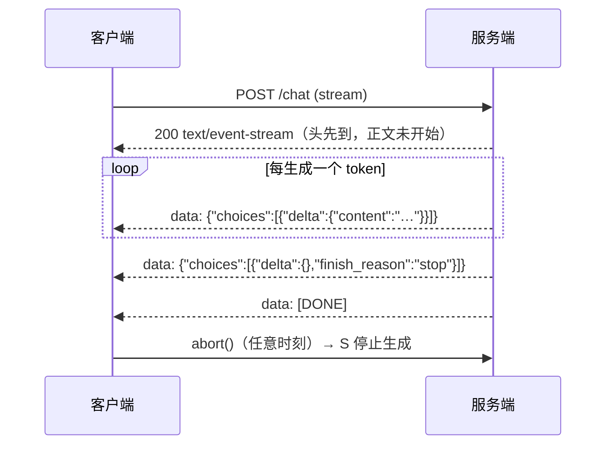

# 流式响应

> **在哪一层**：层 2 · 应用接入 ｜ **上一层出口**：能写并验证输入/输出 schema ｜ **本层出口**：能消费一次模型流——逐块累积、随时取消、中断可识别、结束原因可判断
> **前置**：[模型 API 契约](model-api.md) ｜ **下一步**：[会话与状态](../03-context/session-memory.md)、[生成式 UI](ui.md)

## 1. 概述

流式响应（Streaming）解决的问题是**感知延迟**。模型生成一段回答常需数秒；等整段到达，用户面对的是空白加转圈。流式让首字时间（Time To First Token，TTFT）进入亚秒级，后续内容逐步到达——用户"看到它在干活"，等待体验完全不同。

一次流式交互由四件事构成：**传输**（SSE，服务器发送事件 Server-Sent Events）、**累积**（把 chunk 拼成完整内容）、**取消**（AbortController 贯通到服务端停止生成）、**结束语义**（finish_reason 判断这次结束是正常、截断还是拒绝）。



### 何时使用 / 何时不用

- **用**：面向人的生成场景（聊天、写作、代码）；生成时长不可预测且用户在等。
- **不用**：后台批处理（整段处理更简单）；需要先整体校验再展示的结构化输出（见 [结构化输出](../02-inference-interface/structured-output)，可两者结合：流式传输、缓冲后校验）；对抗内容审核要求高的场景——流式的部分输出更难审核（OpenAI 官方提示，retrievedAt 2026-09-01）。

### 决策表：SSE vs WebSocket vs 轮询

| 方式 | 方向 | 控制权 | 状态 | 信任域 | 最低复杂度 |
| --- | --- | --- | --- | --- | --- |
| SSE（HTTP 流） | 单向：服务器→客户端 | 标准 HTTP，浏览器自动重连（EventSource） | 无状态连接 | 同源/普通 HTTP 鉴权 | 最低：响应头 + data 行 |
| WebSocket | 双向 | 自管协议、心跳、重连 | 可有状态 | 升级协议，需额外网关配置 | 中：需要双向时才值得 |
| 轮询 | 客户端拉 | 完全自管 | 服务端存结果 | 普通 HTTP | 低但延迟差、浪费请求 |

**默认 SSE**：模型流是纯单向推送，SSE 复用 HTTP 基础设施；只有需要边生成边上行输入（如实时语音打断）才上 WebSocket。

### 历史版本里程碑

SSE 是 WHATWG HTML 规范定义的老技术（早于 LLM 应用）；厂商各自定义流式事件格式——OpenAI Chat Completions 用 `data:` JSON 块 + `[DONE]` 哨兵，Responses API 改用带类型的语义事件（`response.output_text.delta` 等），Anthropic 用带生命周期的消息事件（`message_start` → `content_block_delta` → `message_stop`）。具体事件清单以官方文档为准（retrievedAt 2026-09-01）。

## 2. 使用

### 最小实战：零 key 流式消费与取消（≤15 分钟）

本地 mock 一个 OpenAI 风格的 SSE 流，客户端演示**完整消费**与**中途取消**两条路径。环境：Node ≥ 23.6（22.6–23.5 加 `--experimental-strip-types`）。保存为 `streaming-mock.mts`：

```ts
// fixture: 零 key、零依赖的 SSE 流消费与取消验证。输出确定性。
import * as http from 'node:http';

// ---- mock server：OpenAI 风格的 SSE 流，确定性分块 ----
const TOKENS = ['流式', '传输', '把', '等待', '变成', '逐步', '呈现', '。'];
const encoder = new TextEncoder();
const sleep = (ms: number) => new Promise((r) => setTimeout(r, ms));

const server = http.createServer(async (req, res) => {
  if (req.url !== '/v1/chat/stream') { res.writeHead(404).end(); return; }
  res.writeHead(200, {
    'Content-Type': 'text/event-stream',   // SSE 的 MIME 类型
    'Cache-Control': 'no-cache',
  });
  let finished = false;
  req.on('close', () => {
    if (!finished) console.log('[server] client disconnected -> generation stopped');
  });

  for (let i = 0; i < TOKENS.length; i++) {
    if (res.destroyed) return;             // 取消后立刻停止生成
    const chunk = { choices: [{ delta: { content: TOKENS[i] }, finish_reason: null }] };
    res.write(encoder.encode(`data: ${JSON.stringify(chunk)}\n\n`));
    await sleep(80);
  }
  finished = true;
  const done = { choices: [{ delta: {}, finish_reason: 'stop' }], usage: { prompt_tokens: 10, completion_tokens: 8, total_tokens: 18 } };
  res.write(encoder.encode(`data: ${JSON.stringify(done)}\n\n`));
  res.write(encoder.encode('data: [DONE]\n\n'));
  res.end();
});

await new Promise<void>((resolve) => server.listen(0, '127.0.0.1', resolve));
const base = `http://127.0.0.1:${(server.address() as { port: number }).port}`;

// ---- 客户端：SSE 解析 + chunk 累积 + AbortController 取消 ----
interface StreamResult { text: string; finishReason: string | null; aborted: boolean }

async function consumeStream(url: string, signal?: AbortSignal): Promise<StreamResult> {
  const res = await fetch(url, { signal });
  if (!res.ok || !res.body) throw new Error(`HTTP ${res.status}`);
  const reader = res.body.getReader();
  const decoder = new TextDecoder();
  let buffer = '';
  let text = '';
  let finishReason: string | null = null;

  try {
    while (true) {
      const { value, done } = await reader.read();
      if (done) break;
      buffer += decoder.decode(value, { stream: true });   // chunk 可能切断一行，先缓冲
      let sep: number;
      while ((sep = buffer.indexOf('\n\n')) >= 0) {        // 事件以空行分隔
        const rawEvent = buffer.slice(0, sep);
        buffer = buffer.slice(sep + 2);
        for (const line of rawEvent.split('\n')) {
          if (!line.startsWith('data:')) continue;          // 只处理 data: 行
          const data = line.slice(5).trim();
          if (data === '[DONE]') return { text, finishReason, aborted: false };
          const chunk = JSON.parse(data) as {
            choices: { delta: { content?: string }; finish_reason: string | null }[];
          };
          text += chunk.choices[0]?.delta.content ?? '';   // 累积
          if (chunk.choices[0]?.finish_reason) finishReason = chunk.choices[0].finish_reason;
        }
      }
    }
    return { text, finishReason, aborted: false };
  } catch (e) {
    if (signal?.aborted) return { text, finishReason, aborted: true };  // 取消：保留部分输出
    throw e;
  }
}

console.log('--- 完整消费 ---');
const full = await consumeStream(`${base}/v1/chat/stream`);
console.log('text:', full.text);
console.log('finish_reason:', full.finishReason);

console.log('--- 320ms 后取消 ---');
const controller = new AbortController();
setTimeout(() => controller.abort(), 320);
const partial = await consumeStream(`${base}/v1/chat/stream`, controller.signal);
console.log('text:', partial.text);
console.log('aborted:', partial.aborted, '| finish_reason:', partial.finishReason);

await sleep(50);
server.close();
```

运行与正常输出：

```text
$ node streaming-mock.mts
--- 完整消费 ---
text: 流式传输把等待变成逐步呈现。
finish_reason: stop
--- 320ms 后取消 ---
text: 流式传输把等待
aborted: true | finish_reason: null
[server] client disconnected -> generation stopped
```

负例输出即第二段：取消后 `aborted: true`、`finish_reason` 为空——**部分输出没有结束原因，UI 必须标"已中断"而不是当成完整回答**。服务端日志证明生成真的停了（这就是"可取消"的证据）。验收：两条路径输出与上面一致。

清理：删除文件；mock 监听 127.0.0.1 随机端口，进程退出即释放。

### 场景矩阵

| 场景 | 输入 | 动作 | 输出 | 适用 | 不适用 |
| --- | --- | --- | --- | --- | --- |
| 基础：逐块显示 | SSE 流 | 累积 delta + 渲染 | 完整文本 | 聊天界面 | 需整体校验的 JSON |
| 常见：停止按钮 | 用户点击 | AbortController.abort() | 部分文本 + 中断标记 | 任何生成 UI | — |
| 组合：流式 + 结构化 | 组件 JSON 流 | 按行缓冲 + 校验后渲染 | 白名单组件 | [生成式 UI](ui.md) | 强校验低频场景（直接非流式） |

## 3. 原理

### SSE wire 格式（WHATWG 规范行为，retrievedAt 2026-09-01，MDN）

- 响应头：`Content-Type: text/event-stream`，配合 `Cache-Control: no-cache`。
- 正文是 UTF-8 文本流；**每个事件以空行（`\n\n`）结束**。
- 每行是 `字段: 值`；识别四种字段：`data`（载荷）、`event`（事件名）、`id`（断点标识）、`retry`（重连毫秒数）。
- 连续多行 `data:` 会被拼接（中间插换行）；行首 `:` 是注释，可做保活心跳。
- `EventSource` API 对无名事件触发 `onmessage`，对 `event:` 命名事件触发对应 `addEventListener`；断线**自动重连**（可用 `retry` 调整），`close()` 主动终止。
- 连接数限制：HTTP/1.x 下**每个浏览器对同一域名最多 6 个并发 SSE 连接**（Chrome/Firefox 标记 Won't fix）；HTTP/2 协商流上限（默认 100）。

模型 API 的流几乎都用 `data:` 行携带 JSON；厂商差异在**事件词汇表**：

| 概念 | OpenAI Chat Completions | OpenAI Responses | Anthropic Messages |
| --- | --- | --- | --- |
| 增量文本 | `choices[0].delta.content` | `response.output_text.delta` 事件的 `delta` | `content_block_delta` 事件的 `text_delta` |
| 结束原因 | 最后一个 chunk 的 `finish_reason` | `response.completed` | `message_delta` 携带 `stop_reason` |
| 结束哨兵 | `data: [DONE]` | 事件类型即语义 | `message_stop` |
| 首个 chunk | delta 里只有 role | `response.created` | `message_start` |

### 结束原因语义

`finish_reason`/`stop_reason` 回答"这次为什么停了"，决定后续动作：

- 正常结束（`stop` / `end_turn`）：内容完整，可写回会话历史。
- 达到长度上限（`length` / `max_tokens`）：内容被截断，续写或提示用户。
- 停止序列（`stop_sequence`）：命中你设置的停止串。
- 工具调用（`tool_calls` / `tool_use`）：转到工具执行（见 [工具调用契约](../05-action/tool-calling)）。
- 安全拒绝（Anthropic `refusal`）：内容可能是拒答说明，先检查再展示。
- **取消（abort）：没有结束原因**——这是客户端行为，不是服务端语义，UI 必须自行标记。

### 背压与渲染节流

网络到达速度与渲染速度解耦。逐 chunk 直接 `setState` 会在高速流下打爆渲染管线。对策：把"累积"与"渲染"分开——每帧（requestAnimationFrame）或固定间隔 flush 一次缓冲。Node 侧的对应物是 `ReadableStream` 的 reader 循环天然逐块消费，不会整段堆积。

### 中断与恢复

- **传输中断 ≠ 生成语义**。fetch 流断了不会自动重连（EventSource 才有自动重连）；已收到的部分内容要保留并标记"未完成"。
- **生成不可续**。模型没有"从第 N 个 token 继续"的通用接口；恢复 = 用已有部分内容重新发起请求（或明确让用户重试）。EventSource 的 `Last-Event-ID` 重连只对**可重放的事件源**有意义，对一次性生成流没有。
- **代理缓冲是头号敌人**。Nginx 等反代默认缓冲响应，会把流攒成整段。服务端要 `X-Accel-Buffering: no`（或等价配置）并尽早 flush 响应头。

### 规范要求 vs 本地实测

| 断言 | 规范/官方文档 | 本地 mock 实测（上方 fixture） |
| --- | --- | --- |
| 事件以空行分隔，`data:` 行携带载荷 | WHATWG/MDN（L0） | 实测：解析器按 `\n\n` 切分成功 |
| chunk 可能切断一行，需缓冲拼接 | MDN 流式语义（L0） | 实测：解码用 `{ stream: true }` + buffer |
| abort 后服务端可感知连接关闭 | HTTP 连接语义 | 实测：`req.on('close')` 触发并停止生成 |
| 取消的流没有 finish_reason | 厂商流式文档推论 | 实测：`aborted: true` 时 `finishReason` 为 null |
| HTTP/1.x 同域 6 连接上限 | MDN（L0） | 未测（单连接场景），见未决问题 |

## 4. 开发

### 集成与兼容性

- 前端消费优先用 `fetch` + `AbortController`（POST 友好）；`EventSource` 只支持 GET，适合简单只读流。
- 服务端尽早 `flushHeaders()`；经过 CDN/网关时验证"逐块到达"而不是"整段到达"。
- 渲染层 memo 历史消息，只更新当前流式那条，避免整列表重渲染。

### 调试 runbook

### 症状 → 证据 → 处理 → 完成标准
**症状**：前端要等全部生成完才一次性显示。
**证据**：`curl -N <端点>` 观察是逐块还是整段到达；抓包看响应头是否有中间层缓冲痕迹。
**处理**：服务端加 `X-Accel-Buffering: no` / 关闭 gzip / 尽早 flush；确认中间层支持流式透传。
**完成标准**：`curl -N` 下 token 逐块打印；浏览器 TTFT 进入亚秒级。

### 症状 → 证据 → 处理 → 完成标准
**症状**：用户点了停止，账单显示生成仍在继续。
**证据**：服务端日志里 abort 后仍有生成循环输出。
**处理**：服务端监听 `req.on('close')`，把取消信号传给上游（对厂商 API 透传 AbortSignal），收到即停止。
**完成标准**：abort 后服务端生成日志立即停止；对账不再多计。

### 症状 → 证据 → 处理 → 完成标准
**症状**：中断的回答被当成完整回答写进历史，下一轮模型接着残句继续。
**证据**：会话历史里存在无 finish_reason 的 assistant 消息。
**处理**：写回历史前检查 `aborted`/`finishReason`；中断消息标记"已截断"或不入库。
**完成标准**：历史里每条 assistant 消息都有明确结束状态。

### 症状 → 证据 → 处理 → 完成标准
**症状**：多开几个标签页后新连接全部失败。
**证据**：浏览器控制台连接错误；HTTP/1.x 且同域连接数达到 6。
**处理**：升级 HTTP/2，或合并为单一事件通道（一个 SSE 连接多路复用）。
**完成标准**：多标签页同时流式正常。

### 反模式清单

- 对不完整 JSON 逐 chunk 调 `JSON.parse`——先按行/按事件缓冲。
- abort 只在前端 UI 层做，不贯通到服务端——生成继续、成本继续。
- 中断流静默吞掉，UI 显示成正常结尾——看似成功但结束原因缺失。
- 每个网络 chunk 直接 setState——高速流下渲染抖动。
- 忽略 `finish_reason`，把 `length` 截断当完整内容入库。

## 5. 资料库

### 四级阅读路线

- **Beginner**（2 条）：MDN Using server-sent events（wire 格式与 EventSource）；本页 fixture 跑通取消。
- **Builder**（2 条）：OpenAI streaming 指南（delta chunk 结构）；Anthropic streaming 事件参考。
- **Operator**（2 条）：流式路径的代理/CDN 配置核查（X-Accel-Buffering 等）；[可观测性](../08-production/observability) 中给流式加 TTFT 指标。
- **Researcher**（2 条）：WHATWG HTML 规范的 event stream 语法一节；HTTP/2 流多路复用资料。

### 资源表

| 名称 | 层级 | canonical URL | 用途 | 支持的断言 | 下一步 |
| --- | --- | --- | --- | --- | --- |
| MDN Using SSE | L0 | https://developer.mozilla.org/en-US/docs/Web/API/Server-sent_events/Using_server-sent_events | wire 格式权威 | 字段/空行分隔/重连/6 连接上限 | 写解析器 |
| OpenAI Streaming 指南 | L0 | https://platform.openai.com/docs/guides/streaming | 厂商流式总览 | delta 结构、[DONE]、审核提示 | 接真实厂商 |
| Anthropic Streaming 参考 | L0 | https://docs.anthropic.com | 事件生命周期 | message_start/delta/stop 事件族 | 接真实厂商 |
| WHATWG HTML 规范 | L0 | https://html.spec.whatwg.org/multipage/server-sent-events.html | 语法规范 | 事件流语法与解析规则 | 需要精确定义时查 |
| 本页 fixture | E | streaming-mock.mts（正文内联） | 零 key 验证 | 累积/取消/结束原因行为 | 换成真实厂商端点 |

retrievedAt：全部网页资源 2026-09-01。

### 主动证伪与未决问题

- "TTFT 亚秒级可显著改善体验"是工程共识，但你的产品阈值需自行度量（不同任务感知不同）。
- 6 连接上限未在 fixture 中复现（需要浏览器多标签环境）；断言来自 MDN，标注 L0。
- 厂商事件词汇表以官方文档为准，本页表格只列已核验字段。

### learn-ai 到此为止 / 继续去哪

本页管"逐步到达"。多轮历史怎么发与裁剪 → [会话与状态](../03-context/session-memory.md)；流里渲染组件 → [生成式 UI](ui.md)；TTFT/吞吐度量 → [成本与性能](../08-production/cost-performance)；框架的流式封装 → Products 框架页。
