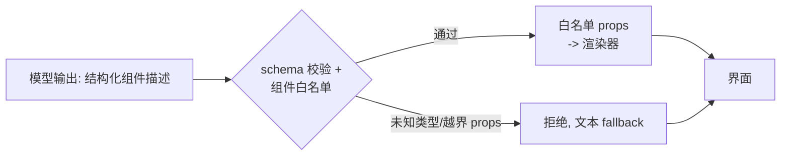

# 生成式 UI

> **在哪一层**：层 2 · 应用接入 ｜ **上一层出口**：能写并验证输入/输出 schema ｜ **本层出口**：能把模型输出渲染成白名单组件——流式到达、schema 校验、不可信内容被拒绝
> **前置**：[结构化输出](../02-inference-interface/structured-output)、[流式响应](streaming.md) ｜ **下一步**：[AG-UI 协议](../07-interoperability/ag-ui)、[A2UI 与 MCP Apps](../07-interoperability/a2ui-mcp-apps)

## 1. 概述

生成式 UI（Generative UI）解决的问题是：**纯文本回答对很多任务是天生的坏界面**。"北京今天 25 度"是一段文字；一张温度卡片加未来三小时趋势是可直接理解的界面。生成式 UI 让模型输出**结构化的组件描述**（schema 化的数据），前端把它渲染成白名单内的真实组件。

当前主流实现路径（以 Vercel AI SDK v7 文档为准，retrievedAt 2026-09-01）：**工具调用即 UI 描述**。你给模型一组工具（如 `displayWeather`），模型决定调用，工具执行返回数据，前端把"这个工具的这个输出"绑定到对应 React 组件渲染。模型从不输出 HTML，只输出结构化参数与数据。



### 何时使用 / 何时不用

- **用**：回答本质是数据展示（天气、行情、清单、表单草稿）；聊天流里混排文本与富组件。
- **不用**：回答本质是论述（文本就是最佳形态）；模型需要操作真实系统而不只是展示——那是 [层 4](../05-action/tool-execution) 的执行问题；要让任意第三方 host 渲染你的 Agent UI——那是协议问题（[AG-UI](../07-interoperability/ag-ui)、[A2UI](../07-interoperability/a2ui-mcp-apps)，本页只给思想基础）。

### 决策表：模型驱动界面的三种形态

| 形态 | 方向 | 控制权 | 状态 | 信任域 | 最低复杂度 |
| --- | --- | --- | --- | --- | --- |
| 纯文本 + 前端解析 | 模型只出文本 | 前端全权决定展示 | 无 | 文本即内容 | 最低 |
| 工具调用 → 组件（本页） | 模型选工具与参数 | 组件集由你锁定，模型只填数据 | 组件状态在客户端 | 模型输出过 schema + 白名单 | + 工具定义与组件绑定 |
| UI 协议（AG-UI/A2UI） | 标准化事件流 | 协议接管事件与状态语义 | 协议状态机 | 跨 host 边界需协议级信任 | 最高，跨端才值得 |

**从工具调用形态起步**：单一产品内不需要协议；组件集完全可控时安全性也最好。

### 历史版本里程碑

- 早期实现走"模型输出 JSON/JSX 直接渲染"路线（含 RSC 流式组件方案）；当前主流收敛到"工具调用 + 组件绑定"（Vercel AI SDK v7 文档形态，retrievedAt 2026-09-01）。
- 协议化路线（AG-UI、A2UI/MCP Apps）在 2025 后出现，属层 4 主题，本页不展开。

## 2. 使用

### 最小实战：零 key 组件流渲染（≤15 分钟）

mock 模型流式输出组件描述（NDJSON 行），客户端用白名单渲染器消费——包含**正常渲染**与**不可信内容拒绝**两类输出。环境：Node ≥ 23.6（22.6–23.5 加 `--experimental-strip-types`）。保存为 `ui-mock.mts`：

```ts
// fixture: 零依赖的生成式 UI 核心流水线验证。输出确定性。
type UiEvent =
  | { type: 'text'; text: string }
  | { type: 'component'; component: { type: string; props: Record<string, unknown> } };

// 组件白名单：渲染器只认识这里注册过的类型与 props
interface ComponentSpec {
  allowedProps: Record<string, 'string' | 'number' | 'string[]'>;
  render: (props: Record<string, unknown>) => string;
}
const registry: Record<string, ComponentSpec> = {
  card: {
    allowedProps: { title: 'string', items: 'string[]' },
    render: (p) => {
      const items = (p.items as string[]) ?? [];
      return [`+-- ${String(p.title)} --+`, ...items.map((it) => `| ${it}`)].join('\n');
    },
  },
  metric: {
    allowedProps: { label: 'string', value: 'string' },
    render: (p) => `[ ${p.label}: ${p.value} ]`,
  },
};

// 校验：类型在白名单内 + 不含越界 props；多余/未知 props 一律拒绝（不是忽略）
function validate(name: string, props: Record<string, unknown>): { ok: boolean; reason?: string } {
  const spec = registry[name];
  if (!spec) return { ok: false, reason: `unknown component type "${name}"` };
  for (const key of Object.keys(props)) {
    if (!(key in spec.allowedProps)) return { ok: false, reason: `prop "${key}" not allowed on "${name}"` };
  }
  return { ok: true };
}

// ---- mock 模型：分块吐出 NDJSON 行（模拟流式结构化输出） ----
const encoder = new TextEncoder();
const sleep = (ms: number) => new Promise((r) => setTimeout(r, ms));
const MODEL_OUTPUT: UiEvent[] = [
  { type: 'text', text: '本周概览：' },
  { type: 'component', component: { type: 'card', props: { title: '发布清单', items: ['流式接入', '会话裁剪'] } } },
  { type: 'component', component: { type: 'metric', props: { label: 'TTFT', value: '480ms' } } },
  // 负例：模型输出不可信 —— 未知组件、越界 props（注入尝试）
  { type: 'component', component: { type: 'iframe', props: { src: 'https://evil.example/x' } } },
  { type: 'component', component: { type: 'card', props: { title: 'x', items: [], onClick: 'alert(1)' } } },
];

async function* mockModelStream(): AsyncGenerator<Uint8Array> {
  for (const event of MODEL_OUTPUT) {
    // 故意把一行 JSON 拆成两个 chunk，验证客户端按行累积（对应流式部分 JSON 问题）
    const line = JSON.stringify(event);
    const mid = Math.floor(line.length / 2);
    yield encoder.encode(line.slice(0, mid));
    await sleep(20);
    yield encoder.encode(line.slice(mid) + '\n');
    await sleep(20);
  }
}

// ---- 客户端渲染流水线：按行累积 -> 校验 -> 白名单渲染 ----
async function renderStream(stream: AsyncGenerator<Uint8Array>): Promise<void> {
  let buffer = '';
  for await (const chunk of stream) {
    buffer += new TextDecoder().decode(chunk, { stream: true });
    let nl: number;
    while ((nl = buffer.indexOf('\n')) >= 0) {
      const line = buffer.slice(0, nl).trim();
      buffer = buffer.slice(nl + 1);
      if (!line) continue;
      const event = JSON.parse(line) as UiEvent;
      if (event.type === 'text') {
        console.log('text:', event.text);
        continue;
      }
      const { type, props } = event.component;
      const check = validate(type, props);
      if (!check.ok) {
        console.log(`rejected: ${check.reason} (fallback to text)`);
        continue;
      }
      // 只把白名单 props 传给渲染器
      const safe: Record<string, unknown> = {};
      for (const key of Object.keys(registry[type].allowedProps)) safe[key] = props[key];
      console.log('render:', registry[type].render(safe));
    }
  }
}

await renderStream(mockModelStream());
```

运行与正常输出：

```text
$ node ui-mock.mts
text: 本周概览：
render: +-- 发布清单 --+
| 流式接入
| 会话裁剪
render: [ TTFT: 480ms ]
rejected: unknown component type "iframe" (fallback to text)
rejected: prop "onClick" not allowed on "card" (fallback to text)
```

负例输出即最后两行：未知组件 `iframe` 与越界 prop `onClick`（注入尝试）都被拒绝并降级为文本——**渲染器对模型输出的信任度为零**。验收：五行输出与上面一致。

清理：删除文件即可。

### 场景矩阵

| 场景 | 输入 | 动作 | 输出 | 适用 | 不适用 |
| --- | --- | --- | --- | --- | --- |
| 基础：数据卡片 | 结构化工具输出 | 白名单组件渲染 | 富卡片 | 天气/行情/清单 | 论述型回答 |
| 常见：流式占位 | 工具调用开始 | loading 态 → 完成态替换 | 先骨架后内容 | 慢工具（秒级） | 即时返回的数据 |
| 组合：表单草稿 | 模型生成预填值 | 表单组件 + 用户确认 | 可编辑草稿 | 结构化录入 | 需要直接落库的场景（须人工确认） |

## 3. 原理

### 渲染流水线的四个阶段

1. **描述**：模型输出结构化组件描述（本页 fixture 用 NDJSON 事件；产品路径通常是工具调用的参数与结果，见 [工具调用契约](../05-action/tool-calling)）。
2. **校验**：描述必须通过 schema（形状）与白名单（类型与 props 范围）双重检查——这是层 1 出口在本层的直接应用。
3. **绑定**：合法描述映射到真实组件；传给组件的只有白名单 props。
4. **降级**：任何不合法描述降级为文本呈现，绝不中断整个流。

### 与流式的组合

组件事件在流里到达时处于"部分 JSON"状态（一行被网络切断），对策与 [流式响应](streaming.md) 一致：**按事件边界缓冲，凑齐再解析**。产品路径下工具调用有三态（对应 Vercel AI SDK v7 的 tool part 状态，retrievedAt 2026-09-01）：`input-available`（参数到齐，可显示骨架）→ `output-available`（数据到齐，渲染组件）→ `output-error`（显示错误态）。

### 安全边界（本页最重要的原理）

**模型输出是不可信输入**。它可能被提示注入劫持（见 [安全](../08-production/security)），产出试图逃逸的组件描述。因此：

- **白名单枚举**，不是黑名单过滤：渲染器只认识注册过的组件类型。
- **props 收窄**：只传递声明的 props，类型校验后进入组件。
- **永不**：`dangerouslySetInnerHTML`、`eval`、把模型输出的字符串当 URL/HTML/代码执行。文本内容渲染时走框架默认转义。
- 组件库保持小而钝：卡片、指标、图表、表单草稿——不给"通用容器"类组件（iframe、script、任意 HTML）。

### 规范要求 vs 本地实测

| 断言 | 规范/官方文档 | 本地 mock 实测（上方 fixture） |
| --- | --- | --- |
| 工具调用结果可绑定组件渲染 | Vercel AI SDK v7 文档（L0） | fixture 用 NDJSON 事件模拟该路径 |
| 工具有三态（参数/输出/错误） | 同上 | fixture 覆盖成功与拒绝两态 |
| 流式部分 JSON 需按事件缓冲 | SSE/NDJSON 流语义 | 实测：一行拆两 chunk 仍正确解析 |
| 白名单拒绝未知组件与越界 props | 应用安全实践 | 实测：两类注入均被拒 |
| 模型输出 HTML/JSX 直接渲染有注入风险 | 应用安全共识 | 未构造真实注入攻击，见未决问题 |

## 4. 开发

### 集成与版本

- 组件 schema 纳入契约测试：新增组件时同步扩白名单与测试用例。
- 组件描述版本化：历史会话回放时，旧描述要能用旧白名单渲染（描述里带版本号）。
- 与状态层对接：组件事件写回会话历史时保留结构化形态（可重放），不要只存渲染后的文本。

### 调试 runbook

### 症状 → 证据 → 处理 → 完成标准
**症状**：组件渲染出畸形界面（空卡片、错位）。
**证据**：schema 校验日志；离线重放该组件描述的 JSON。
**处理**：收紧 schema（必填字段、类型）；加渲染前校验；不合法走文本降级。
**完成标准**：畸形描述不再进入渲染器，均显示 fallback。

### 症状 → 证据 → 处理 → 完成标准
**症状**：安全测试发现模型输出里夹带的脚本被执行。
**证据**：渲染路径中存在 HTML 注入点（dangerouslySetInnerHTML、未转义插值、任意 URL）。
**处理**：删除通用容器组件；props 白名单收窄；全部文本走默认转义。
**完成标准**：注入 payload 重放只得到"rejected + 文本 fallback"。

### 症状 → 证据 → 处理 → 完成标准
**症状**：流式渲染抖动，组件闪烁跳动。
**证据**：每个网络 chunk 触发一次重排；骨架态与完成态频繁切换。
**处理**：按事件缓冲凑齐再渲染；三态只在状态迁移时更新；历史组件 memo。
**完成标准**：长流下界面只按事件粒度变化，无逐 chunk 抖动。

### 症状 → 证据 → 处理 → 完成标准
**症状**：刷新后组件变成原始 JSON 文本。
**证据**：会话历史只存了文本投影，结构化描述丢失。
**处理**：历史存结构化描述（带版本），渲染作为投影按需重放。
**完成标准**：刷新后组件按原样重渲染。

### 反模式清单

- 给模型一个"渲染任意 HTML"的组件——等于把 DOM 交给不可信输入。
- 校验失败静默丢弃——用户不知道有内容被吞，显示 fallback 并留痕。
- 组件 props 直通模型输出（无白名单）——注入面随 props 增长。
- 只存渲染结果不存结构化描述——历史不可重放。
- 在单一产品内直接引入跨 host UI 协议——复杂度错配（协议留在层 4）。

## 5. 资料库

### 四级阅读路线

- **Beginner**（2 条）：本页 fixture 跑通白名单渲染；[结构化输出](../02-inference-interface/structured-output) 复习 schema 纪律。
- **Builder**（2 条）：Vercel AI SDK 的 Generative User Interfaces 指南（工具→组件绑定的产品路径）；给两三个业务组件补三态渲染。
- **Operator**（2 条）：组件渲染失败率的监控与 fallback 统计；[安全](../08-production/security) 的注入测试用例覆盖组件路径。
- **Researcher**（2 条）：[AG-UI](../07-interoperability/ag-ui) 与 [A2UI/MCP Apps](../07-interoperability/a2ui-mcp-apps) 的协议化路径对比。

### 资源表

| 名称 | 层级 | canonical URL | 用途 | 支持的断言 | 下一步 |
| --- | --- | --- | --- | --- | --- |
| Vercel AI SDK: Generative User Interfaces | L0 | https://ai-sdk.dev/docs/ai-sdk-ui/generative-user-interfaces | 产品路径权威 | 工具→组件绑定；tool part 三态 | 按指南接真实工具 |
| Vercel AI SDK: Chatbot Tool Usage | L0 | https://ai-sdk.dev/docs/ai-sdk-ui/chatbot-tool-usage | 工具渲染细节 | 工具部分渲染模式 | 扩展组件集 |
| OWASP Prompt Injection 资料 | L1 | https://owasp.org/www-project-top-ten/ | 注入风险背景 | 模型输出不可信的理由 | 做注入测试 |
| 本页 fixture | E | ui-mock.mts（正文内联） | 零 key 验证 | 白名单拒绝行为 | 换成真实工具调用 |
| AG-UI（本仓层 4） | E | ../07-interoperability/ag-ui | 协议化下钻 | 事件/状态/interrupt 语义 | 需要跨 host 时 |

retrievedAt：全部网页资源 2026-09-01。

### 主动证伪与未决问题

- fixture 未构造真实浏览器注入攻击（无 DOM 环境）；"转义+白名单足够"的结论基于静态推理与 OWASP 实践，浏览器路径需 [安全](../08-production/security) 的用例补充。
- "文本是某些任务的天生坏界面"是产品设计判断，反例存在（重度屏幕阅读器用户偏好纯文本），组件须提供无障碍文本等价物。
- RSC 流式组件等历史路线未在本页保留实现细节（已被主流收敛取代）。

### learn-ai 到此为止 / 继续去哪

本页管"产品内的组件流"。跨 host 的 UI 协议 → [AG-UI](../07-interoperability/ag-ui)、[A2UI 与 MCP Apps](../07-interoperability/a2ui-mcp-apps)；组件触发真实动作的执行安全 → [工具执行工程](../05-action/tool-execution)；无障碍与设计系统 → 产品设计资料（本仓不展开）。
