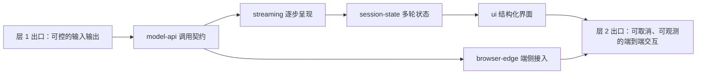

# 层 2 · 应用接入

> **在哪一层**：层 2 · 应用接入 ｜ **上一层出口**：能写并验证输入/输出 schema ｜ **本层出口**：能做一次可取消、可观测的端到端交互
> **前置**：[结构化输出](../01-contracts/structured-output)、[工具调用契约](../01-contracts/tool-calling) ｜ **下一步**：[嵌入与检索](../03-grounding/embeddings-retrieval)、[可观测性](../05-operations/observability)

## 1. 概述

层 2 解决一个具体症状：**回答已经稳定，但还没进产品**。层 1 让你能控制模型的输入与输出；本层把这份能力接入真实的用户界面——API 怎么调、输出怎么逐步到达、多轮对话的状态放哪、出错怎么办。

能力与产品之间有一道鸿沟，由四件事构成：

- **API 适配**：把厂商各异的接口收敛成一个稳定的调用契约（消息、采样、用量、错误）。
- **流式**：把"等整段"变成"边生成边看"，感知延迟从总时长降到首字时间。
- **会话**：模型 API 是无状态的，多轮对话的历史由你保存、裁剪、恢复。
- **错误处理**：限流、超时、中断在产品里是常态，重试语义要在接入层定义清楚。



### 何时进入本层 / 何时不进

- **进**：接口已通、输出已可控，要把它做成用户面对的功能。
- **不进**：回答本身还不稳定、无法解析——先回 [层 1 交互契约](../01-contracts/structured-output)；回答缺少私有事实——去 [层 3 知识接地](../03-grounding/rag)；要让系统执行动作——去 [层 4 行动与协作](../04-action/tool-execution)。

### 症状 → 主题导航

| 症状 | 去哪 | 读完你能 |
| --- | --- | --- |
| 第一条请求还没发出去 / 429 一来就崩 | [模型 API 契约](model-api) | 写出带错误族分类与重试的调用循环 |
| 接口通了，UI 要等整段才出字 | [流式响应](streaming) | 消费 SSE 流，可取消、可中断恢复 |
| 多轮对话越聊越贵 / 刷新丢历史 | [会话与状态](session-state) | 管理会话历史：裁剪、持久化、并发防护 |
| 想让回答带组件而不只是文字 | [生成式 UI](ui) | 把模型输出渲染成白名单组件 |
| 想降延迟 / 保隐私 / 离线可用 | [浏览器与端侧推理](browser-edge) | 选对端侧运行库与降级链 |

### 决策表：接入方式对比

| 方式 | 方向 | 控制权 | 状态 | 信任域 | 最低复杂度 |
| --- | --- | --- | --- | --- | --- |
| 直接 fetch 厂商 API | 出站请求/响应 | 全部自管 | 无（每轮自建） | 密钥在服务端 | 单文件可跑 |
| 官方 SDK | 出站请求/响应 | SDK 管重试与类型 | 无 | 密钥在服务端 | +1 依赖 |
| 前端 AI 框架 | 请求+流+UI 全包 | 框架接管 | 框架会话模型 | 密钥在服务端 | 引入框架契约 |
| 端侧推理 | 设备内执行 | 完全自管 | 设备本地 | 数据不出设备 | 模型分发+运行时 |

选型原则：**从最低复杂度起步**。直接 fetch 直到你需要 SDK 的重试与类型；上框架直到你同时要流式、会话与 UI 三件事。

### 历史版本里程碑

厂商 API 形态持续演化（如 OpenAI 从 Chat Completions 到 Responses API、Anthropic 采样参数随模型世代收缩）。本层不维护厂商时间线，具体字段以官方文档当天页面为准；本仓记录决策影响的断言均标注 retrievedAt。

## 2. 使用

本层最小实战是 [模型 API 契约](model-api) 的零 key 示例：一个本地 mock server 加一个带错误处理的客户端循环，15 分钟内可在干净环境跑通。

```bash
# 保存 model-api 页的完整示例为 model-api-mock.mts，然后：
node model-api-mock.mts
```

验收：三条输出齐全——正常调用返回内容与用量、429 触发一次退避重试后成功、400 不重试直接报错。跑通后你已经亲手实现了一次"可观测"的调用（看到 usage）与错误分族（看到 retryable 标记）。

各主题的使用段都遵循同一约束：零 API key、单文件自包含、确定性输出、正常路径与负例路径成对出现。

## 3. 原理

在能力变换链上，本层把"一次可控变换"升级为"一条产品交互链"：

```text
用户动作 → 请求组装（层 1 schema + 层 2 会话状态）
        → API 调用（model-api：错误族、重试、用量）
        → 流式呈现（streaming：SSE、累积、取消）
        → 结构化渲染（ui：白名单组件）
        → 状态写回（session-state：裁剪、持久化、版本）
```

- **不变量 1**：模型 API 无状态。每次请求重发全部所需历史；"对话记忆"是接入层的构造物。
- **不变量 2**：模型输出是不可信输入。渲染前必须过 schema 与白名单（层 1 出口在本层的直接应用）。
- **不变量 3**：交互必须可取消、可观测。取消依赖 AbortController 贯通到服务端停止生成；观测依赖 usage 与 trace 贯通到成本面板。

**出口标准（Exit criteria）**：能做一次可取消、可观测的端到端交互——用户发出请求、看到逐步输出、中途可停、停后状态一致、事后能对账。

各主题的原理细节：[model-api](model-api)、[streaming](streaming)、[session-state](session-state)、[ui](ui)、[browser-edge](browser-edge)。

## 4. 开发

进入本层前，先用三条诊断定位该读哪页。

### 症状 → 证据 → 处理 → 完成标准
**症状**：功能演示时一切正常，上线后偶发失败。
**证据**：失败样本的 HTTP 状态码分布；429/5xx 占比。
**处理**：按 [model-api](model-api) 补错误族分类与退避重试；配额类错误先修配额而不是重试。
**完成标准**：同样的流量下，客户端日志显示重试收敛、无未分类错误。

### 症状 → 证据 → 处理 → 完成标准
**症状**：用户反馈"要等很久才一次性出全部字"。
**证据**：浏览器网络面板看到整段响应一次到达。
**处理**：按 [streaming](streaming) 打开流式链路（服务端分块、代理不缓冲、客户端逐块渲染）。
**完成标准**：`curl -N` 能看到逐块到达；首字时间进入秒级以内。

### 症状 → 证据 → 处理 → 完成标准
**症状**：对话轮数越多，延迟与成本越高；刷新页面历史丢失。
**证据**：请求日志里重发的 messages 长度逐轮膨胀；store 位置在内存。
**处理**：按 [session-state](session-state) 加 token 预算裁剪与持久化。
**完成标准**：重发 payload 有上限；重启后会话可续接。

## 5. 资料库

### 四级阅读路线

- **Beginner**：[模型 API 契约](model-api)（先跑通一次调用）→ [流式响应](streaming)（让字出来）。
- **Builder**：[会话与状态](session-state) → [生成式 UI](ui)。
- **Operator**：各主题"开发"段的 runbook → [可观测性](../05-operations/observability)。
- **Researcher**：[浏览器与端侧推理](browser-edge) → 层 3 检索链（[RAG](../03-grounding/rag)）。

### 主动证伪与未决问题

- 本层断言"感知延迟由 TTFT 主导"来自流式传输的通用工程经验，具体产品的阈值需自行度量。
- 厂商字段名与错误码随版本变化，本层表格只保留已核验版本，以官方文档为准。

### learn-ai 到此为止 / 继续去哪

本层回答"怎么接"，不回答"检索依据"（→ [层 3 知识接地](../03-grounding/embeddings-retrieval)）、"执行动作"（→ [层 4 行动与协作](../04-action/tool-execution)）、"上线证据"（→ [层 5 可靠运营](../05-operations/testing)）。
