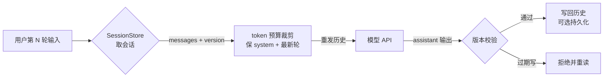

# 会话与状态

> **在哪一层**：层 2 · 应用接入 ｜ **上一层出口**：能写并验证输入/输出 schema ｜ **本层出口**：能给多轮对话建会话——历史有预算裁剪、能持久化恢复、并发写入有防护
> **前置**：[流式响应](../02-inference-interface/streaming.md)、[上下文工程](context-engineering) ｜ **下一步**：[生成式 UI](../02-inference-interface/ui.md)、[工具执行工程](../05-action/tool-execution)

## 1. 概述

会话与状态解决的问题是：**模型 API 没有记忆，而产品需要多轮对话**。每次请求都要重发历史（见 [模型 API 契约](../02-inference-interface/model-api.md) 的关键推论），于是三个工程问题落到你头上：历史**放哪**（内存/Redis/数据库）、发多少（**token 预算内裁剪**）、出事后**怎么续**（恢复与并发防护）。



### 何时使用 / 何时不用

- **用**：任何多轮交互（聊天、迭代式编辑、带上下文的工具任务）。
- **不用**：单次无状态的调用（分类、抽取、单轮问答）——直接构造 messages 即可；跨会话的长期记忆与知识沉淀——那是检索问题，去 [层 3](../04-grounding/embeddings-retrieval)。

### 决策表：会话状态放哪

| 方案 | 方向 | 控制权 | 状态 | 信任域 | 最低复杂度 |
| --- | --- | --- | --- | --- | --- |
| 进程内存（Map） | 进程内读写 | 完全自管 | 重启即丢 | 单实例边界 | 最低：一个 Map |
| Redis（TTL） | 共享外存 | 自管 schema 与失效 | 跨实例、可过期 | 引入运维组件 | +1 基础设施 |
| 数据库（行存） | 持久外存 | 自管迁移与索引 | 永久、可审计 | 引入 schema 治理 | +1 表结构治理 |

**从内存起步**：单实例先用 Map 跑通语义（裁剪、版本、恢复），需要多实例或重启存活时再上 Redis/DB——接口不变，只换 store 实现。

### 历史版本里程碑

厂商在补服务端会话的便利层（如 OpenAI Responses 的 `previous_response_id` 服务端会话状态，retrievedAt 2026-09-01），但**会话状态的 ownership 仍在接入层**——厂商便利层不可移植，跨厂商迁移时你还是要自己管历史。

## 2. 使用

### 最小实战：零 key 会话存储（≤15 分钟）

内存 session store + token 预算裁剪 + 快照恢复 + 乐观锁，四件事一个文件验证。环境：Node ≥ 23.6（22.6–23.5 加 `--experimental-strip-types`）。保存为 `session-mock.mts`：

```ts
// fixture: 零依赖的会话状态核心逻辑验证。输出确定性。
interface ChatMessage { role: 'system' | 'user' | 'assistant'; content: string }
interface Session {
  id: string;
  version: number;          // 乐观锁：每次写入 +1
  messages: ChatMessage[];
}

const TOKENS_PER_CHAR = 0.25;   // 启发式估算：4 字符 ≈ 1 token（英文近似）
const estimateTokens = (text: string): number => Math.ceil(text.length * TOKENS_PER_CHAR);
const estimateHistory = (messages: ChatMessage[]): number =>
  messages.reduce((sum, m) => sum + estimateTokens(m.content), 0);

// token 预算内裁剪：永远保留 system 与最新一轮，从最旧的非 system 消息开始丢弃
function trimToBudget(messages: ChatMessage[], budgetTokens: number): ChatMessage[] {
  const system = messages.filter((m) => m.role === 'system');
  const conversation = messages.filter((m) => m.role !== 'system');
  const kept: ChatMessage[] = [];
  for (let i = conversation.length - 1; i >= 0; i--) {   // 从最新往回收集
    const candidate = [...system, ...kept, conversation[i]];
    if (estimateHistory(candidate) > budgetTokens && kept.length > 0) break;
    kept.unshift(conversation[i]);
  }
  return [...system, ...kept];
}

// ---- 内存 store + 序列化快照（模拟持久化） ----
class SessionStore {
  private sessions = new Map<string, Session>();
  create(id: string, system: string): Session {
    const s: Session = { id, version: 0, messages: [{ role: 'system', content: system }] };
    this.sessions.set(id, s);
    return s;
  }
  get(id: string): Session | undefined { return this.sessions.get(id); }
  append(id: string, message: ChatMessage, expectedVersion: number): { ok: boolean; version: number } {
    const s = this.sessions.get(id);
    if (!s) return { ok: false, version: -1 };
    if (s.version !== expectedVersion) return { ok: false, version: s.version };  // 竞态：版本不匹配
    s.version += 1;
    s.messages.push(message);
    return { ok: true, version: s.version };
  }
  snapshot(id: string): string { return JSON.stringify(this.sessions.get(id)); }
  restore(id: string, snapshot: string): void {
    this.sessions.set(id, JSON.parse(snapshot) as Session);
  }
}

// ---- 演示 ----
const store = new SessionStore();
store.create('s1', '你是简洁的助手');
store.append('s1', { role: 'user', content: '第一轮：介绍流式传输' }, 0);
store.append('s1', { role: 'assistant', content: '流式传输让输出逐步到达。' }, 1);
store.append('s1', { role: 'user', content: '第二轮：它和 SSE 什么关系？' }, 2);
const history = store.get('s1')!.messages;

console.log('--- 裁剪：预算决定重发多少历史 ---');
console.log('完整历史 tokens:', estimateHistory(history), '| 消息数:', history.length);
const loose = trimToBudget(history, 40);
const tight = trimToBudget(history, 8);
console.log('budget=40 ->', loose.length, '条 |', loose.map((m) => m.role).join(' -> '));
console.log('budget=8 ->', tight.length, '条 |', tight.map((m) => m.role).join(' -> '), '| system 保留:', tight[0].role === 'system');

console.log('--- 快照 -> 恢复（模拟进程重启） ---');
const snap = store.snapshot('s1');
const store2 = new SessionStore();
store2.restore('s1', snap);
console.log('恢复后轮数:', store2.get('s1')!.messages.length, '| version:', store2.get('s1')!.version);

console.log('--- 并发写入同一会话：乐观锁拒绝过期写 ---');
const v = store2.get('s1')!.version;
const writeA = store2.append('s1', { role: 'user', content: 'A 的输入' }, v);        // 先到
const writeB = store2.append('s1', { role: 'user', content: 'B 的输入' }, v);        // 后到，版本已过期
console.log('writeA:', writeA, '| writeB:', writeB);
console.log('最终历史:', store2.get('s1')!.messages.map((m) => m.content).join(' | '));
```

运行与正常输出：

```text
$ node session-mock.mts
--- 裁剪：预算决定重发多少历史 ---
完整历史 tokens: 12 | 消息数: 4
budget=40 -> 4 条 | system -> user -> assistant -> user
budget=8 -> 2 条 | system -> user | system 保留: true
--- 快照 -> 恢复（模拟进程重启） ---
恢复后轮数: 4 | version: 3
--- 并发写入同一会话：乐观锁拒绝过期写 ---
writeA: { ok: true, version: 4 } | writeB: { ok: false, version: 4 }
最终历史: 你是简洁的助手 | 第一轮：介绍流式传输 | 流式传输让输出逐步到达。 | 第二轮：它和 SSE 什么关系？ | A 的输入
```

负例输出即第三段：`writeB` 被乐观锁拒绝（`ok: false`），过期写入没有污染历史——**B 的输入不在最终历史里**。验收：三段输出与上面一致，尤其 `budget=8` 时 system 仍保留。

清理：删除文件即可。

### 场景矩阵

| 场景 | 输入 | 动作 | 输出 | 适用 | 不适用 |
| --- | --- | --- | --- | --- | --- |
| 基础：多轮对话 | 会话 id + 新输入 | 取历史 → 裁剪 → 重发 → 写回 | 线性历史 | 所有聊天产品 | 单轮任务 |
| 常见：重启存活 | 进程重启 | 上轮末快照 → restore | 会话续接 | 任何长会话产品 | 一次性会话 |
| 组合：并发编辑 | 同会话两路写入 | 乐观锁拒绝过期写 | 线性一致历史 | 多端同步 | 写入频率极低且无冲突 |

## 3. 原理

### 无状态 API vs 有状态会话

不变量：**厂商 API 只看本次请求的 messages；"会话"是接入层的投影**。由此推出三条设计约束：

1. **历史即成本**。重发的每个 token 都计费，轮数越多越贵——裁剪不是优化，是必需。
2. **历史即上下文**。裁剪策略直接改变模型行为（丢掉的关键轮次=失忆），与 [上下文工程](context-engineering) 是同一问题在会话维度的实例。
3. **历史即信任边界**。写回历史的必须是**完成的内容**——流式截断的消息（见 [流式响应](../02-inference-interface/streaming.md) 的结束语义）不该进历史。

### 裁剪策略空间

| 策略 | 做法 | 代价 | 适用 |
| --- | --- | --- | --- |
| 尾部窗口 | 保 system + 最近 N 轮 | 丢早期上下文 | 简单聊天 |
| token 预算 | 保 system + 预算内最新内容（本页 fixture） | 同上，但成本可控 | 生产默认 |
| 摘要压缩 | 旧轮摘要成一条 system/assistant 消息 | 摘要有损 + 一次额外调用 | 长会话 |
| 检索式 | 旧内容转向量库按需检索 | 引入整套检索链 | 跨会话知识（→ [层 3](../04-grounding/rag)） |

token 估算：字符近似（如英文 4 字符 ≈ 1 token）只配做裁剪预算；**精确计数用厂商端点**（如 Anthropic 的 count tokens 接口，retrievedAt 2026-09-01）或 SDK 的计数工具。

### 失效与恢复

- **TTL**：会话给过期时间（Redis 天然支持）；过期即从"可续接"降级为"需重新开始"。
- **快照点**：每完成一轮（assistant 消息落库）打一个一致快照；恢复时回放到最后一个完整轮。
- **部分轮丢弃**：崩溃时进行中的流没有完整 assistant 输出——丢弃该轮，回滚到上一快照，而不是把半截内容写进历史。

### 并发与竞态

同一会话并发请求会产生两种污染：**交错历史**（两路输出穿插）与**版本覆盖**（旧写覆盖新写）。最低复杂度防护是乐观锁（fixture 的 version 字段）：写入必须携带读到的版本，不匹配即拒绝，客户端重读后重试或合并。更强防护是会话级串行化（队列/锁），适用于高冲突场景。

### 规范要求 vs 本地实测

| 断言 | 规范/官方文档 | 本地 mock 实测（上方 fixture） |
| --- | --- | --- |
| API 无状态，历史需重发 | 两家 API 参考（L0） | fixture 的重发路径即按此构造 |
| 4 字符 ≈ 1 token 为近似 | tokenizer 常识（估算用） | 实测：估算值确定性可用于预算 |
| 裁剪必须保 system 与最新轮 | 上下文工程实践 | 实测：budget=8 时 system -> user |
| 乐观锁可拒绝过期写 | 并发控制通用模式 | 实测：writeB `ok: false` |
| 精确计数用厂商端点 | Anthropic count tokens（L0） | 未测（零 key 设计），见未决问题 |

## 4. 开发

### 集成与迁移

- store 接口（get/append/snapshot/restore）保持窄，内存 → Redis → DB 只换实现。
- 持久化 schema 预留 `version` 与 `created_at`/`updated_at`，迁移时用得上。
- 会话数据含用户输入，属个人数据：清理策略（TTL/删除账户）与 [安全](../08-production/security) 合规一起设计。

### 调试 runbook

### 症状 → 证据 → 处理 → 完成标准
**症状**：聊得越久回答越"失忆"，或成本曲线陡增。
**证据**：请求日志里重发 messages 的长度与 usage.prompt_tokens 逐轮膨胀。
**处理**：接入 token 预算裁剪；确认裁剪保住 system 与最新轮。
**完成标准**：重发 payload 有硬上限；prompt_tokens 增长进入平台期。

### 症状 → 证据 → 处理 → 完成标准
**症状**：刷新或重启后对话从零开始。
**证据**：store 实现是进程内存，且无恢复路径。
**处理**：按轮快照持久化（Redis TTL 或 DB）；启动时 hydrate。
**完成标准**：重启进程，会话从最后完整轮续接。

### 症状 → 证据 → 处理 → 完成标准
**症状**：双端同时操作后，历史出现交错或丢失消息。
**证据**：历史序列里 user/assistant 乱序；两路写请求时间线重叠。
**处理**：加乐观锁（fixture 的 version）或会话级串行化；被拒方重读合并。
**完成标准**：并发写入后历史保持线性一致，无覆盖丢失。

### 症状 → 证据 → 处理 → 完成标准
**症状**：会话存储无限增长。
**证据**：store 或表的大小曲线；过期会话从未清理。
**处理**：TTL + 容量上限 + 归档策略。
**完成标准**：存储规模与活跃会话数挂钩，陈旧会话可自动过期。

### 反模式清单

- 把厂商的"服务端会话便利层"当跨厂商可移植能力依赖。
- 截断的流式输出直接写回历史（下轮模型接着残句生成）。
- 只按"轮数 N"裁剪不看 token——中文一轮可能顶英文十轮。
- 并发写入无版本防护——双端场景必然翻车。
- 会话历史无清理策略——存储与隐私双负债。

## 5. 资料库

### 四级阅读路线

- **Beginner**（2 条）：本页 fixture 跑通裁剪与恢复；[上下文工程](context-engineering) 理解"窗口是资源"。
- **Builder**（2 条）：把 store 换成 Redis 实现（TTL）；接入厂商 token 计数端点做精确预算。
- **Operator**（2 条）：会话存储的容量与过期治理；usage 对账（历史长度 vs 计费）。
- **Researcher**（2 条）：摘要压缩 vs 检索式记忆的取舍（衔接 [RAG](../04-grounding/rag)）；厂商服务端会话层的边界阅读。

### 资源表

| 名称 | 层级 | canonical URL | 用途 | 支持的断言 | 下一步 |
| --- | --- | --- | --- | --- | --- |
| OpenAI Conversation state 指南 | L0 | https://developers.openai.com/api/docs/guides/conversation-state | 服务端会话便利层 | previous_response_id 语义 | 决定是否依赖 |
| Anthropic Count tokens 参考 | L0 | https://docs.anthropic.com | 精确 token 计数 | 计数端点存在与用法 | 替换启发式估算 |
| MDN IndexedDB / Web Storage | L0 | https://developer.mozilla.org/en-US/docs/Web/API/IndexedDB_API | 浏览器侧会话持久化 | 本地存储能力边界 | 前端回填 |
| 本页 fixture | E | session-mock.mts（正文内联） | 零 key 验证 | 裁剪/恢复/乐观锁行为 | 换持久化实现 |
| 上下文工程（本仓） | E | ../03-context/context-engineering | 窗口管理原理 | 裁剪策略的上下文视角 | 衔接层 1 |

retrievedAt：全部网页资源 2026-09-01。

### 主动证伪与未决问题

- 4 字符 ≈ 1 token 的估算只对英文近似；中文比率不同，生产应换厂商计数端点（fixture 未覆盖真实计数调用）。
- 摘要压缩策略的性价比未在本页验证，需要按产品度量。
- 厂商服务端会话层的字段与限制随版本变化，依赖前查官方当天文档。

### learn-ai 到此为止 / 继续去哪

本页管"会话内状态"。跨会话知识与私有事实 → [层 3 知识接地](../04-grounding/embeddings-retrieval)；会话中要执行动作与工具 → [层 4 工具执行工程](../05-action/tool-execution)；Agent 级的长期记忆与检查点 → [Agent 状态与记忆](../06-agent-systems/state-memory)。
