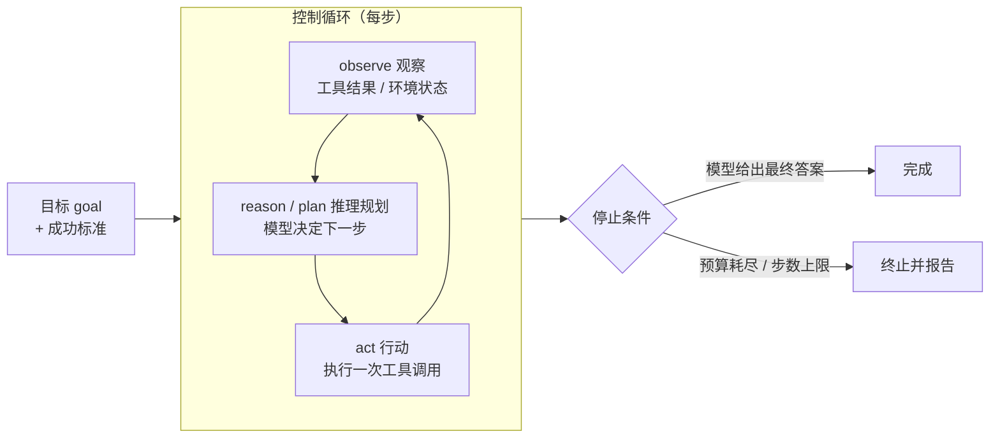

> **在哪一层**：层 4 · 行动与协作 / Agent Runtime ｜ **上一层出口**：能安全执行单次工具调用，并把固定步骤编排成工作流 ｜ **本层出口**：能搭出带停止条件与预算的最小 Agent 循环，并知道状态、恢复、界面自动化各读哪页
> **前置**：[工具调用契约](../../01-contracts/tool-calling) · [工具执行工程](../tool-execution) · [工作流模式](../workflow) ｜ **下一步**：[Agent 设计模式](design-patterns) · [Agent 状态与记忆](state-memory) · [恢复与人工批准](recovery-hitl) · [Computer Use](computer-use)

## 1. 概述

**结论先讲**：Agent 运行时（agent runtime）是把「模型、上下文、工具、状态」装进一个**控制循环**、放进**环境**里跑到停止条件为止的那层代码。Anthropic 把 agent 总结为「基于环境反馈在循环中使用工具的 LLM」；OpenAI 的定义同构：agent 是「规划、调用工具、跨专家协作，并保留足够状态以完成多步工作」的应用。你不训练模型，你写的是这层运行时。

### Agent 定义公式

```text
Agent = model（模型）
      + context（上下文：指令、历史、检索结果）
      + tools（工具：带 schema 的动作空间）
      + state（状态：跨步存活的数据）
      + control loop（控制循环：observe → reason/plan → act → observe）
      + environment（环境：唯一的事实源）
```

memory（记忆）、planning（规划）、human approval（人工批准）、recovery（恢复）是**横切件**：它们挂在公式的 state 与 loop 上，按需添加，不是第六个必需件。四件事各有一页：[设计模式](design-patterns)、[状态与记忆](state-memory)、[恢复与人工批准](recovery-hitl)、[Computer Use](computer-use)。

### 心智模型：一个循环



循环每转一圈消耗一次模型调用加若干工具执行。**环境反馈是进展的唯一事实源**：模型必须看到工具结果才知道下一步——这不是优化项，是正确性要求。

### 决策表：agent vs 相邻形态

| | 单次工具调用 | 工作流 workflow | **Agent 循环** | 多 Agent |
| --- | --- | --- | --- | --- |
| 方向 | 写（一次） | 写（多次，路径固定） | 读写循环，路径动态 | 跨 Agent 委派 |
| 控制权 | 代码 | **代码预定路径** | **模型逐步决定** | 编排者 + 子 Agent 自治 |
| 状态 | 单次调用结果 | 多步中间产物 | 会话 + 记忆 + checkpoint | 各 Agent 状态隔离 |
| 信任域 | 进程内 | 进程内 | host 内 + 权限边界 | 同构 → [multi-agent](../multi-agent)；跨域 → [协议](../protocols) |
| 最低复杂度 | function call | 静态编排 | 循环 + 停止条件 + 权限 | delegation 机制 |

Anthropic 的分界一句话：**workflow 是 LLM 与工具按预定代码路径编排；agent 是 LLM 动态指挥自己的过程与工具用法**。两者同属 agentic system，选择标准是「步骤能否静态枚举」。

### 何时使用 / 何时不用

- 用：步骤数无法预测、需要模型根据反馈改道、环境能给出可验证进展（测试结果、查询返回）。
- 不用：步骤可静态枚举（→ [工作流模式](../workflow)）；只有一次动作（→ [工具执行工程](../tool-execution)）；写不出停止条件与预算——循环会花钱、会做错，没有护栏就不要上线。

### 本子树导航

| 你要解决的问题 | 读哪页 |
| --- | --- |
| 循环怎么搭、何时停 | 本页 |
| 循环里用什么结构（ReAct、路由、规划-执行…） | [Agent 设计模式](design-patterns) |
| 跨步状态放哪、崩溃后怎么恢复现场 | [Agent 状态与记忆](state-memory) |
| 出错后重试 / 回退 / 补偿，何时必须人工批准 | [恢复与人工批准](recovery-hitl) |
| 没有稳定 API / DOM，只剩视觉 UI | [Computer Use](computer-use) |
| 工具要以说明书而非代码复用 | [Agent Skills](../skills) |
| 工具跨进程 / 跨域接入 | [MCP](../protocols/mcp) |

历史版本里程碑：ReAct 论文 2022-10-06 提交 arXiv（v3 2023-03-10，ICLR camera-ready）；Anthropic《Building Effective Agents》发表于 2024-12（该页自注「文中工具生态自 2024-12 起已有变化」）；本子树 2026-09 随 Issue #116 冻结。其余演变时间线未验证，不编造。

## 2. 使用

**最小实战**：≤15 分钟、零 API key、clean checkout 可复制。固定 Node ≥ 22.6（`--experimental-strip-types` 直接运行 TS）。模型响应用**脚本序列**回放——循环、预算、停止条件全是真实运行时代码，只是把模型 API 换成确定性替身。

### 步骤

1. 新建空目录，把下面的代码保存为 `minimal-agent-loop.ts`。
2. 运行 `node --experimental-strip-types minimal-agent-loop.ts`。

```ts
// minimal-agent-loop.ts
// Zero-key, deterministic agent runtime.
// Model responses are scripted; the loop, budget, and stop conditions are real.
// Run: node --experimental-strip-types minimal-agent-loop.ts   (Node >= 22.6)

/** What the "model" returns each turn: a tool call or a final answer. */
type ModelTurn =
  | { kind: "tool_call"; tool: string; args: Record<string, string> }
  | { kind: "final"; text: string };

/** A tool is a named function the runtime can execute. */
interface Tool {
  name: string;
  run: (args: Record<string, string>) => Promise<string>;
}

/** Scripted stand-in for a model API. Deterministic: replays `script`. */
class ScriptedModel {
  private cursor = 0;
  private readonly script: ModelTurn[];
  constructor(script: ModelTurn[]) {
    this.script = script;
  }
  async nextTurn(): Promise<ModelTurn> {
    if (this.cursor >= this.script.length) {
      throw new Error("script_exhausted: model has no more turns");
    }
    return this.script[this.cursor++];
  }
}

interface Budget {
  maxSteps: number; // hard stop: loop iterations
  maxTokens: number; // hard stop: simulated token spend
}

/** The runtime: drives model + tools until a stop condition fires. */
async function runAgent(
  model: ScriptedModel,
  tools: Record<string, Tool>,
  goal: string,
  budget: Budget,
): Promise<string> {
  const transcript: string[] = [`goal: ${goal}`];
  let tokens = 0;

  for (let step = 1; step <= budget.maxSteps; step++) {
    tokens += 120; // fixed per-step cost: observation + reasoning + action
    if (tokens > budget.maxTokens) {
      throw new Error(`budget_exceeded: tokens ${tokens} > ${budget.maxTokens}`);
    }

    const turn = await model.nextTurn(); // reason: the model decides
    if (turn.kind === "final") {
      // stop: the model produced a final answer
      transcript.push(`step ${step}: final -> ${turn.text}`);
      console.log(transcript.join("\n"));
      return turn.text;
    }

    const tool = tools[turn.tool]; // act: dispatch
    if (!tool) {
      throw new Error(`unknown_tool: ${turn.tool}`);
    }
    const observation = await tool.run(turn.args);
    transcript.push(
      `step ${step}: ${turn.tool}(${JSON.stringify(turn.args)}) -> ${observation}`,
    );
    // observe: the observation feeds the next model turn.
    // (The scripted model ignores it; a real model sees it as the tool result.)
  }
  throw new Error(`max_steps_exceeded: ${budget.maxSteps}`); // stop: budget
}

// --- fixture tools: pure functions, no I/O, no keys ---
const tools: Record<string, Tool> = {
  get_order: {
    name: "get_order",
    run: async (args) => `order ${args.orderId}: status=shipped, total=129.00`,
  },
  get_refund_policy: {
    name: "get_refund_policy",
    run: async () => "policy: refunds allowed within 30 days of delivery",
  },
};

// --- scenario 1 (positive): two tool calls, then a final answer ---
const okScript: ModelTurn[] = [
  { kind: "tool_call", tool: "get_order", args: { orderId: "A-1" } },
  { kind: "tool_call", tool: "get_refund_policy", args: {} },
  { kind: "final", text: "Order A-1 shipped recently; refund window still open." },
];

// --- scenario 2 (negative): a model that never stops calling tools ---
const loopScript: ModelTurn[] = [
  { kind: "tool_call", tool: "get_order", args: { orderId: "A-1" } },
  { kind: "tool_call", tool: "get_order", args: { orderId: "A-1" } },
  { kind: "tool_call", tool: "get_order", args: { orderId: "A-1" } },
];

async function main() {
  console.log("== scenario 1: normal run ==");
  await runAgent(new ScriptedModel(okScript), tools, "Can I still refund A-1?", {
    maxSteps: 4,
    maxTokens: 1000,
  });

  console.log("\n== scenario 2: budget stops the loop ==");
  try {
    await runAgent(new ScriptedModel(loopScript), tools, "Keep checking A-1", {
      maxSteps: 2,
      maxTokens: 1000,
    });
  } catch (err) {
    console.log(`expected failure: ${(err as Error).message}`);
  }
}

main();
```

### 正常输出

```text
== scenario 1: normal run ==
goal: Can I still refund A-1?
step 1: get_order({"orderId":"A-1"}) -> order A-1: status=shipped, total=129.00
step 2: get_refund_policy({}) -> policy: refunds allowed within 30 days of delivery
step 3: final -> Order A-1 shipped recently; refund window still open.

== scenario 2: budget stops the loop ==
expected failure: max_steps_exceeded: 2
```

### 负例输出（错误示范）

把 scenario 2 的 `maxSteps` 从 `2` 改成 `8` 再运行：脚本只有 3 轮，第 4 轮抛出

```text
Error: script_exhausted: model has no more turns
```

含义：**模型不会自己停，运行时必须兜底**。真实系统里的等价物是模型为了「更全面」反复调用工具——所以步数与 token 上限写在代码里，不写在提示里。

### 验收命令

```bash
node --experimental-strip-types minimal-agent-loop.ts
```

通过标准：scenario 1 三步后返回最终答案；scenario 2 以 `max_steps_exceeded` 终止而不是死循环；全程无网络请求。

### 清理

删除整个目录即可。

## 3. 原理

### 循环三阶段各自回答什么

| 阶段 | 谁负责 | 回答的问题 | 典型失败模式 |
| --- | --- | --- | --- |
| observe | 运行时 | 环境现在什么样（工具结果、错误、资源） | 工具结果被截断或丢弃 → 模型幻觉进展 |
| reason / plan | 模型 | 下一步做什么、为什么 | 幻觉工具名、计划不可执行 |
| act | 运行时 | 受约束地执行一次动作 | 越权、非幂等重试、超时无取消 |

### 关键不变量

1. **停止条件先于循环存在**：成功标准写进提示，步数与 token 上限写进代码；两样都没有就不要上线。
2. **观察必须回填**：每次工具结果都进入下一轮模型输入（fixture 里是 transcript 约定，真实系统是消息历史）。
3. **环境是唯一事实源**：判断「做到没有」看工具结果与验证，不看模型自述。
4. **预算单调递减**：每步扣减，耗尽即终止——这是成本与安全的硬顶，不是统计指标。

### 状态与生命周期（简述）

一次运行的生命周期是 `goal 装载 → 循环 N 步 → final 或终止`。跨步存活的数据（transcript、todo、外部副作用记录）属于 state：放哪、何时 checkpoint、崩溃后怎么恢复，归[状态与记忆](state-memory)；出错后的重试 / 回退 / 补偿与人工批准，归[恢复与人工批准](recovery-hitl)。

### 规范要求 vs 本地实测

| 断言 | 来源（厂商 / 论文口径） | 本地实测 |
| --- | --- | --- |
| Agent 是「循环中使用工具、基于环境反馈」的系统 | Anthropic《Building Effective Agents》 | `runAgent` 即该循环的约 40 行实现 |
| 需要停止条件（如最大迭代数）保持控制 | 同上 | scenario 2 的 `max_steps_exceeded` |
| Agent 要「保留足够状态完成多步工作」 | OpenAI Agents 文档 | fixture 的 transcript 与 `tokens` 计数 |
| 框架会加抽象层、增加调试成本，建议先直接用 API | Anthropic | 手写循环一页可读完、可断点、可回放 |

## 4. 开发

### 集成与选型

- **谁拥有循环**：想控制每个 `tool_use` 块的解析与执行 → 用模型 API 自持循环（OpenAI 口径：Responses API 自持、Agents SDK 托管）；要现成的 sessions、审批流、trace → 用 Agent SDK。核心循环只有几十行，两边迁移成本都低。
- **版本 pin**：工具定义与模型行为耦合——Anthropic 明确说工具定义应当获得与 prompt 同等的工程投入。生产上同时 pin 模型版本与工具集，任一变更都要重新评估行为。

### 症状 → 证据 → 处理 → 完成标准

**症状**：agent 连续十几轮调用同一个工具，输出没有进展。
**证据**：trace 里连续 N 步 observation 完全相同；运行以 `max_steps_exceeded` 终止。
**处理**：先确认观察确实回填进了模型输入；再在提示里写明「连续两次相同结果即报告失败」；最后收紧 `maxSteps`。
**完成标准**：回放该会话，重复两次后终止并输出失败原因。

### 症状 → 证据 → 处理 → 完成标准

**症状**：运行时抛 `unknown_tool`，任务中断。
**证据**：模型输出的工具名不在注册表里（拼写错误或幻觉）。
**处理**：把错误文本作为 observation 回给模型让它改名重试，而不是直接崩溃；同时给工具去歧义——名称互斥、描述写清边界，工具定义就是给模型的 prompt。
**完成标准**：同一会话下一轮改调合法工具；新工具上线前 review 其名称与描述。

### 症状 → 证据 → 处理 → 完成标准

**症状**：一次任务的 token 成本超预算三倍。
**证据**：usage 显示每步输入 token 随步数线性膨胀（历史回放）；步数分布长尾。
**处理**：加 token 硬顶（fixture 的 `maxTokens`）；裁剪旧工具结果；长任务改用[压缩与外部记忆](state-memory)。
**完成标准**：p95 成本落回预算内；超限任务显式终止并报告，而不是默默烧钱。

### 反模式清单

- 把 RAG 管线叫 Agent——检索不是循环。
- 没有停止条件就上线——「更全面」不是终止语义。
- 步骤固定却上自治循环——用 workflow。
- 第一天就上多 Agent——先让一个循环加两个工具跑绿。
- 用「演示跑通」当验收——停止条件、预算、权限边界三缺一即证据不足。

## 5. 资料库

四级阅读路线：

- **Beginner**：读本页并跑通最小循环；能复述定义公式与四个不变量。
- **Builder**：读[设计模式](design-patterns)为循环选结构；读[状态与记忆](state-memory)接入 checkpoint。
- **Operator**：读[恢复与人工批准](recovery-hitl)，再进层 5 的[可观测性](../../05-operations/observability)与[成本与性能](../../05-operations/cost-performance)。
- **Researcher**：读 ReAct 论文与 Learn LLM 第 13 / 16 / 21 章，看机制推导。

### 资源表

| 名称 | 证据层级 | canonical URL | 用途 | 支持的断言 | 下一步 |
| --- | --- | --- | --- | --- | --- |
| Building Effective Agents（Anthropic） | L1（维护者） | https://www.anthropic.com/research/building-effective-agents | workflow / agent 边界与组合模式 | 「循环中使用工具」「停止条件」定义（retrievedAt 2026-09-01） | [Agent 设计模式](design-patterns) |
| Agents guide（OpenAI） | L1（维护者） | https://platform.openai.com/docs/guides/agents | 生产 SDK 视角的 agent 组成 | 「plan / call tools / keep state」定义；自持循环 vs 托管循环（retrievedAt 2026-09-01） | [恢复与人工批准](recovery-hitl) |
| ReAct: Synergizing Reasoning and Acting（Yao et al., 2022） | L4（研究） | https://arxiv.org/abs/2210.03629 | 推理-行动交替的原始论证 | 推理 trace 帮助模型跟踪与修正计划（retrievedAt 2026-09-01） | [Agent 设计模式](design-patterns) |
| Learn LLM 第 13 / 16 / 21 章 | sibling | https://llm.zenheart.site/chapters/ | 手写 loop、LangGraph、多 Agent 机制 | 机制推导归 Learn LLM（retrievedAt 2026-09-01） | [multi-agent](../multi-agent) |
| What is an agent?（Simon Willison） | L2（权威二次） | https://simonwillison.net/2025/Sep/18/agents/ | 极简定义「autonomously using tools in a loop」 | 被 Anthropic 上下文工程文引用的口径（retrievedAt 2026-09-01，转引自 Anthropic 原文） | 本页概述 |

### 主动证伪与未决问题

- 证伪入口：若你能构造一个场景——必须用 agent 才能达成验收、却写不出停止条件与权限边界——本页「没有停止条件就不上」的规则存在漏洞，应修订规则而不是绕过场景。
- 未决：token 预算的合理默认值依赖模型定价与任务分布，本页不给数字；用[成本与性能](../../05-operations/cost-performance)的方法实测得出。

### learn-ai 到此为止 / 继续去哪

- 循环里的结构选择：[Agent 设计模式](design-patterns)。
- 手写 loop / LangGraph / 多 Agent 的机制推导：Learn LLM [章节目录](https://llm.zenheart.site/chapters/)。
- 证明 agent 做到位：[evals](https://evals.zenheart.site/) 与本仓[测试](../../05-operations/testing)。
