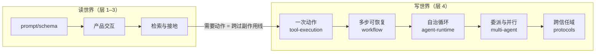

> **在哪一层**：层 4 · 行动与协作 ｜ **上一层出口**：能构建可追溯的检索链 ｜ **本层出口**：能限制权限、暂停/恢复任务，并为任一协作需求选择最低复杂度方案
> **前置**：[RAG：检索增强生成](../03-grounding/rag) ｜ **下一步**：[工具执行工程](tool-execution)（本层入口）；出层去[可观测性](../05-operations/observability)与[安全](../05-operations/security)

## 1. 概述

**结论先讲**：层 3 及以前的系统，最坏的失败是「给出一个错误的答案」——它只**读**世界。层 4 起系统开始**写**世界：调用工具、执行流程、委派任务，最坏的失败变成「做了一件错的事」——邮件已发出、数据已删除、订单已发货。因此本层唯一的总纲是：**写世界默认有副作用，必须显式处理权限、幂等、取消、重试、人工批准与回滚**。层 3 的证据链回答「结果有没有依据」；本层的工程回答「动作是否受控」。

### 症状入口

来自[技术地图](../00-orientation/index)的决策树，落到本层的症状有两条：

- **需要调用系统或执行动作**（查询订单、写数据库、发通知）→ 本层主体（工具/工作流/agent）。
- **需要跨 host / 组织 / Agent 边界协作**→ 本层协议分支（按连接方向选，见[协议地图](protocols/)）。

### 心智模型：读世界与写世界

副作用线是本层的入口：跨过去之前，错误可以靠重跑修正；跨过去之后，**每一次执行都要先问六问**——权限有没有、幂等有没有、能不能取消、能不能重试、要不要人批准、错了怎么回滚。

### 行动决策阶梯

复述自[复杂度决策阶梯](../00-orientation/complexity-ladder)梯级 3–6，本层内部用它选最低复杂度方案：

| 需求形态 | 去处 | 升级触发 |
| --- | --- | --- |
| 一次动作（调用即返回） | [工具执行工程](tool-execution) | 多步、可恢复、需审批 |
| 多步可恢复（步骤可静态枚举） | [工作流模式](workflow) | 步骤不可预测、需自治循环 |
| 自治循环（模型决定每一步） | [Agent 运行时](agent-runtime/) | 跨信任域、异步、能力发现 |
| 跨信任域协作 | [协议地图](protocols/)（MCP/A2A/ACP/AG-UI） | —（本层顶） |

| 方案 | 方向 | 控制权 | 状态 | 信任域 | 最低复杂度 |
| --- | --- | --- | --- | --- | --- |
| 一次工具调用 | 写（单次） | 五道门 | 单次调用记录 | 进程内 | 单步动作 |
| 工作流 | 写（多次） | 你编排步骤 | 多步 + checkpoint | 进程内 | 可枚举多步 |
| Agent 循环 | 读写循环 | 模型 + 停止条件 | 会话/记忆/checkpoint | host 内 | 不可预测步骤 |
| 多 agent | 读写循环 × N | supervisor 委派 | 各自上下文 + 汇总 | host 内 | 并行收益 > 协调成本 |
| 边界协议 | 读写跨界 | 协议协商 | 任务/消息/artifact | 跨信任域 | 第二个信任域出现 |

### 本层导航

| 主题 | 回答的问题 | 出口能力 |
| --- | --- | --- |
| [工具执行工程](tool-execution) | 一次模型发起的动作如何受控执行 | 可拒绝、可超时、可取消、可去重的执行器 |
| [工作流模式](workflow) | 多步流程如何 checkpoint 与恢复 | 失败后从持久化状态重放；不可逆前有人工批准 |
| [Agent 运行时](agent-runtime/)（子树） | 自治循环如何构成与约束 | model + context + tools + state + loop + environment 的运行时；含[设计模式](agent-runtime/design-patterns)、[状态与记忆](agent-runtime/state-memory)、[恢复与人工批准](agent-runtime/recovery-hitl)、[Computer Use](agent-runtime/computer-use) |
| [多 Agent 系统](multi-agent) | 何时与如何委派给多个 agent | supervisor 委派契约 + 路由降级 + 失败定位 |
| [Agent Skills](skills) | 能力如何以文件形式描述与下发 | 可版本、可复用的技能资产 |
| [协议地图](protocols/)（子树） | 跨进程/组织/信任域如何协作 | 按连接方向选协议：MCP / A2A / ACP / AG-UI 等 |

### 何时进入 / 何时不进入

- 进入：需求出现「执行动作」「多步流程」「委派」「跨边界协作」任一关键词。
- 不进入：仍在解决「答案不稳」「没有依据」的问题——先回层 1（契约）或层 3（接地）；把未成熟的问题带进写世界只会放大错误。

历史版本里程碑：本层结构于 2026-09 随 Issue #116 金字塔重构冻结；旧版 agent/patterns/skills 目录的内容分散合并进上述各章。更早时间线未验证，不编造。

## 2. 使用

本页是导航与决策页，无可运行代码产物；「使用」= 决策演练（纸面即可，≤15 分钟）。验收标准：四个场景全部选中最低复杂度去处，并能说出「为什么不去更高处」。

### 演练：四个场景

**场景 A**：用户点按钮后，把表单数据写入内部工单系统。
- 预期：[工具执行工程](tool-execution)。一次受控动作：allowlist + 参数校验 + 幂等键。
- 反例判断：不需要模型决定多步链；若「写入前还要查权限再通知」成为固定链，升 workflow。

**场景 B**：每天把 300 篇新文章走「提取→校验→入库→生成摘要」。
- 预期：[工作流模式](workflow)。步骤静态可枚举，失败要从 checkpoint 恢复而不是重跑全量。
- 反例判断：若「校验」需要按内容动态决定查什么、查几轮，那一步是 agent 节点，不是整条链变 agent。

**场景 C**：让系统自己排查一个线上告警：读日志、形成假设、验证、写报告，何时停由它判断。
- 预期：[Agent 运行时](agent-runtime/)。前提是写得出**明确停止条件**（时间上限、迭代上限）与**权限边界**（只读沙箱）。
- 反例判断：若排查步骤其实是固定套路，那是 workflow 穿了 agent 的外衣。

**场景 D**：两家公司的系统要互相委托任务并异步交付结果。
- 预期：[协议地图](protocols/)。跨信任域 + 异步 + 能力发现，协议分支的三命中。
- 反例判断：同一家公司同进程内的「多 agent」，不需要任何协议——函数调用就够。

### 使用边界

- 本层判断的是**协作形态**；每一形态的实现在对应章节，本页不重复。
- 六问（权限/幂等/取消/重试/批准/回滚）是横切清单：无论落在哪个主题，设计评审都要逐问答出。

## 3. 原理

### 写世界六问：本层的横切不变量

| 问题 | 一句话判据 | 主要承载章 |
| --- | --- | --- |
| 权限 | 这个动作允许谁、以什么范围做？默认拒绝 | [工具执行工程](tool-execution)、[安全](../05-operations/security) |
| 幂等 | 同一意图重复执行，副作用只发生一次？ | [工具执行工程](tool-execution) |
| 取消 | 用户/上游放弃后，执行能停下来并清理？ | [工具执行工程](tool-execution)、[AG-UI](protocols/ag-ui) |
| 重试 | 哪些错误可重试、用什么键保护？ | [工具执行工程](tool-execution)、[工作流模式](workflow) |
| 人工批准 | 不可逆动作前，谁能点头？暂停点持久化了吗？ | [工作流模式](workflow)、[恢复与人工批准](agent-runtime/recovery-hitl) |
| 回滚 | 做错了怎么撤？补偿登记了吗？ | [工作流模式](workflow)（saga） |

六个问题彼此正交：一个系统可以权限做得很好但没有回滚，也可以幂等做得很好但取消失灵。评审时逐问打分，短板决定风险。

### 为什么「最低复杂度」在本层尤其重要

读世界的复杂度是**累加**的（多一层检索多一层延迟）；写世界的复杂度是**相乘**的——多一层自治就多一类「以错误状态继续执行」的可能，多一个协作方就多一类「错误传播」的路径。这就是[复杂度决策阶梯](../00-orientation/complexity-ladder)在梯级 3 以上强调「证据推你上行」的原因：没有踩中升级触发条件就上行，你提前支付的是**副作用风险**，不只是性能。

### 规范要求 vs 本地实测

本页是导航层，无规范可实现测；六问与各主题的「规范 vs 实测」分栏见对应章节。协议子树的规范快照（MCP / A2A / ACP / AG-UI）登记在[协议地图](protocols/)。

## 4. 开发

本页无代码集成；「开发」= 把六问与决策阶梯用作设计与评审的门禁。

### 症状 → 证据 → 处理 → 完成标准

**症状**：agent 已经能调工具了，团队认为「执行侧没什么可做的」。
**证据**：工具函数直连模型输出，无 allowlist、无幂等键、超时靠运气；重试一次就产生双写。
**处理**：把裸调用升级为[受控执行器](tool-execution)：五道门逐项补齐，先补幂等与 allowlist（防双写、防幻觉工具）。
**完成标准**：四态（正常/超时/取消/被拒）各有测试断言；重放同一调用不产生第二次副作用。

### 症状 → 证据 → 处理 → 完成标准

**症状**：团队争论「该上 workflow 还是 agent」，各执一词。
**证据**：双方都画不出完整流程图，也写不出 agent 的停止条件——两个准入材料都缺。
**处理**：先写停止条件与权限边界；写得出就是 agent，画得出全图就是 workflow，两者都缺就先按 workflow 起步收集「枚举失败」的案例。
**完成标准**：设计文档二选一并附上对应准入材料（全图或停止条件清单）。

### 症状 → 证据 → 处理 → 完成标准

**症状**：评审要求「为将来对接多公司」预先引入 A2A/MCP。
**证据**：当前所有协作都在同进程内；没有第二个信任域、没有异步交付、没有能力发现需求。
**处理**：引用协议分支三命中（跨信任域/异步/能力发现）逐条对照，全未命中则留在进程内方案。
**完成标准**：设计文档写明「未来出现 X（第二个信任域/异步任务/能力发现）时再引入协议 Y」。

### 反模式清单

- **跳过执行工程直上 agent**：把权限与幂等的功课留给「agent 的智能」——六问一个都没答。
- **名词驱动**：先选协议/框架再找场景（本层最常见的浪费形态）。
- **把「能跑」当「受控」**：demo 里工具调用成功 ≠ 超时、取消、重试、回滚路径存在。
- **同域上协议**：同进程的多 agent 硬套跨边界协议，买到一堆版本协商问题。

## 5. 资料库

四级阅读路线：

- **Beginner**：读本页 + [复杂度决策阶梯](../00-orientation/complexity-ladder)；能复述六问与行动决策阶梯。
- **Builder**：进 [工具执行工程](tool-execution)（本层地基），跑通受控执行器 fixture。
- **Operator**：[工作流模式](workflow)的恢复语义 + [恢复与人工批准](agent-runtime/recovery-hitl)；再到层 5 的[可观测性](../05-operations/observability)与[安全](../05-operations/security)。
- **Researcher**：[协议地图](protocols/)的连接方向分类与各规范原文；Anthropic 多 agent 复盘。

### 资源表

| 名称 | 证据层级 | canonical URL | 用途 | 支持的断言 | 下一步 |
| --- | --- | --- | --- | --- | --- |
| Building Effective Agents（Anthropic） | L1（维护者） | https://www.anthropic.com/engineering/building-effective-agents | workflow/agent 边界与五模式 | 「workflows 预定义代码路径编排；agents 动态主导」（retrievedAt 2026-09-01） | [工作流模式](workflow) |
| How we built our multi-agent research system | L1（维护者） | https://www.anthropic.com/engineering/built-multi-agent-research-system | 生产级行动系统的容错口径 | 「重试 + checkpoint + 从出错处恢复」（retrievedAt 2026-09-01） | [多 Agent 系统](multi-agent) |
| Temporal Workflows（官方文档） | L1（维护者） | https://docs.temporal.io/workflows | 恢复语义的行业参照 | Event History / replay / 确定性约束（retrievedAt 2026-09-01） | [工作流模式](workflow) |
| MCP 规范 | L0（官方规范） | https://modelcontextprotocol.io/specification/latest | 协议分支候选项 | 工具/上下文跨进程接入（retrievedAt 2026-09-01，快照见 bridge-register） | [协议地图](protocols/) |
| A2A 规范 | L0（官方规范） | https://a2a-protocol.org/v1.0.0/specification/ | 跨信任域协作候选项 | Agent 间任务/消息/artifact（retrievedAt 2026-09-01，快照见 bridge-register） | [A2A](protocols/a2a) |

### 主动证伪与未决问题

- 证伪入口：如果存在一类写世界系统，不回答六问中的某几问也长期安全运行——给出形态与运行时长，六问的必要性需要收窄。
- 未决：`agent-runtime`、`skills`、`protocols` 子树由层 4 其余章节拥有（Issue #116 Wave 2 分工）；本页导航表以 slug-map 冻结的 topicId 为准，子树落地后回链核对。

### learn-ai 到此为止 / 继续去哪

- 各形态实现：本层对应章节（见导航表）。
- 模型为什么能被工具描述驾驭：[Learn LLM](https://llm.zenheart.site/)。
- 证明动作质量与风险的评估方法：[evals](https://evals.zenheart.site/)。
- 出层：[层 5 · 可靠运营](../05-operations/)——用可回放证据证明它可以上线。
