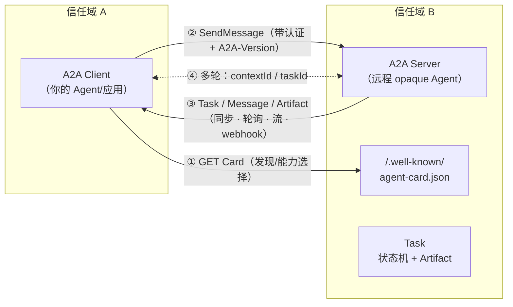
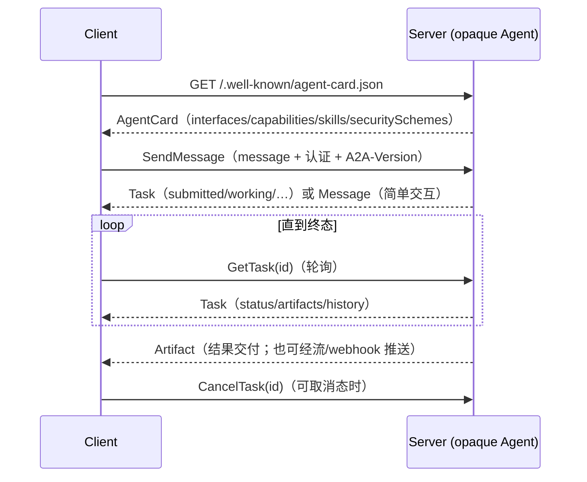

> **在哪一层**：层 4 · 行动与协作 ｜ **上一层出口**：能构建可追溯的检索链和更新路径 ｜ **本层出口**：能跨信任域委派任务给不透明 Agent，并在断流、需要输入、版本不一致时恢复
> **前置**：[协议地图](./index) ｜ [多 Agent 系统](../multi-agent) ｜ **下一步**：[ACP：Agent Client Protocol](acp-agent-client) ｜ [A2UI 与 MCP Apps](a2ui-mcp-apps)

## 1. 概述

**结论先讲**：A2A（Agent2Agent Protocol）解决的是「我的 Agent 需要把任务委派给一个**我看不到内部实现**的远程 Agent」这一种协作。它用一份自描述清单（Agent Card）做能力发现，用 Message 发起对话，用 Task 承载有生命周期的异步工作，用 Artifact 交付结果。如果协作对象是你自己进程内的函数、你信任的工具源、或同域子 Agent，就不要上 A2A——那是函数调用、MCP 或工作流编排的地盘。

### 心智模型：一条信任边界上的对话



四个核心对象的关系：

| 对象 | 谁生成 | 生命周期 | 一句话 |
| --- | --- | --- | --- |
| AgentCard / AgentSkill | Server | 随 `version` 变化，可缓存（ETag） | 描述「我是谁、会什么、怎么连、怎么认证」——是**描述，不是 SLA** |
| Message | 发送方（`messageId` 由创建者生成） | 即时 | 通信单元：发起任务、追问、澄清；**不用来交付结果** |
| Task | Server（`taskId` 服务端生成） | 状态机，见下 | 有生命周期的异步工作单元 |
| Artifact | Server（`artifactId` 任务内唯一） | 随 Task | 任务产出物；结果应放这里而不是 Message |

Task 的九个规范状态（wire 值为 SCREAMING_SNAKE_CASE）：

| 状态 | 类别 | 含义 |
| --- | --- | --- |
| `TASK_STATE_UNSPECIFIED` | 未定 | 未知/不可判定 |
| `TASK_STATE_SUBMITTED` | 活动 | 已提交并确认 |
| `TASK_STATE_WORKING` | 活动 | 处理中 |
| `TASK_STATE_COMPLETED` | 终态 | 成功结束 |
| `TASK_STATE_FAILED` | 终态 | 出错结束 |
| `TASK_STATE_CANCELED` | 终态 | 被取消 |
| `TASK_STATE_REJECTED` | 终态 | Agent 拒绝执行 |
| `TASK_STATE_INPUT_REQUIRED` | 中断 | 需要用户补充输入 |
| `TASK_STATE_AUTH_REQUIRED` | 中断 | 需要补授权（可沿 Agent 链向上委托） |

规范定义了状态集合、终态集合与「流在终态必须关闭」这类约束；**没有给出完整转移图**，SUBMITTED→WORKING 之外的转移语义属于实现定义——不要把任何 SDK 的状态机当成唯一规范状态机。

### 何时使用 / 何时不用

- 用：跨框架/跨供应商互操作；远程、组织外、不可见内部的 Agent 协作；长耗时异步任务（分钟级以上）；需要能力发现与多绑定（JSON-RPC / gRPC / REST）的企业场景。
- 不用（非目标）：模型内部原理（→ Learn LLM）；共享内存式协作——A2A 明确**不暴露**对端内部状态/记忆/工具；通用工具调用（→ [MCP](./mcp)）；用户界面流（→ [AG-UI](ag-ui)）；Agent 框架本身。

### 决策表：A2A 与相邻技术

| 维度 | 函数 / HTTP 调用 | MCP | 工作流 / 同域 subagent | **A2A** |
| --- | --- | --- | --- | --- |
| 方向 | 请求 → 响应 | Host → 工具 | 编排器 → 子任务 | Client Agent → 远程 opaque Agent（对等） |
| 控制权 | 调用方全控 | Host 决定暴露哪些工具 | 编排器全控 | 双方各自所有，仅经协议交互 |
| 状态 | 无 / 短暂 | Server 侧会话 | 同进程共享 | Task/context 由 **Server 拥有**，Client 只持句柄 |
| 信任域 | 进程内 / 同服务 | Host 信任的工具源 | 同 host | **跨供应商 / 跨组织 / 跨信任域** |
| 最低复杂度 | 一行 fetch | 工具 schema + 传输 | 编排 DSL | 发现 + 认证 + 版本协商 + 异步任务管理 |

### 历史版本里程碑

规范页公开的版本序列：`1.0.0`（最新发布）← `0.3.0` ← `0.2.6` ← `0.1.0`；项目由 Google 发起后捐赠给 Linux Foundation（2026-09-01 检索自官方站与仓库 llms.txt）。1.0 的两处破坏性变更（迁移附录 A.2）：① 移除 `kind` 判别字段，改用 JSON 成员名本身判别 Part 与流事件类型；② `extendedAgentCard` 从 Card 顶层迁入 `capabilities`。各版本具体发布日期：未验证。

### 本章 DoD 自检

- [ ] 15 分钟内跑通 §2 fixture（两个终端，零依赖）
- [ ] 能向同事解释 Card → Message → Task → Artifact 各自的职责
- [ ] 连接断开后能用 GetTask 把任务状态对账（reconcile）回来
- [ ] 收到 `TASK_STATE_INPUT_REQUIRED` 知道发什么恢复
- [ ] 能按错误码把失败归到三类：认证/授权、版本、资源不存在

## 2. 使用

**最小实战**：两个零依赖 Node 脚本演一个完整的 A2A REST 绑定交互。要求 Node ≥ 18（内置 `node:http` 与全局 `fetch`），无任何 npm 依赖，无 API key，全程 `127.0.0.1`。

**setup**：新建空目录，保存下面两个文件。

`a2a-server.mjs`（A2A Server：暴露 Card + 三条路由 + 一个慢任务）：

```javascript fixture
// a2a-server.mjs — A2A HTTP+JSON 绑定的最小 Server（Node ≥ 18，零依赖）
// 路由：GET /.well-known/agent-card.json
//       POST /message:send        → SendMessage
//       GET  /tasks/:id           → GetTask（轮询/reconcile）
import { createServer } from "node:http";
import { randomUUID } from "node:crypto";

const PORT = 3123;
const BASE = `http://127.0.0.1:${PORT}`;
const tasks = new Map(); // taskId -> Task（内存存储，演示用）

const card = {
  name: "Echo Research Agent",
  description: "演示用 opaque Agent：回显研究请求并产出摘要 artifact。",
  version: "1.2.0",
  supportedInterfaces: [
    { url: `${BASE}/`, protocolBinding: "HTTP+JSON", protocolVersion: "1.0" },
  ],
  capabilities: { streaming: false, pushNotifications: false },
  defaultInputModes: ["text/plain"],
  defaultOutputModes: ["text/plain", "application/json"],
  skills: [
    {
      id: "summarize",
      name: "Summarizer",
      description: "把用户请求变成一份结构化摘要。",
      tags: ["summary", "demo"],
    },
  ],
};

const now = () => new Date().toISOString(); // 规范要求 ISO 8601 UTC（毫秒 + Z）

function makeTask(id, contextId, state, extra = {}) {
  return {
    id,
    contextId,
    status: { state, timestamp: now() },
    artifacts: [],
    ...extra,
  };
}

function problem(res, status, title, detail) {
  // REST 绑定错误示例使用 application/problem+json（规范 §6.4）
  const body = JSON.stringify({ title, status, detail });
  res.writeHead(status, { "Content-Type": "application/problem+json" });
  res.end(body);
}

function advance(id, state, artifact) {
  const t = tasks.get(id);
  t.status = { state, timestamp: now() };
  if (artifact) t.artifacts.push(artifact);
}

createServer((req, res) => {
  const url = new URL(req.url, BASE);

  // —— 版本协商：A2A-Version 头（Major.Minor；空值按规范解释为 0.3）——
  const version = req.headers["a2a-version"] ?? ""; // 缺失 = 空 = 0.3
  if (url.pathname !== "/.well-known/agent-card.json" && version !== "1.0") {
    return problem(res, 400, "Protocol Version Not Supported",
      `requested ${version || "0.3(implicit)"}, this agent supports 1.0 only`);
  }

  if (req.method === "GET" && url.pathname === "/.well-known/agent-card.json") {
    res.writeHead(200, { "Content-Type": "application/a2a+json" });
    return res.end(JSON.stringify(card));
  }

  if (req.method === "POST" && url.pathname === "/message:send") {
    let raw = "";
    req.on("data", (c) => (raw += c));
    return req.on("end", () => {
      const { message } = JSON.parse(raw);
      // 参数校验：messageId / role / parts 必填（对应 -32602 类验证错误）
      if (!message?.messageId || message.role !== "ROLE_USER"
          || !Array.isArray(message.parts) || message.parts.length === 0) {
        return problem(res, 400, "Invalid parameters",
          "message.messageId, role=ROLE_USER, parts[1..] are required");
      }
      const text = message.parts.map((p) => p.text ?? "").join(" ");
      const contextId = message.contextId ?? randomUUID();
      const id = randomUUID();

      // 场景 A：慢任务 → 提交后异步完成（演示轮询 GetTask）
      if (text.includes("slow")) {
        tasks.set(id, makeTask(id, contextId, "TASK_STATE_SUBMITTED"));
        setTimeout(() => advance(id, "TASK_STATE_WORKING"), 600);
        setTimeout(() => advance(id, "TASK_STATE_COMPLETED", {
          artifactId: randomUUID(), name: "slow-report",
          parts: [{ text: `slow result for: ${text}` }],
        }), 1400);
        res.writeHead(200, { "Content-Type": "application/a2a+json" });
        return res.end(JSON.stringify({ task: tasks.get(id) }));
      }
      // 场景 B：需要补充输入 → INPUT_REQUIRED（多轮）
      if (text.startsWith("book")) {
        const t = makeTask(id, contextId, "TASK_STATE_INPUT_REQUIRED");
        t.status.message = {
          messageId: randomUUID(), role: "ROLE_AGENT",
          parts: [{ text: "从哪出发、去哪？（回复格式：from A to B）" }],
        };
        tasks.set(id, t);
        res.writeHead(200, { "Content-Type": "application/a2a+json" });
        return res.end(JSON.stringify({ task: t }));
      }
      // 场景 C：带 taskId 的追问 → 完成被中断的任务
      if (message.taskId && tasks.has(message.taskId)) {
        const t = tasks.get(message.taskId);
        advance(t.id, "TASK_STATE_COMPLETED", {
          artifactId: randomUUID(), name: "itinerary",
          parts: [{ text: `booked: ${text}` }],
        });
        res.writeHead(200, { "Content-Type": "application/a2a+json" });
        return res.end(JSON.stringify({ task: t }));
      }
      if (message.taskId) return problem(res, 404, "Task Not Found",
        `task ${message.taskId} does not exist`);

      // 场景 D：快任务 → 同步返回已完成 Task + Artifact
      const t = makeTask(id, contextId, "TASK_STATE_WORKING");
      t.artifacts.push({
        artifactId: randomUUID(), name: "summary",
        parts: [{ text: `summary of: ${text}` }],
      });
      t.status = { state: "TASK_STATE_COMPLETED", timestamp: now() };
      tasks.set(id, t);
      res.writeHead(200, { "Content-Type": "application/a2a+json" });
      return res.end(JSON.stringify({ task: t }));
    });
  }

  if (req.method === "GET" && url.pathname.startsWith("/tasks/")) {
    const id = url.pathname.split("/")[2];
    const t = tasks.get(id);
    if (!t) return problem(res, 404, "Task Not Found", `task ${id} unknown`);
    res.writeHead(200, { "Content-Type": "application/a2a+json" });
    return res.end(JSON.stringify(t)); // 封套选择见 §3「规范 vs 实测」
  }

  problem(res, 404, "Not Found", url.pathname);
}).listen(PORT, "127.0.0.1", () => console.log(`A2A agent on ${BASE}`));
```

`a2a-client.mjs`（A2A Client：读 Card → 校验能力 → 发消息 → 处理四种场景）：

```javascript fixture
// a2a-client.mjs — A2A HTTP+JSON 绑定的最小 Client（Node ≥ 18，零依赖）
// 用法：node a2a-client.mjs [fast|slow|input|version-error|notfound]
const BASE = "http://127.0.0.1:3123";
const scenario = process.argv[2] ?? "fast";

// ① 发现：读 Agent Card 并校验能力
const card = await (await fetch(`${BASE}/.well-known/agent-card.json`)).json();
const iface = card.supportedInterfaces?.find(
  (i) => i.protocolBinding === "HTTP+JSON" && i.protocolVersion === "1.0");
if (!iface) throw new Error("no HTTP+JSON 1.0 interface on card");
if (card.capabilities?.streaming) console.log("（本 fixture 未演示流式）");
console.log(`[card] ${card.name} v${card.version}, skills:`,
  card.skills.map((s) => s.id).join(", "));

const headers = (ver) => ({
  "Content-Type": "application/a2a+json",
  "A2A-Version": ver, // 客户端必须随每个请求发送
});

const send = (text, { taskId, version = "1.0" } = {}) =>
  fetch(`${BASE}/message:send`, {
    method: "POST",
    headers: headers(version),
    body: JSON.stringify({
      message: {
        messageId: crypto.randomUUID(),
        ...(taskId ? { taskId } : {}),
        role: "ROLE_USER",
        parts: [{ text }],
      },
    }),
  });

const artifactsOf = (task) => (task.artifacts ?? [])
  .flatMap((a) => a.parts.map((p) => p.text)).join(" | ");

// 用自然结束代替 process.exit：keep-alive 连接下强退可能中断收尾
const terminal = ["TASK_STATE_COMPLETED", "TASK_STATE_FAILED",
  "TASK_STATE_CANCELED", "TASK_STATE_REJECTED"];

const main = async () => {
// ② 负例：版本协商失败 → 400 VersionNotSupportedError
if (scenario === "version-error") {
  const r = await send("hello", { version: "0.5" });
  return console.log(`[version-error] HTTP ${r.status}`, await r.text());
}
// ③ 负例：GetTask 未知 id → 404 TaskNotFoundError
if (scenario === "notfound") {
  const r = await fetch(`${BASE}/tasks/00000000-0000-0000-0000-000000000000`,
    { headers: headers("1.0") });
  return console.log(`[notfound] HTTP ${r.status}`, await r.text());
}

const first = await send(
  scenario === "slow" ? "slow: compile the quarterly report"
  : scenario === "input" ? "book a flight"
  : "summarize: quarterly report");
const { task } = await first.json();
console.log(`[send] task=${task.id} state=${task.status.state}`);

// ④ 中断态：INPUT_REQUIRED → 用 taskId 追问恢复
if (task.status.state === "TASK_STATE_INPUT_REQUIRED") {
  const follow = await send("from SF to NYC", { taskId: task.id });
  const { task: t2 } = await follow.json();
  return console.log(`[input] state=${t2.status.state} artifacts=${artifactsOf(t2)}`);
}

// ⑤ 慢任务：轮询 GetTask 直到终态（断流后同样用这条路径 reconcile）
if (task.status.state !== "TASK_STATE_COMPLETED") {
  for (let i = 0; i < 10; i++) {
    await new Promise((r) => setTimeout(r, 500));
    const t = await (await fetch(`${BASE}/tasks/${task.id}`,
      { headers: headers("1.0") })).json();
    console.log(`[poll ${i}] state=${t.status.state}`);
    if (terminal.includes(t.status.state)) {
      return console.log(`[done] artifacts=${artifactsOf(t)}`);
    }
  }
  return;
}
console.log(`[done] artifacts=${artifactsOf(task)}`);
};
await main();
```

**运行命令**（两个终端）：

```bash fixture
node a2a-server.mjs          # 终端 1
node a2a-client.mjs fast     # 终端 2：快任务，同步完成
node a2a-client.mjs slow     # 轮询 GetTask 至终态
node a2a-client.mjs input    # INPUT_REQUIRED → 追问恢复
node a2a-client.mjs version-error  # 负例：400 版本不支持
node a2a-client.mjs notfound      # 负例：404 任务不存在
```

**正常输出**（fast）：

```text fixture
[card] Echo Research Agent v1.2.0, skills: summarize
[send] task=9f0c… state=TASK_STATE_COMPLETED
[done] artifacts=summary of: summarize: quarterly report
```

**负例输出**（version-error / notfound）：

```text fixture
[version-error] HTTP 400 {"title":"Protocol Version Not Supported","status":400,"detail":"requested 0.5, this agent supports 1.0 only"}
[notfound] HTTP 404 {"title":"Task Not Found","status":404,"detail":"task 00000000-… unknown"}
```

**验收命令**：`node a2a-client.mjs input` 输出以 `[input] state=TASK_STATE_COMPLETED` 结尾；`node a2a-client.mjs slow` 以 `[done] artifacts=slow result…` 结尾。
**清理**：两个 `Ctrl+C`，删除两个脚本文件。无残留状态。

### 场景矩阵

| 场景 | 输入 / 动作 | 输出 | 适用 | 不适用 |
| --- | --- | --- | --- | --- |
| 快任务 | 不含 slow/book 的文本 | 同步返回已完成 Task + Artifact | 秒级问答型委派 | 长耗时工作 |
| 慢任务 | 含 "slow" | SUBMITTED→WORKING→COMPLETED，客户端轮询 | 分钟级以上异步；断流 reconcile | 需要毫秒级实时反馈 |
| 需要输入 | 以 "book" 开头 | INPUT_REQUIRED + 追问恢复 | HITL 多轮 | 无人值守链路 |
| 流式（概念） | `SendStreamingMessage`/SSE | StreamResponse 事件流 | 实时进度（需 `capabilities.streaming:true`） | 本 fixture 未实现（标 conceptual） |
| 推送（概念） | webhook 配置四操作 | HTTP POST StreamResponse | server-to-server（需 `pushNotifications:true`） | 本 fixture 未实现 |

## 3. 原理

A2A 的规范结构是三层：**canonical 数据模型**（Protocol Buffers 定义，`specification/a2a.proto` 是规范真源；JSON Schema 由其生成）→ **11 个抽象操作**（绑定无关）→ **官方绑定**（JSON-RPC over HTTP/SSE、gRPC、HTTP+JSON/REST；另有自定义绑定指南）。所有绑定必须功能等价。

### 数据模型与操作



- **发现**：规范路径 `https://{domain}/.well-known/agent-card.json`；另有注册表与直连配置两种方式。Card 可带 JWS 签名（RFC 7515 + JCS RFC 8785 规范化），客户端应在信任前验证。
- **多轮语义**：`contextId` 逻辑分组同一会话的 Task/Message（服务端生成时对客户端不透明）；`taskId` 只由服务端生成，客户端提供即引用既有任务，二者不匹配必须被拒绝。
- **消息 vs 产物分离**：Message 用于发起/澄清/状态说明；**结果应通过 Artifact 交付**，把「通信」与「数据产出」分开。
- **更新通道三选一**：轮询 GetTask（全绑定可用）；流式 SendStreamingMessage / SubscribeToTask（需 `capabilities.streaming`）；webhook 推送（需 `capabilities.pushNotifications`；无论主绑定是什么，webhook 走 HTTP + JSON）。事件按生成顺序投递，一个任务可同时有多个流。

### 方法与错误映射（规范原文数值）

| 功能 | JSON-RPC 方法 | REST 端点 | A2A 错误 → HTTP |
| --- | --- | --- | --- |
| 发消息 | `SendMessage` | `POST /message:send` | — |
| 流式发消息 | `SendStreamingMessage` | `POST /message:stream` | — |
| 取任务 | `GetTask` | `GET /tasks/{id}` | `TaskNotFoundError` → 404 |
| 列任务 | `ListTasks` | `GET /tasks` | — |
| 取消任务 | `CancelTask` | `POST /tasks/{id}:cancel` | `TaskNotCancelableError` → 400 |
| 订阅任务 | `SubscribeToTask` | `POST /tasks/{id}:subscribe` | 终态任务 → `UnsupportedOperationError` |
| 推送配置 ×4 | `CreateTaskPushNotificationConfig` 等 | `/tasks/{id}/pushNotificationConfigs…` | `PushNotificationNotSupportedError` → 400 |
| 扩展 Card | `GetExtendedAgentCard` | `GET /extendedAgentCard` | 未声明能力 → `UnsupportedOperationError` |

JSON-RPC 侧专用错误码 `-32001`～`-32009`（TaskNotFound=-32001、TaskNotCancelable=-32002 … VersionNotSupported=-32009）；标准 JSON-RPC 错误（-32700/-32600/-32601/-32602/-32603）照常使用。流事件为 `StreamResponse`：四选一 `{task | message | statusUpdate | artifactUpdate}`。

### 版本与安全

- **版本**：`A2A-Version` 头携带 `Major.Minor`（如 `1.0`）；patch 号不参与兼容。空值按 0.3 解释。不支持时返回 `VersionNotSupportedError`。
- **认证**：Card 用 OpenAPI 3.2 风格声明 `securitySchemes`（apiKey / http / oauth2 / oidc / mtls 五类）；凭据走带外获取，每次请求随协议头携带。生产必须 HTTPS/TLS，建议 TLS 1.3+。
- **任务内授权**：Agent 执行中需要授权时把 Task 置为 `TASK_STATE_AUTH_REQUIRED`，把授权责任委托回客户端；凭据应带外传输，若带内传递必须绑定到发起 Agent（防链式泄露）。
- **webhook 安全**：服务端应对回调 URL 做 SSRF 校验（拒私网段/localhost，建议 allowlist）；客户端应幂等处理重复投递、校验任务归属。

### 规范要求 vs 本地实测

| 断言 | 规范（v1.0.0） | 本地 fixture 实测 |
| --- | --- | --- |
| 发现路径 | `/.well-known/agent-card.json` | 一致 |
| 版本头 | 客户端必须发 `A2A-Version`；空值=0.3 | 一致：缺失/0.5 均 400 |
| 状态枚举 | ProtoJSON 字符串，SCREAMING_SNAKE_CASE | 一致 |
| 404 / 400 映射 | `problem+json` 示例 | 一致 |
| Card 安全字段名 | 数据模型表写 `securityRequirements`，同页示例却用 `security` —— **规范内部不一致** | fixture 不声明安全字段，绕开 |
| HTTP Content-Type | REST 绑定节要求 `application/json`；IANA 注册并示例 `application/a2a+json` | fixture 用 `application/a2a+json` |
| `GET /tasks/{id}` 响应封套 | 示例未覆盖（裸 Task 还是包装未明示） | fixture 返回裸 Task，属 fixture 选择 |
| `kind` 判别字段 | 1.0 已移除，成员名即判别 | fixture 按 1.0 写 |

## 4. 开发

### 集成要点

- **Card 校验与缓存**：拉 Card 后先校验（必填字段、`supportedInterfaces` 里有你支持的绑定、`capabilities` 与你要用的操作匹配），再按 `Cache-Control`/`ETag` 缓存；过期用条件请求刷新。Card 是描述不是 SLA——运行时仍要做能力校验失败的处理。
- **版本 pin**：客户端固定请求你测试过的 `Major.Minor`；SDK 升级后重跑契约测试。服务端可多版本共存（不同 URL）。
- **认证 scope**：按 Card 声明的 scheme 取凭据；OAuth 场景用最小 scope，`audience` 对准目标 interface URL。
- **可观测性**：规范要求企业可观测；trace 粒度建议：一次业务调用 = 一个 trace，`messageId`/`taskId`/`contextId` 全部落日志与 span 属性，跨端可对账。

### 调试 runbook

```markdown
### 症状 → 证据 → 处理 → 完成标准
**症状**：长任务中途断流/重启，本地状态与远端不一致
**证据**：本地最后收到的 statusUpdate 时间戳；任务台账里的 taskId
**处理**：用 GetTask(taskId) 拉当前 Task；若支持流则 SubscribeToTask 重挂（首个事件必是当前 Task，防丢）；对比 artifactId 集合去重
**完成标准**：本地任务状态 == GetTask 返回状态；artifact 无缺无重
```

```markdown
### 症状 → 证据 → 处理 → 完成标准
**症状**：任务停在 TASK_STATE_INPUT_REQUIRED / TASK_STATE_AUTH_REQUIRED
**证据**：status.message（Agent 的追问文本）；错误类 401/403 日志
**处理**：INPUT_REQUIRED → 用同一 taskId 发追问 Message；AUTH_REQUIRED → 带外补凭据，Agent 可在收到后无追问继续；若你也是 Agent，可把自己的 Task 置 AUTH_REQUIRED 向上委托
**完成标准**：任务离开中断态并进入终态；凭据未出现在消息 Parts 里
```

```markdown
### 症状 → 证据 → 处理 → 完成标准
**症状**：请求失败，不知道是权限、版本还是资源问题
**证据**：状态码 + JSON-RPC code：401/403（认证/授权）；400 + VersionNotSupported（版本）；404/-32001（任务不存在）；400 + ContentTypeNotSupported（媒体类型）
**处理**：按三类分流——凭据/scope、A2A-Version 头、taskId 是否过期或已清理；用 messageId→taskId→contextId 链路定位是哪次发送引出的任务
**完成标准**：三类各有一次成功恢复的记录；日志能串起完整链路
```

```markdown
### 症状 → 证据 → 处理 → 完成标准
**症状**：webhook 收到重复或可疑推送
**证据**：同一 taskId+状态多次到达；来源 IP/签名不符
**处理**：按 taskId+state 幂等去重；校验配置里的认证凭据与任务归属；对异常源限流并告警
**完成标准**：重放同一推送无副作用；伪造来源被拒并有审计记录
```

### 反模式清单

- 把 AgentSkill 描述当能力保证直接路由，不处理 `ContentTypeNotSupportedError`/能力缺失。
- 用 Message Parts 传任务结果，客户端拼对话还原产物（应读 Artifact）。
- 客户端自造 `taskId` 发起任务（规范：服务端生成，客户端提供即引用）。
- 无 SSRF 校验地把用户提供的 webhook URL 直接注册。
- 断流后盲目重发 `SendMessage` 而不是 `GetTask` reconcile——会造成重复任务。

## 5. 资料库

### 四级阅读路线

- **Beginner**：官方站首页（A2A 是什么 + SDK 清单）→ `docs/topics/what-is-a2a` → 本页 §1。
- **Builder**：版本化规范 v1.0.0（唯一 normative 阅读）→ `docs/topics/key-concepts` → Python tutorial → 本页 fixture 换成官方 JS/TS SDK 重写一遍。
- **Operator**：`docs/topics/enterprise-ready`（认证/多租户）→ `docs/topics/streaming-and-async` → `docs/whats-new-v1`（0.3→1.0 迁移）。
- **Researcher**：`specification/a2a.proto`（规范真源）→ 生成的 JSON Schema → 规范 §12 自定义绑定指南 → 迁移附录 A。

### 资源表

| 名称 | 层级 | canonical URL | 用途 | 支持的断言 | 下一步 |
| --- | --- | --- | --- | --- | --- |
| A2A 规范 v1.0.0 | L0 | https://a2a-protocol.org/v1.0.0/specification/ | normative 真源（人读版） | 本页全部数据模型/操作/错误/绑定断言 | 读 §3 数据模型与 §9 JSON-RPC 绑定 |
| A2A 官方站 | L0 | https://a2a-protocol.org/ | 入口：版本、SDK（Python/JS-TS/Java/Go/.NET/Rust）、概念文档 | 「Google 发起、捐赠 Linux Foundation」；SDK 清单 | 进 topics/ 与 tutorials |
| a2a.proto（仓库内） | L0 | https://a2a-protocol.org/（仓库 `specification/a2a.proto`） | 规范 SSOT；JSON Schema 由其生成 | 「proto 为 normative 真源」 | 对照生成的 `docs/spec/a2a.json` |
| whats-new-v1（迁移） | L1 | https://a2a-protocol.org/（`docs/whats-new-v1.md`） | 0.3.0→1.0 变更摘要 | kind 移除、extendedAgentCard 迁移 | 升级前通读 |
| A2A & MCP 主题 | L1 | https://a2a-protocol.org/（`docs/topics/a2a-and-mcp`） | 互补定位：工具 vs 对等协作 | 规范附录 B 的展开 | 对照本仓 [MCP](./mcp) 章 |

以上条目均于 2026-09-01 检索。采用率/装机量数字：无官方数据，不写。

### 主动证伪与未决问题

- **证伪入口**：本页任何字段/方法断言，对照 v1.0.0 规范同名小节；不一致时以规范为准并给本页提 issue。
- 未决 1：Card 安全字段命名（`securityRequirements` vs `security`）规范内部不一致，等上游澄清；生产实现前以你所用 SDK 的 schema 为准。
- 未决 2：REST `GET /tasks/{id}` 的响应封套未在规范示例中明示（本页 fixture 采用裸 Task）。
- 未决 3：0.2.x/0.3.x 时代的旧 Card 路径与旧版本头（如 `X-A2A-Version`）是否仍被存量服务器接受——迁移附录未提及，未验证；遇到存量对接以实测为准。
- 未决 4：官方工具链（Inspector / 一致性测试套件）未在本轮核验，故不列入资源表。

**learn-ai 到此为止**：协议契约、选型判断、可运行 fixture、故障恢复。**继续去哪**：模型内部机制 → Learn LLM；厂商 SDK 的 API 细节 → 官方 SDK 文档；评估与上线门 → evals 站点；厂商文档原文 → sites-epub。
