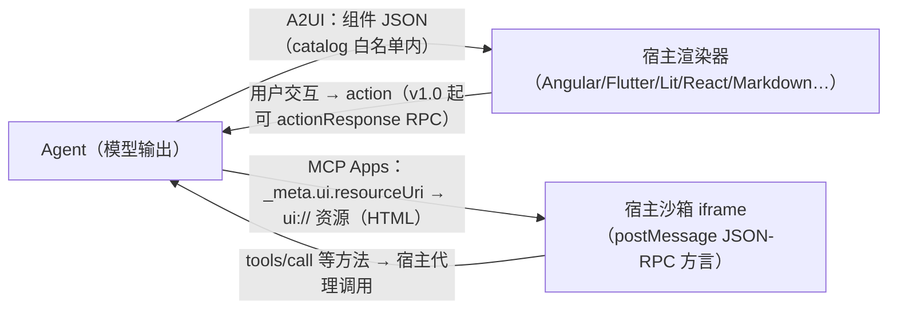

> **在哪一层**：层 4 · 行动与协作 ｜ **上一层出口**：能构建可追溯的检索链和更新路径 ｜ **本层出口**：能判断「Agent 该发声明式组件还是宿主沙箱 HTML」，并写出一个带 allowlist 校验的渲染器骨架
> **前置**：[MCP](./mcp) ｜ [AG-UI](ag-ui) ｜ **下一步**：[协议观察清单](watchlist)

## 1. 概述

**结论先讲**：文本对话对很多任务是低效接口（订餐要来回追问日期/时间），而直接让 Agent 发 HTML/JS 又重又不安全。本页合并讲两个互补的「UI payload / 宿主扩展」方案：

- **A2UI（Agent to UI）**：Agent 发**声明式组件描述**（JSON），客户端用自己的原生组件渲染——安全如数据、表达如代码。Google 创建（Apache 2.0），CopilotKit 等共建。
- **MCP Apps**：MCP 官方扩展——server 的工具声明一个 `ui://` 资源引用，宿主把返回的**交互式 HTML** 渲染在沙箱 iframe 里，双方经 postMessage 上的 JSON-RPC 方言双向通信。

一句话分工：**A2UI 管「Agent 说要什么 UI」（声明式），MCP Apps 管「MCP 宿主内嵌什么 UI」（HTML + 沙箱）**；两者都只定义 payload/宿主行为，**怎么传**归传输协议（A2A、AG-UI、SSE、WebSocket 都行），**前端怎么实现**归层 2 [生成式 UI](../../02-integration/ui)。

### 心智模型：Agent 出描述，宿主出渲染与安全



两案共同的安全命题：**Agent 生成的 UI 跨越信任边界，不能执行任意代码**。A2UI 用「预批准组件目录 + 声明式数据」实现（没有 UI 注入面）；MCP Apps 用「沙箱 iframe + postMessage + 宿主控制能力面（CSP/permissions）」实现。

### 版本现状（2026-09-01 检索自 a2ui.org）

| A2UI 版本 | 状态 | 要点 |
| --- | --- | --- |
| v1.0 | Candidate（候选） | 新增 client→server RPC（`actionResponse`）、action ID；`theme` 更名 `surfaceProperties` |
| **v0.9.1** | **Current（当前生产）** | 标准化 `application/a2ui+json` MIME；放宽 surfaceId 约束 |
| v0.9 | Stable（前一稳定） | 哲学转向 Prompt-First；引入 `createSurface`、客户端函数、自定义 catalog、模块化 schema |
| v0.8 | Legacy | Structured-Output first：surface/组件/数据绑定/邻接表基线 |

MCP Apps 为 modelcontextprotocol.io 的官方扩展文档（非独立协议版本线）；宿主支持面见 §3。

### 何时使用 / 何时不用

- 用 A2UI：跨平台原生渲染（web/移动/桌面一套描述）；LLM 逐步生成（扁平流式 JSON 友好）；安全上禁止任意代码执行。
- 用 MCP Apps：宿主本来就是 MCP 客户端（Claude、VS Code Copilot 等）；需要成熟 Web 生态（可视化库、表单）；接受沙箱 iframe 模型。
- 不用（两案皆非目标）：传输层语义（→ [AG-UI](ag-ui) / [A2A](a2a)）；前端组件实现细节（→ 层 2 [生成式 UI](../../02-integration/ui)）；纯文本对话够用的场景。

### 决策表

| 维度 | 文本对话 | **A2UI** | **MCP Apps** | 自建 web app + 链接 |
| --- | --- | --- | --- | --- |
| 表达力 | 低 | 中（catalog 内组件） | 高（HTML/JS 生态） | 最高 |
| 信任模型 | 无 UI 风险 | 声明式数据，白名单组件 | 沙箱 iframe + 宿主控权 | 自担 |
| 上下文保留 | 在对话内 | 在对话内 | **在对话内** | 跳出对话 |
| 双向数据流 | 无 | action/actionResponse | postMessage JSON-RPC（可调工具） | 自建 API |
| 宿主要求 | 无 | 渲染器 | MCP 宿主 + 沙箱 | 无 |
| 最低复杂度 | 最低 | catalog + 渲染器 | MCP server + `ui://` 资源 | 独立应用 |

### 历史版本里程碑

A2UI 版本线见上表（a2ui.org 首页公开）；MCP Apps 扩展文档的发布与版本历史未在检索页显示：未验证。

### 本章 DoD 自检

- [ ] 15 分钟跑通 §2 fixture（组件校验 + 渲染 mock，含负例）
- [ ] 能说出 A2UI 与 MCP Apps 的信任模型差别（白名单 vs 沙箱）
- [ ] 能解释 surface / 组件 / 数据绑定（path）三个概念
- [ ] 接到需求能先查宿主支持面（§3 表）再选方案

## 2. 使用

**最小实战**：一个 A2UI 风格的组件 payload 校验器 + 终端渲染 mock。它演示三件核心事：**catalog 白名单**（未注册组件拒绝）、**声明式结构校验**（成员名判别、引用完整）、**数据绑定路径**（`/booking/date` 这类 path 指向数据模型）。Node ≥ 18，零依赖。

> 说明：以下 payload 以 a2ui.org v0.9.1 的**概念**为蓝本（组件判别、path 绑定、id 引用），是**最小子集而非规范消息全集**；生产以官方 v0.9.1/v1.0 规范为准（标 conceptual + fixture）。

`a2ui-render.mjs`（catalog 校验 + 渲染 mock，含负例）：

```javascript fixture
// a2ui-render.mjs — A2UI 风格 payload 校验 + 终端渲染 mock（Node ≥ 18，零依赖）
// 演示：catalog 白名单 / 成员名判别 / child 引用完整 / 数据 path 绑定
const CATALOG = new Set(["Text", "Button", "TextInput", "DateTimeInput", "Column"]);

// 概念蓝本：surfaceUpdate 消息（v0.8 风格字段，教学用最小子集）
const payload = {
  surfaceUpdate: {
    surfaceId: "booking",
    components: [
      { id: "title", component: { Text: { text: { literalString: "预订晚餐" } } } },
      { id: "date", component: { DateTimeInput: { value: { path: "/booking/date" } } } },
      { id: "note", component: { TextInput: { value: { path: "/booking/note" } } } },
      { id: "go-label", component: { Text: { text: { literalString: "确认" } } } },
      { id: "go", component: { Button: { child: "go-label",
        action: { name: "confirm_booking" } } } },
    ],
  },
  dataModel: { booking: { date: "2026-09-01T19:00:00Z", note: "" } },
};

// ① catalog 白名单：未注册组件一律拒绝（防 UI 注入）
const isAllowed = (c) => {
  const keys = Object.keys(c.component ?? {});
  if (keys.length !== 1) return { ok: false, why: `期望单一判别成员，得到 ${keys}` };
  return CATALOG.has(keys[0])
    ? { ok: true, kind: keys[0] }
    : { ok: false, why: `组件 ${keys[0]} 不在 catalog 白名单` };
};

// ② 结构校验：id 唯一、child 引用存在、path 绑定命中数据模型
const validate = ({ components }, dataModel) => {
  const ids = new Set();
  const problems = [];
  for (const c of components) {
    if (ids.has(c.id)) problems.push(`重复 id: ${c.id}`);
    ids.add(c.id);
    const check = isAllowed(c);
    if (!check.ok) problems.push(`${c.id}: ${check.why}`);
    const body = Object.values(c.component ?? {})[0] ?? {};
    if (body.child && !components.some((x) => x.id === body.child))
      problems.push(`${c.id}: child 引用缺失 ${body.child}`);
    const bind = body.value ?? body.text ?? {};
    if (bind.path) {
      const hit = bind.path.split("/").filter(Boolean)
        .reduce((n, k) => n?.[k], dataModel);
      if (hit === undefined) problems.push(`${c.id}: path 未命中 ${bind.path}`);
    }
  }
  return problems;
};

// ③ 渲染 mock：按组件类型输出终端表示；绑定显示实际数据值
const render = ({ components }, dataModel) => {
  const byId = new Map(components.map((c) => [c.id, c]));
  const valueOf = (body) => {
    if (body.text?.literalString) return body.text.literalString;
    if (body.value?.path) return `${JSON.stringify(
      body.value.path.split("/").filter(Boolean).reduce((n, k) => n?.[k], dataModel))}`;
    return "";
  };
  const line = (c) => {
    const kind = Object.keys(c.component)[0], body = Object.values(c.component)[0];
    if (kind === "Text") return `  [text] ${valueOf(body)}`;
    if (kind === "Button") return `  [button:${body.action.name}] ${valueOf(byId.get(body.child).component[Object.keys(byId.get(body.child).component)[0]])}`;
    return `  [${kind}] bound ${body.value?.path ?? "?"} = ${valueOf(body)}`;
  };
  return components.map(line).join("\n");
};

const problems = validate(payload.surfaceUpdate, payload.dataModel);
if (problems.length) {
  console.error("REJECTED:"); for (const p of problems) console.error(" -", p);
  process.exit(1);
}
console.log(`surface=${payload.surfaceUpdate.surfaceId}`);
console.log(render(payload.surfaceUpdate, payload.dataModel));

// 负例：注入未注册组件 + 悬空 child 引用
const attack = structuredClone(payload);
attack.surfaceUpdate.components.push(
  { id: "evil", component: { IframeEmbed: { src: "https://evil.example" } } });
const attackProblems = validate(attack.surfaceUpdate, attack.dataModel);
console.log("\nnegative case rejected:",
  attackProblems.length > 0 ? attackProblems.join("; ") : "UNEXPECTED PASS");
```

**运行命令**：

```bash fixture
node a2ui-render.mjs
```

**正常输出**：

```text fixture
surface=booking
  [text] 预订晚餐
  [DateTimeInput] bound /booking/date = "2026-09-01T19:00:00Z"
  [TextInput] bound /booking/note = ""
  [text] 确认
  [button:confirm_booking] 确认

negative case rejected: evil: 组件 IframeEmbed 不在 catalog 白名单
```

**验收命令**：输出含 `surface=booking` 且 `negative case rejected:` 段落非空。
**清理**：删除脚本。无网络、无状态残留。

### 场景矩阵

| 场景 | 输入 / 动作 | 输出 | 适用 | 不适用 |
| --- | --- | --- | --- | --- |
| 表单生成 | 订餐/配置类需求 | 组件树 + 数据绑定 | 少来回追问的输入收集 | 一次性事实问答 |
| 数据探索 | 「按区域看销售」 | 图表类自定义组件 | 钻取/切换指标 | 纯文本摘要够用时 |
| MCP 宿主内嵌 | server 工具声明 `_meta.ui.resourceUri` | 沙箱 HTML 应用 | 已在 Claude/VS Code 等宿主内 | 非 MCP 宿主 |
| 双向交互 | 用户点 action | v1.0：`actionResponse` RPC；MCP Apps：postMessage 调用 | 需要回传结果给 Agent | 只读展示 |

## 3. 原理

### A2UI：声明式组件 + catalog + 数据绑定

- **Surface（界面面）**：一次会话中的一块 UI 区域，由 `surfaceId` 标识；v0.9 起以 `createSurface` 显式建立、Prompt-First（模型在对话流里生成 UI 消息，而非一次性结构化输出）。
- **组件**：判别联合——JSON 成员名即类型（`{"Text": …}`、`{"Button": …}`）；`id` 供其他组件引用（如 Button 的 `child`），形成邻接结构而非嵌套 DOM。
- **数据绑定**：`{"path": "/booking/date"}` 用路径指向数据模型；渲染器把数据与结构分离，Agent 可以只更新数据（`dataModelUpdate`）不动结构。
- **catalog（目录）**：宿主预批准的组件集合——可自带自定义组件（图表、地图）；**不在目录里的组件不渲染**，这是安全边界的实现点。
- **渐进渲染**：消息流式生成，用户看着界面逐步成形（对 LLM 生成友好：扁平 JSON、不要求一次成型）。
- **v1.0 候选新增**：action ID 与 client→server 的 `actionResponse` RPC——用户交互结果能回到 Agent。

### MCP Apps：工具声明 + ui:// 资源 + 沙箱

规范机制（modelcontextprotocol.io/extensions/apps/overview，2026-09-01 检索）：

1. **UI 预载**：工具描述带 `_meta.ui.resourceUri` 指向 `ui://` 资源，宿主可在工具调用前预载。
2. **资源获取**：宿主从 server 取 UI 资源（HTML，通常内联 JS/CSS；外部源须在 `_meta.ui.csp` 列出）。
3. **沙箱渲染**：Web 宿主渲染进 sandboxed iframe；`_meta.ui.permissions` 可申请麦克风/摄像头等额外能力。
4. **双向通信**：app ↔ 宿主走 postMessage 上的 JSON-RPC 方言——部分与核心 MCP 共享（`tools/call`），部分类似（`ui/initialize`），多数为 `ui/` 前缀新方法；app 可请求调工具、发消息、更新模型上下文。

SDK 面：`@modelcontextprotocol/ext-apps` 的 `App` 类是便捷封装（非必需）；宿主侧可用 `@mcp-ui/client`（React）或 App Bridge（渲染/消息/代理/安全策略）。宿主支持（官方列出）：Claude、Claude Desktop、VS Code GitHub Copilot、Microsoft 365 Copilot、Goose、Postman、MCPJam、Archestra.AI——采用面以官方 client matrix 当前页为准。

### 边界与分工

| 问题 | 归属 |
| --- | --- |
| Agent 交付什么 UI（声明式） | **A2UI** |
| MCP 宿主内嵌什么 UI（HTML/沙箱） | **MCP Apps** |
| 事件/消息怎么流 | [AG-UI](ag-ui)（前端交互）/ [A2A](a2a)（Agent 间，A2UI 官方列为其传输之一） |
| 前端组件与状态怎么写 | 层 2 [生成式 UI](../../02-integration/ui) |

### 规范要求 vs 本地实测

| 断言 | 官方来源 | 本地 fixture 实测 |
| --- | --- | --- |
| A2UI 版本线（v0.8→v1.0） | a2ui.org 首页 | 一致（页面表格照录） |
| 成员名判别组件（`{"Text": …}`） | a2ui.org 示例 | 一致 |
| path 数据绑定 | a2ui.org 示例 | 一致（含未命中检测） |
| catalog 白名单拒绝未注册组件 | a2ui.org「Secure by Design」 | 一致（负例拒绝 `IframeEmbed`） |
| `application/a2ui+json` MIME | v0.9.1 说明 | 未实测（fixture 无传输层） |
| `dataModelUpdate`/`beginRendering`（v0.9 消息族） | a2ui.org 示例 | 未采用——fixture 用 v0.8 风格 `surfaceUpdate` 教学子集 |
| MCP Apps `_meta.ui` / postMessage 方言 | MCP 扩展文档 | 未实测（无宿主环境） |

## 4. 开发

### 集成要点

- **选型先查宿主**：A2UI 看目标平台有没有对应渲染器（Angular/Flutter/Lit/React/Markdown）；MCP Apps 看宿主支持矩阵。宿主不支持，payload 再标准也渲染不出来。
- **版本 pin**：A2UI 锁 v0.9.1（current）或评估 v1.0 candidate 的新能力（actionResponse）后再上；两者字段有差异（如 theme→surfaceProperties）。
- **自定义组件走 catalog**：先在宿主注册（含权限与样式约束），再让 Agent 引用；未注册组件静默降级为文本。
- **MCP Apps 安全三件套**：`csp` 收紧外部源、`permissions` 最小化、宿主侧限制可调工具面。

### 调试 runbook

```markdown
### 症状 → 证据 → 处理 → 完成标准
**症状**：Agent 生成的 UI 在宿主里不显示
**证据**：payload 校验日志——组件是否在 catalog、判别成员是否唯一、id/child 是否完整
**处理**：白名单缺失→宿主注册或换基础组件；结构损坏→在生成 prompt 里附组件 schema 并加校验器反馈重试；绑定 path 未命中→对齐数据模型
**完成标准**：同一 payload 每次校验通过并渲染出全部组件
```

```markdown
### 症状 → 证据 → 处理 → 完成标准
**症状**：MCP App 渲染了但调不了工具
**证据**：postMessage 会话里 `ui/initialize` 是否完成；宿主是否限制该 app 可调的工具
**处理**：完成初始化握手再发调用；检查宿主策略与 server 工具暴露；外部资源加载失败查 csp
**完成标准**：app 内动作能触发 tools/call 并拿到结果
```

```markdown
### 症状 → 证据 → 处理 → 完成标准
**症状**：流式生成中途 JSON 断裂，界面闪烁
**证据**：渲染器是否把半成品当错误丢弃
**处理**：按 A2UI 渐进渲染原则实现——按已完成的组件/数据增量渲染，错误帧保留已渲染部分并请求续传
**完成标准**：人为截断流后，已渲染组件不丢失、恢复后无重复
```

### 反模式清单

- 关掉 catalog 校验「先跑通」——等于放弃该方案的唯一安全边界。
- 把整棵 DOM 树塞进 payload——A2UI 是组件描述不是 HTML 传输。
- MCP Apps 里从非 csp 列出的源加载脚本。
- 混淆职责：在 A2UI payload 里塞传输语义（runId 之类），或在 AG-UI 事件里塞组件结构。

## 5. 资料库

### 四级阅读路线

- **Beginner**：a2ui.org 首页（版本表 + 概念入口）→ MCP Apps overview 的「Why not just build a web app?」→ 本页 §1。
- **Builder**：A2UI Core Concepts（surfaces/components/binding/catalogs）→ MCP Apps build guide → 本页 fixture 换成官方渲染器。
- **Operator**：A2UI Transports（A2A/AG-UI 等传输组合）→ MCP Apps 安全模型（sandbox/postMessage/能力面）→ 宿主支持矩阵。
- **Researcher**：A2UI v1.0 candidate 规范与 Evolution Guide → A2UI 与 MCP Apps 互操作指南（a2ui-in-mcp-apps / mcp-apps-in-a2ui 两方向）→ 版本迁移路径。

### 资源表

| 名称 | 层级 | canonical URL | 用途 | 支持的断言 | 下一步 |
| --- | --- | --- | --- | --- | --- |
| A2UI 官网 | L0 | https://a2ui.org/ | 版本表、概念入口、渲染器生态 | §1 版本现状表；「Google 创建、Apache 2.0」 | 进 concepts/ |
| A2UI 规范（v0.9.1 / v1.0） | L0 | https://a2ui.org/（specifications 导航） | normative 消息/组件定义 | 组件判别、path 绑定、actionResponse | 实现前通读 |
| MCP Apps 扩展 | L0 | https://modelcontextprotocol.io/extensions/apps/overview | 机制、安全模型、宿主支持 | §3 MCP Apps 全部断言 | 读 build guide |
| A2UI 概念：transports | L1 | https://a2ui.org/concepts/transports/ | 与 A2A/AG-UI 等传输的组合 | 「传输不绑定」 | 对照 ag-ui 章 |
| A2UI×MCP Apps 互操作 | L1 | https://a2ui.org/guides/a2ui-in-mcp-apps/ 与 /mcp-apps-in-a2ui/ | 两个方向的组合用法 | 互补性 | 造集成 demo |

以上条目均于 2026-09-01 检索。渲染器/宿主清单为快照，以官方页当前版本为准。

### 主动证伪与未决问题

- **证伪入口**：A2UI 字段对照官方 v0.9.1/v1.0 规范；MCP Apps 机制对照扩展文档；不一致提 issue。
- 未决 1：v1.0 仍是 candidate，`actionResponse` 等新机制的互操作成熟度未验证。
- 未决 2：MCP Apps 扩展的版本化策略与发布历史未在检索页显示。
- 未决 3：fixture 采用 v0.8 风格 `surfaceUpdate` 教学子集；v0.9+ 的 `createSurface`/`dataModelUpdate`/`beginRendering` 完整消息族未在 fixture 覆盖（规范页未逐字段核验）。
- 未决 4：宿主支持矩阵动态变化（官方列出 8 个宿主，2026-09-01 快照），采用决策前复查。

**learn-ai 到此为止**：payload 契约、安全边界、可运行校验器。**继续去哪**：前端实现 → 层 2 [生成式 UI](../../02-integration/ui)；传输 → [AG-UI](ag-ui) / [A2A](a2a)；MCP 基础 → [MCP](./mcp)。
