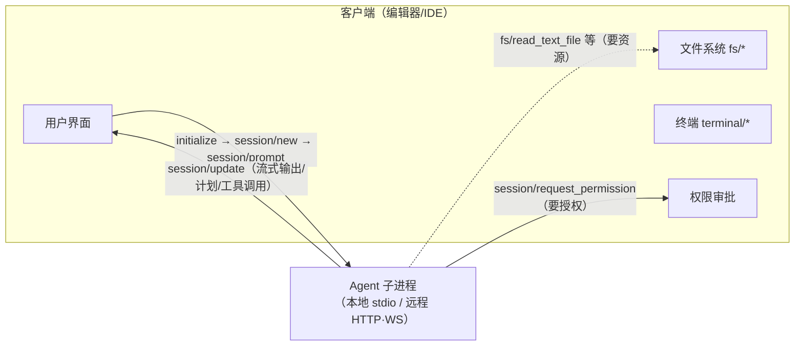

> **在哪一层**：层 4 · 行动与协作 ｜ **上一层出口**：能构建可追溯的检索链和更新路径 ｜ **本层出口**：能把一个编码 Agent 接进任意 ACP 编辑器，并说清它与 MCP/A2A 的分工
> **前置**：[协议地图](./index) ｜ [MCP](./mcp) ｜ **下一步**：[AG-UI](ag-ui) ｜ [A2A](a2a)

## 1. 概述

> **消歧（先读这段）**：**ACP** 至少指四个东西。本页讲 **Agent Client Protocol**（agentclientprotocol.com），编辑器/IDE ↔ 编码 Agent 的开放协议，Zed 主导（站点 metadata 指向 zed.dev，2026-09-01 检索）。历史上 IBM 也提出过同名 Agent Communication Protocol，后并入 A2A 轨道（时间与细节未验证，见 [A2A](a2a)）。AGNTCY 生态里还有一个 Agent Connect Protocol（REST 调用远程 Agent 的接口，见 [协议观察清单](watchlist)）。OpenClaw 内部另有一个同名私有协议（产品实现，见 Products）。检索或选型时永远先确认全称与 canonical URL。

**结论先讲**：Agent Client Protocol（ACP）标准化「代码编辑器 ↔ 编码 Agent」这一条边。没有它，每个编辑器要为每个 Agent 写一次定制集成；有了它，实现 ACP 的 Agent 能被所有 ACP 编辑器使用——官方原话：**就像 LSP（Language Server Protocol）之于语言服务那样**。它的信任模型很特别：Agent 是客户端的子进程（本地场景），文件系统、终端、权限审批全部由**客户端**把关，Agent 只是请求方。

### 心智模型：编辑器坐镇，Agent 是协作者



- **本地 Agent**：作为编辑器子进程运行，JSON-RPC over stdio（换行分隔、UTF-8）。
- **远程 Agent**：云端或其他基础设施，HTTP / WebSocket（官方页提及；标准传输一节目前只规范 stdio，Streamable HTTP 是进行中的草案）。
- 内容复用 MCP 的 JSON 表示（ContentBlock），并新增编码 UX 类型（如 diff 展示）；用户可读文本默认 Markdown。文件路径**必须绝对路径**，行号 1-based。

### 协议生命周期（官方 Message Flow）

```text
① initialize（协商 protocolVersion + 能力）→（如需）authenticate
② session/new 或 session/load（需要 loadSession 能力）
③ session/prompt ↔ session/update（消息块/计划/工具调用/命令更新）
   ├─ Agent → Client: session/request_permission（工具授权）
   └─ Client → Agent: session/cancel（打断当前 turn）
④ session/prompt 响应带回 stopReason（end_turn/max_tokens/max_turn_requests/refusal/cancelled）
```

能力协商规则：initialize 里**省略的能力 = 不支持**；新增能力不算破坏性变更；`protocolVersion` 是单个整数（当前 1），只在破坏性变更时递增。

### 何时使用 / 何时不用

- 用：给编码 Agent 做编辑器集成（或给编辑器做 Agent 支持）；需要权限审批与文件/终端资源受控共享的本地 Agent 场景。
- 不用：Agent ↔ 工具（→ [MCP](./mcp)）；Agent ↔ Agent 对等协作（→ [A2A](a2a)）；Agent backend ↔ 前端应用的事件流（→ [AG-UI](ag-ui)）。

### 决策表：ACP 与相邻协议

| 维度 | MCP | **ACP（本页）** | A2A |
| --- | --- | --- | --- |
| 方向 | host → 工具/数据 | 编辑器 → 编码 Agent（client-server） | Agent ↔ Agent（对等） |
| 控制权 | host 拥有工具暴露 | **客户端拥有环境**：文件、终端、权限 | 双方各自所有 |
| 状态 | server 会话 | **session**（cwd + mcpServers + 历史） | Task/context 由 server 拥有 |
| 信任域 | host 信任的工具源 | 用户桌面（Agent 是受控子进程） | 跨供应商/跨组织 |
| 最低复杂度 | 工具 schema + 传输 | initialize + session + prompt turn | 发现 + 认证 + 异步任务 |

与 MCP 的协同（同一客户端、双协议）：`session/new` 的参数就带 `mcpServers` 列表——编辑器把用户配置的 MCP 服务器交给 Agent 连接；Agent 侧声明 `mcpCapabilities`（http/sse）。官方还有 "MCP over ACP" 的 RFD 讨论稿（未定稿）。

### 历史版本里程碑

`protocolVersion` 为整数主版本，当前 1；能力以增量方式演进（新增能力不算破坏性变更）。站点 updates 页记录演进（未逐条核验）。更早的历史与发布日期：未验证。

### 本章 DoD 自检

- [ ] 15 分钟跑通 §2 的双进程 fixture（编辑器 ↔ Agent mock）
- [ ] 能画出 initialize → session/new → prompt → update → 权限 → stopReason 的时序
- [ ] 能说出客户端 cancel 后 Agent 必须返回哪个 stopReason
- [ ] 能解释 ACP 里「文件/终端/权限在客户端」与 A2A「opaque 对等」的差异

## 2. 使用

**最小实战**：两个零依赖 Node 脚本——一个 mock 编码 Agent（stdin/stdout JSON-RPC），一个 mock 编辑器（`child_process` 拉起它）。Node ≥ 18，无 npm 依赖，无 API key。

`acp-agent.mjs`（Agent 侧 mock：处理 initialize / session/new / session/prompt；中途向客户端发起 `session/request_permission`）：

```javascript fixture
// acp-agent.mjs — ACP Agent mock：换行分隔 JSON-RPC over stdio（Node ≥ 18）
import { createInterface } from "node:readline";
import { randomUUID } from "node:crypto";

let nextId = 100;
const send = (msg) => process.stdout.write(JSON.stringify(msg) + "\n");
const notify = (method, params) => send({ jsonrpc: "2.0", method, params });
const reply = (id, result) => send({ jsonrpc: "2.0", id, result });
const request = (method, params) =>
  new Promise((resolve) => {
    const id = nextId++;
    pendingRequests.set(id, resolve);
    send({ jsonrpc: "2.0", id, method, params });
  });
const pendingRequests = new Map();

let sessionId = null;
let cancelled = false;

const onUpdate = (update) =>
  notify("session/update", { sessionId, update });

const handlePrompt = async (id, text) => {
  cancelled = false;
  onUpdate({ sessionUpdate: "agent_message_chunk", messageId: randomUUID(),
    content: { type: "text", text: `分析请求：${text}` } });
  onUpdate({ sessionUpdate: "tool_call", toolCallId: "call_001",
    title: "Reading configuration file", kind: "read", status: "pending" });

  // Agent → Client：请求工具授权（客户端会转给用户）
  const perm = await request("session/request_permission", {
    sessionId,
    toolCall: { toolCallId: "call_001" },
    options: [
      { optionId: "allow_once", kind: "allow_once", name: "允许一次" },
      { optionId: "reject_once", kind: "reject_once", name: "拒绝一次" },
    ],
  });
  if (perm.outcome === "cancelled" || cancelled) {
    return reply(id, { stopReason: "cancelled" });
  }
  onUpdate({ sessionUpdate: "tool_call", toolCallId: "call_001",
    title: "Reading configuration file", kind: "read", status: "completed" });
  onUpdate({ sessionUpdate: "agent_message_chunk", messageId: randomUUID(),
    content: { type: "text", text: `完成（授权：${perm.optionId ?? "n/a"}）。` } });
  reply(id, { stopReason: "end_turn" });
};

const methods = {
  initialize: (id) => reply(id, {
    protocolVersion: 1, // 版本协商：支持则原样返回
    agentCapabilities: {
      loadSession: false,
      promptCapabilities: { image: false, audio: false, embeddedContext: false },
    },
    agentInfo: { name: "mock-coding-agent", title: "Mock Agent", version: "0.1.0" },
    authMethods: [],
  }),
  "session/new": (id) => {
    sessionId = "sess_" + randomUUID().slice(0, 12);
    reply(id, { sessionId });
  },
  "session/prompt": async (id, { prompt }) => {
    const text = prompt.map((b) => b.text ?? "").join(" ");
    if (text.startsWith("wait")) {
      // 慢任务：演示客户端 session/cancel 打断
      onUpdate({ sessionUpdate: "agent_message_chunk", messageId: randomUUID(),
        content: { type: "text", text: "长时间分析中…" } });
      for (let i = 0; i < 20 && !cancelled; i++)
        await new Promise((r) => setTimeout(r, 100));
      return reply(id, { stopReason: cancelled ? "cancelled" : "end_turn" });
    }
    await handlePrompt(id, text);
  },
  "session/cancel": () => { cancelled = true; }, // 通知：无响应
};

createInterface({ input: process.stdin }).on("line", (line) => {
  if (!line.trim()) return;
  const msg = JSON.parse(line); // Agent 也会收到客户端对 request_permission 的响应
  if (msg.id !== undefined && msg.method === undefined) {
    pendingRequests.get(msg.id)?.(msg.result); // resolve 挂起的授权请求
    return;
  }
  methods[msg.method]?.(msg.id, msg.params ?? {});
});
process.stderr.write("[agent] ready on stdio\n"); // stderr 只用于日志
```

`acp-editor.mjs`（客户端 mock：spawn 子进程、走完整个生命周期 + 一次取消）：

```javascript fixture
// acp-editor.mjs — ACP Client（编辑器）mock：spawn Agent 子进程（Node ≥ 18）
import { spawn } from "node:child_process";
import { createInterface } from "node:readline";

const child = spawn(process.execPath, ["acp-agent.mjs"], { stdio: ["pipe", "pipe", "inherit"] });
let nextId = 1;
const pending = new Map();

const send = (msg) => child.stdin.write(JSON.stringify(msg) + "\n");
const request = (method, params) =>
  new Promise((resolve) => {
    const id = nextId++;
    pending.set(id, resolve);
    send({ jsonrpc: "2.0", id, method, params });
  });
const notify = (method, params) => send({ jsonrpc: "2.0", method, params });

const onServerRequest = (msg) => {
  if (msg.method === "session/request_permission") {
    // 真实编辑器这里弹 UI 给用户；mock 自动选 allow_once
    const option = msg.params.options.find((o) => o.kind === "allow_once");
    send({ jsonrpc: "2.0", id: msg.id,
      result: { outcome: "selected", optionId: option.optionId } });
  }
};

const rl = createInterface({ input: child.stdout });
rl.on("line", (line) => {
  const msg = JSON.parse(line);
  if (msg.id !== undefined && msg.method) return onServerRequest(msg); // 服务器→客户端请求
  if (msg.method === "session/update") {
    const u = msg.params.update;
    console.log(`[update] ${u.sessionUpdate}${u.status ? `:${u.status}` : ""}` +
      `${u.content?.text ? ` ${u.content.text}` : ""}`);
    return;
  }
  pending.get(msg.id)?.(msg.result); // 响应：resolve 对应请求
});

// ① initialize → ② session/new → ③ prompt（含授权往返）
const init = await request("initialize", {
  protocolVersion: 1,
  clientCapabilities: { fs: { readTextFile: true, writeTextFile: true }, terminal: false },
  clientInfo: { name: "mock-editor", title: "Mock Editor", version: "0.1.0" },
});
console.log(`[init] agent=${init.agentInfo.name} v${init.protocolVersion}`);
const { sessionId } = await request("session/new", {
  cwd: process.cwd(), mcpServers: [], // MCP 协同点：把 MCP 服务器交给 Agent
});
console.log(`[session] ${sessionId}`);
const r1 = await request("session/prompt", {
  sessionId,
  prompt: [{ type: "text", text: "检查这个项目的配置问题" }],
});
console.log(`[turn1] stopReason=${r1.stopReason}`);

// ④ 取消路径：慢任务 300ms 后打断
const slow = request("session/prompt", {
  sessionId, prompt: [{ type: "text", text: "wait: 全库慢分析" }],
});
setTimeout(() => notify("session/cancel", { sessionId }), 300);
console.log(`[turn2] stopReason=${(await slow).stopReason}`);
child.kill();
```

**运行命令**：

```bash fixture
node acp-editor.mjs
```

**正常输出**：

```text fixture
[agent] ready on stdio
[init] agent=mock-coding-agent v1
[session] sess_9f0c…
[update] agent_message_chunk 分析请求：检查这个项目的配置问题
[update] tool_call:pending
[update] tool_call:completed
[update] agent_message_chunk 完成（授权：allow_once）。
[turn1] stopReason=end_turn
[update] agent_message_chunk 长时间分析中…
[turn2] stopReason=cancelled
```

**负例**（把 `acp-editor.mjs` 中 initialize 的 `protocolVersion` 改为 `99`）：Agent 按规范返回它支持的版本（1），客户端若不支持则应断开并告知用户——mock 里 `init.protocolVersion` 打印为 1，即为协商证据。
**验收命令**：输出末两行为 `stopReason=end_turn` 与 `stopReason=cancelled`。
**清理**：`Ctrl+C`（若有残留），删除两个脚本。

### 场景矩阵

| 场景 | 输入 / 动作 | 输出 | 适用 | 不适用 |
| --- | --- | --- | --- | --- |
| 标准 turn | 普通文本 prompt | update 流 + `end_turn` | 日常问答/改码 | — |
| 工具授权 | Agent 发 `request_permission` | 用户选择 allow/reject | 写文件、执行命令前 | 只读分析（可不问） |
| 打断 | prompt 后发 `session/cancel` | `stopReason=cancelled` | 用户反悔/超时 | 已结束的 turn |
| 会话恢复 | `session/load`（需 `loadSession:true`） | 重放历史 update | 跨重启续聊 | 本 fixture 未实现 |
| 资源回调 | Agent 调 `fs/read_text_file` 等 | 客户端代读写 | Agent 无直接磁盘权限时 | 本 fixture 未实现 |

## 3. 原理

### 双向 JSON-RPC 与角色不对称

ACP 的两条方法轴（简表，字段以官方 schema 为准）：

| 方向 | 方法 / 通知 | 说明 |
| --- | --- | --- |
| Client → Agent | `initialize` / `authenticate` / `session/new` / `session/load` / `session/prompt` / `session/set_mode` / `logout` | 生命周期与输入 |
| Client → Agent（通知） | `session/cancel` | 打断当前 turn，无响应 |
| Agent → Client | `session/request_permission` | 工具授权请求（请求-响应） |
| Agent → Client（通知） | `session/update` | agent/user/thought 消息块、tool_call、plan、命令列表、模式变更 |
| Agent → Client（能力门控） | `fs/read_text_file`、`fs/write_text_file`、`terminal/*`、`elicitation/create` | 需 initialize 声明对应客户端能力 |

关键不变量：

- **stopReason 枚举**：`end_turn`（模型自然结束）/ `max_tokens` / `max_turn_requests` / `refusal` / `cancelled`。取消不是错误：客户端 `session/cancel` 后，Agent **必须**以 `cancelled` stopReason 响应 `session/prompt`，把底层库抛出的中断异常转成语义结果，否则客户端会把取消当错误弹给用户（官方 Warning 原意）。
- **权限选项**：`allow_once` / `allow_always` / `reject_once` / `reject_always`——「记住选择」由客户端落地，Agent 每次仍应请求。
- **取消时序**：客户端发出 cancel 后应抢先本地把未完成 tool_call 标为 cancelled，并对所有挂起的 `request_permission` 回 `cancelled` outcome；Agent 在响应 prompt 前仍可补发 update。
- **stdio 纪律**：消息以 `\n` 分隔、不得内嵌换行；stdout 只准写 ACP 消息，日志走 stderr；双方都得遵守。
- **能力=可用性**：`fs.readTextFile`、`terminal`、`elicitation`、布尔配置项等能力省略即不支持；Agent 不得调用未声明能力。

### 数据流与 MCP 复用

`session/prompt` 的 `prompt` 是 `ContentBlock[]`（与 MCP ContentBlock 同构：text / resource / image / audio…），Agent 的输出 chunk 也是 ContentBlock。Agent 端能力 `promptCapabilities` 声明可接受的输入类型；基线是 Text 与 ResourceLink。会话对象携带 `cwd` 与 `mcpServers`——**客户端决定工作目录和工具源，Agent 负责连接**。

### 规范要求 vs 本地实测

| 断言 | 规范（agentclientprotocol.com） | 本地 fixture 实测 |
| --- | --- | --- |
| initialize 返回相同 protocolVersion（支持时） | 必须原样返回 | 一致 |
| 省略能力 = 不支持 | 必须 | 一致（terminal:false 未被触碰） |
| cancel 后 stopReason=cancelled | 必须（含异常转换） | 一致 |
| 权限 outcome：`selected`+optionId / `cancelled` | 必须 | 一致 |
| stdout 只写 ACP 消息 | 必须 | 一致（日志走 stderr） |
| `fs/*`、`terminal/*` 回调 | 需客户端能力声明 | fixture 声明了 fs 能力但未触发回调（未实测） |
| `session/load` 重放历史 | 需 `loadSession:true` | 未实现 |

## 4. 开发

### 集成要点

- **版本 pin**：`protocolVersion` 整数协商——客户端发最新支持值，Agent 不同意则回自己最新值，客户端不支持就断开。发布前固定测试矩阵（你的编辑器版本 × Agent 版本）。
- **权限策略**：把 `allow_always` 的记忆放在客户端账户层并可视化（用户要能撤销）；默认走 `allow_once`。
- **超时**：`session/prompt` 是长请求——客户端 UI 要可取消；Agent 对模型/工具调用要有自己的超时与 stopReason 归因。
- **stderr**：Agent 日志写 stderr，编辑器转发/展示；不要混入 stdout。

### 调试 runbook

```markdown
### 症状 → 证据 → 处理 → 完成标准
**症状**：编辑器里 Agent 没有任何输出
**证据**：子进程是否存活；stderr 是否有 Agent 日志；stdout 是否有非 JSON 行
**处理**：先查 spawn 失败/路径错误；再查 stdout 污染（框架 banner 打进 stdout 会破坏 JSON-RPC 流，必须重定向）；用 rl 逐行 dump 原始行
**完成标准**：initialize 请求-响应在日志中成对出现；stderr 可见 Agent 启动日志
```

```markdown
### 症状 → 证据 → 处理 → 完成标准
**症状**：点了取消但 UI 报错
**证据**：session/prompt 的最终响应是 error 还是 result.stopReason
**处理**：Agent 侧把中断异常捕获并转成 stopReason=cancelled（规范 Warning 场景）；客户端侧对挂起的 request_permission 全部回 cancelled
**完成标准**：取消路径最终 result.stopReason=cancelled，无 error 弹窗
```

```markdown
### 症状 → 证据 → 处理 → 完成标准
**症状**：Agent 调 fs/terminal 报 method not found
**证据**：initialize 响应里 clientCapabilities 是否声明
**处理**：编辑器补能力声明，或 Agent 改为在 prompt 里产出内容而非回调；能力协商失败要在 initialize 阶段暴露而非运行中
**完成标准**：能力清单与实际调用一致；未声明能力的调用不再发生
```

### 反模式清单

- 把 banner/进度条打进 Agent stdout——直接打断 JSON-RPC 流。
- 客户端吞掉 `session/update` 只看最终 stopReason——丢掉流式 UX 与工具可见性。
- 用 `allow_always` 当默认值且无撤销入口。
- 在 Agent 进程内自行读写磁盘，绕过 `fs/*` 回调与权限模型。

## 5. 资料库

### 四级阅读路线

- **Beginner**：官方 Introduction（LSP 类比、为什么需要 ACP）→ 本页 §1。
- **Builder**：Protocol Overview（方法总表）→ Initialization / Session Setup / Prompt Turn → 本页 fixture 换 TypeScript/Rust 官方 SDK 重写。
- **Operator**：Tool Calls（权限模型）→ File System / Terminals / Session Modes → Extensibility（`_meta` 与 `_` 前缀自定义方法）。
- **Researcher**：官方 JSON Schema → RFD 列表（mcp-over-acp、request-cancellation、session-fork 等，均为讨论稿）。

### 资源表

| 名称 | 层级 | canonical URL | 用途 | 支持的断言 | 下一步 |
| --- | --- | --- | --- | --- | --- |
| ACP 官方文档 | L0 | https://agentclientprotocol.com/ | 规范入口（Introduction/Protocol/Schema） | 本页生命周期、方法、stopReason、权限选项 | 读 protocol/overview |
| Protocol Schema | L0 | https://agentclientprotocol.com/protocol/schema | 字段级 SSOT | ContentBlock/ToolCall/权限对象形状 | 写类型时对照 |
| Transports | L1 | https://agentclientprotocol.com/protocol/transports | stdio 规则（换行分隔/UTF-8/stderr） | 「stdout 只写 ACP 消息」 | 实现自定义传输前读 |
| Libraries（TS/Rust/Python/Kotlin） | L1 | https://agentclientprotocol.com/libraries/typescript 等各页 | 官方 SDK | 语言支持清单 | 用 SDK 替换手写 JSON-RPC |
| ACP Registry | L2 | https://agentclientprotocol.com/get-started/registry | 兼容 Agent/客户端生态 | — | 选型时查兼容矩阵 |

以上条目均于 2026-09-01 检索（站点 sitemap 显示 protocol/schema 更新于 2026-02-04）。

### 主动证伪与未决问题

- **证伪入口**：本页任何方法/字段断言对照官方 schema 页；不一致以 schema 为准并提 issue。
- 未决 1：Streamable HTTP 传输仍标「draft proposal in progress」，远程 Agent 部署形态未定稿。
- 未决 2：治理/所有权细节（Zed 主导到什么程度、是否基金会化）在 governance 页，未逐字核验。
- 未决 3：RFD（mcp-over-acp、session-resume、logout 等）均为讨论稿，不作为能力承诺。

**learn-ai 到此为止**：协议契约、编辑器-Agent 边界、可运行 fixture。**继续去哪**：模型内部 → Learn LLM；具体编辑器/Agent 产品的接入命令 → Products；评估 → evals 站点。
